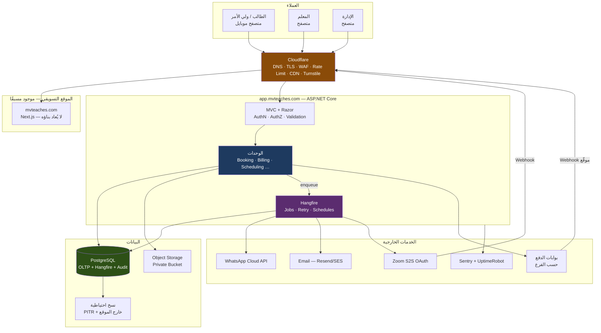
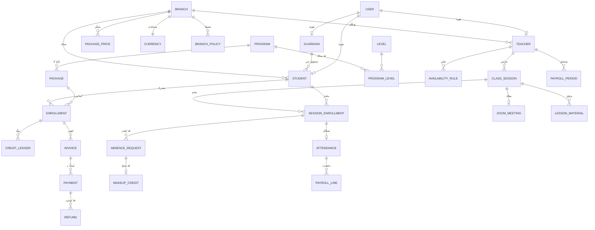
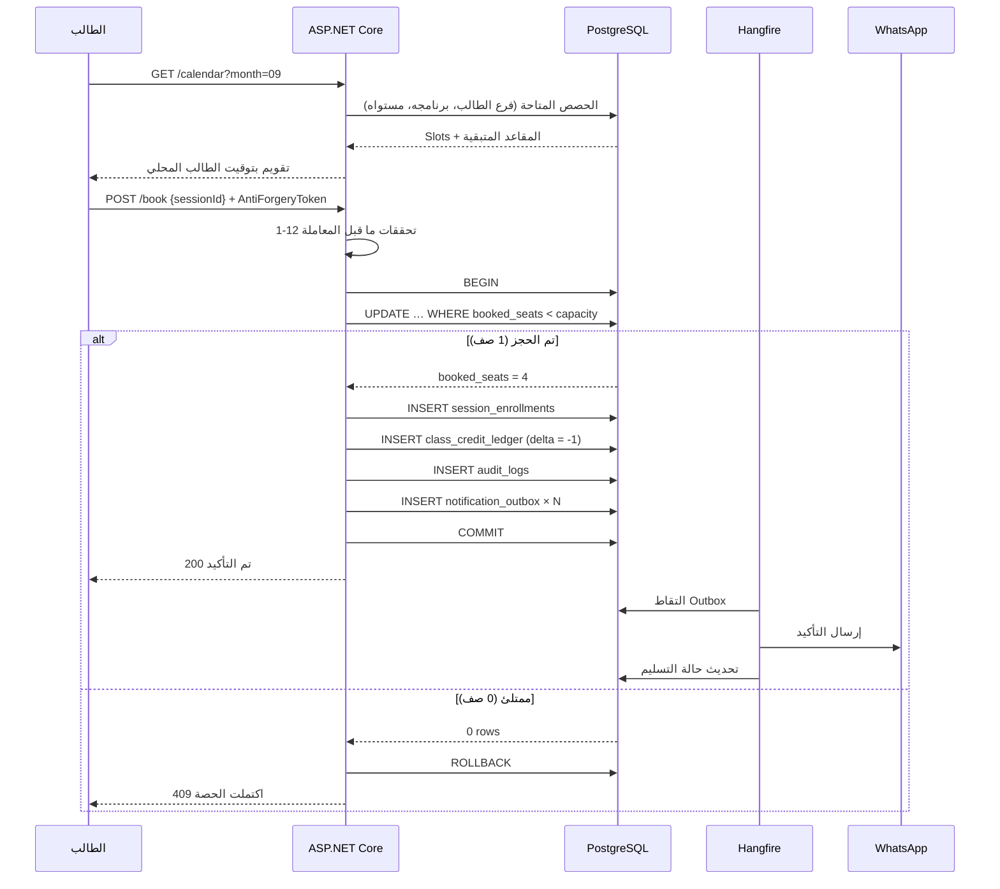
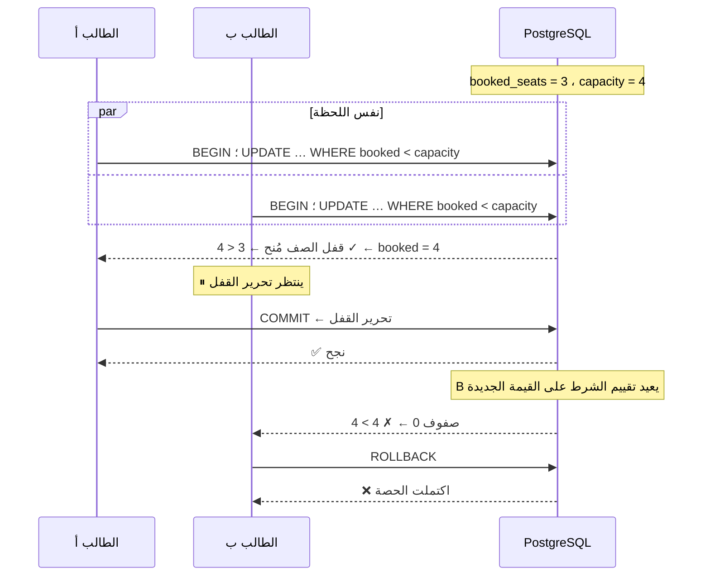
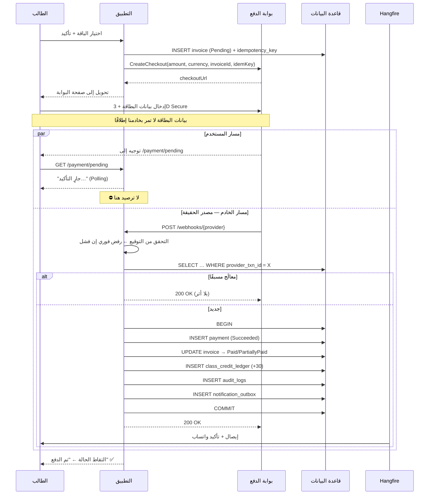
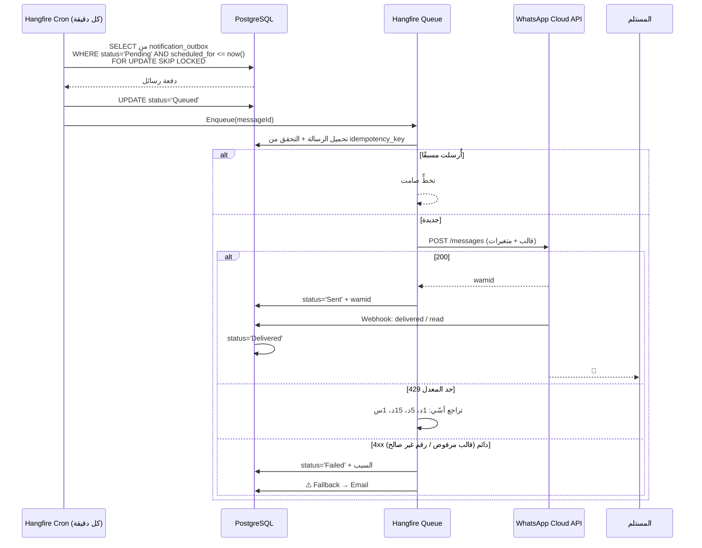
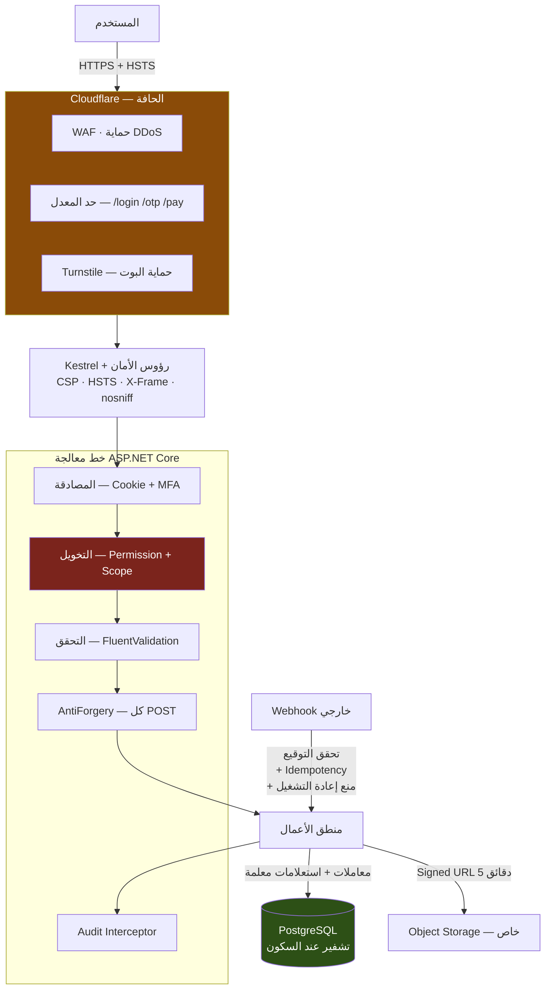

# MVTEACHES — دراسة تقنية وهندسية شاملة قبل التنفيذ
### Technical, Architectural & Commercial Feasibility Study

| | |
|---|---|
| **الإصدار** | v1.0 |
| **تاريخ الإصدار** | 2026-08-17 |
| **الحالة** | Pre-Development — Discovery Deliverable |
| **الهدف** | تحديد Scope + Cost + Architecture + Timeline + Risks قبل كتابة أول سطر Production Code |
| **تحذير** | هذه الوثيقة **ليست استشارة قانونية**. البنود المتعلقة بحماية البيانات والقاصرين والفوترة الضريبية موسومة صراحة بـ `NEEDS LEGAL REVIEW`. |

---

## 0. المصادر المعتمدة في هذه الدراسة

كل استنتاج في هذه الوثيقة مبني على أحد المصادر التالية. عند غياب المصدر، لا يوجد استنتاج — يوجد `UNKNOWN`.

| # | المصدر | الوصف | الوزن |
|---|---|---|---|
| **S1** | نص الطلب (Prompt) | متطلبات صاغها طالب الدراسة | متطلبات مُعلنة |
| **S2** | `MVTEACHES_Profile.docx` | ملف الباقات والأسعار وسياسة الدفع | **مصدر تجاري مُلزِم** |
| **S3** | `MVTEACHES_buss-pro.pdf` (20 صفحة) | Company Profile 2026 — تسويقي رسمي | مصدر تجاري رسمي |
| **S4** | 6 صور لوثيقة SRS من 14 صفحة | مواصفات شاشات + تكاملات + ملاحظات فنية | **أدق مصدر تقني متوفر** |
| **S5** | صورة Instagram `@mvteaches_jordan` | إعلان أسعار مُنشور فعليًا | مصدر تسويقي منشور |
| **S6** | `https://mvteaches.com` (تم الفحص 2026-08-17) | موقع Next.js حي، تسويقي فقط | **واقع قائم** |
| **S7** | مصادر خارجية رسمية (Meta / Zoom / Stripe / DigitalOcean / ICO …) | أسعار وتوافر خدمات | تم توثيق تاريخ الفحص |

> **ملاحظة منهجية حرجة:** المصدر S4 (وثيقة الـ SRS المصوّرة) **ناقص**. لديّ 6 صفحات من أصل 14 (الصفحات 2، 4، 5، 6، 7، 8). **الصفحات 1 و 3 مفقودة** وهي تحتوي على: «١. نظرة عامة على المشروع»، «٢. نطاق العمل»، «٣. البنية العامة للفروع» — أي **أهم ثلاثة أقسام في الوثيقة كلها**. الصفحات 9–14 هي الترجمة الإنجليزية.
>
> ➜ **ACTION REQUIRED:** اطلب ملف الـ SRS الأصلي (PDF/DOCX) كاملًا قبل تجميد الـ Scope. قسم «البنية العامة للفروع» تحديدًا يحدد النموذج البياني كله.

---

# 1. Executive Summary — الملخّص التنفيذي

## 1.1 ما هو المشروع فعليًا

MVTEACHES هو **معهد لغة إنجليزية أونلاين متعدد الفروع والدول**، مؤسّس في لندن، بمكاتب في **لندن، عمّان، الناصرة، وبوغوتا (كولومبيا)** (S3, ص5 و ص18). المطلوب بناء **منصة تشغيلية مركزية** تستبدل الإدارة اليدوية عبر WhatsApp بنظام يغطي: التسجيل، تحديد المستوى، الجدولة، الحجز، الدفع، الحضور، الأجور، الملفات، والتقارير.

## 1.2 الحكم الهندسي المختصر

| السؤال | الجواب |
|---|---|
| هل المشروع قابل للتنفيذ تقنيًا؟ | **نعم**، بلا تعقيد خوارزمي غير عادي. |
| هل هو مشروع "بسيط"؟ | **لا.** هو نظام مالي + جدولة + امتثال بيانات قاصرين. الثلاثة معًا تجعله أصعب من متجر إلكتروني عادي. |
| ما أخطر ما فيه؟ | **ليس الكود.** أخطر ما فيه أن **نموذج العمل نفسه غير محسوم**: الفروع، الأسعار، وحدود الباقات متناقضة بين المصادر الأربعة. |
| هل يمكن البدء الآن؟ | **لا يمكن بناء طبقة التسعير والاشتراكات قبل حسم 14 سؤالًا محددًا** (القسم 38). يمكن البدء فورًا بطبقات المصادقة والملفات الشخصية. |
| هل التكلفة معقولة؟ | **نعم.** البنية التحتية للـ MVP ≈ **$45–70/شهر**. التكلفة الحقيقية ليست السيرفرات — بل **رخص Zoom + رسائل WhatsApp + عمولة الدفع**. |

## 1.3 الاكتشاف الأهم في هذه الدراسة

> **المصادر الأربعة تصف أربعة أعمال مختلفة.**

| البعد | S1 (الطلب) | S2 (الباقات) | S3 (البروفايل) | S6 (الموقع الحي) |
|---|---|---|---|---|
| **الدول** | الأردن، فلسطين، بريطانيا | الأردن (JD فقط) | لندن، عمّان، **الناصرة**، **بوغوتا** | لندن (UK فقط) |
| **الأسعار** | 25 JOD/حصة فردية | 75/150/450 JD لـ 30 حصة | — | لا أسعار |
| **الدورات** | مستويات A1–C2 فقط | A1–C2 | + **IELTS، TOEFL، Kids، Corporate** | General, Speaking, IELTS |
| **الفئات العمرية** | 5–12 / 12–17 / 18–30 | — | **7–17 / 18+** | — |
| **طرق الدفع** | Visa/MC/**PayPal** | — | بطاقات + **تحويل بنكي** | — |

هذا ليس تفصيلًا تجميليًا. **كل صف في هذا الجدول يغيّر مخطط قاعدة البيانات.** الشروع في البناء قبل حسمها يعني إعادة كتابة طبقة التسعير والحجز خلال 6 أشهر.

## 1.4 التوصية النهائية باختصار

**ابنِ Modular Monolith على ASP.NET Core + PostgreSQL، مستضافًا على Hetzner خلف Cloudflare، مع Hangfire للطوابير، وطبقة Payment Provider مجرّدة مربوطة بالفرع لا بالدولة.**

**لا تبنِ:** Microservices، Kubernetes، React SPA منفصل، أو تطبيق موبايل — في أي مرحلة من المراحل الثلاث المقترحة. تفاصيل الأسباب في القسم 39.

---

# 2. Understanding of the Business — فهم النشاط التجاري

## 2.1 نموذج الإيراد الفعلي (من S2 — المصدر التجاري المُلزِم)

المصدر S2 هو الوثيقة الوحيدة التي تحمل أسعارًا مُهيكلة. نصّها الحرفي:

| الباقة | النوع | 3 أشهر / 30 حصة | شهر / 10 حصص | السعر المشتق للحصة |
|---|---|---|---|---|
| **Basic** — الحزمة العادية | Group Classes | **75 JD** | 25 JD | 2.50 JD |
| **Standard** — الحزمة الأساسية | Small Groups (4 Students) | **150 JD** | 50 JD | 5.00 JD |
| **Premium** — الحزم المتميزة | One-to-One | **450 JD** | 150 JD | 15.00 JD |

**سياسة الدفع (S2، حرفيًا):** «يتم الدفع بنسبة 100% قبل بدء الدورة أو على دفعتين، قبل الدورة 50% وفي منتصف الدورة يتم إكمال 50%.»
**العقد (S2، حرفيًا):** «توقيع عقد عند التسجيل لضمان حقوق الطلاب والمعهد.»

### ثلاث نتائج هندسية فورية من هذا الجدول

1. **الوحدة التجارية ليست "الحصة" — بل "الباقة" (Package/Enrollment).** الطالب لا يشتري حصصًا مفردة؛ يشتري 10 أو 30 حصة بسعر مجمّع. أي تصميم يخزّن `PricePerClass` كحقيقة أساسية سيكون خاطئًا. السعر يُشتق من الباقة، ولا يُخزَّن مضروبًا.

2. **الدفع على دفعتين (50/50) موجود في المصدر التجاري ومفقود تمامًا من S1.** هذا يعني أن `Payment` علاقتها بـ `Enrollment` هي **one-to-many** منذ اليوم الأول، وأن هناك حالة `PartiallyPaid` مشروعة وليست خطأً. القسم 17 من S1 وصف هذه الحالة كأنها استثناء — بينما هي **سياسة معلنة**.

3. **العقد الموقّع عند التسجيل** يستدعي كيان `Contracts` (نسخة، تاريخ قبول، IP، نسخة PDF محفوظة). هذا مفقود من قائمة الكيانات في S1 §30 بالكامل.

## 2.2 خطوط الأعمال المكتشفة والغائبة عن الطلب

| خط العمل | المصدر | مذكور في S1؟ | الأثر |
|---|---|---|---|
| General English (A1–C2) | S3 ص7، S6 | ✅ | الأساس |
| Kids' Conversation (7–17) | S3 ص7 | جزئيًا | فئة عمرية + محتوى مختلف |
| Adults' Conversation (18+) | S3 ص7, S6 | ❌ | **دورة بلا مستوى CEFR** |
| **IELTS Preparation** | S3 ص7, S5, S6 | ❌ | **لا تُقاس بـ A1–C2 بل بـ Band Score** |
| **TOEFL Preparation** | S3 ص7, S5 | ❌ | نفس المشكلة |
| **Corporate Training (B2B)** | S3 ص13 | ❌ | **يحتاج Actor جديد: Organisation** |
| **School Partnerships (B2B2C)** | S3 ص14 | ❌ | عقود مؤسسية، فوترة جماعية |

> ### ⚠️ الخلل البنيوي رقم 1 في متطلبات S1
> نموذج البيانات في S1 §30 يفترض أن **المستوى (Level) هو المحور** الذي يُعلَّق عليه كل شيء: السعر، الحجز، المعلم، الاشتراك.
>
> هذا **خاطئ**. المحور الصحيح هو **البرنامج (Program)**، والمستوى **صفة** له:
> - `General English` → له مستويات A1…C2
> - `IELTS Preparation` → **ليس له مستوى CEFR**، بل Target Band Score
> - `Adults' Conversation` → ليس له مستوى، بل فئة عمرية
> - `Corporate Training` → ليس له لا مستوى ولا فئة عمرية، بل Client Organisation
>
> ربط السعر والحجز بـ `LevelId` مباشرة يجعل IELTS و TOEFL و Corporate **مستحيلة التمثيل** دون إعادة هيكلة. هذا خطأ تصميمي يجب تصحيحه **قبل** كتابة أول Migration.

## 2.3 الواقع القائم فعليًا (S6 — تم الفحص 2026-08-17)

| العنصر | الحالة الفعلية |
|---|---|
| النطاق `mvteaches.com` | ✅ **مملوك وفعّال** — لا حاجة لاستراتيجية شراء نطاق |
| الموقع التسويقي | ✅ موجود، مبني على **Next.js**، إنجليزي فقط |
| البريد | `contact@mvteaches.com` (نطاق حقيقي) — بينما S3 ص17 يعرض `mvtjordan@gmail.com` |
| تسجيل دخول / حجز / دفع | ❌ **غير موجود إطلاقًا** |
| مبدّل الدولة/الفرع | ❌ غير موجود |
| الدورات المعروضة | 3 فقط: General English, Speaking Class, IELTS (**لا TOEFL، لا Kids**) |
| الأسعار | ❌ غير معروضة على الموقع |
| وجود لاتيني | ✅ صفحة Facebook باسم **«Mvteaches Latinoamérica»** |

**نتيجة تخطيطية مهمة:** الموقع التسويقي **موجود ولا يجب إعادة بنائه**. نطاق العمل الحقيقي هو **التطبيق** (Portal)، ويُنشر على `app.mvteaches.com`. هذا يقلّص Phase 1 بشكل ملموس ويوفر تكلفة تصميم واجهة عامة.

## 2.4 المؤشرات التشغيلية المتناقضة (S3)

| المؤشر | ص5 | ص15 |
|---|---|---|
| الطلاب | 1,000+ | **3,000+** |
| الدول | 4+ | **40+** |
| المعلمون | — | **150+** |
| نسبة النجاح | — | 95% |

الأرقام التسويقية متناقضة داخليًا وأتعامل معها كـ **غير موثوقة لأغراض Capacity Planning**. لكن رقمًا واحدًا منها له وزن هندسي مباشر:

> **150+ معلمًا** مقابل **3 مسؤولين** في S1. إن كان الرقم صحيحًا ولو جزئيًا، فإن:
> - رخص Zoom تصبح **أكبر بند تكلفة شهرية في المشروع كله** (القسم 18).
> - **بوابة تقديم المعلمين الذاتية** (S4 ص4) تنتقل من "Nice to have" إلى **MVP إلزامي** — لا يمكن لثلاثة أشخاص إدخال 150 معلمًا يدويًا.
>
> ➜ `OPEN QUESTION Q-31`: كم عدد المعلمين النشطين فعليًا اليوم؟ وكم عدد **الحصص المتزامنة** في ذروة اليوم؟

---

# 3. Actors and Roles — الفاعلون والأدوار

## 3.1 قائمة الفاعلين الكاملة

المصدر S1 ذكر 5 فاعلين. المصادر S3/S4 تكشف **10**:

| # | الفاعل | المصدر | في MVP؟ | ملاحظة |
|---|---|---|---|---|
| 1 | **Super Admin** (الأردن) | S1, S4 | ✅ | صلاحية كاملة عبر كل الفروع |
| 2 | **Branch Admin / Viewer** | S1, S4 | ✅ | S4: «حساب الإدارة وحيد وموحّد يشرف على الفرعين» ← **تعارض، انظر C-09** |
| 3 | **Teacher** | S1, S3, S4 | ✅ | |
| 4 | **Student (Adult 18+)** | S1, S3 | ✅ | |
| 5 | **Student (Minor 7–17)** | S3 | ✅ | ⚠️ يستدعي مسار موافقة ولي أمر |
| 6 | **Parent / Guardian** | ❌ **غير مذكور في أي مصدر** | ❓ | **`Q-01` الأخطر — انظر أدناه** |
| 7 | **Teacher Applicant** | S4 ص4 | ✅ | مقدّم طلب عبر الموقع، ليس مستخدمًا بعد |
| 8 | **Visitor / Lead** | S4 ص4 | ✅ | نموذج تواصل، تصفح أسعار الفرع |
| 9 | **Corporate Client** | S3 ص13 | ❌ Phase 2+ | يحتاج Organisation + Seats + فوترة |
| 10 | **Partner School** | S3 ص14 | ❌ Future | |
| 11 | **System / Scheduler** | ضمنيًا | ✅ | فاعل غير بشري ينفّذ التذكيرات والانتهاءات |

## 3.2 المشكلة رقم 1 في المشروع كله: حساب الطفل

> ### 🔴 `Q-01` — BLOCKING — لا يجوز كتابة كود التسجيل قبل الجواب
>
> **الحقيقة (S3 ص7):** يوجد دورة `KIDS' CONVERSATION — 7–17 years`.
> **الحقيقة (S1 §7):** الطالب يسجّل بنفسه: Username, Password, Phone, Email.
> **الحقيقة (S1 §8):** يُرسل OTP إلى **واتساب الطالب**.
>
> **التناقض:** طفل عمره **7 سنوات** لا يملك رقم واتساب، ولا بريدًا إلكترونيًا، ولا أهلية قانونية للتعاقد أو الدفع. ومع ذلك، لا يوجد في أي مصدر من المصادر الستة **أي ذكر لحساب ولي أمر**.
>
> **لماذا هذا حرج:**
> 1. **قانونيًا:** UK GDPR + ICO Children's Code تعتبر أي خدمة "likely to be accessed by under-18s" خاضعة لالتزامات مشددة (القسم 24).
> 2. **تعاقديًا:** S2 يشترط **توقيع عقد**. القاصر لا يوقّع عقدًا نافذًا.
> 3. **ماليًا:** بطاقة الدفع تخصّ ولي الأمر لا الطفل.
> 4. **بنيويًا:** إن أُضيف `Parent` لاحقًا، فسيتغيّر مالك كل من: الحساب، الاشتراك، الدفعة، الموافقة، وقناة الإشعار. **هذه إعادة كتابة، لا إضافة حقل.**
>
> **OPTIONS:**
> | # | الخيار | الوصف | التقييم |
> |---|---|---|---|
> | A | **Guardian-owned account** | ولي الأمر هو `User`؛ الطفل `StudentProfile` تابع له. الدفع والعقد والواتساب لولي الأمر. الطفل قد يحصل على Login محدود بلا صلاحيات مالية. | ✅ **RECOMMENDED** |
> | B | Student-owned + Guardian linked | الطفل يملك الحساب مع حقل ولي أمر إجباري تحت 18 | ⚠️ يترك المسؤولية القانونية غامضة |
> | C | رفع الحد الأدنى إلى 18 | إلغاء دورة Kids | ❌ يلغي خط عمل معلن |
> | D | تسجيل الأطفال يدويًا عبر الإدارة فقط | لا Self-signup تحت 18 | ⚠️ آمن لكنه لا يتوسّع |
>
> **RECOMMENDATION:** الخيار **A**. صمّم الفصل `User` (كيان مصادقة) ≠ `Student` (كيان تعليمي) **منذ أول Migration**، حتى لو كانا 1:1 في الأغلبية العظمى من الحالات. تكلفة الفصل اليوم = جدول إضافي. تكلفة الفصل بعد سنة = إعادة بناء المشروع.
>
> **CLIENT DECISION REQUIRED — قبل Phase 2.**

## 3.3 نموذج الصلاحيات المقترح (RBAC + Scope)

طلب S1 نظام صلاحيات «قابل للتوسع وليس Hardcoded لأسماء الأشخاص». هذا صحيح لكنه **غير كافٍ**. المطلوب فعليًا بُعدان:

```
Permission Check = (ما الذي يستطيع فعله؟)  ×  (على أي نطاق؟)
                    RBAC Permission            Scope / Branch
```

**بدون البُعد الثاني، لا يمكن التعبير عن «مسؤول فلسطين يرى بيانات فلسطين فقط».** وهذه هي الحالة الأكثر احتمالًا في الواقع رغم ما تقوله S4.

### النموذج

```
User ──< UserRoleAssignment >── Role ──< RolePermission >── Permission
              │
              └── ScopeType: Global | Branch
                  ScopeBranchId: nullable FK
```

- **Permission** = سلسلة ثابتة دقيقة الحبيبات: `payment.refund`, `price.edit`, `student.level.override`, `teacher.payout.view`
- **Role** = حزمة Permissions قابلة للإدارة من الشاشة (لا في الكود)
- **Assignment** = (User, Role, Scope) — يسمح بـ: «سعيد = Admin على فرع فلسطين» + «Viewer على فرع الأردن»

### الأدوار الافتراضية المقترحة

| الدور | النطاق | الوصف |
|---|---|---|
| `SuperAdmin` | Global | كل شيء + إدارة الأدوار. **يتطلب MFA إلزاميًا** |
| `BranchAdmin` | Branch | إدارة كاملة داخل فرعه، بلا صلاحية تغيير الأسعار |
| `FinanceAdmin` | Global/Branch | مدفوعات، استرداد، أجور. **يتطلب MFA + سبب مكتوب** |
| `BranchViewer` | Branch | قراءة فقط — دور الشخصين في فلسطين وبريطانيا (S1 §2) |
| `Teacher` | Self | جدوله، طلابه، حضوره، ملفاته فقط |
| `Student` | Self | بياناته فقط |

### قواعد تنفيذ غير قابلة للتفاوض

1. **Deny by default.** كل Endpoint يتطلب Permission صريحًا. لا يوجد Endpoint بلا `[Authorize]`.
2. **Scope مفروض في طبقة الاستعلام**، لا في الـ UI. استخدم **EF Core Global Query Filter** على `BranchId` مربوطًا بـ Scope المستخدم الحالي. إخفاء زر في الواجهة ليس أمنًا.
3. **`SuperAdmin` لا يُمنح ضمنيًا كل الصلاحيات في الكود** (`if (user.IsSuperAdmin) return true;`). امنحه إياها **كبيانات** في جدول `RolePermission` — وإلا فقدت قابلية التدقيق ولن يظهر تغيير صلاحياته في الـ Audit Log.
4. **تعطيل الحساب فوري** — `IsActive=false` يجب أن يبطل الجلسات النشطة، لا أن ينتظر انتهاء الكوكي. (`SecurityStamp` في ASP.NET Identity + `ValidationInterval` قصير).
5. **لا يستطيع أي مستخدم تعديل صلاحيات نفسه**، ولا حذف آخر `SuperAdmin` في النظام — قاعدة على مستوى قاعدة البيانات لا على مستوى الواجهة.

---

# 4. Functional Requirements — المتطلبات الوظيفية

مرقّمة `FR-xx` للإحالة في عقد التنفيذ والاختبار. العمود «المصدر» يوثّق من طلبها؛ العمود «المرحلة» هو توصيتي.

## 4.1 المصادقة والحسابات

| # | المتطلب | المصدر | المرحلة |
|---|---|---|---|
| FR-01 | تسجيل طالب ذاتي (Username, Full Name, DOB, Phone, Email, Password) | S1 §7 | MVP |
| FR-02 | اختيار الفرع عند التسجيل — **يُثبَّت ولا يُغيَّر ذاتيًا** | S4 ص4 | MVP |
| FR-03 | تحقق رقم الهاتف عبر **WhatsApp OTP** | S1 §8 | MVP |
| FR-04 | تحقق البريد عبر رابط تفعيل | S1 §34 | MVP |
| FR-05 | استعادة كلمة المرور بمهلة صلاحية ورمز أحادي الاستخدام | S1 §34 | MVP |
| FR-06 | **MFA إلزامي لكل الأدوار الإدارية** | S1 §28 | MVP |
| FR-07 | قفل الحساب بعد محاولات فاشلة + Rate Limiting | S1 §28 | MVP |
| FR-08 | **موافقة ولي أمر للقاصرين** | مشتق من S3 | ⛔ محجوب بـ `Q-01` |
| FR-09 | قبول عقد إلكتروني عند التسجيل مع حفظ النسخة والتاريخ | **S2** | MVP |

## 4.2 الطلاب

| # | المتطلب | المصدر | المرحلة |
|---|---|---|---|
| FR-10 | ملف شخصي: بيانات، دولة، فرع، منطقة زمنية، تفضيل اللغة | S1 §19 | MVP |
| FR-11 | لوحة الطالب: الحصص القادمة، الرصيد، حالة الاشتراك | S4 ص5 | MVP |
| FR-12 | سجل الحضور التاريخي (حضر / غاب / أُجِّل) | S4 ص5 | MVP |
| FR-13 | **طلب اعتذار عن حصة** + سبب + **إرفاق مستند اختياري** | S4 ص5 | MVP |
| FR-14 | **قبول تلقائي للاعتذار ضمن مهلة محددة، وإلا يُحوَّل لموافقة الإدارة** | S4 ص5 | MVP |
| FR-15 | «حسابي المالي»: الباقة، تاريخ الانتهاء، الفواتير، زر الدفع/التجديد | S4 ص5 | MVP |
| FR-16 | نسبة إنجاز كل مستوى | S4 ص5 | Phase 2 |
| FR-17 | **شهادة إتمام قابلة للتحميل (PDF)** | S4 ص5, S3 ص7 | Phase 2 |

## 4.3 المعلمون

| # | المتطلب | المصدر | المرحلة |
|---|---|---|---|
| FR-20 | **نموذج تقديم عام للمعلمين**: الاسم، الجنسية، المؤهل، CELTA/TESOL، سنوات الخبرة، **رفع CV (PDF)**، رابط فيديو تعريفي | S4 ص4 | MVP |
| FR-21 | شاشة إدارية لمراجعة الطلبات: عرض، قبول/رفض، **تحويل المقبول إلى حساب معلم فعّال** | S4 ص4 | MVP |
| FR-22 | ملف المعلم: السيرة، المؤهلات، **المواد التي يدرّسها**، كلمة المرور | S4 ص6 | MVP |
| FR-23 | إتاحة أوقات (Availability) **غير متتالية** | S1 §5 | MVP |
| FR-24 | جدول الحصص بتوقيت المعلم المحلي + رابط Zoom | S4 ص6 | MVP |
| FR-25 | **تسجيل الحضور بعد كل حصة** (حضر/غاب لكل طالب) | S4 ص6 | MVP |
| FR-26 | **كشف دوام (Timesheet) محسوب تلقائيًا من سجلات الحضور — لا إدخال يدوي** | S4 ص6 + ص8 | MVP |
| FR-27 | تصدير الـ Timesheet كـ PDF، عرض يومي/أسبوعي/شهري | S4 ص6 | Phase 2 |
| FR-28 | **«حسابي المالي» للمعلم**: الحصص المحتسبة، المبلغ المستحق، سجل الدفعات المستلمة | S4 ص6 | MVP |
| FR-29 | متابعة طلبات اعتذار طلابه | S4 ص6 | MVP |
| FR-30 | رفع ملفات الحصة والواجبات | S1 §23 | MVP |

> **ملاحظة على FR-26 — أهم متطلب فني في وثيقة الـ SRS:**
> نصّ S4 ص8 حرفيًا: «كشف الدوام (Timesheet) الخاص بالمعلم مبني على سجلات الحضور الفعلية المسجّلة بعد كل حصة، **وليس إدخالاً يدوياً منفصلاً**، لضمان الدقة ومنع أي تعارض لاحق حول عدد الحصص».
>
> هذا ليس متطلب واجهة — هو **قرار معماري**: أجر المعلم **مشتق (derived)** من `Attendance`، وليس حقلًا مُدخَلًا. النتيجة: `Attendance` تصبح **سجلًا ماليًا**، ويجب أن تخضع لـ Audit Log كامل وأن يكون تعديلها بعد الاعتماد عملية مقيّدة ومسجّلة.
>
> ➜ هذا يحسم أيضًا سؤالًا تركه S1 §39 مفتوحًا: **«هل تُتابَع رواتب المعلمين؟» الجواب: نعم، وهي جزء من MVP.** دفتر الأستاذ **ثنائي الجانب**: ذمم مدينة (طلاب) + ذمم دائنة (معلمون).

## 4.4 الجدولة والحجز

| # | المتطلب | المصدر | المرحلة |
|---|---|---|---|
| FR-40 | تعريف Slots زمنية (ساعة واحدة) على أساس إتاحة المعلم | S1 §14 | MVP |
| FR-41 | **محرّك جدولة: تحويل تلقائي للتوقيت حسب موقع كل طرف** | S4 ص7 | MVP |
| FR-42 | **اكتشاف تعارض المواعيد** | S4 ص7 | MVP |
| FR-43 | **إعادة إسناد حصة لمعلم بديل عند الحاجة** | S4 ص7 | Phase 2 |
| FR-44 | تقويم الطالب بحالات: Available / Fully Booked / Unavailable / Holiday / Cancelled / Past | S1 §14 | MVP |
| FR-45 | منع الحجز عند امتلاء السعة (`Q-04`: هل هي 4 دائمًا؟) | S1 §14 | MVP |
| FR-46 | منع الحجز المزدوج للطالب وللمعلم | S1 §15 | MVP |
| FR-47 | منع الحجز خارج الاشتراك / بعد انتهائه / بلا دفع | S1 §15 | MVP |
| FR-48 | **حماية من Race Condition على آخر مقعد** | S1 §15 | MVP |
| FR-49 | حجز حصص فردية (Private) بساعات غير متتالية | S1 §18 | MVP |
| FR-50 | إلغاء/تأجيل من الطالب ضمن مهلة (`Q-05`) | S1 §38 | MVP |
| FR-51 | إلغاء من المعلم + إشعار فوري لكل المتأثرين | S4 ص8 | MVP |

## 4.5 المستويات والامتحان

| # | المتطلب | المصدر | المرحلة |
|---|---|---|---|
| FR-60 | إدارة المستويات كـ Entity (لا نص ثابت) | S1 §3 | MVP |
| FR-61 | بنك أسئلة + إنشاء اختبار + Multiple Choice | S1 §9, S4 ص7 | MVP |
| FR-62 | تصحيح تلقائي + اقتراح مستوى | S1 §9 | MVP |
| FR-63 | حفظ المحاولة والنتيجة والتاريخ | S1 §9 | MVP |
| FR-64 | Workflow: `ExamCompleted → LevelSuggested → PendingApproval → Approved` | S1 §9 | MVP |
| FR-65 | تنبيه للإدارة: «طالب أنهى الامتحان ولم يُسنَد له مستوى» | S1 §9 | MVP |
| FR-66 | **عدم منع الطالب من استخدام النظام قبل اعتماد المستوى** | S1 §9 | MVP |
| FR-67 | تجاوز إداري (Override) لتسجيل الطالب في مستوى معين + **سبب إلزامي** | S1 §9 | MVP |
| FR-68 | سياسة إعادة الامتحان قابلة للضبط | S1 §9 | Phase 2 |

## 4.6 الاشتراكات والمالية

| # | المتطلب | المصدر | المرحلة |
|---|---|---|---|
| FR-70 | **تعريف الباقات لكل فرع على حدة بعملته الخاصة** (عدد الحصص، المدة، السعر) | S4 ص7 | MVP |
| FR-71 | صفحة أسعار تُقرأ ديناميكيًا حسب الفرع المختار | S4 ص4 | MVP |
| FR-72 | تسجيل اشتراك: النوع، البرنامج، السعر، المشترى، المستخدم، المتبقي، الفائت، التعويضي، المدفوع، المستحق، الحالة، تاريخ البدء/الانتهاء | S1 §10 | MVP |
| FR-73 | **دفع على دفعتين (50% + 50%)** | **S2** | MVP |
| FR-74 | دفع إلكتروني ببطاقة | S1 §12, S3 ص17 | MVP |
| FR-75 | **دفع بتحويل بنكي + رفع إثبات + اعتماد إداري** | **S3 ص17** | MVP |
| FR-76 | التحقق من الدفع **Server-to-Server / Webhook حصريًا** | S1 §13 | MVP |
| FR-77 | فاتورة/إيصال قابل للتحميل | S1 §13 | MVP |
| FR-78 | استرداد (Refund) جزئي أو كلي مع سبب | S1 §13 | Phase 2 |
| FR-79 | **تقرير مستحقات المعلمين (أجور)** | S4 ص7 | MVP |
| FR-80 | تقرير مالي مفصول حسب الفرع أو موحّد | S4 ص7 | MVP |

## 4.7 الإشعارات والتكاملات

| # | المتطلب | المصدر | المرحلة |
|---|---|---|---|
| FR-90 | **إنشاء رابط Zoom تلقائي مستقل لكل حصة عند جدولتها** | **S4 ص8** | MVP |
| FR-91 | تذكير قبل الحصة — التوقيتات **قابلة للضبط من الشاشة** | S4 ص7+ص8, S1 §20 | MVP |
| FR-92 | إرسال رابط Zoom قبل الحصة بفترة قصيرة | S1 §21 | MVP |
| FR-93 | إشعار فوري عند تأجيل/إلغاء حصة للطالب والمعلم | S4 ص8 | MVP |
| FR-94 | قوالب رسائل قابلة للتحرير من شاشة الإدارة | S4 ص7 | MVP |
| FR-95 | إشعار عبر **البريد + واتساب** | S4 ص8 | MVP |
| FR-96 | تنبيه تلقائي عند تكرار غياب طالب معيّن | S4 ص7 | Phase 2 |
| FR-97 | أخبار وإعلانات بصور | S1 §24 | Phase 2 |

## 4.8 الإدارة والتقارير

| # | المتطلب | المصدر | المرحلة |
|---|---|---|---|
| FR-100 | **فلتر أعلى كل الشاشات: الكل / فرع 1 / فرع 2 …** | S4 ص7 | MVP |
| FR-101 | لوحة مؤشرات: الطلاب النشطون، الإيرادات، الحصص المنفذة | S4 ص7 | MVP |
| FR-102 | تقارير يومية/أسبوعية/شهرية مع فلاتر متعددة | S1 §25 | Phase 2 |
| FR-103 | تقرير حضور شامل عبر كل الفروع | S4 ص7 | Phase 2 |
| FR-104 | **Audit Log كامل قابل للبحث** | S1 §27 | MVP |
| FR-105 | إعدادات الفرع: العملة، البوابة، جدول الأسعار | S4 ص7 | MVP |

---

# 5. Non-Functional Requirements — المتطلبات غير الوظيفية

| # | المتطلب | الهدف القابل للقياس | لماذا هذا الرقم |
|---|---|---|---|
| NFR-01 | زمن استجابة الصفحات | p95 < 800ms | مستخدمون على شبكات 4G في الأردن/فلسطين |
| NFR-02 | زمن استجابة عملية الحجز | p99 < 1.5s (يشمل الـ Transaction) | تجربة "المقعد الأخير" |
| NFR-03 | التوافرية | 99.5% شهريًا (≈ 3.6 ساعة توقف/شهر) | لا مبرر لدفع تكلفة 99.9% في MVP |
| NFR-04 | **نافذة الحصص الحرجة** | صفر توقف مخطط بين 14:00–21:00 بتوقيت عمّان | ذروة الحصص المستنتجة من S1 §5 |
| NFR-05 | RPO (أقصى فقد بيانات) | ≤ 5 دقائق | فقد دفعة واحدة غير مقبول |
| NFR-06 | RTO (زمن الاستعادة) | ≤ 4 ساعات | |
| NFR-07 | دقة التوقيت | صفر أخطاء DST | القسم 22 |
| NFR-08 | تسليم الإشعارات | ≥ 99% للرسائل الحرجة (رابط Zoom) خلال 60 ثانية | |
| NFR-09 | حجم البيانات | 5,000 طالب × 30 حصة ≈ 150k صف حجز/دورة — تافه لـ Postgres | يبرر رفض التعقيد المعماري |
| NFR-10 | الأمان | صفر ثغرات Critical/High قبل الإطلاق | |
| NFR-11 | التوطين | AR/EN كامل + RTL/LTR، **صفر نص مكتوب داخل الكود** | |
| NFR-12 | الاستجابة | Mobile-first للوحة الطالب | S1 §37 |
| NFR-13 | قابلية التدقيق | 100% من العمليات المالية والصلاحيات مسجّلة | |
| NFR-14 | الاحتفاظ بالسجلات | Audit ≥ 3 سنوات (`NEEDS LEGAL REVIEW`) | |
| NFR-15 | قابلية النقل | صفر ارتباط بمزوّد سحابي واحد (لا PaaS خاص) | يحفظ حرية الانتقال |

---

# 6. Business Rules — قواعد العمل

## 6.1 قواعد مؤكدة بمصدر (قابلة للتنفيذ فورًا)

| # | القاعدة | المصدر |
|---|---|---|
| BR-01 | مدة الحصة = **60 دقيقة** | S1 §14, S2 |
| BR-02 | الدورة الكاملة = **30 حصة على 3 أشهر**؛ ويوجد بديل شهري = **10 حصص** | S2, S3 ص17 |
| BR-03 | المستويات = A1, A2, B1, B2, C1, C2 — **كيان مُدار لا نص ثابت** | S1 §3, S3 ص8 |
| BR-04 | **كل كيان أساسي (طالب، حصة، دفعة، باقة) مرتبط بفرع محدد** | **S4 ص8** |
| BR-05 | **الفرع يُختار عند التسجيل ويُثبَّت** — لا يغيّره الطالب | **S4 ص4** |
| BR-06 | لكل فرع: **عملة + بوابة دفع + جدول أسعار مستقل** | **S4 ص7 + ص8** |
| BR-07 | الدفع: **100% مقدمًا، أو 50% قبل + 50% في المنتصف** | **S2** |
| BR-08 | **توقيع عقد إلزامي عند التسجيل** | **S2** |
| BR-09 | رابط Zoom **مستقل لكل حصة**، يُنشأ عند الجدولة — **لا رابط ثابت يُعاد استخدامه** | **S4 ص8** |
| BR-10 | أجر المعلم **محسوب من سجلات الحضور الفعلية**، لا يُدخَل يدويًا | **S4 ص6 + ص8** |
| BR-11 | اعتذار الطالب **يُقبل تلقائيًا ضمن مهلة**؛ خارجها يحتاج موافقة إدارية | **S4 ص5** |
| BR-12 | لا يجوز الحجز المزدوج للطالب ولا للمعلم في نفس التوقيت | S1 §15 |
| BR-13 | لا يجوز الحجز بعد انتهاء الاشتراك ولا بدون رصيد حصص | S1 §15 |
| BR-14 | **وصول المستخدم لصفحة Success ليس دليل نجاح دفع** — التأكيد بالـ Webhook فقط | S1 §13 |
| BR-15 | الطالب بلا مستوى معتمد **لا يُمنع من استخدام النظام**، بل من الحجز في مستوى غير معتمد — مع إمكانية Override إداري | S1 §9 |
| BR-16 | حساب الإدارة الموحّد يرى كل الفروع؛ الفلترة عبر مبدّل في أعلى الشاشة | **S4 ص7 + ص8** |
| BR-17 | تقديم المعلم عبر نموذج عام ← مراجعة ← قبول ← تحويل لحساب فعّال | **S4 ص4 + ص7** |

## 6.2 قواعد ذُكرت في S1 لكنها **بلا سياسة محددة** — لا تُبنَ قبل الجواب

| # | القاعدة | ما ينقص | السؤال |
|---|---|---|---|
| BR-20 | السعة القصوى للحصة الجماعية | هل 4 لكل الباقات أم للـ Standard فقط؟ | `Q-04` |
| BR-21 | مهلة الإلغاء المجاني | كم ساعة؟ | `Q-05` |
| BR-22 | الإلغاء المتأخر | هل يستهلك حصة؟ | `Q-06` |
| BR-23 | صلاحية رصيد التعويض | كم يومًا؟ وهل ينتهي مع الاشتراك؟ | `Q-07` |
| BR-24 | Booking Cutoff | كم دقيقة قبل الحصة يُغلق الحجز؟ | `Q-08` |
| BR-25 | الحصص غير المستخدمة عند الانتهاء | تُلغى / تُمدَّد / تُرحَّل؟ | `Q-09` |
| BR-26 | شرط الدفع للحجز | هل 50% تكفي لحجز كل الـ 30 حصة أم النصف فقط؟ | `Q-10` |
| BR-27 | فشل/استرداد الدفع | ماذا يحدث للحجوزات القائمة؟ | `Q-11` |
| BR-28 | غياب المعلم | من يعوّض؟ وهل يُخصم من أجره؟ | `Q-12` |
| BR-29 | العطل الرسمية | لأي بلد؟ الفروع في 4 دول بعطل مختلفة | `Q-13` |
| BR-30 | تعدد الاشتراكات النشطة | هل يجوز؟ | `Q-14` |

> **قاعدة تنفيذية:** كل بند في 6.2 يجب أن يُمثَّل كـ **صف في جدول إعدادات (`BranchPolicy`)**، لا كثابت في الكود. حتى بعد الإجابة عليها، ستتغير — وهي تختلف بين الفروع بطبيعتها. تكلفة جعلها قابلة للضبط الآن ≈ صفر؛ تكلفة تحويلها لاحقًا = تعديل كل نقطة استدعاء.

## 6.3 قاعدة أوصي بإضافتها ولم يطلبها أحد

| # | القاعدة | المبرر |
|---|---|---|
| BR-40 | **رصيد الحصص = دفتر حركات (Ledger)، لا عدّاد قابل للتعديل** | التفاصيل في القسم 16 — هذه أخطر قاعدة في الوثيقة كلها |
| BR-41 | **كل تعديل إداري على بيانات مالية أو مستوى يتطلب حقل «سبب» إلزاميًا** | يحوّل الـ Audit Log من سجل تقني إلى أداة مساءلة فعلية |
| BR-42 | **العملات لا تُحوَّل تلقائيًا في التقارير المجمّعة** | عرض «إجمالي الإيراد» بخلط JOD و GBP و COP رقم كاذب. اعرض لكل عملة على حدة، وإن لزم التجميع فبسعر صرف **محفوظ لحظة العملية** |

---

# 7. Open Questions — الأسئلة المفتوحة (بصيغة UNKNOWN المطلوبة)

هذا القسم يطبّق القالب المطلوب في §49 من الطلب. **الأسئلة المحجوبة (BLOCKING) لا يجوز تجاوزها بافتراض.**

---

### 🔴 `Q-02` — BLOCKING — ما هي الفروع فعليًا؟

**UNKNOWN:** عدد الفروع وهويتها. المصادر تعطي ثلاث إجابات مختلفة.

**WHY IT MATTERS:** `BranchId` هو **مفتاح التقسيم لكل جدول أساسي** (BR-04). عدد الفروع يحدد: عدد بوابات الدفع المطلوبة، عدد العملات، عدد أسواق WhatsApp بأسعار مختلفة، وعدد المناطق القانونية. **الفرق بين فرعين وأربعة ليس فرقًا في البيانات — بل في التكلفة والامتثال والجدول الزمني.**

**OPTIONS:**

| # | التفسير | المصدر | الأثر |
|---|---|---|---|
| A | فرعان: الأردن + فلسطين | S4 ص4 («الأردن / فلسطين») | الأبسط. متسق مع وثيقة الـ SRS |
| B | ثلاثة: + بريطانيا | S1 §2 | يفتح Stripe ويحل مشكلة الدفع كليًا |
| C | **أربعة: لندن + عمّان + الناصرة + بوغوتا** | **S3 ص5 و ص18** | يضيف **الإسبانية + COP + سوق لاتيني** |

**تفاصيل يجب عدم تجاهلها:**
- **«الناصرة» ≠ «فلسطين» تقنيًا.** الناصرة داخل الخط الأخضر، مفاتيحها **+972**، وبنيتها المصرفية والدفعية وأسعار WhatsApp فيها **مختلفة كليًا** عن الضفة/غزة (**+970**). دمجهما في فرع واحد اسمه «فلسطين» **خطأ تقني سيسبب فشل التوجيه** في OTP والدفع.
- **بوغوتا لا تظهر في أي متطلب.** لكن صفحة **«Mvteaches Latinoamérica»** موجودة فعليًا على Facebook. إن كان الفرع اللاتيني حيًا، فالمشروع يحتاج **الإسبانية كلغة ثالثة** و **COP كعملة رابعة** — وهذا وحده يضيف ~15% للجهد.

**RECOMMENDATION:** صمّم `Branches` كجدول ديناميكي يستوعب **N فروع** بلا حد، لكن **افتح في MVP فرعين فقط (الأردن + بريطانيا)** لأنهما الأسهل ماليًا. أضف الباقي كبيانات لا ككود.

**CLIENT DECISION REQUIRED — قبل أول Migration.**

---

### 🔴 `Q-03` — BLOCKING — هل توجد شركة مسجّلة في بريطانيا؟

**UNKNOWN:** الكيان القانوني الذي سيحمل الحساب التجاري.

**WHY IT MATTERS:** **هذا السؤال وحده يحدد بنية المدفوعات كلها.** تم التحقق (2026-08-17): **Stripe لا يقبل تجارًا من الأردن ولا من فلسطين.** لكنه يدعم بريطانيا بالكامل. المؤشرات على وجود كيان بريطاني قوية: S3 يصف لندن كـ Head Office، والموقع الحي يعرض رقم +44 و`contact@mvteaches.com`، وص18 يصف الشركة بـ "Licensed English Language Courses".

**OPTIONS:**

| # | الحالة | نتيجة بنية الدفع | التعقيد |
|---|---|---|---|
| A | **يوجد UK Ltd** | Stripe كبوابة رئيسية عالمية + بوابة محلية أردنية للبطاقات المحلية | ✅ **الأبسط والأرخص** |
| B | الأردن فقط | بوابة إقليمية (PayTabs/MyFatoorah) + PayPal بقيود + تحويل بنكي | ⚠️ أعقد، عمولات أعلى |
| C | كيانان منفصلان | بوابة لكل كيان، **دفتران ماليان منفصلان**، تسوية مستقلة | 🔴 الأعقد محاسبيًا |

**RECOMMENDATION:** إن وُجد UK Ltd — استخدمه كـ Merchant الرئيسي. الفرق ليس في الرسوم فقط، بل في **جودة الـ API، وجودة الـ Webhooks، وتوفر SDK رسمي لـ .NET، ودعم الاشتراكات المتكررة** — وهي فجوة كبيرة لصالح Stripe.

**CLIENT DECISION REQUIRED — قبل Phase 7. سؤال، لا بحث.**

---

### 🔴 `Q-04` — BLOCKING — ما الفرق الحقيقي بين Basic و Standard؟

**UNKNOWN:** ما الذي يبرر ضعف السعر (75 مقابل 150 JD) لنفس عدد الحصص؟

**WHY IT MATTERS:** الأمر يحدد **هل `MaxCapacity` ثابت في النظام أم صفة في جدول الباقات**. وهو أساس منطق الحجز كله.

| المصدر | ما يقوله |
|---|---|
| S2 | Basic = "Group Classes" (**بلا تحديد عدد**) / Standard = "Small Groups (**4 Students**)" |
| S3 ص17 (FAQ) | «Our classes are small, with a **maximum of 4 students**» — بإطلاق |
| S1 §4 | «الحد الأقصى للحصة الجماعية: **4 طلاب فقط**» |

**التناقض:** إن كانت السعة 4 في الحالتين، فما الفرق؟ ولماذا الضعف؟

**OPTIONS:**
- **A —** Basic مجموعة أكبر (8–12 طالبًا) و S3 مبالغة تسويقية ← `MaxCapacity` **صفة في `Package`**
- **B —** كلاهما 4، والفرق في **جودة المعلم** (بريطاني أصلي مقابل غير ذلك) ← `TeacherTier` صفة جديدة
- **C —** كلاهما 4، والفرق في **الخدمات المرافقة** (مواد، تصحيح، متابعة) ← `Package` يحمل مزايا
- **D —** الأسعار قديمة/غير دقيقة

**RECOMMENDATION:** بصرف النظر عن الجواب — **اجعل `MaxCapacity` عمودًا في `Packages` لا ثابتًا في الكود.** هذا صحيح في كل السيناريوهات الأربعة، ويكلّف صفرًا. لكن **الجواب مطلوب** لأن الخيار B يضيف بُعدًا كاملًا لتصنيف المعلمين وللأجور.

**CLIENT DECISION REQUIRED — قبل Phase 5.**

---

### 🟠 `Q-15` — أي جدول أسعار هو الصحيح؟

**UNKNOWN:** توجد **ثلاث** قوائم أسعار متضاربة.

| المصدر | المحتوى |
|---|---|
| S2 | 75 / 150 / 450 JD لـ 30 حصة ← الفردية = **15 JD/ساعة** |
| S5 (Instagram) | General 50 JD، Conversation 50 JD، **IELTS 100 JD**، **TOEFL 100 JD** + «**75% off**» |
| S1 §17/§18 | «Private B1 = **25 JOD/hour**» |

ثلاثة أرقام مختلفة للحصة الفردية: **15 / 25 / غير محدد**. ولا يُعرف هل 50 JD في Instagram شهرية أم لدورة كاملة، ولا هل الـ 75% خصم دائم أم حملة منتهية.

**WHY IT MATTERS:** السعر يُخزَّن في الاشتراك لحظة الشراء (Snapshot). خطأ هنا = خطأ مالي دائم في كل التقارير.

**RECOMMENDATION:** اعتمد **S2 كمصدر الحقيقة الوحيد** لأنه الوثيقة التجارية المُهيكلة. عامل S5 كحملة تسويقية مؤقتة، و S1 §17 كمثال توضيحي لا كسعر. **وابنِ شاشة إدارة أسعار من اليوم الأول** — فوجود ثلاث قوائم متضاربة دليل قاطع على أن الأسعار تتغير كثيرًا ولا يجوز أن تكون في الكود.

**CLIENT DECISION REQUIRED.**

---

### 🟠 `Q-16` — ما هي منتجات النظام: مستويات أم برامج؟

**UNKNOWN:** كيف يُمثَّل IELTS و TOEFL و Corporate في نموذج قائم على A1–C2.

**WHY IT MATTERS:** انظر §2.2 — هذا خلل بنيوي في نموذج S1، وليس مجرد نقص.

**RECOMMENDATION:** أدخل كيان **`Programs`** كمحور أساسي، و `Levels` كصفة اختيارية (`nullable`) للبرامج التي تستخدم CEFR. هذا يجعل IELTS و Conversation و Corporate قابلة للتمثيل بلا حيلة. **نفّذ هذا حتى لو أُجّل بيع IELTS** — التكلفة الآن جدول واحد، والتكلفة لاحقًا إعادة هيكلة التسعير والحجز.

---

### 🟡 `Q-17` — الفئات العمرية

| المصدر | التقسيم |
|---|---|
| S1 §4 | 5–12 / **12–17** / 18–30 (تداخل عند 12، وحد أعلى 30) |
| S3 ص7 | **7–17** / **18+** (بلا حد أعلى) |

**RECOMMENDATION:** اعتمد S3 لأنه المنشور تجاريًا. خزّن الفئة كـ `[MinAge, MaxAge)` — **نصف مفتوح** — فيصبح 7–18 و 18–∞، وينتفي التداخل رياضيًا بلا نقاش. **لا تخزّن الفئة العمرية في ملف الطالب** — احسبها من `DateOfBirth` وقت التقييم؛ وإلا صار عندك أطفال بعمر 12 إلى الأبد.

---

### 🟡 `Q-18` — Date of Birth أم Age؟ (سؤال S1 §7 الصريح)

**RECOMMENDATION — قاطع:** **`DateOfBirth` فقط. لا تخزّن `Age` إطلاقًا.**
- `Age` بيانات **متعفّنة** (stale) — خاطئة خلال عام.
- الامتثال يتطلب معرفة **متى** يبلغ المستخدم 18 (تتغير حقوقه ومسار الموافقة تلقائيًا).
- `Age` مشتق تافه؛ تخزينه يخلق مصدرَي حقيقة متضاربين.
- ⚠️ من منظور تقليل البيانات (Data Minimisation): تاريخ الميلاد الكامل بيانات شخصية أقوى. إن لم تكن الدقة اليومية مطلوبة، فسنة+شهر تكفي. `NEEDS LEGAL REVIEW`.

---

### 🟡 `Q-19` — كيف نمنع الطالب من انتحال دولة أرخص؟ (سؤال S1 §11 الصريح)

**الجواب موجود في وثيقة العميل نفسها، وهو أفضل مما اقترحه الطلب.**

S4 ص4 حرفيًا: «اختيار الفرع عند التسجيل (**يُحدَّد للطالب بشكل ثابت**)»، و S4 ص8: «كل كيان أساسي … مرتبط بفرع محدد».

**التصميم الصحيح:**

```
السعر  ←  دالة في (BranchId, PackageId)      ← وليس في الدولة
العملة ←  صفة في Branch
البوابة ←  صفة في Branch
الدولة  ←  حقل وصفي فقط، لا يشارك في أي حساب مالي
```

**آليات الحماية الطبقية:**

| الطبقة | الآلية |
|---|---|
| 1 | `BranchId` يُثبَّت عند التسجيل، **لا يوجد Endpoint يسمح للطالب بتغييره** — تُفرض على مستوى الصلاحية لا الواجهة |
| 2 | تغيير الفرع = عملية إدارية بصلاحية `student.branch.change` + **سبب إلزامي** + قيد في Audit Log |
| 3 | السعر **يُلتقط Snapshot** في `Enrollment` لحظة الشراء — تغيير الفرع لاحقًا لا يعيد تسعير اشتراك قائم |
| 4 | التحقق من مطابقة الفرع **في الخادم** عند إنشاء طلب الدفع، لا الاعتماد على قيمة قادمة من المتصفح |
| 5 | تنبيه (لا حجب) عند تعارض مفتاح الهاتف مع الفرع — إشارة احتيال لمراجعة بشرية |

**لماذا هذا أفضل من كل خيارات S1:** الـ Geo-IP يُهزم بـ VPN في 10 ثوانٍ؛ مفتاح الهاتف يُهزم برقم واتساب أجنبي؛ دولة الفوترة تُهزم ببطاقة مسبقة الدفع. **الحل ليس الكشف — بل جعل الحقل غير قابل للتحرير من الطرف غير الموثوق أصلًا.** الفرع قرار إداري، لا إدخال مستخدم.

---

### 🟡 `Q-20` — أي سيناريو Zoom؟ (سؤال S1 §21)

**الجواب محسوم في وثيقة العميل — العميل اختار بالفعل.**

S4 ص8 حرفيًا: «**Zoom API: إنشاء رابط اجتماع تلقائي مستقل لكل حصة عند جدولتها (وليس رابطاً ثابتاً يُعاد استخدامه)**».

هذا **السيناريو A** بشكل قاطع، مع تحذير صريح ضد إعادة استخدام الرابط. تحليل المفاضلة في القسم 18، لكن **القرار متخذ ولا يحتاج إعادة فتح — فقط تأكيدًا.**

---

### 🟡 `Q-21` — توقيتات التذكير

ثلاث جداول مختلفة في ثلاثة مواضع: S4 ص7 و ص8 يقولان **24 ساعة + 1 ساعة**؛ S1 §20 يقول **1 ساعة + 15 دقيقة** للمعلم؛ S1 §21 يقول **1 ساعة + 5 دقائق** لرابط Zoom.

**RECOMMENDATION:** لا تحسم. **اجعل التوقيتات صفوفًا في `NotificationSchedules`** `(EventType, RecipientRole, OffsetMinutes, TemplateId, Channel)`. هذا ما يقوله S4 ص7 صراحةً: «قوالب رسائل التذكير والتأجيل والإلغاء، **توقيت الإرسال (٢٤ ساعة / ١ ساعة قبل الحصة)**» — أي أن العميل يريدها **مضبوطة من الشاشة**. أي رقم ثابت في الكود هنا خطأ تصميمي.

---

### 🟡 `Q-22` → `Q-30` — أسئلة سياسة إضافية

مجمّعة بالكامل في **القسم 38 (Client Questions)** لتُطبع وتُسأل في جلسة واحدة.

---

# 8. Critical Risks — المخاطر الحرجة

مصنّفة بـ (الاحتمال × الأثر). ركّزت على المخاطر التي **تُبنى داخل المعمارية**، لا المخاطر العامة.

| # | الخطر | احتمال | أثر | التخفيف |
|---|---|---|---|---|
| **R-01** | **رصيد الحصص كعدّاد قابل للتعديل** يؤدي لنزاع «دفعت 30 وحضرت 22 وأين الباقي؟» بلا سجل | **عالٍ** | **كارثي** | **دفتر حركات Append-Only** (القسم 16). لا `UPDATE` على الرصيد أبدًا. الرصيد = `SUM(delta)` |
| **R-02** | **Race Condition على آخر مقعد** ← 5 طلاب في حصة سعتها 4 | **عالٍ** | عالٍ | `UPDATE … WHERE Booked < Capacity` ذرّي + Unique Index (القسم 15) |
| **R-03** | **اعتماد صفحة Success كدليل دفع** ← خدمة مجانية لمن يعرف الرابط | متوسط | **كارثي** | Webhook موقّع حصريًا (القسم 16) |
| **R-04** | **خطأ DST** ← حصص بريطانيا تنزاح ساعة مرتين سنويًا | **شبه مؤكد** | عالٍ | IANA + تخزين الإتاحة كوقت محلي (القسم 22) |
| **R-05** | **بيانات قاصرين بلا موافقة ولي أمر** | **عالٍ** | **قانوني/وجودي** | `Q-01` + `NEEDS LEGAL REVIEW` |
| **R-06** | **رخص Zoom تنفجر مع نمو المعلمين** — الرخصة الواحدة = اجتماع واحد متزامن | **عالٍ** | مالي كبير | نمذجة التكلفة بعدد **الحصص المتزامنة** لا المعلمين (القسم 18) |
| **R-07** | **بوابة دفع فلسطين غير محسومة** — وثيقة العميل نفسها تعترف بذلك | **مؤكد** | متوسط | طبقة `IPaymentProvider` مجرّدة + تحويل بنكي كخيار احتياطي |
| **R-08** | **`Level` كمحور بدل `Program`** ← IELTS/TOEFL/Corporate مستحيلة | **عالٍ** | عالٍ | أدخل `Programs` الآن (`Q-16`) |
| **R-09** | **تسريب ملفات الحصص عبر URL مباشر (IDOR)** | متوسط | عالٍ | Private Bucket + Signed URLs قصيرة + تحقق صلاحية عند كل توليد (القسم 19) |
| **R-10** | **رقم واتساب واحد لعدة طلاب (إخوة)** يكسر التحقق ويربك الإشعارات | **عالٍ** | متوسط | لا تفرض Unique على الهاتف؛ اربطه بولي الأمر. `Q-23` |
| **R-11** | **Webhook مكرر** ← ترصيد الحصص مرتين | **عالٍ** | عالٍ | Idempotency Key + جدول أحداث فريد (القسم 16) |
| **R-12** | **خلط العملات في التقارير** ← أرقام كاذبة تُبنى عليها قرارات | **عالٍ** | عالٍ | BR-42 — لا تجميع بلا سعر صرف محفوظ |
| **R-13** | **الاعتماد الكامل على WhatsApp** — تعليق الحساب يوقف OTP والروابط | متوسط | **عالٍ** | Email + SMS كقناة احتياطية إلزامية للمسارات الحرجة |
| **R-14** | **Scope Creep من Corporate/Schools/LATAM** | **عالٍ** | عالٍ | تجميد Scope مكتوب بعد الإجابة على أسئلة القسم 38 |
| **R-15** | **مطوّر واحد = نقطة فشل واحدة** (Bus Factor = 1) | **عالٍ** | عالٍ | Git خارجي + توثيق + Runbook + IaC من اليوم الأول |
| **R-16** | **حذف/تعديل إداري بلا أثر** | متوسط | عالٍ | Audit إلزامي + **Soft Delete فقط** على الكيانات المالية |
| **R-17** | **`mvtjordan@gmail.com` كبريد تشغيلي** (S3 ص17) | **مؤكد** | متوسط | لا تربط أي حساب Meta/Zoom/بوابة دفع ببريد Gmail شخصي. استخدم بريد النطاق + MFA |

---

# 9. Conflicting Requirements — سجل التعارضات

**القاعدة:** لا أختار. كل تعارض يُعرض بمصدريه ويُحال للقرار.

---

### `C-01` — 🔴 الجغرافيا ونطاق العمل

| | |
|---|---|
| **Source A** (S1 §2, §11, §12) | ثلاث دول: الأردن، فلسطين، بريطانيا |
| **Source B** (S4 ص4, ص7) | **فرعان**: «الأردن / فلسطين» — والفلتر ثنائي، والملاحظات تقول «الفرعين» |
| **Source C** (S3 ص5, ص18) | **أربعة مكاتب**: London (Europe HQ)، Amman (ME HQ)، **Nazareth**، **Bogotá, Colombia** |
| **Conflict** | 2 أم 3 أم 4 فروع؟ وهل «فلسطين» تعني +970 أم +972 (الناصرة)؟ وهل كولومبيا داخل النطاق؟ |
| **الأثر** | العملات، البوابات، أسعار WhatsApp، اللغات (**إسبانية؟**)، الأطر القانونية |
| **Decision required** | ✅ **BLOCKING — قبل أول Migration** |

---

### `C-02` — 🔴 سعة الحصة الجماعية وتمييز الباقات

| | |
|---|---|
| **Source A** (S3 ص17 FAQ) | «maximum of **4 students**» — مطلقًا، لكل الحصص |
| **Source B** (S2) | Basic = "Group Classes" بلا عدد، 75 JD؛ Standard = "Small Groups (**4 Students**)"، 150 JD |
| **Conflict** | إن كانت السعة 4 في الحالتين، فما مبرر ضعف السعر؟ |
| **الأثر** | هل `MaxCapacity` ثابت أم صفة باقة؟ وهل يوجد بُعد "درجة معلم" أصلًا؟ |
| **Decision required** | ✅ **BLOCKING — قبل Phase 5** |

---

### `C-03` — 🟠 ثلاث قوائم أسعار متضاربة

| | |
|---|---|
| **Source A** (S2) | 75 / 150 / 450 JD لـ 30 حصة — الفردية 15 JD/ساعة |
| **Source B** (S5 Instagram) | General 50، Conversation 50، IELTS 100، TOEFL 100 JD + «75% off» |
| **Source C** (S1 §17, §18) | الفردية = **25 JOD/ساعة** |
| **Conflict** | الفردية: 15 أم 25؟ أسعار Instagram: شهرية أم للدورة؟ الخصم: دائم أم منتهٍ؟ |
| **Decision required** | ✅ قبل Phase 7 |

---

### `C-04` — 🟠 كتالوج المنتجات

| | |
|---|---|
| **Source A** (S1 §3, §30) | المنتج = **مستوى CEFR** (A1–C2) فقط |
| **Source B** (S3 ص7) | 4 دورات: Kids' Conversation، Adults' Conversation، General English، **IELTS & TOEFL** + **Corporate Training** (ص13) |
| **Source C** (S6 الموقع الحي) | **3 دورات فقط**: General English، Speaking Class، IELTS — **لا TOEFL ولا Kids** |
| **Conflict** | ثلاث كتالوجات مختلفة. والـ IELTS/TOEFL لا تُقاس بـ CEFR أصلًا |
| **الأثر** | يفرض إدخال `Programs` (`Q-16`) — خلل بنيوي لا مجرد نقص بيانات |
| **Decision required** | ✅ **قبل تصميم قاعدة البيانات** |

---

### `C-05` — 🟡 الفئات العمرية

| | |
|---|---|
| **Source A** (S1 §4) | 5–12 / 12–17 / 18–30 — **بتداخل معلن عند 12**، وحد أعلى 30 |
| **Source B** (S3 ص7) | **7–17** / **18+** — بلا تداخل وبلا حد أعلى |
| **Conflict** | الحد الأدنى 5 أم 7؟ وهل يُرفض طالب عمره 35؟ |
| **الأثر** | لا يغيّر تحليل القاصرين — كلاهما يشمل أطفالًا. لكنه يغيّر منطق الأهلية |
| **Decision required** | ✅ |

---

### `C-06` — 🟠 طرق الدفع

| | |
|---|---|
| **Source A** (S1 §12) | Visa + MasterCard + **PayPal** |
| **Source B** (S3 ص17 FAQ) | «credit/debit cards **and bank transfer**» — **لا ذكر لـ PayPal** |
| **Conflict** | PayPal مطلوب في الطلب وغير معلن للعميل؛ والتحويل البنكي معلن للعميل وغائب عن الطلب |
| **الأثر** | **التحويل البنكي ليس تكاملًا — هو Workflow يدوي كامل**: رفع إثبات، مراجعة إدارية، اعتماد، ترصيد، Audit. هذا **جهد تطوير أكبر** من ربط بوابة، وغائب تمامًا عن تقدير S1 |
| **Decision required** | ✅ قبل Phase 7 |

---

### `C-07` — 🟡 توقيتات الإشعارات

| | |
|---|---|
| **Source A** (S4 ص7, ص8) | **24 ساعة + 1 ساعة** قبل الحصة |
| **Source B** (S1 §20) | 1 ساعة + 15 دقيقة (تذكير المعلم) |
| **Source C** (S1 §21) | 1 ساعة + 5 دقائق (رابط Zoom) |
| **الحل** | ليس تعارضًا حقيقيًا — بل **دليل قاطع على وجوب جعلها بيانات لا كودًا** (`Q-21`) |
| **Decision required** | 🟢 محسوم هندسيًا |

---

### `C-08` — 🟢 سيناريو Zoom

| | |
|---|---|
| **Source A** (S1 §21) | «لا تختر A أو B بدون مقارنة» |
| **Source B** (S4 ص8) | **العميل اختار A بالفعل** وحذّر صراحة من الرابط الثابت |
| **الحل** | المقارنة في القسم 18 للتوثيق، لكن القرار متخذ. **يحتاج تأكيدًا لا إعادة فتح** |

---

### `C-09` — 🟠 نموذج صلاحيات الإدارة

| | |
|---|---|
| **Source A** (S1 §2) | ثلاثة أشخاص: Admin أردني كامل + **Viewer فلسطيني** + **Viewer بريطاني** — أي **صلاحيات مقيّدة بالشخص/الموقع** |
| **Source B** (S4 ص8) | «حساب الإدارة (Admin) **وحيد وموحّد** يشرف على الفرعين من واجهة واحدة» |
| **Conflict** | حساب واحد موحّد أم عدة حسابات بنطاقات مختلفة؟ |
| **الأثر** | يحدد هل نحتاج بُعد `Scope` في الصلاحيات (§3.3) أم RBAC مسطّح |
| **RECOMMENDATION** | نفّذ نموذج (Role × Scope) بأي حال. يستوعب الحالتين، وتكلفته الإضافية ضئيلة، بينما الترقية من المسطّح لاحقًا مؤلمة |
| **Decision required** | ✅ |

---

### `C-10` — 🟡 حجم العملية

| | |
|---|---|
| **Source A** (S3 ص5) | 1,000+ متعلم، 4+ دول |
| **Source B** (S3 ص15) | **3,000+** طالب، **150+** معلم، **40+** دولة |
| **Source C** (S1 §2) | **3 أشخاص** يديرون كل شيء |
| **Conflict** | تناقض داخلي في نفس الوثيقة. و150 معلمًا لا ينسجم مع 3 مدراء |
| **الأثر** | **رخص Zoom** (القسم 18) و**أولوية بوابة تقديم المعلمين** |
| **Decision required** | ✅ مطلوب رقم واقعي للحصص المتزامنة في الذروة |

---

### `C-11` — 🟠 متطلبات موجودة في وثيقة العميل وغائبة كليًا عن الطلب

ليست تعارضًا بل **فجوة نطاق**. كل بند منها **عمل تطوير حقيقي غير مقدَّر في S1**:

| # | المتطلب | المصدر | الجهد التقريبي |
|---|---|---|---|
| 1 | بوابة تقديم المعلمين + مراجعة + تحويل لحساب | S4 ص4, ص7 | ~5 أيام |
| 2 | نظام طلبات اعتذار بقبول تلقائي/تصعيد + مرفقات | S4 ص5, ص6 | ~6 أيام |
| 3 | **Timesheet وأجور المعلمين** محسوبة من الحضور | S4 ص6, ص7 | ~8 أيام |
| 4 | دفع بتحويل بنكي + إثبات + اعتماد | S3 ص17 | ~5 أيام |
| 5 | عقد إلكتروني عند التسجيل | S2 | ~3 أيام |
| 6 | دفع على دفعتين (50/50) | S2 | ~4 أيام |
| 7 | شهادات إتمام PDF | S4 ص5, S3 ص7 | ~3 أيام |
| 8 | إعادة إسناد حصة لمعلم بديل | S4 ص7 | ~4 أيام |
| 9 | نسبة إنجاز المستوى | S4 ص5 | ~3 أيام |
| | **الإجمالي غير المقدَّر** | | **≈ 41 يوم عمل** |

> **هذا هو أهم رقم في هذه الدراسة.** وثيقة العميل تحتوي على **~41 يوم عمل** من المتطلبات التي لا يعرف بها من صاغ الطلب. أي عرض سعر مبني على S1 وحده **سيقلّ عن الواقع بنحو 25–30%**.

---

# 10. Recommended Architecture — المعمارية المقترحة

## 10.1 القرار المعماري الأساسي: Modular Monolith

**التوصية: تطبيق واحد (Single Deployable) مقسّم داخليًا إلى وحدات ذات حدود واضحة.**

### لماذا ليس Microservices

| العامل | الواقع |
|---|---|
| الفريق | مطوّر واحد (S1 §31). Microservices تتطلب فريقًا لكل خدمة |
| حجم البيانات | 5,000 طالب × 30 حصة ≈ 150k صف/دورة — **جزء من الألف** من طاقة Postgres على خادم واحد |
| المعاملات | الحجز والدفع يحتاجان **ACID عبر عدة جداول**. توزيعها يفرض Saga + تعويضات — تعقيد هائل بلا مقابل |
| التكلفة | كل خدمة = خادم + مراقبة + نشر. الضرب في 6 بلا فائدة قياس |
| **الحكم** | ❌ **مرفوض في كل مراحل النمو الثلاث** |

### لماذا Modular Monolith وليس Monolith عادي

الفصل الداخلي ليس ترفًا — هو ما يجعل استخراج وحدة لاحقًا **ممكنًا** إن لزم. الوحدات المقترحة:

```
MVTeaches.sln
├── src/
│   ├── MVTeaches.Web                  ← MVC + Razor + Controllers (المدخل الوحيد)
│   ├── MVTeaches.Worker               ← Hangfire Server (منفصل عند النمو فقط)
│   │
│   ├── Modules/
│   │   ├── Identity/                  ← مصادقة، أدوار، صلاحيات، MFA
│   │   ├── Catalog/                   ← Branches, Programs, Levels, Packages, Pricing
│   │   ├── People/                    ← Students, Teachers, Guardians, Applications
│   │   ├── Assessment/                ← بنك الأسئلة، الامتحان، اعتماد المستوى
│   │   ├── Scheduling/                ← الإتاحة، Slots، Sessions، التوقيت
│   │   ├── Booking/                   ← الحجز، الإلغاء، الاعتذار، الحضور  ⚠️ الأخطر
│   │   ├── Billing/                   ← الاشتراكات، الدفتر، المدفوعات، الأجور  ⚠️ الأخطر
│   │   ├── Notifications/             ← القوالب، الجدولة، القنوات، السجل
│   │   ├── Content/                   ← الملفات، الواجبات، الإعلانات
│   │   └── Reporting/                 ← القراءة فقط، عبر Views/SQL مباشر
│   │
│   └── Shared/
│       ├── Kernel/                    ← Result, Money, DateTimeProvider, Errors
│       ├── Audit/                     ← اعتراض وتسجيل التغييرات
│       └── Integrations/              ← IPaymentProvider, IWhatsAppSender, IZoomClient, IFileStore
```

### ثلاث قواعد فصل غير قابلة للتفاوض

1. **لا وحدة تستدعي `DbContext` وحدة أخرى.** التواصل عبر واجهات عامة فقط. اختبرها بـ **ArchUnitNET** في الـ CI — الفصل غير المُختبَر يذوب خلال شهرين.
2. **`Billing` لا تعرف شيئًا عن Zoom أو WhatsApp.** تُصدر أحداثًا (`PaymentConfirmed`)، وتلتقطها `Notifications`.
3. **كل تكامل خارجي خلف واجهة.** `IPaymentProvider` وليس `StripeClient` في المتحكّم. هذا **متطلب معلن من العميل** لا تفضيل شخصي: S4 ص8 — «النظام يُبنى بحيث تكون بوابة/طريقة الدفع لكل فرع قابلة للتهيئة والاستبدال **دون تعديل هيكلي على النظام**».

## 10.2 مخطط المعمارية العام (§43)



### شرح كل مكوّن ولماذا هو موجود

| المكوّن | الدور | لماذا هذا الاختيار |
|---|---|---|
| **Cloudflare** | DNS، TLS، WAF، حد المعدل، CDN، حماية بوت | الطبقة المجانية تغطي كل ما نحتاجه في MVP. تحمي من DDoS وحشو بيانات الاعتماد قبل وصولها للخادم |
| **الموقع التسويقي** | موجود بالفعل (S6) | **لا يُعاد بناؤه** — توفير مباشر في الجهد |
| **ASP.NET Core MVC** | التطبيق كله | Server-rendered ← لا توكنات في المتصفح ← سطح هجوم أصغر |
| **PostgreSQL** | OLTP + Hangfire + Audit | قاعدة واحدة تكفي حتى ~50k مستخدم. المبررات في القسم 12 |
| **Hangfire** | الطوابير والجدولة | **داخل نفس العملية في MVP** — لا Redis، لا RabbitMQ، لا SQS |
| **Object Storage** | الملفات والصور | Bucket خاص + Signed URLs. **لا ملفات في قاعدة البيانات** |
| **بوابات الدفع** | متعددة، حسب الفرع | متطلب معلن (S4 ص8) |

## 10.3 لماذا Hangfire وليس طابورًا حقيقيًا (§22)

| الخيار | التكلفة | التقييم للمشروع |
|---|---|---|
| **Hangfire + Postgres** | **$0** | ✅ **موصى به**: Retry، Dashboard، Cron، Idempotency، لوحة مرئية للفاشل. يعمل داخل نفس العملية |
| Redis + Hangfire | ~$15/شهر | لاحقًا فقط، عند الحاجة للـ Cache أيضًا |
| RabbitMQ | خادم إضافي | ❌ تشغيل ثقيل بلا مقابل هنا |
| Azure Service Bus / AWS SQS | رسوم + ارتباط بمزوّد | ❌ يخالف NFR-15 |

**الحساب الفاصل:** 500 طالب × 30 حصة × 3 إشعارات ≈ **45,000 رسالة/دورة** ≈ 500/يوم ≈ **0.006 رسالة/ثانية**. هذا حِمل لا يبرّر أي بنية طوابير مخصصة. Hangfire على Postgres يستوعبه بهامش يفوق الألف ضعف.

---

# 11. Technology Stack — حزمة التقنيات

## 11.1 قاعدة البيانات — التحليل الحاسم

| المعيار | PostgreSQL | SQL Server | MySQL |
|---|---|---|---|
| رخصة الإنتاج | **مجانية** | Express محدودة 10GB؛ Standard ≈ **$3,900/core** | مجانية |
| توافق EF Core | Npgsql — ممتاز | الأنضج | Pomelo — جيد |
| **منع تعارض المواعيد على مستوى القاعدة** | ✅ **`EXCLUDE USING gist` + `tstzrange`** | ❌ غير موجود | ❌ غير موجود |
| JSON للـ Audit | `jsonb` مفهرس (GIN) | `nvarchar(max)` + فهارس محسوبة | JSON محدود |
| المناطق الزمنية | `timestamptz` أصلي + `AT TIME ZONE` | `datetimeoffset` (أضعف) | ضعيف |
| فهارس جزئية (Partial Index) | ✅ | ❌ (Filtered مقيّد) | ❌ |
| استضافة مُدارة رخيصة | ✅ في كل مكان | نادرة وغالية | ✅ |

### السبب الحاسم — وليس السعر

**PostgreSQL يستطيع منع الحجز المزدوج على مستوى المحرّك نفسه:**

```sql
ALTER TABLE class_sessions ADD CONSTRAINT no_teacher_overlap
  EXCLUDE USING gist (
      teacher_id WITH =,
      tstzrange(starts_at_utc, ends_at_utc, '[)') WITH &&
  ) WHERE (status <> 'Cancelled');
```

هذا القيد يجعل تعارض جدول المعلم **مستحيلًا فيزيائيًا** — بغض النظر عن أخطاء الكود، أو الطلبات المتزامنة، أو الإدخال الإداري اليدوي، أو حتى `INSERT` مباشر من psql.

في SQL Server، الضمان نفسه يتطلب أقفالًا يدوية ومنطقًا تطبيقيًا **يمكن نسيانه أو تجاوزه**. في نظام جوهره الجدولة، هذه ليست ميزة تحسينية — **هي جدار الحماية الأخير ضد أكثر أنواع الأخطاء تكلفة في هذا المشروع.**

> **الحكم: PostgreSQL 16+.** الاستنتاج «أنا مطوّر .NET إذن SQL Server» غير صحيح هنا — التوفير المالي كبير، والميزة التقنية الحاسمة في الاتجاه المعاكس.

## 11.2 الواجهة الأمامية

| الخيار | التقييم |
|---|---|
| **ASP.NET Core MVC + Razor + htmx + Alpine.js** | ✅ **موصى به** |
| Blazor Server | ⚠️ WebSocket دائم — هش على شبكات موبايل متقطعة في المنطقة |
| Blazor WASM | ❌ حجم تحميل أولي كبير، SEO ضعيف |
| React / Vue / Angular SPA | ❌ مشروعان بدل واحد، توكنات في المتصفح، ضعف الأمان الافتراضي، وقت تطوير أطول |

**المبرر:** الطلب حدد بوضوح: أقل تكلفة معقولة + أمان + قابلية صيانة + سرعة تطوير + مطوّر ASP.NET Core واحد. **Razor يفوز في الخمسة معًا.**

الأجزاء التفاعلية الفعلية قليلة ومحصورة: التقويم، اختيار الـ Slot، شريط تقدم الامتحان. تُغطى بـ **htmx** (تحديثات جزئية بلا JS) + **Alpine.js** (تفاعل محلي) + **FullCalendar** للتقويم. لا حاجة إطلاقًا لإطار SPA كامل.

> ⚠️ **تحذير:** الموقع التسويقي مبني على Next.js (S6). **لا تحاول توحيد التقنيتين.** اتركه كما هو على `mvteaches.com`، وانشر التطبيق على `app.mvteaches.com`. إعادة كتابته بـ Razor عمل بلا قيمة، وإعادة كتابة التطبيق بـ Next.js تهدر خبرة المطوّر الأساسية.

## 11.3 الحزمة الكاملة الموصى بها

| الطبقة | الاختيار | الملاحظة |
|---|---|---|
| Runtime | **.NET 10 (LTS)** | دعم طويل الأمد |
| Web | ASP.NET Core MVC + Razor | |
| تفاعل | htmx + Alpine.js + FullCalendar | |
| CSS | Tailwind أو Bootstrap 5 RTL | **Bootstrap RTL أسرع للعربية** |
| ORM | EF Core 10 + **Dapper للتقارير** | EF للكتابة، Dapper للقراءة الثقيلة |
| قاعدة البيانات | **PostgreSQL 16+** | |
| الهجرات | EF Migrations + **DbUp** للسكربتات اليدوية | |
| الطوابير | **Hangfire.PostgreSql** | |
| المصادقة | **ASP.NET Core Identity** | مع مخازن مخصصة عند اللزوم |
| MFA | TOTP مدمج في Identity | |
| المناطق الزمنية | **NodaTime + TimeZoneConverter** | ⚠️ إلزامي — القسم 22 |
| التحقق | FluentValidation | |
| التوطين | `IStringLocalizer` + ملفات `.resx` | |
| PDF | **QuestPDF** | رخصة مجانية للإيرادات المنخفضة |
| التسجيل | Serilog → ملفات + Sentry | |
| المراقبة | Sentry + UptimeRobot + `/health` | |
| الاختبار | xUnit + FluentAssertions + **Testcontainers** | Testcontainers لاختبار Postgres حقيقي |
| اختبار المعمارية | **ArchUnitNET** | يحرس حدود الوحدات |
| CI/CD | GitHub Actions أو GitLab CI | |
| الحاويات | Docker + docker-compose | **لا Kubernetes** |
| الأسرار | متغيرات بيئة + Docker secrets | **لا أسرار في Git إطلاقًا** |

---

# 12. Database Architecture — معمارية قاعدة البيانات

## 12.1 المبادئ الحاكمة

| # | المبدأ | لماذا |
|---|---|---|
| **DB-01** | **`BranchId` عمود إلزامي في كل جدول أساسي** | متطلب معلن (S4 ص8). يُفرض بـ Global Query Filter |
| **DB-02** | **المال = `numeric(18,4)` + `char(3)` عملة. لا `float`/`double` أبدًا** | خطأ حساب عائم في المال = فقدان ثقة دائم |
| **DB-03** | **الأوقات = `timestamptz` (لحظة UTC) + `IANA TZ ID` منفصل للعرض** | القسم 22 |
| **DB-04** | **الرصيد لا يُخزَّن — يُشتق من دفتر حركات** | القسم 16 — أخطر مبدأ في الوثيقة |
| **DB-05** | **Soft Delete على كل كيان مالي أو تعليمي** | الحذف الفعلي يدمّر التدقيق |
| **DB-06** | **السعر يُلتقط Snapshot في الاشتراك لحظة الشراء** | تغيير جدول الأسعار لا يجوز أن يعيد تسعير الماضي |
| **DB-07** | **`RowVersion` (`xmin`) على الكيانات المتنافس عليها** | تفاؤلي للتعديل، تشاؤمي للحجز |
| **DB-08** | **قيود التكامل في القاعدة لا في التطبيق فقط** | القاعدة هي الحارس الأخير |
| **DB-09** | **جداول التدقيق Append-Only** — لا `UPDATE` ولا `DELETE` (يُفرض بـ Trigger) | |
| **DB-10** | **`Users` ≠ `Students` ≠ `Teachers`** | يسمح بولي الأمر و بشخص هو معلم وطالب معًا |

## 12.2 مجموعات الكيانات

### أ. الهوية والصلاحيات
`Users` · `Roles` · `Permissions` · `RolePermissions` · `UserRoleAssignments (+ScopeType, ScopeBranchId)` · `UserSessions` · `MfaDevices` · `LoginAttempts`

### ب. الكتالوج والفروع
`Branches` · `Countries` · `Currencies` · **`Programs`** ⭐ · `Levels` · `ProgramLevels` · `AgeGroups` · `Packages` · `PackagePrices` · `BranchPolicies` ⭐ · `Holidays`

### ج. الأشخاص
`Students` · `Guardians` ⭐ · `GuardianStudents` · `Teachers` · `TeacherPrograms` · `TeacherLevels` · `TeacherAgeGroups` · **`TeacherApplications`** ⭐ · `Contracts` ⭐

### د. تحديد المستوى
`PlacementTests` · `PlacementQuestions` · `PlacementOptions` · `PlacementAttempts` · `PlacementAnswers` · `StudentLevelAssignments`

### هـ. الجدولة
`TeacherAvailabilityRules` ⭐ · `TeacherAvailabilityExceptions` · `ClassSessions` · `SessionEnrollments` · `Attendance`

### و. الحجز والغياب
`AbsenceRequests` ⭐ · `MakeUpCredits`

### ز. المالية
`Enrollments` · **`ClassCreditLedger`** ⭐⭐ · `Invoices` · `InvoiceLines` · `Payments` · `PaymentTransactions` · `Refunds` · `BankTransferProofs` ⭐ · **`TeacherPayrollPeriods`** ⭐ · `TeacherPayrollLines` · `TeacherPayouts`

### ح. التكاملات والمحتوى
`ZoomMeetings` · `NotificationTemplates` · `NotificationSchedules` ⭐ · `NotificationOutbox` ⭐ · `NotificationLogs` · `LessonMaterials` · `Homework` · `HomeworkSubmissions` · `Announcements` · `AuditLogs` · `OutboxEvents`

> ⭐ = **كيان غير موجود في قائمة S1 §30** وهو مطلوب فعليًا.
> ⭐⭐ = الكيان الأهم في النظام كله.

## 12.3 تعريفات حرجة (الجداول التي يقع فيها معظم الأخطاء)

### `TeacherAvailabilityRules` — إتاحة المعلم

```sql
CREATE TABLE teacher_availability_rules (
    id                bigserial PRIMARY KEY,
    teacher_id        bigint NOT NULL REFERENCES teachers(id),
    day_of_week       smallint NOT NULL CHECK (day_of_week BETWEEN 0 AND 6),
    start_local_time  time NOT NULL,      -- ⚠️ وقت جدار محلي، لا UTC
    end_local_time    time NOT NULL,
    iana_tz           text NOT NULL,      -- 'Europe/London'
    effective_from    date NOT NULL,
    effective_to      date NULL,
    CHECK (end_local_time > start_local_time)
);
```

> ### ⚠️ أخطر خطأ ممكن في هذا النظام
> **لا تخزّن الإتاحة المتكررة كـ UTC.** المعلم في لندن يقول «كل أربعاء 4–8 مساءً بتوقيتي». إن خزّنتها `16:00 UTC`، فعند بدء التوقيت الصيفي (آخر أحد من مارس) ستصبح حصصه **3–7 مساءً بتوقيته** — والنظام سيبدو صحيحًا بينما كل حجوزات الصيف خاطئة بساعة.
>
> **القاعدة:** خزّن **الوقت المحلي + المنطقة**، ثم **حوّل إلى UTC لحظة توليد الحصة الفعلية**. التفاصيل في القسم 22.

### `ClassSessions` — الحصة الفعلية

```sql
CREATE TABLE class_sessions (
    id               bigserial PRIMARY KEY,
    branch_id        int      NOT NULL REFERENCES branches(id),
    teacher_id       bigint   NOT NULL REFERENCES teachers(id),
    program_id       int      NOT NULL REFERENCES programs(id),
    level_id         int      NULL     REFERENCES levels(id),   -- NULL لـ IELTS/Conversation
    session_type     text     NOT NULL CHECK (session_type IN ('Group','Private')),
    starts_at_utc    timestamptz NOT NULL,
    ends_at_utc      timestamptz NOT NULL,
    capacity         smallint NOT NULL CHECK (capacity > 0),
    booked_seats     smallint NOT NULL DEFAULT 0 CHECK (booked_seats >= 0),
    status           text     NOT NULL,  -- Scheduled|Completed|Cancelled|TeacherAbsent
    zoom_meeting_id  text     NULL,
    -- التزامن التفاؤلي عبر عمود النظام xmin (DB-07)، لا عبر عمود مُعرَّف بـ DEFAULT:
    --   modelBuilder.Entity<ClassSession>().UseXminAsConcurrencyToken();
    -- ⚠️ عمود عادي بـ DEFAULT لا يتغيّر عند UPDATE ولا يصلح رمزًا للتزامن.

    CHECK (booked_seats <= capacity),
    CHECK (ends_at_utc > starts_at_utc)
);

-- ⭐ منع تعارض جدول المعلم على مستوى المحرّك
CREATE EXTENSION IF NOT EXISTS btree_gist;
ALTER TABLE class_sessions ADD CONSTRAINT no_teacher_overlap
  EXCLUDE USING gist (
      teacher_id WITH =,
      tstzrange(starts_at_utc, ends_at_utc, '[)') WITH &&
  ) WHERE (status <> 'Cancelled');
```

### `SessionEnrollments` — تسجيل الطالب في الحصة

```sql
CREATE TABLE session_enrollments (
    id           bigserial PRIMARY KEY,
    session_id   bigint NOT NULL REFERENCES class_sessions(id),
    student_id   bigint NOT NULL REFERENCES students(id),
    enrollment_id bigint NOT NULL REFERENCES enrollments(id),
    booked_at_utc timestamptz NOT NULL DEFAULT now(),
    state        text NOT NULL,   -- Booked|Cancelled|Attended|Absent|Excused
    is_makeup    boolean NOT NULL DEFAULT false
);

-- ⭐ يمنع حجز الطالب لنفس الحصة مرتين
CREATE UNIQUE INDEX ux_session_student_active
    ON session_enrollments (session_id, student_id)
    WHERE state <> 'Cancelled';
```

### ⭐⭐ `ClassCreditLedger` — دفتر حركات الحصص (**الجدول الأهم**)

```sql
CREATE TABLE class_credit_ledger (
    id             bigserial PRIMARY KEY,
    enrollment_id  bigint NOT NULL REFERENCES enrollments(id),
    student_id     bigint NOT NULL REFERENCES students(id),
    delta          smallint NOT NULL CHECK (delta <> 0),  -- +30 شراء ، -1 استهلاك ، +1 تعويض
    reason         text NOT NULL,
        -- Purchase | Booking | BookingCancelled | ExcusedAbsence
        -- MakeUpGranted | MakeUpUsed | AdminAdjustment | Expiry | Refund
    session_id     bigint NULL REFERENCES class_sessions(id),
    payment_id     bigint NULL REFERENCES payments(id),
    performed_by   bigint NULL REFERENCES users(id),
    note           text NULL,          -- إلزامي عند AdminAdjustment
    created_at_utc timestamptz NOT NULL DEFAULT now()
);
CREATE INDEX ix_ledger_enrollment ON class_credit_ledger (enrollment_id, created_at_utc);
```

**الرصيد المتبقي:**
```sql
SELECT COALESCE(SUM(delta), 0) FROM class_credit_ledger WHERE enrollment_id = @id;
```

> ### لماذا هذا هو أهم قرار تصميمي في المشروع
>
> المتطلب S1 §10 يطلب تخزين: `ClassesPurchased`, `ClassesUsed`, `ClassesRemaining`, `MissedClasses`, `MakeUpClasses` — **خمسة عدّادات قابلة للتعديل**.
>
> **هذا التصميم سيفشل حتميًا.** لأن:
> 1. **يمكن أن تتناقض.** `Purchased=30, Used=8, Remaining=21` — أيها الصحيح؟ لا أحد يعرف.
> 2. **لا تجيب على «لماذا؟»** الطالب يقول «دفعت 30 وحضرت 22، أين حصتي؟» — العدّاد لا يملك جوابًا.
> 3. **أي خطأ برمجي يفسدها بلا رجعة.** استدعاء `Update` مضاعف بسبب Webhook مكرر = رصيد خاطئ دائم بلا أثر.
> 4. **تجعل التوفيق مستحيلًا.** لا يمكن إثبات صحة الرصيد لأنه لا يُشتق من شيء.
>
> **الدفتر يحل الأربعة دفعة واحدة:**
> - `ClassesRemaining` = `SUM(delta)` — لا يمكن أن يتناقض مع نفسه
> - كل تغيّر يحمل سببه وفاعله ولحظته
> - Append-Only ← الخطأ يُصحَّح **بقيد عكسي**، والأثر كله محفوظ
> - أي رصيد قابل لإعادة الحساب من الصفر في أي لحظة
>
> **هذا هو الجواب المباشر على سؤال §54: «كيف نمنع فقدان حقوق الطالب في الحصص؟»**
> الجواب: بجعل فقدانها **مستحيل التمثيل** في نموذج البيانات.
>
> (يجوز الاحتفاظ بعمود `cached_balance` **للأداء فقط**، يُحدَّث بـ Trigger، ويُوفَّق ليليًا مع مجموع الدفتر. لكنه **ليس مصدر الحقيقة أبدًا**.)

### `AuditLogs`

```sql
CREATE TABLE audit_logs (
    id             bigserial PRIMARY KEY,
    occurred_at_utc timestamptz NOT NULL DEFAULT now(),
    actor_user_id  bigint NULL REFERENCES users(id),
    actor_role     text NULL,
    branch_id      int NULL,
    entity_type    text NOT NULL,
    entity_id      text NOT NULL,
    action         text NOT NULL,        -- Create|Update|Delete|Login|Refund|Override
    before_json    jsonb NULL,
    after_json     jsonb NULL,
    changed_fields text[] NULL,
    reason         text NULL,            -- إلزامي للعمليات الحساسة
    ip_address     inet NULL,
    user_agent     text NULL,
    correlation_id uuid NULL
);
CREATE INDEX ix_audit_entity ON audit_logs (entity_type, entity_id, occurred_at_utc DESC);
CREATE INDEX ix_audit_actor  ON audit_logs (actor_user_id, occurred_at_utc DESC);
CREATE INDEX ix_audit_after  ON audit_logs USING gin (after_json);
```

> ⚠️ **لا تسجّل كلمات مرور، ولا رموز OTP، ولا أرقام بطاقات، ولا رموز API في `before_json`/`after_json`.** استخدم قائمة استبعاد صريحة (Allow-list أفضل من Deny-list) — الـ Audit Log الشامل بلا تصفية هو **أكبر مسرّب بيانات محتمل في النظام**.

## 12.4 الفهارس الأساسية

| الجدول | الفهرس | الغرض |
|---|---|---|
| `class_sessions` | `(branch_id, starts_at_utc, status)` | استعلام التقويم — الأكثر تكرارًا |
| `class_sessions` | `(teacher_id, starts_at_utc)` | جدول المعلم |
| `class_sessions` | `EXCLUDE gist` | منع التعارض |
| `session_enrollments` | `UNIQUE (session_id, student_id) WHERE state<>'Cancelled'` | منع التكرار |
| `session_enrollments` | `(student_id, session_id)` | تقويم الطالب |
| `class_credit_ledger` | `(enrollment_id, created_at_utc)` | حساب الرصيد |
| `payments` | `UNIQUE (provider, provider_txn_id)` | **منع الازدواج** |
| `notification_outbox` | `(status, scheduled_for_utc) WHERE status='Pending'` | التقاط المهام |
| `audit_logs` | `(entity_type, entity_id, occurred_at DESC)` | التتبع |
| `students` | `UNIQUE (branch_id, LOWER(username))` | تفرّد اسم المستخدم |

## 12.5 قواعد التزامن

| الحالة | الآلية |
|---|---|
| حجز مقعد | **`UPDATE` شرطي ذرّي** + Unique Index (القسم 15) |
| تعديل ملف شخصي | تفاؤلي عبر `xmin` |
| تعارض جدول المعلم | `EXCLUDE` على مستوى القاعدة |
| Webhook دفع | Unique على `(provider, provider_txn_id)` + `ON CONFLICT DO NOTHING` |
| إغلاق فترة أجور | `SELECT … FOR UPDATE` على صف الفترة |
| ترصيد الحصص | داخل نفس معاملة تأكيد الدفع |

---

# 13. ERD — مخطط الكيانات والعلاقات

## 13.1 المخطط المفاهيمي



## 13.2 قواعد الكاردينالية الحرجة

| العلاقة | النسبة | القيد |
|---|---|---|
| Branch → Student | 1 : N | **إلزامي** — لا طالب بلا فرع (BR-04) |
| Guardian → Student | 1 : N | إلزامي إن كان العمر < 18 (`Q-01`) |
| Program → Level | N : M **اختياري** | ⭐ `NULL` لـ IELTS/Conversation |
| Enrollment → Payment | **1 : N** | ⭐ الدفع على دفعتين (S2) |
| Enrollment → CreditLedger | 1 : N | Append-Only |
| ClassSession → SessionEnrollment | 1 : 0..N | `N ≤ capacity` — يُفرض بـ CHECK |
| ClassSession(Private) | 1 : 1 | `capacity = 1` |
| Teacher → ClassSession | 1 : N | ⭐ **بلا تداخل زمني** (`EXCLUDE`) |
| SessionEnrollment → Attendance | 1 : 0..1 | يُنشأ بعد الحصة |
| Attendance → PayrollLine | 1 : 0..1 | ⭐ أجر المعلم مشتق (BR-10) |

## 13.3 المفاتيح والقيود الجوهرية

| النوع | التعريف |
|---|---|
| **PK** | `bigint identity` في كل الجداول. **لا مفاتيح مركّبة** — تعقّد EF بلا فائدة |
| **معرّف عام** | `public_id uuid` على `Students`, `Payments`, `ClassSessions` — **يُستخدم في الروابط بدل الـ ID المتسلسل** (منع تعداد IDOR) |
| **FK** | `ON DELETE RESTRICT` افتراضيًا. **لا `CASCADE` على أي كيان مالي** |
| **UNIQUE** | `(branch_id, lower(username))` · `(provider, provider_txn_id)` · `(session_id, student_id) WHERE active` · `(enrollment_id, installment_no)` |
| **CHECK** | `booked_seats <= capacity` · `amount > 0` · `ends_at > starts_at` · `delta <> 0` |
| **EXCLUDE** | تعارض جدول المعلم |
| **Trigger** | منع `UPDATE`/`DELETE` على `audit_logs` و `class_credit_ledger` |

---

# 14. Authentication & Authorization — المصادقة والتخويل

## 14.1 المصادقة

| العنصر | القرار | التفصيل |
|---|---|---|
| الإطار | **ASP.NET Core Identity** | لا تكتب مصادقة يدويًا |
| تجزئة كلمة المرور | **Argon2id** إن أمكن، وإلا PBKDF2 الافتراضي بعدد تكرارات مرفوع | |
| سياسة كلمة المرور | ≥ 10 أحرف + **فحص قائمة المسربة (HIBP k-anonymity)** | فحص التسريب أنفع من إجبار الرموز الخاصة |
| الجلسة | Cookie: `HttpOnly` + `Secure` + `SameSite=Lax` | **لا JWT في المتصفح** |
| مدة الجلسة | طالب/معلم 14 يومًا متجدد · **إدارة: 8 ساعات مطلقة** | |
| MFA | **TOTP إلزامي لكل الأدوار الإدارية** | لا استثناء |
| القفل | 5 محاولات → 15 دقيقة، تصاعدي | |
| الحماية من البوت | **Cloudflare Turnstile** على التسجيل والدخول واستعادة كلمة المرور | مجاني، أفضل من reCAPTCHA خصوصيًا |
| إبطال فوري | `SecurityStamp` + `ValidationInterval = 5 دقائق` | تعطيل الحساب يبطل الجلسات |

## 14.2 تدفق تسجيل الطالب مع WhatsApp OTP

```
1. إدخال البيانات + اختيار الفرع + Turnstile
2. تطبيع الهاتف إلى E.164 (libphonenumber-csharp)   ⚠️ حاسم
3. إنشاء المستخدم بحالة PendingPhoneVerification
4. توليد OTP من رقم 6 خانات  ← RandomNumberGenerator ، لا Random
5. تخزين hash(OTP) فقط + صلاحية 5 دقائق + عدّاد محاولات
6. إرسال عبر قالب WhatsApp Authentication
7. تحقق: ≤ 5 محاولات، ثم إبطال الرمز كليًا
8. حد إرسال: 3 رسائل/رقم/ساعة  ← حماية من استنزاف الرصيد
9. عند النجاح: PhoneVerified = true  → إتاحة تحديد المستوى
```

### قواعد أمنية إلزامية للـ OTP

| # | القاعدة | لماذا |
|---|---|---|
| 1 | **لا تخزّن OTP كنص صريح** — hash فقط | تسريب القاعدة = اختراق كل الحسابات |
| 2 | **رقم عشوائي تشفيري** لا `System.Random` | `Random` متوقّع بالكامل |
| 3 | **حد معدل على الرقم وعلى IP معًا** | **كل رسالة تكلف مالًا** — بلا حد، المهاجم يستنزف رصيدك |
| 4 | **إبطال الرمز فور الاستخدام** | منع إعادة التشغيل (Replay) |
| 5 | **رسالة خطأ موحّدة** لا تكشف وجود الرقم | منع تعداد الحسابات |
| 6 | **قناة احتياطية (Email/SMS)** | R-13 — تعليق حساب واتساب يقفل التسجيل كليًا |

## 14.3 التخويل

```csharp
// ❌ لا تفعل — دور مكتوب في الكود
[Authorize(Roles = "Admin")]

// ✅ افعل — صلاحية دقيقة الحبيبات
[Authorize(Policy = Permissions.Payment.Refund)]
```

**فرض النطاق (Branch Scope) في طبقة البيانات لا الواجهة:**

```csharp
modelBuilder.Entity<Student>()
    .HasQueryFilter(s =>
        _scope.IsGlobal || s.BranchId == _scope.BranchId);
```

> ⚠️ **تحذير:** الفلتر العام يُطبَّق على `DbSet` لا على `FromSqlRaw` ولا على استعلامات Dapper. **كل استعلام تقارير مكتوب يدويًا يجب أن يمرّر `BranchId` صراحةً.** هذه أكثر ثغرة Broken Access Control تكرارًا في هذا النمط من الأنظمة.

**قواعد إضافية:**
- كل وصول لكيان بمعرّف من المستخدم يمر بفحص ملكية (منع IDOR)
- استخدم `public_id uuid` في الروابط لا `id` المتسلسل
- `AuditAttribute` على كل Action يعدّل بيانات حساسة
- العمليات الحساسة (استرداد، تغيير سعر، تجاوز مستوى) تتطلب **حقل سبب إلزامي** يُحفظ في الـ Audit

---

# 15. Booking Engine — محرّك الحجز

## 15.1 سلسلة التحقق (بالترتيب الإلزامي)

```
1.  المصادقة والصلاحية
2.  الطالب نشط وغير موقوف
3.  الحصة قائمة وحالتها Scheduled
4.  الحصة تخص فرع الطالب                      ← BR-04
5.  لم يمضِ وقت الحصة، ولم يُتجاوز Booking Cutoff  ← Q-08
6.  يوجد اشتراك نشط غير منتهٍ
7.  رصيد الدفتر > 0                            ← SUM(delta)
8.  شرط الدفع محقق                             ← Q-10
9.  البرنامج/المستوى مطابق أو يوجد Override إداري ← BR-15
10. الفئة العمرية مطابقة
11. لا تعارض زمني في جدول الطالب                ← فحص تداخل
12. لم يحجز هذه الحصة مسبقًا                    ← Unique Index
13. ── فتح المعاملة ──
14. حجز المقعد ذرّيًا                            ← § 15.2
15. إنشاء SessionEnrollment
16. قيد الدفتر (delta = -1، reason = Booking)
17. تسجيل Audit
18. كتابة أحداث الإشعار في Outbox               ← لا إرسال داخل المعاملة
19. ── إغلاق المعاملة ──
20. Hangfire يلتقط الـ Outbox ويرسل
```

**المبدأ الحاكم: لا يُستدعى أي نظام خارجي داخل معاملة قاعدة بيانات.** استدعاء WhatsApp داخل الـ Transaction يعني أن تعليق شبكة Meta لثوانٍ يُبقي أقفال القاعدة مفتوحة ويعطّل الحجز للجميع.

## 15.2 حل Race Condition — السؤال المباشر في S1 §15

**السيناريو:** طالبان يضغطان «احجز» على آخر مقعد في نفس الجزء من الثانية.

### ❌ الحل الخاطئ (والأكثر شيوعًا)

```csharp
var s = await db.Sessions.FindAsync(id);
if (s.BookedSeats < s.Capacity) {   // ← كلاهما يقرأ 3 < 4  ✓
    s.BookedSeats++;                 // ← كلاهما يكتب 4
    await db.SaveChangesAsync();
}                                    // ← النتيجة: 5 طلاب في حصة سعتها 4
```
النافذة بين القراءة والكتابة (Check-Then-Act) هي بالضبط مكان الخطأ.

### ✅ الحل الصحيح — تحديث شرطي ذرّي

```sql
UPDATE class_sessions
   SET booked_seats = booked_seats + 1
 WHERE id = @sessionId
   AND status = 'Scheduled'
   AND booked_seats < capacity
RETURNING booked_seats;
```

**لماذا هذا صحيح بشكل قاطع:**
- PostgreSQL يأخذ **قفل صف** ضمنيًا أثناء `UPDATE`
- الطلب الثاني **ينتظر** حتى تُنهي المعاملة الأولى
- بعدها يعيد تقييم `booked_seats < capacity` على **القيمة الجديدة** → الشرط يفشل → **صفر صفوف متأثرة** → نرفض بأمان
- لا Check-Then-Act، لا نافذة زمنية، **لا حاجة لقفل تطبيقي**

```csharp
var affected = await db.Database.ExecuteSqlInterpolatedAsync($@"
    UPDATE class_sessions SET booked_seats = booked_seats + 1
     WHERE id = {sessionId} AND status = 'Scheduled'
       AND booked_seats < capacity");

if (affected == 0)
    return Result.Fail("SESSION_FULL");   // الطالب الثاني يصله هذا
```

### ثلاث طبقات حماية متتالية

| الطبقة | الآلية | تحمي من |
|---|---|---|
| 1 | `UPDATE` شرطي ذرّي | التزامن العادي |
| 2 | `CHECK (booked_seats <= capacity)` | خطأ برمجي أو تعديل يدوي |
| 3 | `UNIQUE (session_id, student_id) WHERE active` | نقر مزدوج / إعادة إرسال النموذج |

**الطبقات الثلاث معًا تجعل تجاوز السعة مستحيلًا** حتى في وجود خلل في الكود.

## 15.3 مخطط تتابع الحجز (§45)



## 15.4 سيناريو التسابق بالتفصيل



**النتيجة: مقعد واحد لطالب واحد. بلا أقفال تطبيقية، بلا Redis، بلا إعادة محاولة.**

## 15.5 الحجز الخاص (Private) والإلغاء

**الحجز الخاص:** نفس المحرّك بالضبط، مع `session_type='Private'` و `capacity=1`. الفروق: التسعير بالساعة، والحصة تُنشأ **عند الطلب** من إتاحة المعلم لا من جدول مُعدّ مسبقًا. **قيد `EXCLUDE` يحمي جدول المعلم في الحالتين تلقائيًا** — وهذا بالضبط سبب اختيار PostgreSQL.

**الإلغاء ضمن المهلة:**
```
UPDATE session_enrollments SET state='Cancelled'
UPDATE class_sessions SET booked_seats = booked_seats - 1
INSERT class_credit_ledger (delta = +1, reason='BookingCancelled')
```
المقعد يعود للسوق فورًا، ورصيد الطالب يُستعاد بقيد — لا بتعديل عدّاد.

**هذا يحقق مباشرة متطلب S1 §16:** «طالب اعتذر مبكرًا → يُفتح المقعد لطالب آخر مع الحفاظ على حقه في التعويض». الدفتر يجعل هذا **تلقائيًا** بدل أن يكون منطقًا خاصًا.

---

# 16. Payment Architecture — معمارية المدفوعات

## 16.1 القيد الحاكم: الجغرافيا تحدد الخيارات، لا التفضيل

**حقيقة محققة (2026-08-17):** **Stripe لا يقبل تجارًا مقيمين في الأردن ولا في فلسطين.** بريطانيا مدعومة بالكامل. هذا يجعل `Q-03` (وجود شركة بريطانية) **السؤال الأهم في المشروع كله ماليًا**.

## 16.2 مقارنة المزوّدين

| المزوّد | تاجر أردني | تاجر فلسطيني | تاجر بريطاني | .NET SDK | اشتراكات متكررة | Webhooks | جودة الـ API |
|---|---|---|---|---|---|---|---|
| **Stripe** | ❌ | ❌ | ✅ | ✅ رسمي ممتاز | ✅ الأفضل في الصناعة | ✅ موقّعة + إعادة إرسال | ⭐⭐⭐⭐⭐ |
| **PayPal** | ⚠️ قيود سحب | ❓ غير مؤكد | ✅ | ✅ رسمي | ✅ | ✅ | ⭐⭐⭐ |
| **PayTabs** | ✅ حضور معلن بالأردن | ❓ | ✅ | ⚠️ REST | ⚠️ محدود | ✅ | ⭐⭐⭐ |
| **MyFatoorah** | ⚠️ تركيز خليجي | ❓ | ❌ | ⚠️ REST | ⚠️ | ✅ | ⭐⭐⭐ |
| **HyperPay** | ⚠️ تركيز سعودي | ❌ | ❌ | ⚠️ REST | ✅ | ✅ | ⭐⭐⭐ |
| **Checkout.com** | مؤسسي | ❌ | ✅ | ✅ | ✅ | ✅ | ⭐⭐⭐⭐ |
| **تحويل بنكي** | ✅ | ✅ | ✅ | — | ❌ | ❌ | يدوي |

### الأبعاد المالية والامتثالية (بقية معايير S1 §12)

| المزوّد | الرسوم | رسم تأسيس | رسم شهري | مدة التسوية | استرداد | 3D Secure | نطاق PCI | حماية احتيال | JOD | USD | GBP |
|---|---|---|---|---|---|---|---|---|---|---|---|
| **Stripe** | 🔍 مُعلن علنًا لكل سوق | لا | لا | 🔍 (عادة 2–7 أيام) | ✅ API كامل | ✅ 3DS2 + SCA | **SAQ-A** عبر Elements | ✅ Radar مدمج | ❌ | ✅ | ✅ |
| **PayPal** | 🔍 مُعلن علنًا | لا | لا | 🔍 | ✅ | ✅ | SAQ-A | ✅ | ❌ | ✅ | ✅ |
| **PayTabs** | ⚠️ **UNKNOWN — بعرض سعر** | ⚠️ UNKNOWN | ⚠️ UNKNOWN | ⚠️ UNKNOWN | ✅ | ✅ 3DS2 | SAQ-A (صفحة مستضافة) | ✅ | ✅ | ✅ | ⚠️ |
| **MyFatoorah** | ⚠️ **UNKNOWN — بعرض سعر** | ⚠️ UNKNOWN | ⚠️ UNKNOWN | ⚠️ UNKNOWN | ✅ | ✅ 3DS2 | SAQ-A | ✅ | ⚠️ | ✅ | ⚠️ |
| **HyperPay** | ⚠️ **UNKNOWN — بعرض سعر** | ⚠️ UNKNOWN | ⚠️ UNKNOWN | ⚠️ UNKNOWN | ✅ | ✅ 3DS2 | SAQ-A | ✅ | ⚠️ | ✅ | ⚠️ |
| **Checkout.com** | ⚠️ مؤسسي — بعقد | ⚠️ | ⚠️ | 🔍 | ✅ | ✅ 3DS2 | SAQ-A | ✅ | ⚠️ | ✅ | ✅ |
| **تحويل بنكي** | رسم حوالة فقط | لا | لا | **1–3 أيام + مراجعة يدوية** | يدوي | — | خارج النطاق | ❌ | ✅ | ✅ | ✅ |

> ### ⚠️ `UNKNOWN` — رسوم المزوّدين الإقليميين
> **WHY IT MATTERS:** الفرق بين 2.5% و 3.9% على إيراد سنوي متوقع يساوي آلاف الدنانير. لكنه **لا يغيّر التوصية المعمارية** — طبقة `IPaymentProvider` تجعل التبديل رخيصًا في كل الأحوال.
>
> **OPTIONS:** لا يوجد. **رسوم PayTabs و MyFatoorah و HyperPay في الأردن غير منشورة علنًا وتُحدَّد بعرض سعر لكل تاجر** حسب القطاع والحجم المتوقع. أي رقم أكتبه هنا سيكون اختراعًا.
>
> **RECOMMENDATION:** اطلب عرض سعر مكتوبًا من الثلاثة في نفس الأسبوع، بسؤال موحّد: النسبة + الرسم الثابت لكل عملية + رسم التأسيس + الرسم الشهري + مدة التسوية + رسم الاسترداد + رسم رد المبالغ (Chargeback) + دعم JOD.
>
> **CLIENT DECISION REQUIRED — قبل Phase 7.**
>
> 🔍 = منشور علنًا على موقع المزوّد ويتغيّر بالسوق — راجعه لحظة التعاقد.
>
> **ملاحظة على PCI DSS:** كل الخيارات أعلاه تُبقي المشروع في **أخف نطاق ممكن (SAQ-A)** لأن بيانات البطاقة تُدخَل في صفحة مستضافة أو حقول مؤطّرة لدى المزوّد **ولا تمر بخادمنا إطلاقًا** (§23.2). ⛔ **لا تبنِ نموذج إدخال بطاقة داخل التطبيق تحت أي ظرف** — ذلك ينقل المشروع إلى SAQ-D ويجعل الامتثال شبه مستحيل لفريق بهذا الحجم.

> ⚠️ **`UNKNOWN` صريح — لن أخمّن:** أهلية التاجر الفلسطيني لدى PayTabs و MyFatoorah **غير مؤكدة من مصدر رسمي**. صفحات «الدول المدعومة» لدى هؤلاء المزوّدين تسرد الأسواق الخليجية والأردن، ولا تذكر فلسطين صراحةً بالنفي أو الإيجاب.
>
> **WHY IT MATTERS:** إن كان الجواب لا، فالفرع الفلسطيني **لا يملك بوابة بطاقات إطلاقًا** ويعتمد على التحويل البنكي حصريًا.
>
> **CLIENT ACTION REQUIRED:** تواصل مباشر مع مبيعات PayTabs و MyFatoorah بسؤال محدد: «هل تقبلون Merchant بسجل تجاري فلسطيني وحساب بنكي فلسطيني؟» — **هذا سؤال لمزوّد الخدمة، لا بحث على الإنترنت.**
>
> **مؤشر داعم:** وثيقة العميل نفسها (S4 ص8) تعترف: «**طريقة الدفع لفرع فلسطين لم تُحسم بعد**». العميل يعرف المشكلة. طبقة التجريد ليست تفضيلي — هي **متطلب معلن**.

## 16.3 التوصية

### **Primary Gateway**

| الحالة | البوابة الرئيسية | السبب |
|---|---|---|
| **يوجد UK Ltd** (`Q-03` = نعم) | **Stripe** | أفضل API، أفضل Webhooks، SDK رسمي لـ .NET، اشتراكات متكررة ناضجة، 3DS2 و SCA مدمجان، PCI SAQ-A عبر Stripe Elements |
| **الأردن فقط** | **PayTabs** | الحضور الأوضح في الأردن، يدعم JOD، بطاقات محلية ودولية |

### **Backup Gateway**

| الحالة | الاحتياطي | السبب |
|---|---|---|
| كل الحالات | **PayPal** | تغطية دولية، ثقة المستخدم، **لكن لا تجعله الوحيد** — قيود السحب في الأردن ونزاعات المستهلك تجعله غير مناسب كبوابة أساسية |
| **فلسطين** | **تحويل بنكي + إثبات + اعتماد إداري** | ⚠️ **الخيار الوحيد المضمون حتى يُحسم `Q-03`/16.2** |

## 16.4 طبقة التجريد — تنفيذ المتطلب المعلن

```csharp
public interface IPaymentProvider
{
    string  Key { get; }                            // "stripe" | "paytabs" | "paypal" | "banktransfer"
    Task<CheckoutSession> CreateCheckoutAsync(PaymentIntentRequest r, CancellationToken ct);
    Task<WebhookResult>   HandleWebhookAsync(HttpRequest req, CancellationToken ct);
    Task<RefundResult>    RefundAsync(string providerTxnId, Money amount, string reason, CancellationToken ct);
    bool VerifySignature(string payload, string signature, string secret);
}
```

الاختيار وقت التشغيل: `Branch.PaymentProviderKey` → `IPaymentProviderFactory.Resolve(key)`.
إضافة بوابة جديدة = **صنف جديد + صف في جدول الفروع**. صفر تعديل في منطق الأعمال. هذا حرفيًا ما طلبه S4 ص8: «قابلة للتهيئة والاستبدال دون تعديل هيكلي».

## 16.5 لماذا الـ Webhook حصريًا — الجواب على سؤال S1 §13

> **صفحة Success ليست دليلًا على الدفع. أبدًا.**

| السبب | الشرح |
|---|---|
| **1. تحت سيطرة المهاجم** | `/payment/success?orderId=123` عنوان يمكن لأي شخص فتحه مباشرة. لو رصّدت الحصص عنده، فقد أعطيت خدمتك مجانًا لمن يعرف الرابط |
| **2. غير موثوقة الوصول** | المستخدم يغلق المتصفح، أو ينقطع الإنترنت، أو يفشل التوجيه بعد نجاح الدفع فعليًا → **دفع بلا خدمة** = شكوى وردّ مالي |
| **3. غير نهائية** | بعض طرق الدفع تُقر بعد دقائق أو أيام. الـ Redirect يحدث قبل التسوية |
| **4. البوابة هي مصدر الحقيقة الوحيد** | الخادم يجب أن يسمع من الخادم — **Server-to-Server** |

**القاعدة:** الـ Redirect يعرض «جارٍ التأكيد…» فقط. **الـ Webhook الموقّع وحده** ينشئ `Payment` ويكتب قيد الدفتر.

## 16.6 مخطط تتابع الدفع (§46)



## 16.7 معالجة الحالات الحدّية — الأسئلة الست في §46

| الحالة | المعالجة |
|---|---|
| **المستخدم يغلق المتصفح** | لا أثر. الـ Webhook يصل ويرصّد. الطالب يجد الرصيد عند دخوله لاحقًا + إشعار واتساب |
| **نجح الدفع والـ Webhook متأخر** | صفحة `Pending` تستعلم كل 3 ثوانٍ لمدة 60 ثانية، ثم رسالة «قيد التأكيد، سنعلمك». **لا يُرفض ولا يُرصّد** |
| **الدفع مرتين** | `Idempotency-Key` مشتق من `(invoiceId, amount)` يُمرَّر للبوابة عند إنشاء الجلسة → البوابة نفسها ترفض التكرار. وطبقة ثانية: `UNIQUE (provider, provider_txn_id)` |
| **Webhook مكرر** | ⚠️ **متوقع وطبيعي — كل البوابات تعيد الإرسال.** `INSERT … ON CONFLICT (provider, provider_txn_id) DO NOTHING`. أعِد `200 OK` دائمًا للمكرر، وإلا استمرت البوابة في المحاولة |
| **Webhook خارج الترتيب** | لا تعتمد على الترتيب. اقبل الحالة النهائية فقط، وتجاهل انتقالًا يعود للخلف (`Succeeded → Pending` مرفوض) |
| **استرداد** | `INSERT refunds` + **قيد دفتر عكسي** `delta = -remaining` + إلغاء الحجوزات المستقبلية + Audit بسبب إلزامي |
| **فشل الدفع** | تبقى الفاتورة `Pending`. **لا تُلغَ الحجوزات فورًا** — امنح مهلة قابلة للضبط (`Q-11`) |
| **تحويل بنكي** | حالة `AwaitingProof` → رفع صورة → `AwaitingApproval` → اعتماد إداري (بصلاحية `payment.approve_manual` + سبب) → `Paid` + ترصيد. **كل خطوة في الـ Audit** |

## 16.8 دفتر المالية والتقارير (§26)

**المبدأ: لا رقم مالي يُعدَّل — كل شيء قيود.**

```
حركة مالية = (نوع، مبلغ، عملة، طرف، مرجع، لحظة، فاعل)
```

| المفهوم | التعريف الصارم | لا يُخلط مع |
|---|---|---|
| **Revenue** (إيراد) | مبالغ محصّلة ومؤكدة بـ Webhook | القيمة المبيعة |
| **Outstanding** (مستحق) | `مبلغ الفاتورة − المحصّل` — دفعة 50% الثانية | إيراد |
| **Deferred Revenue** | محصّل لحصص لم تُقدَّم بعد | إيراد محقق |
| **Refunds** | مبالغ مُعادة، **قيمة سالبة منفصلة** | خصم من الإيراد الأصلي |
| **Credits** | رصيد حصص، **ليس مالًا** | نقد |
| **Make-up** | حصة تعويضية، **إيرادها مُحقق سلفًا** | إيراد جديد |
| **Teacher Payable** | مستحق للمعلم من الحضور (BR-10) | مصروف نقدي حتى الدفع |

> **تحذير محاسبي مهم:** الطالب يدفع 75 JD مقدمًا مقابل 30 حصة على 3 أشهر. **هذا ليس إيرادًا محققًا يوم الدفع** — بل التزامًا يتحقق تدريجيًا مع تقديم كل حصة. عرض «إيراد اليوم = 75 JD» يضخّم الأرقام ويخفي الالتزام القائم.
>
> **التوصية:** اعرض في اللوحة **ثلاثة أرقام منفصلة**: `Cash Collected` (نقد محصّل) · `Revenue Recognised` (إيراد محقق = حصص قُدِّمت فعلًا) · `Deferred` (التزام قائم). دفتر الحركات يجعل الثلاثة قابلة للاشتقاق مجانًا.
>
> `NEEDS ACCOUNTING REVIEW` — المعالجة المحاسبية الرسمية تحتاج محاسبًا قانونيًا في كل ولاية ضريبية.

## 16.9 لوحة المؤشرات — KPIs والرسوم البيانية (S1 §25 و §26)

**المبدأ:** كل مؤشر أدناه **يُشتق من الدفتر أو من الحضور** — لا يوجد رقم يُدخَل يدويًا. هذا يجعل اللوحة **قابلة لإعادة الحساب من الصفر** في أي لحظة، ويمنع تباعد الأرقام بين الشاشات.

### المؤشرات المالية

| # | المؤشر | التعريف / الصيغة | الرسم المقترح |
|---|---|---|---|
| K-01 | **Cash Collected** — النقد المحصّل | `SUM(payments.amount) WHERE status='Succeeded'` ضمن الفترة | خط زمني + مقارنة بالفترة السابقة |
| K-02 | **Revenue Recognised** — الإيراد المحقق | `عدد الحصص المُقدَّمة فعليًا × سعر الحصة المُشتق من الاشتراك` | عمود مكدّس حسب البرنامج |
| K-03 | **Deferred Revenue** — الإيراد المؤجل | `K-01 − K-02` (التزام قائم عن حصص لم تُقدَّم) | مساحة تراكمية |
| K-04 | **Outstanding** — المستحق غير المحصّل | `SUM(invoices.total − invoices.paid) WHERE status='PartiallyPaid'` | عمود أفقي مرتّب حسب الطالب |
| K-05 | **Refunds** | `SUM(refunds.amount)` — **قيمة منفصلة، لا تُخصم من K-01** | خط ثانوي على محور K-01 |
| K-06 | **Failed Payment Rate** | `فاشلة ÷ (فاشلة + ناجحة)` | مؤشر رقمي + خط اتجاه |
| K-07 | **Teacher Payable** — مستحقات المعلمين | `SUM(payroll_lines.amount) WHERE status='Unpaid'` (من الحضور، BR-10) | عمود حسب المعلم |
| K-08 | **Gross Margin per Package** ⭐ | `K-02 − أجور المعلمين − عمولة الدفع − تكلفة الإشعارات` | **عمود حسب الباقة — أهم مؤشر استراتيجي** |
| K-09 | **ARPU** | `K-01 ÷ عدد الطلاب النشطين` | رقم + اتجاه |

### المؤشرات التشغيلية

| # | المؤشر | التعريف / الصيغة | الرسم المقترح |
|---|---|---|---|
| K-10 | **الطلاب النشطون** | طلاب باشتراك ساري ورصيد > 0 | رقم + خط زمني |
| K-11 | **الحصص المنفَّذة** | `COUNT(class_sessions) WHERE status='Completed'` | أعمدة يومية/أسبوعية |
| K-12 | **معدل الحضور** | `حضور ÷ (حضور + غياب)` | مقياس دائري + خط اتجاه |
| K-13 | **معدل الغياب غير المعذور** | `غياب بلا طلب اعتذار مقبول ÷ الإجمالي` | خط — **إنذار مبكر للتسرّب** |
| K-14 | **رصيد التعويض القائم** | `SUM(delta) WHERE reason='MakeUpGranted'` غير المستهلك | رقم + عمود حسب الفرع |
| K-15 | **معدل إشغال المقاعد** ⭐ | `SUM(booked_seats) ÷ SUM(capacity)` | **خريطة حرارية: يوم × ساعة** — تكشف الساعات الميتة |
| K-16 | **اشتراكات جديدة** | `COUNT(enrollments)` ضمن الفترة | أعمدة + تقسيم حسب المصدر |
| K-17 | **معدل التجديد** | `مجدِّدون ÷ منتهون` | مقياس + اتجاه |
| K-18 | **قمع تحديد المستوى** | مسجَّل ← امتحن ← اقتُرح ← اعتُمد ← اشترك | **رسم قمعي (Funnel)** — يكشف نقطة التسرّب |
| K-19 | **حِمل المعلم** | ساعات مجدولة ÷ ساعات متاحة | عمود حسب المعلم |
| K-20 | **صحة الإشعارات** | `مُسلَّمة ÷ مُرسَلة` لكل قناة | مقياس — **يحمي فاتورة واتساب** |

### أبعاد الفلترة (تُطبَّق على كل المؤشرات أعلاه)

`الفترة الزمنية` · `الفرع` ⭐ · `البرنامج` · `المستوى` · `الفئة العمرية` · `نوع الحصة (جماعي/فردي)` · `المعلم` · `الباقة` · `حالة الدفع`

> ### ثلاث قواعد تصميم للوحة
> 1. **⛔ لا تجميع عبر عملات مختلفة** (BR-42). المبدّل الافتراضي فرع واحد؛ عند اختيار «الكل»، **اعرض صفًا لكل عملة** — لا رقمًا واحدًا مجموعًا.
> 2. **افصل K-01 عن K-02 بصريًا وبوضوح.** خلطهما هو أكثر خطأ تحليلي شيوعًا في أعمال الاشتراكات، ويجعل الشركة تبدو أكثر ربحية مما هي عليه بمقدار الإيراد المؤجل كله.
> 3. **K-08 و K-15 هما المؤشران اللذان يغيّران القرارات فعليًا.** الأول يجيب «هل الباقة مربحة أصلًا؟» (§CTO/3)، والثاني يجيب «أي ساعات نفتح ونغلق؟». بقية المؤشرات وصفية.
>
> **التنفيذ:** قراءة عبر **Dapper على Views مُعرَّفة في القاعدة** لا عبر EF — تقارير تجميعية على EF تولّد استعلامات بطيئة. ⚠️ **كل View يجب أن يقبل `BranchId` صراحةً** — الفلتر العام لا يُطبَّق على SQL اليدوي (§14.3).

---

# 17. WhatsApp Architecture — معمارية الواتساب

## 17.1 اختيار المزوّد

| الخيار | الرسوم فوق سعر Meta | التقييم |
|---|---|---|
| **Meta WhatsApp Cloud API مباشرة** | **صفر** | ✅ **موصى به** — الاستضافة على Meta مجانية، لا وسيط |
| Twilio / 360dialog / Wati … | رسوم منصة إضافية | ❌ لا مبرر — حجمنا صغير والتكامل بسيط |

**متطلبات التفعيل:** Meta Business Manager + توثيق النشاط (**Business Verification**) + رقم مخصص للـ API (لا يُستخدم على تطبيق واتساب عادي) + **قوالب معتمدة مسبقًا** لكل نوع رسالة.

## 17.2 التسعير (متحقق 2026-08-17)

| البند | القيمة | المصدر |
|---|---|---|
| النموذج | **لكل رسالة** (تغيّر من "لكل محادثة" في 2025-07-01) | Meta Developers |
| الفئات | Marketing · Utility · **Authentication** · Service | Meta |
| **Service** | **مجانية** لكل الشركات (منذ 2024-11-01) | Meta |
| Utility داخل نافذة الخدمة | **مجانية** | Meta |
| **الأردن — Authentication** | **$0.0100 / رسالة** | Plivo (رات كارد Meta للأردن) |
| **الأردن — Utility** | **$0.0100 / رسالة** | نفسه |
| الأردن — Marketing | $0.0375 / رسالة | نفسه |
| بريطانيا — Authentication | ≈ **$0.020** (£0.0159) | مراجع الصناعة |

> ⚠️ **`UNKNOWN`:** أسعار **+970 (فلسطين)**، **+972 (الناصرة)**، و **+57 (كولومبيا)** لم أتحقق منها من رات كارد Meta الرسمي. **لا تقتبس سعرًا واحدًا لكل الفروع** — السعر لكل دولة، والفارق بين الأرخص والأغلى يتجاوز 10 أضعاف.
> **ACTION:** نزّل ملف الرات كارد الرسمي (CSV) من Meta Business Manager بعد إنشاء الحساب، وأدخل الأسعار الفعلية في نموذج التكلفة.

## 17.3 تقدير التكلفة الشهرية

**الافتراض:** 500 طالب نشط × 12 حصة/شهر × 2 إشعار = **12,000 رسالة Utility** + ~600 OTP.

| البند | العدد | السعر | الإجمالي |
|---|---|---|---|
| تذكير + رابط Zoom (Utility) | 12,000 | $0.0100 | **$120.00** |
| OTP (Authentication) | 600 | $0.0100 | **$6.00** |
| تأكيدات/تنبيهات | 1,500 | $0.0100 | **$15.00** |
| | | **الإجمالي** | **≈ $141 / شهر** |

> **هذا الرقم يتجاوز تكلفة الاستضافة كلها بثلاثة أضعاف.**
>
> **تحسين موصى به:** أرسل **رسالة تذكير واحدة تحتوي الرابط** بدل رسالتين منفصلتين (تذكير + رابط). يوفّر ~50% = **$60/شهر = $720/سنة**. القرار: هل الرابط قبل 5 دقائق ضروري، أم يكفي إرساله مع تذكير الساعة؟ ➜ `Q-24`.

## 17.4 المعمارية والتسلسل (§47)



### `notification_outbox` — الجدول المحوري

```sql
CREATE TABLE notification_outbox (
    id                bigserial PRIMARY KEY,
    idempotency_key   text NOT NULL UNIQUE,   -- ⭐ 'session:1234:reminder:60m:user:88'
    channel           text NOT NULL,          -- WhatsApp | Email | SMS
    recipient_user_id bigint NOT NULL,
    template_key      text NOT NULL,
    payload_json      jsonb NOT NULL,
    locale            text NOT NULL,
    scheduled_for_utc timestamptz NOT NULL,
    status            text NOT NULL DEFAULT 'Pending',
    attempts          smallint NOT NULL DEFAULT 0,
    last_error        text NULL,
    provider_msg_id   text NULL,
    created_at_utc    timestamptz NOT NULL DEFAULT now()
);
CREATE INDEX ix_outbox_due ON notification_outbox (scheduled_for_utc)
    WHERE status = 'Pending';
```

> **`idempotency_key` هو أهم عمود هنا.** بنيته `session:{id}:{event}:{offset}:user:{id}` تجعل إعادة تشغيل الـ Cron، أو إعادة نشر التطبيق، أو تكرار Hangfire — **غير قادرة رياضيًا** على إرسال نفس الرسالة مرتين. بدونه، خطأ واحد يكلّف مالًا **ويغضب المستخدمين**.

### قواعد التشغيل

| القاعدة | التفصيل |
|---|---|
| **Retry** | تراجع أسّي: 1د → 5د → 15د → 1س → 6س. حد أقصى 5 محاولات |
| **Dead Letter** | بعد 5 فشل → `status='Dead'` + تنبيه للإدارة. **لا تحذف** |
| **Idempotency** | `UNIQUE(idempotency_key)` — الطبقة الأولى والأخيرة |
| **حالة التسليم** | Webhook Meta يحدّث `sent → delivered → read` |
| **Fallback** | فشل واتساب في مسار حرج (رابط Zoom) → **Email فوري تلقائيًا** |
| **Rate Limit** | احترم حدود Meta بحد تزامن في Hangfire (مثلًا 10 عاملين) |
| **Quiet Hours** | لا رسائل غير حرجة **بالتوقيت المحلي للمستلم** بين 22:00–08:00 |
| **قوالب** | لكل لغة قالب معتمد منفصل. **الموافقة تستغرق أيامًا** → قدّمها في Phase 1 لا Phase 8 |

## 17.5 مخاطر منصية

| الخطر | التخفيف |
|---|---|
| رفض/تعليق قالب من Meta | جهّز نصوصًا بديلة، ولا تربط مسارًا حرجًا بقالب واحد |
| تعليق حساب الأعمال | **Email + SMS كاحتياطي إلزامي** (R-13) |
| الرقم مستخدم على واتساب عادي | رقم مخصص للـ API لا يُستخدم يدويًا إطلاقًا |
| تصعيد جودة الرقم (Quality Rating) | لا رسائل تسويقية على نفس الرقم؛ احترم إلغاء الاشتراك |
| استنزاف الرصيد عبر إساءة OTP | حد معدل على الرقم + IP + Turnstile (§14.2) |

---

# 18. Zoom Architecture — معمارية Zoom

## 18.1 القرار محسوم في وثيقة العميل

**S4 ص8:** «Zoom API: إنشاء رابط اجتماع تلقائي مستقل لكل حصة عند جدولتها (**وليس رابطاً ثابتاً يُعاد استخدامه**)». هذا **السيناريو A**.

## 18.2 المقارنة (للتوثيق والتأكيد)

| المعيار | A — توليد تلقائي | B — المعلم يلصق الرابط |
|---|---|---|
| جهد التطوير | أعلى (OAuth + API + Webhooks) | شبه صفر |
| الاعتماد على انضباط المعلم | ✅ صفر | ❌ ينسى ← حصة تفشل |
| **أمان الرابط** | ✅ **رابط لكل حصة، ينتهي بانتهائها** | ❌ رابط ثابت يُتداول ← دخول غير مصرح |
| **إخفاء Host URL** | ✅ آلي — الطالب يرى `join_url` فقط | ❌ المعلم قد يشارك رابط المضيف خطأً |
| الحضور التلقائي | ✅ عبر Webhook `participant_joined` | ❌ مستحيل |
| التسجيل والتقارير | ✅ | ❌ |
| التكلفة | رخص + تطوير | رخص فقط |
| **الحكم** | ✅ **موصى به ومطلوب من العميل** | احتياطي طوارئ فقط |

> **التوصية:** نفّذ A كأساس، مع **مسار احتياطي يدوي** يسمح للإدارة بلصق رابط عند تعطل Zoom API (يخدم أيضًا معلمًا يفضّل Google Meet). التكلفة الإضافية: حقل نصي + فرع منطقي واحد. الفائدة: مرونة تشغيلية عند العطل.

## 18.3 التكامل التقني

| العنصر | التنفيذ |
|---|---|
| المصادقة | **Server-to-Server OAuth** — لا يحتاج تدخل مستخدم، مناسب للخلفية |
| إنشاء الاجتماع | `POST /users/{teacherZoomId}/meetings` عند جدولة الحصة |
| **`join_url`** | ✅ **يُرسل للطلاب** |
| **`start_url`** | 🔴 **لا يُرسل لطالب إطلاقًا** — يمنح صلاحية المضيف. للمعلم فقط، **عبر بوابته لا عبر واتساب** |
| الأمان | `waiting_room=true` · `join_before_host=false` · كلمة مرور تلقائية |
| Webhooks | `meeting.started` · `meeting.ended` · `meeting.participant_joined` |
| **الحضور** | ⭐ التقط `participant_joined` كـ **حضور مقترح**، ويؤكده المعلم. هذا يجعل FR-25 أسرع ويقوّي دقة أجر المعلم (BR-10) |
| التخزين | `zoom_meetings (session_id, meeting_id, join_url, start_url_encrypted)` |

> 🔴 **قاعدة أمنية غير قابلة للتفاوض:** `start_url` **يُخزَّن مشفّرًا** ولا يُرسل في أي إشعار (واتساب/بريد). يُعرض داخل بوابة المعلم بعد مصادقة فقط. `start_url` يحوي رمزًا مضمّنًا يمنح صلاحية المضيف الكاملة — تسريبه = سيطرة كاملة على الحصة.

## 18.4 ⚠️ التكلفة — أكبر مفاجأة مالية في المشروع

**حقيقة محققة (2026-08-17):**
- **Zoom Pro:** المستخدم المرخّص يستضيف **اجتماعًا واحدًا فقط في الوقت نفسه**
- **Zoom Business:** حتى **اجتماعين** متزامنين
- **السعر:** Pro ≈ **$13.33/مستخدم/شهر** سنويًا (أو $16.99 شهريًا) · Business ≈ **$18.33/مستخدم/شهر** سنويًا

> ### النتيجة الحرجة
> **عدد الرخص المطلوبة = عدد الحصص المتزامنة في ذروة اليوم — لا عدد المعلمين الكلي.**
>
> المثال في S1 §5 (معلم واحد، 4 حصص متتالية 4–8 مساءً) يحتاج **رخصة واحدة**. لكن إن درّس **6 معلمين في نفس الساعة**، فأنت تحتاج **6 رخص = $80/شهر**.

| سيناريو الذروة | رخص Pro | التكلفة الشهرية |
|---|---|---|
| 3 حصص متزامنة | 3 | **$40** |
| 6 حصص متزامنة | 6 | **$80** |
| 10 حصص متزامنة | 10 | **$133** |
| 20 حصة متزامنة | 20 | **$267** |

> **مع سعر الباقة عند 75 JD (≈$106) لثلاثة أشهر لكل طالب، فإن رخص Zoom قد تلتهم نسبة معتبرة من هامش الربح.**
>
> **بدائل تستحق التقييم الجاد قبل الالتزام:**
> | البديل | الميزة | العيب |
> |---|---|---|
> | **Jitsi Meet مستضاف ذاتيًا** | مجاني، لا حد للتزامن، API مفتوح | يحتاج خادم + صيانة + جودة أقل استقرارًا |
> | **LiveKit / Daily.co** | تسعير بالدقيقة، بلا رخص مستخدمين | تكلفة تنمو مع الاستخدام |
> | **Google Meet** | رخيص عبر Workspace | API أضعف للأتمتة |
>
> ➜ **`Q-25`:** كم عدد الحصص المتزامنة المتوقع في الذروة خلال 12 شهرًا؟ **هذا الرقم يحدد ما إذا كان Zoom قرارًا اقتصاديًا سليمًا أصلًا.** أوصي بشدة بحسابه **قبل** شراء أي رخصة.

---

# 19. File Storage — تخزين الملفات

## 19.1 القرار

| الخيار | الحكم |
|---|---|
| **Object Storage + Bucket خاص + Signed URLs** | ✅ **موصى به** |
| ملفات على قرص الخادم | ❌ تضيع مع النشر، لا تتوسع، تعقّد النسخ الاحتياطي |
| **BLOB داخل PostgreSQL** | ❌ **مرفوض صراحةً** — يضخّم النسخ الاحتياطية، يبطئ الاستعادة، يستهلك الذاكرة المؤقتة (buffer cache) المخصصة للبيانات الساخنة |

**استثناء مبرر واحد:** ملفات صغيرة (< 50KB) شديدة الحساسية ونادرة القراءة، مثل نسخة العقد الموقّع، حيث القيد المعاملي مع البيانات مطلوب. حتى هنا الأفضل: تخزين في Object Storage + **بصمة SHA-256 في القاعدة** لإثبات عدم التلاعب.

**المزوّد الموصى به:** **Cloudflare R2** — **صفر رسوم Egress**، متوافق مع S3 API، يعمل مع AWS SDK لـ .NET بلا تعديل. البديل: Hetzner Object Storage (أرخص تخزينًا، لكن Egress محاسَب).

## 19.2 التفويض على الملفات — الجواب على متطلب S1 §23

> **المتطلب:** «منع أي طالب من الوصول لملفات حصة لا يملك صلاحيتها **حتى لو عرف URL الملف**.»

**التصميم:**

```
الملف في Bucket خاص  ← لا وصول عام مطلقًا
        ↓
الطالب يطلب /materials/{publicId}
        ↓
الخادم يتحقق:  هل له SessionEnrollment نشط في حصة هذا الملف؟
        ↓ نعم فقط
توليد Signed URL صالح 5 دقائق ← تحويل
        ↓
تسجيل التحميل في Audit
```

| القاعدة | لماذا |
|---|---|
| **Bucket خاص بالكامل** — لا كائن عام | معرفة الرابط لا تكفي للوصول |
| **Signed URL قصير جدًا (5 دقائق)** | يقلّل نافذة إعادة المشاركة |
| **التحقق عند كل توليد**، لا مرة واحدة | إلغاء الاشتراك يقطع الوصول فورًا |
| **`public_id uuid` في الروابط** | منع تعداد المعرّفات (IDOR) |
| **تسجيل كل تحميل** | كشف المشاركة الجماعية |
| **مفاتيح مبهمة في التخزين** `{sessionUuid}/{fileUuid}.pdf` | لا معلومات في المسار |

## 19.3 أمان الرفع

| الضابط | القيمة |
|---|---|
| الحجم الأقصى | PDF/مستندات 20MB · صور 5MB · **يُفرض في Kestrel والوسيط معًا** |
| الأنواع المسموحة | **allow-list**: `application/pdf`, `image/jpeg`, `image/png`, `image/webp`, `.docx`, `.pptx` |
| **التحقق من المحتوى** | **Magic Bytes، لا الامتداد ولا الـ Content-Type** — كلاهما يُزوَّر بسهولة |
| إعادة التسمية | اسم عشوائي دائمًا — **لا تستخدم اسم الملف الأصلي في المسار** (منع Path Traversal) |
| **فحص الفيروسات** | **ClamAV في حاوية** — رفع إلى منطقة حجر → فحص → نقل. مجاني |
| منع تنفيذ | حظر `.exe .js .html .svg .php` — **⚠️ SVG خطر: يحمل JavaScript** |
| رؤوس التقديم | `Content-Disposition: attachment` + `X-Content-Type-Options: nosniff` |
| نطاق منفصل | التقديم من نطاق مختلف (مثل `files.mvteaches.com`) لعزل مخاطر XSS |

## 19.4 الصور والإعلانات (§24) — «أقل استهلاك ممكن»

طلب صاحب المشروع تقليل المساحة. المسار الموصى به:

```
رفع → تحقق → تغيير الحجم إلى 3 مقاسات → تحويل إلى WebP → حذف الأصل بعد التأكيد
      (thumb 320px · card 800px · full 1600px)
```

- **WebP** بجودة 80 يوفّر **~30% مقابل JPEG** بجودة بصرية مماثلة، ودعمه شامل في المتصفحات الحالية
- **AVIF** يوفّر ~50% لكن الترميز أبطأ بكثير — **مؤجَّل**، ليس MVP
- **لا تخزّن الأصل الأصلي** بعد توليد المشتقات، إلا إن طُلب أرشيف
- **CDN عبر Cloudflare** يجعل التحميل من الحافة ويقلل Egress للصفر عمليًا
- **مكتبة .NET:** `ImageSharp` (تنبيه: رخصتها تجارية فوق حد إيرادي معين — راجعها) أو `SkiaSharp` (مجانية بالكامل)

**التقدير:** 1,000 صورة × 3 مقاسات × ~120KB ≈ **360MB** — تكلفة R2 عند $0.015/GB/شهر ≈ **$0.005/شهر**. التخزين ليس مشكلة تكلفة إطلاقًا؛ **الانضباط في المعالجة هو ما يمنع تضخمه لاحقًا.**

---

# 20. Notifications — نظام الإشعارات

## 20.1 المعمارية

```
منطق الأعمال
    ↓ (لا يعرف شيئًا عن القنوات)
NotificationService.Schedule(eventKey, recipients, data, scheduledFor)
    ↓
notification_outbox  ← ⭐ يُكتب داخل نفس معاملة العمل
    ↓
Hangfire Cron (كل دقيقة) → FOR UPDATE SKIP LOCKED
    ↓
موجّه القناة
    ├── WhatsAppChannel  ← الأساسية
    ├── EmailChannel     ← الاحتياطية + الإيصالات
    └── SmsChannel       ← Phase 2، لمسارات حرجة
    ↓
notification_logs  (sent / delivered / read / failed)
```

> ### لماذا نمط Outbox تحديدًا
> **المشكلة:** لو أرسلت الرسالة **داخل** المعاملة وفشلت المعاملة → رسالة أُرسلت عن حجز لم يحدث. ولو أرسلتها **بعد** الالتزام وتعطّل الخادم بينهما → حجز بلا إشعار.
>
> **الحل:** اكتب نية الإرسال في **نفس المعاملة** (فتنجح أو تفشل معها ذرّيًا)، ثم اقرأها عملية منفصلة. هذا يضمن **at-least-once**، وتحوّله مفاتيح الـ Idempotency إلى **exactly-once فعليًا**.

## 20.2 مصفوفة الأحداث

| الحدث | المستلم | القناة | التوقيت | حرج؟ |
|---|---|---|---|---|
| تحقق التسجيل | الطالب/الولي | WhatsApp | فوري | 🔴 |
| تأكيد الحجز | الطالب | WhatsApp + Email | فوري | 🟡 |
| **تذكير بالحصة** | الطالب + المعلم | WhatsApp | **قابل للضبط** (`Q-21`) | 🟡 |
| **رابط Zoom** | الطالب | WhatsApp | قابل للضبط | 🔴 |
| **رابط المضيف** | المعلم | **داخل البوابة فقط** | — | 🔴 |
| إلغاء/تأجيل حصة | كل المتأثرين | WhatsApp + Email | **فوري** (S4 ص8) | 🔴 |
| نجاح الدفع + إيصال | الطالب/الولي | Email + WhatsApp | بعد الـ Webhook | 🔴 |
| **تذكير القسط الثاني** | الطالب/الولي | WhatsApp | قبل موعده بأيام | 🟡 |
| قرب انتهاء الاشتراك | الطالب/الولي | WhatsApp | قابل للضبط | 🟡 |
| قرار طلب اعتذار | الطالب | WhatsApp | فوري | 🟡 |
| طلب اعتذار جديد | الإدارة/المعلم | لوحة + Email | فوري | 🟢 |
| «مستوى غير معتمد» | الإدارة | لوحة | يومي | 🟢 |
| **تكرار غياب طالب** | الإدارة | Email | يومي (S4 ص7) | 🟢 |
| طلب تدريس جديد | الإدارة | لوحة + Email | فوري | 🟢 |
| رسالة في طابور الموتى | الإدارة | Email + Sentry | فوري | 🔴 |

## 20.3 قواعد التصميم

1. **القوالب في قاعدة البيانات** لا في الكود (متطلب S4 ص7)، مفتاح + لغة + قناة + نسخة
2. **توقيتات الإرسال بيانات** (`NotificationSchedules`) — `Q-21`
3. **الوقت في نص الرسالة بتوقيت المستلم المحلي** مع اسم المنطقة صراحةً: «6:00 م بتوقيت عمّان»
4. **تفضيلات المستلم** (S4 ص5: «تفضيلات التنبيهات») — يُحترم للاختياري، لا للحرج
5. **ساعات الصمت** بتوقيت المستلم
6. **لا معلومات حساسة في نص الإشعار** — لا مبالغ تفصيلية، لا `start_url`، لا روابط ملفات مباشرة

---

# 21. Localization — التوطين

## 21.1 المتطلب والواقع

**المطلوب (S1 §36):** العربية + الإنجليزية، RTL + LTR، صفر نص مكتوب في الكود.
**⚠️ الواقع (S3 ص5, ص18):** مكتب في **بوغوتا** + صفحة «Mvteaches Latinoamérica» ← **الإسبانية محتملة جدًا كلغة ثالثة**.

**النتيجة:** صمّم لـ **N لغات**، لا لاثنتين. الفرق في الجهد اليوم ≈ صفر؛ الفرق لاحقًا كبير.

## 21.2 التنفيذ

| العنصر | القرار |
|---|---|
| الآلية | `IStringLocalizer` + ملفات `.resx` (`Resources/Views/Home/Index.ar.resx`) |
| اختيار اللغة | `RouteDataRequestCultureProvider` → `/ar/…` `/en/…` — **صديق لمحركات البحث وقابل للمشاركة** |
| الاتجاه | `<html dir="@(culture.TextInfo.IsRightToLeft ? "rtl" : "ltr")">` + Bootstrap RTL |
| **التقويم** | ⚠️ **ميلادي دائمًا للتواريخ التشغيلية**. الهجري عرضًا فقط إن طُلب |
| **الأرقام** | ⚠️ **أرقام لاتينية (0-9) في الحقول المالية دائمًا** — الأرقام العربية-الهندية (٠-٩) تسبب أخطاء نسخ ولصق وتحليل |
| العملة | من `Branch.CurrencyCode`، **لا من لغة الواجهة** |
| التاريخ/الوقت | من منطقة المستخدم + لغته |
| قوالب الإشعارات | صفوف في القاعدة بمفتاح لغة — **لا في `.resx`** (لأن الإدارة تحررها) |
| رسائل الخطأ | مترجمة، **بلا تفاصيل تقنية للمستخدم النهائي** |
| PDF | ⚠️ **خط عربي مدمج** (Cairo / Noto Naskh) — QuestPDF لا يعرض العربية بلا خط صريح ودعم تشكيل |

> ### 🔴 خطأ شائع يجب تجنّبه من اليوم الأول
> **لا تربط اللغة بالفرع أو بالدولة.**
> طالب في فرع الأردن قد يفضّل الإنجليزية. معلم بريطاني يدرّس طلاب عمّان يحتاج الإنجليزية. الإسبانية قد تُطلب من مستخدم في أي فرع.
>
> `Language` تفضيل **على مستوى المستخدم**. `Currency` و `Pricing` صفة **على مستوى الفرع**. `TimeZone` صفة **على مستوى المستخدم**. **ثلاثة أبعاد مستقلة تمامًا** — دمج أي اثنين منها يسبب أخطاء يصعب تتبعها لاحقًا.

---

# 22. Time Zone Architecture — معمارية المناطق الزمنية

## 22.1 القواعد الحاكمة

| # | القاعدة |
|---|---|
| **TZ-01** | **كل لحظة زمنية تُخزَّن UTC** — `timestamptz` في Postgres، `Instant` في NodaTime |
| **TZ-02** | **معرّف IANA فقط** (`Asia/Amman`, `Europe/London`, `America/Bogota`) — **لا أسماء Windows، ولا إزاحات ثابتة** |
| **TZ-03** | **إزاحة ثابتة (`UTC+3`) = خطأ.** الأردن وبريطانيا يطبّقان توقيتًا صيفيًا بقواعد مختلفة وتواريخ مختلفة |
| **TZ-04** | **`TimeZoneId` صفة في المستخدم**، لا في الفرع — معلم بريطاني قد يعمل في فرع الأردن |
| **TZ-05** | **الإتاحة المتكررة = وقت محلي + منطقة**، لا UTC (§12.3) |
| **TZ-06** | التحويل إلى UTC يحدث **لحظة توليد الحصة الفعلية** |
| **TZ-07** | **NodaTime إلزامي.** `DateTime`/`TimeZoneInfo` في .NET غير كافيين للحالات الحدّية |
| **TZ-08** | العرض يُصاحبه اسم المنطقة صراحةً: «6:00 م (توقيت عمّان)» |
| **TZ-09** | مكتبة `TimeZoneConverter` للتوافق بين Windows و IANA أثناء التطوير على ويندوز |

## 22.2 التعامل مع التوقيت الصيفي (DST) — الشرح المطلوب في S1 §6

### آلية العمل

```
قاعدة الإتاحة:  المعلم أحمد ، لندن ، كل أربعاء ، 16:00–20:00 محلي
                iana_tz = 'Europe/London'
                       ↓
        مولّد الحصص (Hangfire ، أسبوعيًا)
                       ↓
LocalDateTime(2026-01-14, 16:00).InZoneLeniently(London)
    → GMT (UTC+0)  → 16:00 UTC

LocalDateTime(2026-07-15, 16:00).InZoneLeniently(London)
    → BST (UTC+1)  → 15:00 UTC     ⭐ لحظة UTC مختلفة، نفس الوقت المحلي
```

**المعلم يرى 4 عصرًا في الحالتين — وهو ما وعد به فعلًا.** الطالب في عمّان يرى الحصة تنتقل من 6 م إلى 5 م، **وهذا صحيح** — الفارق الحقيقي بين لندن وعمّان تغيّر.

### الحالتان الحدّيتان اللتان تكسران التطبيقات

| الحالة | ماذا يحدث | المعالجة |
|---|---|---|
| **الوقت المحلي غير موجود** (الربيع — الساعة تقفز من 1:59 إلى 3:00) | حصة عند 2:30 **لا وجود لها** | `InZoneLeniently` يقدّمها إلى 3:00. **أشعر المعلم بالتعديل** |
| **الوقت المحلي مكرر** (الخريف — الساعة تعود، 1:30 تحدث مرتين) | أي 1:30 هي المقصودة؟ | `InZoneLeniently` يختار **الأولى**. **أشعر المعلم بالغموض** |

> ⚠️ **`InZoneStrictly` يرمي استثناءً في الحالتين ويكسر توليد الجداول مرتين سنويًا.** استخدم `Leniently` **مع تسجيل صريح وإشعار للمعلم عند حدوث التعديل** — الصمت هنا يعني حصة في وقت خاطئ بلا علم أحد.

### حالة خاصة مهمة إقليميًا

> **الأردن ألغى العمل بالتوقيت الصيفي** — قرار حكومي أُعلن في **2022-10-05** ونُفِّذ اعتبارًا من **2022-10-28**، فأصبحت `Asia/Amman` على **UTC+3 ثابتًا** طوال العام بلا أي تغيير موسمي (تم التحقق 2026-08-17). بريطانيا (`Europe/London`) **ما زالت** تطبّق GMT/BST. **النتيجة: الفارق بين عمّان ولندن يتغيّر خلال السنة** (2 ساعة صيفًا، 3 شتاءً).
>
> هذا بالضبط ما يجعل قاعدة `TZ-03` حرجة: من يكتب `AmmanTime = LondonTime + 2` سيحصل على **حصص خاطئة بساعة لنصف السنة**. مكتبة IANA (عبر NodaTime) تعرف هذه القواعد وتحدّثها مع تحديثات قاعدة `tzdata` — التخمين اليدوي لا.

## 22.3 المسؤوليات

| الطرف | يرى |
|---|---|
| الطالب | توقيته المحلي (من ملفه) |
| المعلم | **توقيته المحلي** (متطلب S1 §6 و S4 ص7) |
| الإدارة | **توقيت الفرع + توقيت المعلم جنبًا إلى جنب** (متطلب S1 §6 صراحةً) |
| قاعدة البيانات | UTC فقط |
| السجلات | UTC فقط |
| الإشعارات | توقيت المستلم + اسم المنطقة |

---

# 23. Security Architecture — معمارية الأمن

## 23.1 مخطط التدفق الأمني (§44)



## 23.2 مصفوفة الضوابط

| المجال | الضابط | الحالة في MVP |
|---|---|---|
| **النقل** | TLS 1.2+ · HSTS مع preload · إعادة توجيه HTTP | ✅ إلزامي |
| **الرؤوس** | CSP صارم · `X-Content-Type-Options` · `X-Frame-Options: DENY` · `Referrer-Policy` · `Permissions-Policy` | ✅ |
| **CSP** | ⚠️ **بلا `unsafe-inline`** — استخدم nonce. (سبب إضافي لتجنّب SPA) | ✅ |
| **CSRF** | `[ValidateAntiForgeryToken]` على كل عملية تغيير | ✅ |
| **XSS** | ترميز Razor تلقائي · **لا `@Html.Raw` على مدخلات مستخدم أبدًا** · تنقية HTML للإعلانات | ✅ |
| **SQL Injection** | EF/Dapper بمعاملات فقط · **لا دمج نصي** · `FromSqlInterpolated` لا `FromSqlRaw` | ✅ |
| **IDOR** | `public_id uuid` + فحص ملكية على كل وصول | ✅ |
| **Broken Access Control** | Deny-by-default · Global Query Filter · ⚠️ **اختبار آلي لكل دور × كل مسار** | ✅ |
| **SSRF** | ⚠️ حقل «رابط فيديو تعريفي» في نموذج المعلم (S4 ص4) — **لا تجلبه من الخادم**. خزّن النص وتحقق منه في المتصفح فقط | ✅ |
| **رفع الملفات** | القسم 19.3 | ✅ |
| **كلمات المرور** | Argon2id/PBKDF2 مقوّى + فحص HIBP | ✅ |
| **MFA** | TOTP إلزامي لكل الأدوار الإدارية | ✅ |
| **حد المعدل** | Cloudflare + `RateLimiter` مدمج في .NET — على IP و **الحساب** معًا | ✅ |
| **قفل الحساب** | تصاعدي | ✅ |
| **حماية البوت** | Turnstile | ✅ |
| **الجلسة** | HttpOnly · Secure · SameSite · تدوير عند الترقية · **إبطال فوري** | ✅ |
| **أمان Webhook** | ⭐ التحقق من التوقيع · نافذة زمنية ≤ 5 دقائق (منع Replay) · Idempotency · **allow-list لعناوين المزوّد** | ✅ |
| **الأسرار** | متغيرات بيئة · ⚠️ **لا شيء في Git** · تدوير دوري · **`.gitignore` يُراجع قبل أول Commit** | ✅ |
| **التشفير عند السكون** | تشفير القرص + تشفير النسخ الاحتياطية | ✅ |
| **تشفير على مستوى الحقل** | `start_url` · بيانات التحويل البنكي · مرفقات الاعتذار | ✅ |
| **CORS** | ⚠️ **معطّل تمامًا** — تطبيق Razor لا يحتاجه | ✅ |
| **التبعيات** | Dependabot + `dotnet list package --vulnerable` في CI | ✅ |
| **السجلات** | ⚠️ **لا كلمات مرور، لا OTP، لا بطاقات، لا رموز في السجلات** | ✅ |
| **PCI DSS** | ⭐ **بيانات البطاقة لا تمر بخادمنا إطلاقًا** — استضافة البوابة أو حقول مؤطّرة → SAQ-A (أخف نطاق ممكن) | ✅ |

## 23.3 حماية الأموال والمدفوعات (سؤال §54)

1. الـ Webhook الموقّع هو المصدر الوحيد لحالة الدفع
2. `UNIQUE (provider, provider_txn_id)` يمنع الترصيد المزدوج
3. المبالغ **تُحسب في الخادم من جدول الأسعار**، ولا تُقبل من العميل إطلاقًا
4. مطابقة العملة مع الفرع تُتحقق في الخادم
5. الاسترداد يتطلب صلاحية منفصلة + **MFA حديثة** + **سبب مكتوب**
6. **تسوية يومية آلية:** قارن مجموع مدفوعات النظام مع كشف البوابة — أي فرق ينبّه فورًا
7. `numeric` لا `float`
8. كل عملية مالية في Audit Log لا يمكن تعديله (Trigger)

## 23.4 منع عبث الإدارة بلا أثر (سؤال §54)

| الضابط | التنفيذ |
|---|---|
| **لا `UPDATE`/`DELETE` على `audit_logs`** | Trigger يرفض على مستوى القاعدة — **حتى مالك التطبيق لا يستطيع** |
| **لا حذف فعلي** لأي كيان مالي أو تعليمي | Soft Delete + سبب |
| **سبب إلزامي** للعمليات الحساسة | يُحفظ في `audit_logs.reason` |
| **الرصيد لا يُعدَّل** — يُصحَّح بقيد عكسي | الدفتر Append-Only |
| **فصل الصلاحيات** | `payment.refund` ≠ `price.edit` ≠ `student.level.override` — لا تُجمع في دور واحد افتراضيًا |
| **لا صلاحيات ضمنية في الكود** | حتى `SuperAdmin` صلاحياته بيانات (§3.3) |
| **بيانات اعتماد قاعدة البيانات** | المستخدم التطبيقي **بلا `DROP`/`ALTER`**؛ حساب منفصل للهجرات |
| **تقرير مراجعة أسبوعي** | ملخص العمليات الحساسة يُرسل تلقائيًا للمالك |

---

# 24. Privacy / Compliance — الخصوصية والامتثال

> ## ⚠️ `NEEDS LEGAL REVIEW`
> هذا القسم **تحليل تقني لا استشارة قانونية**. كل بند موسوم بـ `LEGAL` يجب أن يراجعه محامٍ مختص في الولاية القضائية المعنية **قبل الإطلاق**.

## 24.1 الأطر المنطبقة

| الولاية | الإطار | الحالة (تم الفحص 2026-08-17) | الأثر |
|---|---|---|---|
| **بريطانيا** | **UK GDPR + DPA 2018** | نافذ | ⚠️ **الأكثر صرامة — يحكم التصميم كله** |
| **بريطانيا — أطفال** | **ICO Children's Code (AADC)** | نافذ منذ 2020-09؛ ومنذ **2025-06-19** أصبحت مبادئه **ملزمة قانونيًا** عبر المادة 25(1) من UK GDPR بموجب Data (Use and Access) Act | 🔴 **حرج** |
| **الأردن** | **قانون حماية البيانات الشخصية رقم 24 لسنة 2023** | نافذ منذ 2024-03-17؛ فترة التوفيق انتهت 2025-03-17. **هيئة حماية البيانات لم تُشكَّل بالكامل بعد** | ⚠️ الالتزام قائم رغم ضعف الإنفاذ |
| **فلسطين** | إطار موحّد شامل | `UNKNOWN` — **يحتاج مراجعة محلية** | `LEGAL` |
| **كولومبيا** | Ley 1581 de 2012 (إن فُعِّل الفرع) | خارج نطاق تحققي | `LEGAL` |

> ### الاستنتاج الحاكم
> **صمّم بمعيار UK GDPR + ICO Children's Code لكل المستخدمين.**
>
> ثلاثة أسباب: (1) هو الأصرم فالامتثال له يغطي البقية؛ (2) الشركة تصف نفسها بأنها **مؤسسة في لندن** (S3) وتستهدف مستخدمين بريطانيين؛ (3) بناء نظامين للخصوصية أغلى وأخطر من بناء واحد صارم.

## 24.2 التزامات ICO Children's Code — الأكثر تأثيرًا على التصميم

الخدمة **"likely to be accessed by under-18s"** بشكل قاطع (دورة Kids 7–17 معلنة في S3). الالتزامات المصمّمة:

| # | الالتزام | الترجمة الهندسية |
|---|---|---|
| 1 | **المصلحة الفضلى للطفل** أساس التصميم | قرار موثّق مكتوب لكل ميزة تمسّ القاصرين |
| 2 | **أقوى إعدادات خصوصية افتراضيًا** | ملف القاصر **غير مرئي لغير معلميه وإدارته** افتراضيًا |
| 3 | **تقليل البيانات** | ⚠️ **لا تجمع ما لا تحتاجه.** أعِد النظر في: العنوان الكامل، الصورة الشخصية، الجنسية |
| 4 | **بلا أنماط مخادعة (Dark Patterns)** | لا حث على مشاركة بيانات أكثر، لا تجديد تلقائي خفي |
| 5 | **شفافية بلغة مفهومة لطفل** | نسخة مبسّطة من سياسة الخصوصية |
| 6 | **لا مشاركة مع أطراف ثالثة بلا مبرر** | ⚠️ **لا تحليلات سلوكية ولا بكسلات إعلانية داخل بوابة الطالب** |
| 7 | **تقييم أثر (DPIA) إلزامي** | 🔴 **مستند مطلوب قبل الإطلاق** — `LEGAL` |
| 8 | **التحقق من العمر بما يناسب المخاطر** | تاريخ الميلاد + مسار موافقة ولي الأمر (`Q-01`) |

## 24.3 المتطلبات التقنية للامتثال

| المتطلب | التنفيذ | مراجعة قانونية |
|---|---|---|
| **الأساس القانوني للمعالجة** | وثّق لكل غرض: عقد / موافقة / مصلحة مشروعة | ⚖️ `LEGAL` |
| **الموافقة** | مسجّلة بنسخة، لحظة، IP — **منفصلة عن قبول الشروط** (لا حزم) | ⚖️ `LEGAL` |
| **موافقة ولي الأمر** | ⛔ محجوب بـ `Q-01` | 🔴 ⚖️ `LEGAL` |
| **حق الوصول (DSAR)** | تصدير كل بيانات الشخص بصيغة مقروءة آليًا | — |
| **حق المحو** | ⚠️ **يتعارض مع الاحتفاظ المالي.** الحل: **إخفاء الهوية (Anonymisation)** — احذف الاسم والهاتف والبريد، **احتفظ بالسجل المالي مربوطًا بمعرّف مبهم** | 🔴 ⚖️ `LEGAL` |
| **حق التصحيح** | شاشة تعديل + Audit | — |
| **مدة الاحتفاظ** | 🔴 `UNKNOWN` — **يجب تحديدها لكل نوع بيانات** | 🔴 ⚖️ `LEGAL` |
| **سجل أنشطة المعالجة (RoPA)** | مستند مطلوب | ⚖️ `LEGAL` |
| **نقل البيانات خارج الحدود** | ⚠️ خادم في ألمانيا + بيانات مستخدمين بريطانيين وأردنيين — **يحتاج آلية نقل صحيحة** | 🔴 ⚖️ `LEGAL` |
| **معالجون فرعيون** | Meta، Zoom، البوابة، المستضيف — **كلهم يحتاجون DPA موقّعًا** | ⚖️ `LEGAL` |
| **الإخطار عن الاختراق** | ⚠️ **72 ساعة** تحت UK GDPR — يتطلب **إجراءً مكتوبًا جاهزًا مسبقًا** | ⚖️ `LEGAL` |
| **الخصوصية بالتصميم** | تشفير، تقليل، فصل، تحكم بالوصول | — |

## 24.4 مخاطر خصوصية خاصة بهذا المشروع

| # | الخطر | التخفيف |
|---|---|---|
| 1 | **الواتساب يمرّ ببنية Meta** | أخبِر المستخدمين صراحةً. **لا ترسل بيانات صحية أو مالية تفصيلية عبره** |
| 2 | **بيانات القاصرين عند طرف ثالث (Zoom)** | راجع شروط Zoom للأطفال. **لا تسجّل الحصص بلا موافقة صريحة** — `LEGAL` |
| 3 | **تسجيل الحصص** | 🔴 لم يطلبه أحد. **لا تبنِه في MVP.** التسجيل يفتح باب موافقات وحفظ ونقل معقد جدًا مع القاصرين |
| 4 | **رفع المعلمين لملفات تحوي بيانات طلاب** | إرشادات + تصنيف + عدم الفهرسة |
| 5 | **مرفقات طلبات الاعتذار** (S4 ص5) | 🔴 ⚖️ `LEGAL` — قد تكون **تقارير طبية = بيانات فئة خاصة** ← تشفير + وصول محدود جدًا + حذف مبكر |
| 6 | **`mvtjordan@gmail.com` كبريد رسمي** | 🔴 **غير مقبول** لأي بيانات شخصية. انتقل لبريد النطاق مع MFA |
| 7 | **الـ Audit Log نفسه مخزن بيانات شخصية** | يخضع للاحتفاظ والوصول — وقيمة `before_json` يجب تصفيتها |

---

# 25. Infrastructure — البنية التحتية

## 25.1 MVP — تصميم بسيط عن قصد

```
Cloudflare  (DNS · TLS · WAF · CDN · Turnstile)     ← الطبقة المجانية
      │
      ├──► mvteaches.com          ← الموقع الحالي (Next.js) — لا تغيير
      │
      └──► app.mvteaches.com
                │
        ┌───────┴────────────────────────────────┐
        │  VPS واحد  (4 vCPU / 8 GB / 80 GB)     │
        │  ├── Docker: تطبيق ASP.NET Core        │
        │  ├── Docker: Hangfire (نفس العملية)     │
        │  ├── Docker: ClamAV (فحص الملفات)      │
        │  └── Caddy / Nginx (Reverse Proxy)      │
        └────────────────────────────────────────┘
                │
        ┌───────┴──────────┐        ┌──────────────────┐
        │ PostgreSQL مُدار │        │ Object Storage    │
        │ + PITR + نسخ     │        │ Bucket خاص        │
        └──────────────────┘        └──────────────────┘
                │
        نسخ احتياطية خارج الموقع (مزوّد مختلف)  ⭐
```

**ثلاثة قرارات متعمدة في هذا التصميم:**

1. **قاعدة البيانات مُدارة، لا مستضافة ذاتيًا.** هذا هو المكان الوحيد الذي أوصي فيه بدفع فرق سعر. الفارق ~$15/شهر يشتري: نسخًا احتياطية آلية، **استعادة لنقطة زمنية (PITR)**، ترقيات أمنية، ومراقبة. **استعادة قاعدة بيانات فاشلة بلا PITR في الثالثة فجرًا هي أسوأ ليلة في حياة أي مطوّر منفرد** (R-15).

2. **النسخ الاحتياطية عند مزوّد مختلف.** نسخة احتياطية على نفس المزوّد ليست نسخة احتياطية — هي **نسخة**. إغلاق حساب أو خطأ فوترة يمحو الاثنين معًا.

3. **كل شيء آخر على خادم واحد.** بمقاييس القسم NFR-09، خادم واحد يستوعب النمو المتوقع لسنتين بهامش واسع.

## 25.2 مراحل النمو — ومتى تنتقل بالضبط

| المرحلة | المستخدمون | التغيير | **المُحفِّز الفعلي (لا التخمين)** |
|---|---|---|---|
| **MVP** | < 2,000 | VPS واحد + DB مُدارة | البداية |
| **Growth 1** | 5,000 | +Redis (كاش+جلسات) · **فصل Hangfire لعملية مستقلة** | عندما تؤثر المهام الخلفية على زمن استجابة الويب |
| **Growth 2** | 20,000 | +نسخة تطبيق ثانية · **Load Balancer** · CDN للأصول | عندما يتجاوز استهلاك المعالج 60% في الذروة باستمرار |
| **Growth 3** | 100,000 | +**Read Replica** للتقارير · تقسيم جداول السجلات · تخزين مؤقت للتقويم | عندما تتجاوز استعلامات التقارير 1 ثانية باستمرار |

> ### 🔴 متى نحتاج Kubernetes؟
> **في أي مرحلة من الثلاث: لا.**
>
> Kubernetes يحلّ مشاكل: عشرات الخدمات، فرق متعددة، نشر متعدد المناطق، تحجيم آلي عنيف. **لا شيء من ذلك موجود هنا.** تكلفته: منحنى تعلّم شديد، طبقة تشخيص إضافية، وحمل تشغيلي كامل — على **مطوّر واحد**.
>
> `docker compose` على خادمين خلف موازن حِمل يكفي حتى 100,000 مستخدم في هذا النمط من التطبيقات. **رفض التعقيد هنا قرار هندسي، لا كسل.**

---

# 26. Hosting Options — خيارات الاستضافة

## 26.1 المقارنة

| المزوّد | نقطة القوة | نقطة الضعف | ملاءمة المشروع |
|---|---|---|---|
| **Hetzner** | **أفضل أداء لكل دولار في السوق** — بفارق كبير | مراكز بيانات في أوروبا/سنغافورة/أمريكا فقط (لا شرق أوسط) | ✅ **موصى به** |
| **DigitalOcean** | بساطة، Postgres مُدارة موثقة، وثائق ممتازة | أغلى ~2× من Hetzner لنفس المواصفات | ✅ **موصى به للقاعدة** |
| Contabo | الأرخص اسميًا | أداء وموثوقية متذبذبان | ⚠️ لا يناسب نظامًا ماليًا |
| Railway / Render | نشر بضغطة | تكلفة تتصاعد بسرعة، ارتباط بالمنصة | ⚠️ للنماذج الأولية |
| Fly.io | توزيع على الحافة | تعقيد الشبكات، مفاجآت في الفوترة | ⚠️ |
| Oracle Cloud Free | 4 ARM + 24GB **مجانًا** | **سحب الموارد وإغلاق الحسابات موثّق على نطاق واسع** | ❌ **لا تبنِ نظامًا ماليًا عليه** |
| **AWS / Azure** | كل شيء متاح | معقد، مكلف، **مفاجآت فوترة Egress** | ❌ لا مبرر في هذا الحجم |

## 26.2 التوصية

| المكوّن | المزوّد | السبب |
|---|---|---|
| **خادم التطبيق** | **Hetzner Cloud** (CX/CAX، ألمانيا أو فنلندا) | أفضل أداء/سعر بفارق واضح؛ ARM (CAX) أرخص و .NET يعمل عليه أصلًا |
| **قاعدة البيانات** | **DigitalOcean Managed PostgreSQL** | PITR ونسخ آلية موثقة — **تأمين ضد أسوأ سيناريو** |
| **التخزين** | **Cloudflare R2** | **صفر Egress** — مهم لتحميل الملفات المتكرر |
| **الحافة** | **Cloudflare** | الطبقة المجانية تكفي MVP بالكامل |
| **النسخ خارج الموقع** | Backblaze B2 أو Hetzner Storage Box | **مزوّد مختلف — شرط غير قابل للتفاوض** |

> ⚠️ **اعتبار زمن الوصول (Latency):** المستخدمون في الأردن/فلسطين والخادم في ألمانيا ← **~60–90 مللي ثانية**. غير محسوس في تطبيق Razor. **لكن Cloudflare يجب أن يخدم الأصول الساكنة من الحافة** لتقليل الرحلات. إن ثبت أن الأداء مشكلة، البديل هو مزوّد إقليمي — لا الانتقال لسحابة عملاقة.

> ⚠️ **`UNKNOWN`:** لم أتمكن من استخراج أسعار Hetzner المحددة بالدقة المطلوبة من الصفحة الرسمية (المعلومات محمّلة ديناميكيًا). أرقام Hetzner في القسم 29 **تقديرية وموسومة كذلك**. **ACTION:** تحقق من `hetzner.com/cloud` قبل اعتماد الميزانية النهائية.

---

# 27. Domain Strategy — استراتيجية النطاق

## 27.1 الوضع الفعلي — تم التحقق 2026-08-17

> **`mvteaches.com` مملوك وفعّال ويعمل عليه موقع Next.js حي.** كما أن `contact@mvteaches.com` بريد فعّال.

**هذا يُبطل جزءًا كبيرًا من متطلب S1 §33.** السؤال لم يعد «أي نطاق نشتري؟» بل «كيف ننظّم النطاقات الفرعية؟».

## 27.2 التوصية

| النطاق | الاستخدام | الحالة |
|---|---|---|
| `mvteaches.com` | الموقع التسويقي — **يبقى كما هو** | ✅ قائم |
| **`app.mvteaches.com`** | ⭐ **التطبيق (الطالب/المعلم/الإدارة)** | **يُنشأ** |
| `files.mvteaches.com` | تقديم الملفات — **نطاق منفصل يعزل مخاطر XSS** | يُنشأ |
| `status.mvteaches.com` | صفحة حالة عامة | Phase 2 |
| `mvteaches.jo` / `.com.jo` | **حماية العلامة فقط** — إعادة توجيه للأصل | اختياري |

> **⛔ لا تبنِ التطبيق على مسار فرعي** (`mvteaches.com/app`). النطاق الفرعي يفصل الكوكيز، ويسمح بنشر مستقل، ويمنع تداخل CSP بين موقع Next.js وتطبيق Razor. **هذا أهم قرار في هذا القسم.**

**قواعد إضافية:**
- **قفل النطاق (Registrar Lock) + خصوصية WHOIS + MFA على حساب المسجّل** — الاستيلاء على النطاق يعادل الاستيلاء على الشركة
- **DNS على Cloudflare** مع سجلات **SPF + DKIM + DMARC** ← بلا هذه الثلاثة، بريد التحقق والإيصالات سيصل إلى مجلد الرسائل غير المرغوبة
- التجديد **تلقائي**، وبطاقة صالحة، وتنبيه قبل 60 يومًا. **انتهاء النطاق سهوًا يوقف المشروع كله**

---

# 28. API Integrations — التكاملات الخارجية

| # | الخدمة | لماذا نحتاجها | طبقة مجانية | التسعير (تُحقق 2026-08-17) | تعمل في كل الفروع؟ | Webhooks |
|---|---|---|---|---|---|---|
| 1 | **Meta WhatsApp Cloud API** | OTP + تذكير + رابط Zoom | ✅ Service مجانية | **الأردن: $0.0100/رسالة** (Auth & Utility) | ⚠️ سعر مختلف لكل دولة | ✅ حالة التسليم |
| 2 | **Zoom (S2S OAuth)** | إنشاء الاجتماعات (BR-09) | Basic محدود 40 دقيقة ← **غير كافٍ** | **Pro $13.33/مستخدم/شهر سنويًا** | ✅ | ✅ |
| 3 | **بوابة الدفع** | تحصيل | — | نسبة + رسم ثابت | 🔴 **`Q-03` + فلسطين مجهولة** | ✅ **حرجة** |
| 4 | **Resend** (بريد) | تحقق، إيصالات، تنبيهات | ✅ **3,000/شهر** | **$20/شهر لـ 50,000** | ✅ | ✅ |
| 4ب | Amazon SES (بديل) | البريد عند الحجم الكبير | — | **$0.10 / 1,000 رسالة** | ✅ | ✅ |
| 5 | **Cloudflare** | DNS · WAF · CDN · Turnstile | ✅ **كافية للـ MVP** | $0 | ✅ | — |
| 6 | **Cloudflare R2** | تخزين الملفات | 10GB مجانًا | ~$0.015/GB + **صفر Egress** | ✅ | — |
| 7 | **Sentry** | تتبّع الأخطاء | ✅ 5,000 حدث/شهر | $26/شهر عند التوسع | ✅ | — |
| 8 | **UptimeRobot** | مراقبة التوافر | ✅ 50 فحص | $0 | ✅ | ✅ تنبيه |
| 9 | **HIBP Pwned Passwords** | فحص كلمات المرور المسربة | ✅ مجاني (k-anonymity) | $0 | ✅ | — |
| 10 | **libphonenumber** | تطبيع الأرقام إلى E.164 | ✅ مكتبة | $0 | ✅ | — |
| 11 | مزوّد SMS احتياطي | مسارات حرجة عند تعطل واتساب | — | ~$0.02–0.05/رسالة | ⚠️ | Phase 2 |
| 12 | أسعار الصرف | التقارير متعددة العملات | ✅ عدة مزوّدين | $0 | ✅ | Phase 2 |
| 13 | **ClamAV** | فحص الملفات المرفوعة | ✅ مفتوح المصدر | $0 (حاوية) | ✅ | — |

## 28.1 مقارنة مزوّدي البريد (المعايير الخمسة في S1 §34)

| المزوّد | الطبقة المجانية | السعر | الوصولية | API | SMTP | توافق .NET |
|---|---|---|---|---|---|---|
| **Resend** ✅ **موصى به** | **3,000/شهر** | **$20/شهر لـ 50,000** | ممتازة — مبني على SES مع طبقة سمعة مُدارة | ✅ REST بسيط جدًا | ✅ | ✅ مكتبة رسمية + أي عميل SMTP |
| **Amazon SES** ✅ **بديل عند الحجم** | لا شيء (خارج EC2) | **$0.10 / 1,000** — **الأرخص بفارق كبير** | ممتازة لكن **تتطلب إدارة سمعة يدوية** (تسخين، شكاوى، ارتداد) | ✅ AWS SDK | ✅ | ✅ AWS SDK for .NET رسمي |
| **Postmark** | 100/شهر فقط | **$15/شهر** + $1.80/1,000 إضافية | **الأفضل في الصناعة للبريد المعاملاتي** | ✅ ممتاز | ✅ | ✅ مكتبة مجتمعية ناضجة |
| **SendGrid** | محدودة (تغيّرت مرارًا) | 🔍 بالطبقات | جيدة، لكن **سمعة الـ IP المشترك متذبذبة تاريخيًا** | ✅ | ✅ | ✅ مكتبة رسمية |
| **Mailgun** | تجريبية فقط | 🔍 بالطبقات | جيدة، قوية في التحليلات والتوجيه | ✅ | ✅ | ⚠️ مكتبات مجتمعية |

**التوصية:** **Resend** للـ MVP — الطبقة المجانية (3,000/شهر) تغطي الحجم المتوقع بالكامل، والـ API الأبسط بين الخمسة. **انتقل إلى SES عند تجاوز ~200,000 رسالة/شهر** حيث يصبح فارق السعر معتبرًا ويبرّر جهد إدارة السمعة.

**السبب في استبعاد SendGrid و Mailgun:** ليس ضعفًا تقنيًا — بل أن **Resend يغطي نفس الحاجة بطبقة مجانية أسخى و API أبسط**، و **SES أرخص بوضوح عند الحجم**. لا يوجد نطاق حجم يفوز فيه أي منهما في هذا المشروع.

> ⚠️ **الوصولية لا تحددها المنصة وحدها.** بلا **SPF + DKIM + DMARC** مضبوطة على النطاق (§27.2)، سيصل بريد التحقق والإيصالات إلى مجلد الرسائل غير المرغوبة **مهما كان المزوّد**. هذا الإعداد أهم من اختيار المزوّد نفسه.

### ملاحظات على المصادقة والحدود

| الخدمة | المصادقة | حدود المعدل | خطر التعطل |
|---|---|---|---|
| WhatsApp | Access Token دائم + App Secret | حسب مستوى الجودة | 🔴 عالٍ — R-13 |
| Zoom | **Server-to-Server OAuth** (Account ID + Client ID/Secret) | ~100 طلب/ثانية | 🟡 متوسط — احتياطي يدوي |
| بوابة الدفع | مفتاح سري + توقيع Webhook | سخي | 🔴 عالٍ — التحصيل يتوقف |
| Resend | مفتاح API | حسب الخطة | 🟡 — احتياطي SES |

> **قاعدة عامة لكل التكاملات:** غلّفها بـ **Circuit Breaker + مهلة زمنية + إعادة محاولة** (Polly). **تعطّل خدمة خارجية يجب ألا يُسقط التطبيق** — يجب أن يُحوّل إلى القناة الاحتياطية أو يؤجّل، مع تسجيل واضح.

---

# 29. Cost Analysis — تحليل التكاليف

> ⚠️ **إخلاء مسؤولية:** الأسعار الموسومة ✅ محقّقة من مصادر رسمية أو مزوّدين بتاريخ **2026-08-17**. الموسومة ⚠️ **تقديرية** ولم أتمكن من تأكيدها. **لم أخترع أي رقم** — غير المحقق موسوم صراحةً.

## 29.1 التكلفة الشهرية — MVP (حتى 500 طالب نشط)

| البند | المزوّد | التكلفة | التحقق |
|---|---|---|---|
| خادم التطبيق (4vCPU/8GB) | Hetzner CX33/CAX21 | **~$10** | ⚠️ تقديري |
| PostgreSQL مُدارة (1GB) | DigitalOcean | **$15.15** | ✅ محقق |
| تخزين الكائنات | Cloudflare R2 | **~$1** | ⚠️ |
| نسخ احتياطية خارج الموقع | Backblaze B2 | **~$2** | ⚠️ |
| CDN · WAF · DNS · Turnstile | Cloudflare Free | **$0** | ✅ |
| النطاق | قائم | **~$1.5** | ✅ مملوك |
| البريد (< 3,000) | Resend Free | **$0** | ✅ |
| المراقبة | Sentry + UptimeRobot Free | **$0** | ✅ |
| **مجموع البنية التحتية** | | **≈ $30** | |
| **Zoom — 3 حصص متزامنة** | Zoom Pro × 3 | **$40** | ✅ محقق |
| **WhatsApp** (~5,000 رسالة) | Meta | **~$50** | ✅ سعر الأردن محقق |
| **الإجمالي التشغيلي** | | **≈ $120 / شهر** | |
| **+ عمولة الدفع** | متغيرة | **~2.5–3.5% من الإيراد** | ⚠️ حسب البوابة |

## 29.2 التكلفة الشهرية — إنتاج موصى به (2,000 طالب)

| البند | التكلفة | ملاحظة |
|---|---|---|
| خادم التطبيق (8vCPU/16GB) | ~$20 | ⚠️ |
| PostgreSQL مُدارة + **عقدة احتياطية (HA)** | **$30.30** | ✅ محقق — **يستحق كل سنت** |
| بيئة اختبار (Staging) | ~$8 | ⭐ **لا تنشر بلا Staging** |
| تخزين + نسخ احتياطية | ~$8 | |
| Cloudflare Pro (اختياري) | $20 | لقواعد WAF متقدمة |
| البريد (~20,000) | ~$20 | ✅ Resend |
| Sentry Team | $26 | ✅ |
| **مجموع البنية التحتية** | **≈ $132** | |
| **Zoom — 8 حصص متزامنة** | **$107** | ✅ Pro × 8 |
| **WhatsApp** (~25,000 رسالة) | **~$250** | ✅ |
| **الإجمالي** | **≈ $490 / شهر** | |

## 29.3 التكلفة الشهرية — نمو (20,000 طالب)

| البند | التكلفة |
|---|---|
| 2× خادم تطبيق + موازن حِمل | ~$60 |
| PostgreSQL HA أكبر + نسخة قراءة | ~$150 |
| Redis | ~$15 |
| عامل خلفية مستقل | ~$15 |
| تخزين + CDN + نسخ | ~$40 |
| Cloudflare Pro/Business | $20–200 |
| البريد | ~$80 |
| المراقبة | ~$80 |
| **البنية التحتية** | **≈ $500** |
| **Zoom — 40 حصة متزامنة** | **~$730** ⚠️ |
| **WhatsApp** (~250,000) | **~$2,500** |
| **الإجمالي** | **≈ $3,700 / شهر** |

> ### 🔴 الاستنتاج الأهم في تحليل التكلفة
>
> **البنية التحتية تمثّل 13% فقط من التكلفة عند حجم النمو. الـ 87% الباقية = WhatsApp + Zoom.**
>
> | | MVP | إنتاج | نمو |
> |---|---|---|---|
> | البنية التحتية | $30 (25%) | $132 (27%) | $500 (**13%**) |
> | WhatsApp + Zoom | $90 (75%) | $357 (73%) | $3,230 (**87%**) |
>
> **النتيجة العملية:** المفاضلة بين مستضيف وآخر لتوفير $10 شهريًا **ضجيج**. أما إعادة تصميم استراتيجية الإشعارات أو استبدال Zoom فتوفّر **آلاف الدولارات سنويًا**.
>
> **ثلاثة إجراءات ذات عائد حقيقي:**
> 1. **دمج رسالتَي التذكير في واحدة** ← توفير ~50% من فاتورة واتساب
> 2. **تقييم Jitsi/LiveKit بدل Zoom** ← توفير قد يصل $700/شهر عند النمو
> 3. **استخدام Email للإشعارات غير الحرجة** ← البريد أرخص بـ ~100 مرة من واتساب

## 29.4 تكلفة التطوير — بالجهد لا بالسعر

> ⚠️ **لن أخترع سعرًا.** أعرض **أيام العمل**، ويضربها القارئ في سعره اليومي. هذا الرقم الوحيد الذي يمكنني تقديره بمسؤولية.

| المرحلة | أيام العمل | ضمن MVP؟ |
|---|---|---|
| Phase 0 — Discovery وحسم الأسئلة | **5** | ✅ |
| Phase 1 — المعمارية + قاعدة البيانات + UX | **12** | ✅ |
| Phase 2 — المصادقة + المستخدمون + الصلاحيات | **12** | ✅ |
| Phase 3 — الطلاب + المعلمون + **بوابة التقديم** | **15** | ✅ |
| Phase 4 — امتحان تحديد المستوى | **10** | ✅ |
| Phase 5 — الجدولة + المناطق الزمنية | **15** | ✅ |
| Phase 6 — الحجز + **الاعتذار + التعويض + الدفتر** | **20** | ✅ |
| Phase 7 — المدفوعات + **الأقساط + التحويل البنكي + الفواتير** | **20** | ✅ |
| Phase 7ب — **أجور المعلمين + Timesheet** | **8** | ✅ |
| Phase 8 — WhatsApp + الإشعارات | **10** | ✅ |
| Phase 9 — Zoom | **8** | ✅ |
| Phase 10 — الملفات + الواجبات | **8** | 🟡 مبسّط |
| Phase 11 — التقارير | **12** | 🟡 أساسية فقط |
| Phase 12 — تقوية أمنية | **8** | ✅ |
| Phase 13 — الاختبارات | **12** | ✅ |
| Phase 14 — النشر + التشغيل | **6** | ✅ |
| التوطين AR/EN كامل | **8** | ✅ |
| العقد الإلكتروني + الشهادات | **5** | 🟡 |
| **المجموع الخام** | **194 يومًا** | |
| إدارة + مراجعات + هامش 15% | **+29** | |
| **الإجمالي** | **≈ 223 يوم عمل** | |

| السيناريو | أيام | مدة تقريبية (مطوّر واحد، 20 يوم/شهر) |
|---|---|---|
| **MVP الأدنى** (القسم 30) | **~140** | **≈ 7 أشهر** |
| **الإصدار الكامل** | **~223** | **≈ 11 شهرًا** |
| مطوّران متوازيان (بعد Phase 2) | ~223 | **≈ 6–7 أشهر** |

> ### تحذير على التقدير
> **الرقم أعلاه لا يشمل:**
> - تصميم UI/UX احترافي (**+15–25 يومًا** إن لم يكن هناك مصمم)
> - وقت العميل في الإجابة على أسئلة القسم 38 — **مسار حرج خارج سيطرة المطوّر**
> - **موافقة قوالب WhatsApp من Meta** (أيام إلى أسابيع) ← ابدأها في Phase 1
> - **توثيق نشاط Meta Business** (قد يستغرق أسابيع)
> - **فتح حساب تاجر لدى البوابة** (2–6 أسابيع) ← ابدأه في Phase 1
> - المراجعة القانونية والـ DPIA
>
> ➜ **ابدأ العمليات الإدارية البطيئة (Meta، البوابة، الكيان القانوني) في الأسبوع الأول** — وإلا انتظرت شهرًا بكود جاهز.

---

# 30. MVP Scope — نطاق الحد الأدنى

**المعيار:** يدخل الـ MVP كل ما **بدونه لا يمكن تشغيل دورة كاملة من التسجيل إلى الشهادة**. ما عداه يُؤجَّل.

## 30.1 داخل الـ MVP ✅

| المجال | المشمول |
|---|---|
| **المصادقة** | تسجيل، WhatsApp OTP، تحقق البريد، استعادة كلمة المرور، **MFA للإدارة**، RBAC + Scope |
| **الفروع** | فرعان، عملة وجدول أسعار وبوابة لكل فرع، مبدّل الفرع |
| **الكتالوج** | **`Programs`** + Levels + AgeGroups + Packages + Prices |
| **الأشخاص** | ملفات الطلاب والمعلمين، **بوابة تقديم المعلمين + مسار القبول** |
| **تحديد المستوى** | امتحان اختيار من متعدد + اقتراح + **اعتماد + تجاوز إداري بسبب** |
| **الجدولة** | إتاحة غير متتالية، توليد الحصص، **مناطق زمنية + DST**، منع التعارض |
| **الحجز** | جماعي + فردي، **الحماية الثلاثية من التسابق**، إلغاء |
| **الغياب** | **طلب اعتذار + قبول تلقائي/تصعيد + رصيد تعويض** |
| **الحضور** | تسجيل المعلم لكل طالب |
| **المالية** | **دفتر حصص Append-Only**، اشتراكات، **أقساط 50/50**، فواتير، **بوابة + تحويل بنكي**، Webhooks |
| **الأجور** | **Timesheet من الحضور + تقرير مستحقات المعلمين** |
| **Zoom** | إنشاء تلقائي، `join_url` للطلاب، `start_url` محمي |
| **الإشعارات** | Outbox + Hangfire + قوالب + جدولة قابلة للضبط + WhatsApp + Email |
| **الملفات** | رفع PDF + Signed URLs + فحص فيروسات |
| **الإدارة** | لوحة أساسية، إدارة كل الكيانات، **Audit Log** |
| **التوطين** | **AR/EN كامل + RTL** |
| **الأمن** | القسم 23 بالكامل |
| **التشغيل** | نسخ احتياطية + مراقبة + بيئة Staging + **اختبار استعادة موثّق** |

## 30.2 مؤجَّل صراحةً ⏸️ — ولماذا

| المؤجَّل | لماذا يمكن تأجيله بأمان |
|---|---|
| تحليلات ورسوم متقدمة | تقرير جدولي بسيط يكفي للقرار |
| شهادات PDF | تُصدر يدويًا لأول دورة (< 100 طالب) |
| نسبة إنجاز المستوى | تحسين تجربة، لا يمنع التشغيل |
| إعادة إسناد لمعلم بديل | يُنفَّذ يدويًا في البداية |
| **Corporate Training** | 🔴 خط عمل كامل — **يحتاج Scope منفصل** |
| **School Partnerships** | 🔴 نفسه |
| SMS احتياطي | Email يكفي كاحتياطي أول |
| كوبونات وخصومات | لم يطلبها أحد صراحةً |
| **تطبيق موبايل أصلي** | 🔴 **مضاعفة التكلفة.** موقع متجاوب يغطي 95% من الحاجة |
| **تسجيل حصص Zoom** | 🔴 **تعقيد قانوني كبير مع القاصرين** — لا تفتح هذا الباب في MVP |
| مراسلة داخلية | واتساب يغطيها حاليًا |
| Referral / برنامج إحالة | نمو، لا تشغيل |

## 30.3 ثلاثة أشياء تبدو مؤجَّلة لكنها **ليست كذلك**

> **تأجيل هذه الثلاثة يفرض إعادة كتابة لاحقًا — تكلفة تأجيلها أعلى من تكلفة بنائها الآن:**
>
> | # | البند | لماذا لا يمكن تأجيله |
> |---|---|---|
> | 1 | **دفتر حركات الحصص** | تحويل عدّاد إلى دفتر لاحقًا = ترحيل بيانات بلا تاريخ يمكن استرجاعه. **التاريخ المفقود لا يُستعاد** |
> | 2 | **`BranchId` في كل جدول** | إضافة بُعد تقسيم لاحقًا = تعديل كل استعلام وكل فهرس وكل تقرير |
> | 3 | **فصل `User` عن `Student`/`Guardian`** | إعادة إسناد ملكية الحسابات لاحقًا = ترحيل بيانات مصادقة — **أخطر ترحيل ممكن** |
>
> **هذا هو الجواب المباشر على سؤال §54: «ما الذي يجب عدم بنائه بطريقة خاطئة من البداية؟»**

---

# 31. Future Scope — النطاق المستقبلي

| المرحلة | البنود | الشرط المُحفِّز |
|---|---|---|
| **الموجة 2** (3–6 أشهر بعد الإطلاق) | تقارير متقدمة · شهادات آلية · تتبّع الإنجاز · SMS احتياطي · إعادة إسناد آلية · كوبونات · قائمة انتظار | استقرار العمليات الأساسية |
| **الموجة 3** (6–12 شهرًا) | **Corporate Training** (Organisation, Seats, فوترة B2B) · **فرع كولومبيا + الإسبانية** · محفظة رصيد الطالب · تجديد تلقائي · تقييم المعلمين | قرار تجاري + طلب مثبت |
| **الموجة 4** (12+ شهرًا) | **PWA** بدل تطبيق أصلي · شراكات المدارس · مسارات تعلّم ذاتية · تسجيل الحصص (**بعد مراجعة قانونية**) | حجم يبرّر الاستثمار |
| **مشروط بالطلب** | تصحيح واجبات بالذكاء الاصطناعي · تحليلات تنبؤية للتسرب · تطبيق أصلي | ⚠️ **لا تبنِ شيئًا منها بلا طلب مثبت** |

> **PWA وليس تطبيقًا أصليًا.** تطبيق أصلي يعني: مطوّرًا آخر، ومتجرين، ومراجعات إصدار، ومنظومة تحديثات. **PWA يعطي أيقونة على الشاشة الرئيسية وإشعارات، بـ ~10% من التكلفة.**

---

# 32. Development Phases — مراحل التطوير

| # | المرحلة | التبعيات | المخاطر | المخرجات | معايير القبول |
|---|---|---|---|---|---|
| **0** | **Discovery** | — | 🔴 **عدم إجابة العميل يوقف كل شيء** | أسئلة القسم 38 مُجابة · **Scope مجمّد وموقّع** | **كل الأسئلة المحجوبة (Q-01..Q-04) لها جواب مكتوب** |
| **1** | **المعمارية + قاعدة البيانات + UX** | 0 | مخطط خاطئ = إعادة كتابة | ERD · Migrations · هيكل المشروع · Wireframes · CI/CD · **بدء إجراءات Meta والبوابة** | القاعدة تنشر من الصفر بأمر واحد · CI أخضر |
| **2** | **المصادقة + الصلاحيات** | 1 | ثغرة هنا = اختراق النظام كله | Identity · RBAC+Scope · MFA · OTP · Audit | **اختبار آلي: كل دور × كل مسار** · لا مسار بلا صلاحية |
| **3** | **الطلاب + المعلمون** | 2 | `Q-01` غير محسوم | الملفات · **بوابة التقديم + القبول** · العقد | تحويل مقدّم طلب إلى حساب معلم يعمل من طرف لطرف |
| **4** | **تحديد المستوى** | 3 | منخفض | بنك الأسئلة · الامتحان · Workflow الاعتماد | تنبيه «مستوى غير معتمد» يظهر · التجاوز يتطلب سببًا |
| **5** | **الجدولة** | 3 | 🔴 **DST — الأكثر خفاءً** | الإتاحة · توليد الحصص · التوقيتات · `EXCLUDE` | **اختبار يعبر تحول DST في لندن وينجح** |
| **6** | **الحجز** | 5 | 🔴 **التسابق** | المحرّك · الاعتذار · التعويض · **الدفتر** | **اختبار تزامن: 10 طلبات على مقعدين → 2 نجاح بالضبط** |
| **7** | **المدفوعات** | 6 | 🔴 **مال حقيقي** | البوابة · Webhooks · أقساط · تحويل بنكي · فواتير · **الأجور** | **Webhook مكرر لا يرصّد مرتين** · مبلغ ملاعب من العميل مرفوض |
| **8** | **WhatsApp** | 6 | 🟡 موافقة القوالب بطيئة | Outbox · القوالب · الجدولة · الاحتياطي | رسالة واحدة فقط لكل حدث حتى مع إعادة التشغيل |
| **9** | **Zoom** | 5, 8 | 🟡 الرخص | S2S OAuth · الإنشاء · Webhooks | **`start_url` لا يظهر لطالب أبدًا** (اختبار صريح) |
| **10** | **الملفات والواجبات** | 3 | 🟡 IDOR + برمجيات خبيثة | الرفع · Signed URLs · ClamAV | **طالب غير مسجّل يحصل على 403 برابط صحيح** |
| **11** | **التقارير** | 7 | 🟡 خلط العملات | لوحة · مالية · حضور · أجور | **لا تجميع عبر عملات مختلفة** |
| **12** | **تقوية أمنية** | الكل | 🔴 | فحص تبعيات · اختبار اختراق · مراجعة رؤوس · مراجعة أسرار | صفر ثغرات Critical/High |
| **13** | **الاختبارات** | الكل | 🟡 | وحدة · تكامل · تزامن · E2E · حِمل · UAT | تغطية ≥ 70% على منطق الأعمال · **100% على الحجز والمالية** |
| **14** | **النشر** | 13 | 🟡 | Staging → Production · نسخ · مراقبة · Runbook | **استعادة نسخة احتياطية منفّذة فعليًا وموثّقة** |

## 32.1 المسار الحرج

```
[0 Discovery] ─🔴─► [1 DB] ──► [2 Auth] ──► [3 People] ──► [5 Schedule] ──► [6 Booking] ──► [7 Payments] ──► [12/13/14]
                                                                 │              │
                                                                 └──► [9 Zoom] ─┴──► [8 WhatsApp]
                                                    [4 Placement] ──┘   [10 Files]   [11 Reports]   ← قابلة للتوازي
```

**ثلاث حقائق عن المسار الحرج:**
1. **Phase 0 يحجب كل شيء.** لا يمكن تصميم قاعدة البيانات قبل معرفة عدد الفروع (`Q-02`) ونموذج القاصرين (`Q-01`).
2. **6 → 7 هو أخطر انتقال.** المدفوعات تفترض دفترًا سليمًا. أي خلل في المرحلة 6 يتضاعف ماليًا في 7.
3. **الإجراءات الإدارية (Meta، البوابة، الكيان) تعمل بالتوازي من الأسبوع الأول** — وإلا صارت هي المسار الحرج.

---

# 33. Testing Strategy — استراتيجية الاختبار

## 33.1 هرم الاختبار — مُوجَّه بالمخاطر لا بالتغطية

**المبدأ: لا تسعَ لتغطية 90% متساوية. غطِّ ما يكلّف خطؤه مالًا أو ثقة.**

| المستوى | الأداة | النطاق | الهدف |
|---|---|---|---|
| **وحدة** | xUnit + FluentAssertions | التسعير · الأهلية · الرصيد · التوقيت | **سريع، كثيف** |
| **تكامل** | **Testcontainers + Postgres حقيقي** | المستودعات · القيود · المعاملات · `EXCLUDE` | ⭐ **إلزامي** — قاعدة في الذاكرة لا تختبر القيود |
| **تزامن** | xUnit + `Parallel.ForEachAsync` | ⭐ **الحجز والدفع** | 🔴 **أهم فئة في المشروع** |
| **عقد** | WireMock.NET | WhatsApp · Zoom · البوابة | لا تضرب واجهات حقيقية في CI |
| **تفويض** | اختبار مصفوفي مولَّد | **كل دور × كل مسار** | 🔴 يكشف Broken Access Control |
| **E2E** | Playwright | 6 مسارات حرجة فقط | بطيء وهش — قلّله |
| **حِمل** | k6 / NBomber | التقويم والحجز | التحقق من NFR-01/02 |
| **أمني** | OWASP ZAP + `dotnet list package --vulnerable` | كل نشر | تلقائي في CI |

## 33.2 حالات اختبار إلزامية — لا يُطلق النظام بدونها

| # | الحالة | معيار النجاح |
|---|---|---|
| **T-01** | 🔴 20 طلب حجز متزامن على حصة بـ 4 مقاعد | **4 نجاح بالضبط، 16 رفض `SESSION_FULL`، `booked_seats = 4`** |
| **T-02** | 🔴 Webhook دفع مُرسل 3 مرات | **قيد دفتر واحد، دفعة واحدة** |
| **T-03** | 🔴 Webhook بتوقيع خاطئ | **رفض 401، صفر أثر في القاعدة** |
| **T-04** | 🔴 حصة معلم لندن الأربعاء 16:00 محليًا، تعبر تحوّل BST | **يبقى 16:00 محليًا؛ لحظة UTC تتغير** |
| **T-05** | 🔴 محاولة إنشاء حصتين متداخلتين لنفس المعلم | **رفض من القاعدة (`EXCLUDE`) لا من الكود** |
| **T-06** | 🔴 طالب فرع A يطلب بيانات فرع B بمعرّف مباشر | **404، لا 403** (عدم كشف الوجود) |
| **T-07** | 🔴 طالب غير مسجّل يفتح رابط ملف حصة صحيح | **رفض** |
| **T-08** | 🔴 `start_url` في أي استجابة API موجّهة لطالب | **صفر مطابقات — فحص نصي آلي** |
| **T-09** | 🔴 نقر مزدوج على «احجز» | **حجز واحد** (Unique Index) |
| **T-10** | 🔴 تلاعب بالمبلغ في نموذج الدفع | **رفض — المبلغ يُحسب في الخادم** |
| **T-11** | 🔴 مجموع الدفتر = الرصيد المخزّن مؤقتًا | **تطابق تام لكل الاشتراكات** |
| **T-12** | 🔴 محاولة `UPDATE` على `audit_logs` | **رفض من Trigger** |
| **T-13** | 🔴 إلغاء حجز يعيد المقعد والرصيد | `booked_seats -1` + قيد `+1` |
| **T-14** | 🔴 تعطيل حساب إداري | **إبطال الجلسة خلال ≤ 5 دقائق** |
| **T-15** | 🔴 رفع ملف `.exe` مُعاد تسميته `.pdf` | **رفض بفحص Magic Bytes** |
| **T-16** | 🔴 استعادة نسخة احتياطية في بيئة نظيفة | **نجاح موثّق بختم زمني** |

> **T-01 و T-04 و T-11 هي الثلاثة التي تُنسى دائمًا وتكلّف أكثر ما تكلّف.**

---

# 34. Deployment Strategy — استراتيجية النشر

## 34.1 البيئات

| البيئة | الغرض | البيانات |
|---|---|---|
| Local | تطوير | docker-compose · بيانات وهمية |
| **Staging** | ⭐ **إلزامية** | **نسخة إنتاج مُخفاة الهوية** — لا بيانات حقيقية |
| Production | الإنتاج | حقيقية |

## 34.2 خط الأنابيب

```
Push → GitHub Actions
  ├─ build + tests (وحدة + تكامل + تزامن)
  ├─ فحص التبعيات المصابة
  ├─ تحليل ساكن + فحص الأسرار (gitleaks)
  ├─ بناء صورة Docker + وسمها بالـ SHA
  ├─ نشر تلقائي إلى Staging
  ├─ اختبارات دخانية على Staging
  └─ ⏸ موافقة يدوية → Production
```

## 34.3 قواعد النشر

| القاعدة | التفصيل |
|---|---|
| **الهجرات منفصلة عن نشر التطبيق** | خطوة صريحة قبل النشر |
| **⭐ الهجرات متوافقة للأمام** | **لا تحذف عمودًا في نفس الإصدار الذي تتوقف عن استخدامه فيه.** احذفه في الإصدار التالي — يبقي التراجع ممكنًا |
| **⭐ نسخة احتياطية قبل كل هجرة** | آلية وإجبارية |
| **نافذة النشر** | خارج 14:00–21:00 بتوقيت عمّان (NFR-04) |
| **تراجع سريع** | صور موسومة بالـ SHA — التراجع = إعادة تشغيل بوسم سابق |
| **أعلام الميزات** | للميزات المحفوفة بالمخاطر |
| **الأسرار** | متغيرات بيئة على الخادم — **لا في الصورة ولا في المستودع** |
| **`gitleaks` في CI** | ⭐ يمنع تسريب مفتاح البوابة في تاريخ Git |
| **صحة التطبيق** | `/health` (سطحي) + `/health/ready` (يفحص القاعدة والتخزين) |

---

# 35. Monitoring & Backup — المراقبة والنسخ الاحتياطي

## 35.1 المراقبة

| الطبقة | الأداة | التنبيه |
|---|---|---|
| التوافر | UptimeRobot كل دقيقة | فشل 2 متتالٍ |
| الأخطاء | Sentry | أي استثناء غير معالج |
| الأداء | Serilog + مقاييس | p95 > 1s لخمس دقائق |
| قاعدة البيانات | مراقبة المزوّد | اتصالات > 80% · قرص > 80% · استعلام > 5s |
| **الطوابير** | Hangfire Dashboard | ⭐ **رسالة واحدة في طابور الموتى = تنبيه فوري** |
| **الدفع** | تنبيه مخصص | ⭐ **Webhook فاشل · فرق في التسوية اليومية** |
| **الإشعارات** | تنبيه مخصص | ⭐ **معدل فشل واتساب > 5%** |
| الأمن | تنبيه مخصص | موجة فشل دخول · تصعيد صلاحية · دخول إداري من موقع جديد |
| **الأعمال** | لوحة | ⭐ **حصص اليوم بلا رابط Zoom** — قبل ساعة من البدء |

> **آخر بند هو الأهم تشغيليًا:** الأعطال التي تُؤلم فعلًا ليست أخطاء 500 — بل **حصة تبدأ بعد 10 دقائق بلا رابط، ولا أحد يعلم**. راقب **نتائج الأعمال**، لا الاستثناءات فقط.

## 35.2 النسخ الاحتياطي

| البند | السياسة |
|---|---|
| قاعدة البيانات — آلي | يومي كامل + **PITR** (RPO ≤ 5 دقائق) |
| قاعدة البيانات — منطقي | `pg_dump` يومي → **مزوّد مختلف** |
| الاحتفاظ | 7 يومية · 4 أسبوعية · 12 شهرية |
| **التشفير** | كل النسخ مشفّرة عند السكون |
| التخزين | **⭐ نسخة عند مزوّد آخر — غير قابل للتفاوض** |
| **⭐ اختبار الاستعادة** | **شهريًا، في بيئة نظيفة، وموثّق بختم زمني** |
| الملفات | نسخ Bucket إلى مزوّد آخر أسبوعيًا |
| الأسرار | نسخة مشفّرة **بلا اتصال** (مدير كلمات مرور + نسخة ورقية في خزنة) |
| السجلات | تصدير الـ Audit شهريًا لأرشيف غير قابل للتعديل |

> ### قاعدة النسخ الاحتياطي الوحيدة التي تهم
> **نسخة احتياطية لم تُختبر استعادتها = لا نسخة احتياطية.**
>
> أضف مهمة شهرية متكررة في التقويم: «استعادة نسخة الأمس في بيئة نظيفة والتحقق من عدد الصفوف». معظم كوارث فقد البيانات تحدث في مؤسسات **كانت لديها نسخ احتياطية** لكنها لم تكن تعمل.

---

# 36. Disaster Recovery — التعافي من الكوارث

| السيناريو | الأثر | RTO | الإجراء |
|---|---|---|---|
| تعطّل التطبيق | توقف كامل | **15 دقيقة** | إعادة تشغيل الحاوية · تراجع بوسم سابق |
| تلف قاعدة البيانات | 🔴 كارثي | **4 ساعات** | استعادة PITR إلى ما قبل الحدث |
| **حذف بيانات خاطئ** | متغير | **2 ساعة** | ⭐ PITR إلى الثانية السابقة — **السبب الأول لاختيار قاعدة مُدارة** |
| فقد الخادم كليًا | توقف كامل | **6 ساعات** | خادم جديد + `docker compose up` + استعادة القاعدة |
| **فشل المزوّد كليًا** | توقف | **24 ساعة** | نسخة عند مزوّد آخر + Runbook مكتوب |
| تعطّل بوابة الدفع | لا تحصيل | فوري | تفعيل التحويل البنكي · شاشة إشعار |
| **تعليق حساب WhatsApp** | لا OTP ولا روابط | فوري | ⭐ **تحويل تلقائي إلى Email** — يجب أن يكون **مبنيًا ومختبَرًا مسبقًا** |
| تعطّل Zoom | لا حصص | فوري | مسار الرابط اليدوي (§18.2) + إشعار جماعي |
| **اختراق أمني** | 🔴 كارثي | فوري | Runbook: عزل · إبطال كل الجلسات والأسرار · تقييم النطاق · **إخطار خلال 72 ساعة** |
| **فقدان المطوّر الوحيد** | 🔴 وجودي | — | ⭐ **توثيق + Git خارجي + وصول للأسرار عند المالك + IaC** (R-15) |

> **السطر الأخير هو أخطر بند في هذا الجدول.** مشروع بمطوّر واحد بلا توثيق ولا وصول احتياطي للأسرار **يتوقف نهائيًا** إن غاب ذلك الشخص. **التخفيف يبدأ من اليوم الأول، لا عند حدوثه.**

---

# 37. Operational Procedures — الإجراءات التشغيلية

| الدورية | الإجراء |
|---|---|
| **يوميًا** | فحص طابور الموتى · **التسوية المالية مقابل كشف البوابة** · حصص اليوم بلا رابط Zoom · تنبيهات Sentry |
| **أسبوعيًا** | مراجعة الطلبات المعلّقة (اعتذار، تقديم معلمين) · تقرير العمليات الحساسة · مراجعة معدل فشل الإشعارات · **مراجعة سعة قرص القاعدة** |
| **شهريًا** | ⭐ **اختبار استعادة نسخة احتياطية** · تحديث التبعيات · مراجعة الصلاحيات ("من لديه ماذا ولماذا") · **مطابقة أجور المعلمين مع الحضور** · مراجعة فاتورة واتساب |
| **ربع سنوي** | تدوير الأسرار · مراجعة أمنية · مراجعة الاحتفاظ بالبيانات · **تحديث `tzdata`** · مراجعة نموذج التكلفة |
| **سنويًا** | تجديد النطاق · **مراجعة قانونية** · تحديث DPIA · تدريب على التعافي |

## 37.1 Runbooks المطلوبة كتابتها

`1` استعادة قاعدة البيانات · `2` تراجع عن نشر · `3` تعطل بوابة الدفع · `4` تعليق حساب WhatsApp · `5` الاستجابة لاختراق · `6` إعادة إرسال إشعار فاشل · `7` تصحيح رصيد طالب (**بقيد عكسي فقط**) · `8` تسليم المشروع لمطوّر جديد

---

# 38. Client Questions — الأسئلة الواجب طرحها على صاحب المشروع

> **اطبع هذا القسم. اجلس مع صاحب المشروع. لا تكتب سطر Production Code قبل أن تُجاب البنود المعلّمة 🔴.**

## المجموعة أ — محجوبة (BLOCKING) 🔴

| # | السؤال | لماذا يحجب |
|---|---|---|
| **1** | **هل توجد شركة مسجّلة في بريطانيا (UK Ltd)؟ وأين الحساب البنكي التجاري؟** | يحدد بنية المدفوعات كلها (`Q-03`) — Stripe لا يقبل الأردن ولا فلسطين |
| **2** | **كم عدد الفروع بالضبط؟ وهل «الناصرة» و«بوغوتا» ضمن النطاق؟** | `BranchId` مفتاح تقسيم كل جدول (`Q-02`) |
| **3** | **ما الفرق الحقيقي بين باقة Basic (75 JD) و Standard (150 JD)؟** | يحدد هل السعة 4 ثابتة أم صفة باقة (`Q-04`) |
| **4** | **هل يسجّل طفل عمره 7 سنوات بنفسه؟ هل يوجد حساب ولي أمر؟ من يوقّع العقد ويدفع؟** | يحدد ملكية الحساب والعقد والدفع والإشعار (`Q-01`) |
| **5** | **أي قائمة أسعار هي المعتمدة: ملف الباقات أم إعلان Instagram؟ وهل الفردية 15 أم 25 JD/ساعة؟** | السعر يُلتقط Snapshot دائمًا |
| **6** | **هل IELTS و TOEFL و Corporate ضمن نطاق النسخة الأولى؟** | يحدد هل ندخل كيان `Programs` الآن (`Q-16`) |

## المجموعة ب — سياسات الحجز والإلغاء

| # | السؤال |
|---|---|
| 7 | كم ساعة قبل الحصة يُسمح بالإلغاء المجاني؟ |
| 8 | هل الإلغاء المتأخر يستهلك حصة أم لا؟ |
| 9 | ما مهلة إغلاق الحجز قبل بدء الحصة (Booking Cutoff)؟ |
| 10 | ما مدة صلاحية رصيد التعويض؟ وهل ينتهي بانتهاء الاشتراك؟ |
| 11 | ماذا يحدث للحصص غير المستخدمة عند انتهاء الاشتراك: تُلغى؟ تُمدَّد؟ تُرحَّل؟ |
| 12 | هل يجوز للطالب امتلاك أكثر من اشتراك نشط (مستويين مثلًا)؟ |
| 13 | هل الاشتراك قابل للتحويل لشخص آخر؟ |
| 14 | ما الحد الأدنى من الطلاب لانعقاد حصة جماعية؟ وماذا لو حجز طالب واحد فقط؟ |
| 15 | هل يوجد نظام قائمة انتظار للحصص الممتلئة؟ |

## المجموعة ج — المالية

| # | السؤال |
|---|---|
| 16 | مع دفع 50% فقط: هل يحجز الطالب كل الـ 30 حصة أم 15 فقط؟ **(الأهم في هذه المجموعة)** |
| 17 | ما موعد استحقاق القسط الثاني بالضبط؟ وماذا يحدث عند التأخر؟ |
| 18 | هل تُدعم الاستردادات؟ بأي شروط ونسبة؟ |
| 19 | هل يستطيع الأدمن تعديل السعر لطالب معين (خصم يدوي)؟ |
| 20 | هل يستطيع الأدمن تسجيل دفعة نقدية يدويًا؟ **من يراجعها؟** |
| 21 | **هل الفاتورة الضريبية مطلوبة قانونيًا في الأردن؟ وهل يوجد ضريبة مبيعات على الخدمات التعليمية؟** `LEGAL` |
| 22 | ما عملة كل فرع بالضبط؟ ومن يتحمل رسوم تحويل العملة؟ |
| 23 | هل توجد كوبونات خصم أو خصم عائلي أو نظام إحالة؟ |
| 24 | هل توجد حصة تجريبية مجانية؟ (S3 يذكر «free placement test and consultation») |

## المجموعة د — المعلمون والأجور

| # | السؤال |
|---|---|
| 25 | كيف يُحسب أجر المعلم: بالساعة؟ بالحصة؟ راتب ثابت؟ نسبة؟ **ويختلف حسب نوع الحصة؟** |
| 26 | إذا انعقدت الحصة بطالب واحد بدل أربعة، هل يتقاضى المعلم كاملًا؟ |
| 27 | ماذا لو غاب المعلم؟ من يعوّض؟ وهل يُخصم؟ |
| 28 | كيف يُدفع للمعلمين (خصوصًا في بريطانيا)؟ وهل يُتابع النظام الدفع الفعلي أم يحسب المستحق فقط؟ |
| 29 | هل يُسجَّل غياب المعلم وإجازاته في النظام؟ |
| 30 | من يعتمد طلب التدريس الجديد؟ وما معايير القبول؟ |

## المجموعة هـ — التشغيل والحجم

| # | السؤال |
|---|---|
| 31 | **كم عدد الحصص المتزامنة في ساعة الذروة اليوم؟ وكم ستكون بعد سنة؟** ← يحدد فاتورة Zoom |
| 32 | كم عدد المعلمين النشطين فعليًا؟ (150+ في البروفايل مقابل 3 مدراء) |
| 33 | ما العطل الرسمية المعتمدة؟ **لأي بلد؟** (الفروع في 4 دول) |
| 34 | هل تُسجَّل الحصص؟ **(أنصح بشدة بـ «لا» في المرحلة الأولى — تعقيد قانوني كبير مع القاصرين)** |
| 35 | من يملك المواد التي يرفعها المعلم؟ وهل تبقى متاحة للطالب بعد انتهاء اشتراكه؟ |
| 36 | ما مدة الاحتفاظ بالملفات والبيانات؟ `LEGAL` |

## المجموعة و — الحسابات والبيانات

| # | السؤال |
|---|---|
| 37 | هل يجوز لعدة طلاب (إخوة) استخدام نفس رقم الهاتف؟ **يحدد قيود التفرّد** |
| 38 | هل يجوز لعدة حسابات استخدام نفس البريد؟ |
| 39 | هل اسم المستخدم فريد عالميًا أم داخل الفرع فقط؟ |
| 40 | هل يستطيع الطالب إعادة امتحان تحديد المستوى؟ كم مرة؟ بعد كم؟ |
| 41 | من يعتمد المستوى النهائي: المعلم أم الإدارة أم كلاهما؟ |
| 42 | هل يستطيع الطالب الانتقال لمستوى أعلى قبل إنهاء الحالي؟ |

## المجموعة ز — القانوني (`LEGAL`) ⚖️

| # | السؤال |
|---|---|
| 43 | من الكيان القانوني المسؤول عن بيانات الطلاب؟ |
| 44 | هل توجد سياسة خصوصية وشروط استخدام معتمدة قانونيًا؟ **بأي لغات؟** |
| 45 | ما نص العقد المشار إليه في ملف الباقات؟ ومن صاغه؟ |
| 46 | هل روجعت متطلبات الأطفال في بريطانيا (ICO Children's Code)؟ |
| 47 | هل يُقبل تخزين بيانات مستخدمين بريطانيين على خادم في ألمانيا؟ |
| 48 | من مسؤول حماية البيانات (DPO) أو نقطة الاتصال؟ |

---

# 39. Recommended Final Architecture — المعمارية النهائية الموصى بها

## 39.1 التوصية الصريحة

> ## **My Recommendation**
>
> **Modular Monolith على ASP.NET Core 10 + Razor، مع PostgreSQL 16، و Hangfire داخل العملية، على VPS واحد من Hetzner + قاعدة بيانات مُدارة من DigitalOcean، خلف Cloudflare، مع طبقة `IPaymentProvider` مجرّدة مربوطة بالفرع، ونموذج بيانات مبني على دفتر حركات append-only لكل ما يمسّ الحصص والمال.**

## 39.2 لماذا هذه بالذات — مقابل كل معيار طلبته

| المعيار | كيف تحققه هذه المعمارية |
|---|---|
| **التكلفة** | $30/شهر بنية تحتية للـ MVP · صفر رخص برمجيات · صفر ارتباط بمزوّد |
| **الأمان** | Server-rendered ← لا توكنات في المتصفح · Deny-by-default · قيود على مستوى القاعدة · سطح هجوم أصغر بكثير من SPA |
| **قابلية الصيانة** | مشروع واحد، لغة واحدة، تصحيح أخطاء واحد — **يطابق واقع «مطوّر واحد»** |
| **الأداء** | p95 < 800ms بسهولة على هذا الحجم · Razor أسرع من SPA في التحميل الأول |
| **قابلية التوسع** | خادم واحد يكفي حتى 20k مستخدم · التوسع أفقيًا بلا إعادة كتابة |
| **تجربة المطوّر** | ✅ **الحزمة التي يتقنها المطوّر بالفعل** — أهم عامل في مشروع بمطوّر واحد |

## 39.3 الخمسة قرارات التي تصنع الفرق

| # | القرار | البديل الشائع | لماذا هذا أفضل هنا |
|---|---|---|---|
| **1** | **دفتر حركات للحصص** | 5 عدّادات (طلب S1 §10) | يجعل ضياع حقوق الطالب **مستحيل التمثيل** |
| **2** | **PostgreSQL بقيد `EXCLUDE`** | SQL Server | يجعل تعارض جدول المعلم **مستحيلًا فيزيائيًا** — وأرخص |
| **3** | **`BranchId` بعد أساسي** | فلترة بالدولة | يحل مشكلة التسعير التي حيّرت الطلب (`Q-19`) |
| **4** | **`UPDATE` شرطي ذرّي** | قفل تطبيقي / Redis | يحل التسابق بلا أي بنية تحتية إضافية |
| **5** | **Outbox + مفاتيح Idempotency** | إرسال مباشر من الطلب | يمنع الرسائل المكررة والمفقودة — **ويحمي الفاتورة** |

## 39.4 خمسة أشياء رفضتها صراحةً وسبب الرفض

| المرفوض | السبب |
|---|---|
| **Microservices** | مطوّر واحد + معاملات ACID عبر الجداول + حجم بيانات تافه |
| **Kubernetes** | يحلّ مشاكل غير موجودة، ويضيف عبئًا تشغيليًا كاملًا على شخص واحد |
| **React/Vue SPA** | مشروعان بدل واحد + توكنات في المتصفح + وقت تطوير أطول + لا فائدة تُذكر |
| **SQL Server** | رخصة مكلفة + يفتقد `EXCLUDE` وهو حجر الزاوية في محرّك الجدولة |
| **تطبيق موبايل أصلي** | مضاعفة التكلفة والصيانة · موقع متجاوب ثم PWA يغطيان الحاجة |

---

# 40. Estimated Development Cost — تقدير تكلفة التطوير

| السيناريو | أيام العمل | المدة (مطوّر واحد) |
|---|---|---|
| **MVP الأدنى القابل للتشغيل** | **~140** | **≈ 7 أشهر** |
| **الإصدار الكامل (القسم 4)** | **~223** | **≈ 11 شهرًا** |
| **مطوّران متوازيان بعد Phase 2** | ~223 (بجهد تنسيق) | **≈ 6–7 أشهر** |

**التحويل إلى مبلغ:** `التكلفة = عدد الأيام × سعر اليوم`. لن أخترع سعر يوم — يختلف جذريًا بين مطوّر منفرد وشركة، وبين الأردن وبريطانيا.

**بنود إضافية خارج الرقم أعلاه:**

| البند | التقدير |
|---|---|
| تصميم UI/UX احترافي | +15–25 يومًا أو أتعاب مصمم |
| مراجعة قانونية + DPIA + صياغة سياسات | أتعاب محامٍ — `LEGAL` |
| اختبار اختراق خارجي قبل الإطلاق | ⭐ **موصى به بشدة** — نظام يتعامل مع أموال وبيانات أطفال |
| صيانة سنوية (تحديثات + دعم + طوارئ) | **15–20% من تكلفة التطوير سنويًا** |

> **قاعدة تقدير مهمة:** الرقم أعلاه يفترض أن أسئلة القسم 38 **مُجابة**. كل سؤال يُترك مفتوحًا أثناء التطوير يكلّف **إعادة عمل أضعاف** تكلفة الإجابة عليه في اجتماع مدته ساعة.

---

# 41. Estimated Monthly Running Cost — التكلفة التشغيلية الشهرية

| المستوى | البنية التحتية | Zoom | WhatsApp | **الإجمالي** |
|---|---|---|---|---|
| **MVP الأدنى** (≤ 500 طالب) | $30 | $40 | $50 | **≈ $120** |
| **إنتاج موصى به** (≤ 2,000) | $132 | $107 | $250 | **≈ $490** |
| **نمو** (≤ 20,000) | $500 | $730 | $2,500 | **≈ $3,700** |

**+ عمولة بوابة الدفع ≈ 2.5–3.5% من الإيراد** (تُحقق مع البوابة المختارة بعد `Q-03`).

> **ثلاث ملاحظات على هذا الجدول:**
> 1. **البنية التحتية أرخص بند وأقلها أهمية** — لا تُهدر وقتًا في تحسينه.
> 2. **فاتورة WhatsApp تنمو خطيًا مع عدد الحصص.** هي البند الذي يستحق هندسة فعلية (§29.3).
> 3. **فاتورة Zoom تنمو مع التزامن لا مع عدد الطلاب** — وهي البند الذي قد يستحق **استبدال المنصة كليًا** عند النمو.

---

# 42. First Steps to Start Development — خطوات البدء

## الأسبوع 1 — قرارات وإجراءات بطيئة (بلا كود)

| # | الإجراء | المسؤول |
|---|---|---|
| 1 | 🔴 **جلسة مع صاحب المشروع على أسئلة المجموعة أ (1–6)** | المطوّر + المالك |
| 2 | 🔴 **طلب وثيقة الـ SRS كاملة (14 صفحة) — الصفحتان 1 و3 مفقودتان** | المالك |
| 3 | ⏳ **بدء توثيق Meta Business + طلب WhatsApp Business API** (أسابيع) | المالك |
| 4 | ⏳ **بدء إجراءات حساب التاجر لدى البوابة** (2–6 أسابيع) | المالك |
| 5 | ⏳ **سؤال PayTabs/MyFatoorah صراحةً عن أهلية التاجر الفلسطيني** | المالك |
| 6 | إنشاء مستودع Git خاص + `.gitignore` + `gitleaks` | المطوّر |
| 7 | الوصول لحساب النطاق + تفعيل MFA وقفل النطاق | المالك |
| 8 | **الانتقال من `mvtjordan@gmail.com` إلى بريد النطاق مع MFA** | المالك |

## الأسبوع 2 — الأساس التقني

| # | الإجراء |
|---|---|
| 9 | إنشاء الحل بهيكل الوحدات (§10.1) |
| 10 | docker-compose: التطبيق + Postgres + ClamAV |
| 11 | GitHub Actions: بناء + اختبار + فحص تبعيات + `gitleaks` |
| 12 | **أول Migration: `Branches` · `Programs` · `Levels` · `Users` — بعد إجابة `Q-01` و `Q-02` فقط** |
| 13 | إعداد Testcontainers + أول اختبار تكامل |
| 14 | إعداد NodaTime + **أول اختبار DST يمر** |
| 15 | Serilog + Sentry |

## الأسبوع 3 — إثبات المفهوم على أخطر جزء

| # | الإجراء |
|---|---|
| 16 | ⭐ **بناء الحد الأدنى من محرّك الحجز: `class_sessions` + `EXCLUDE` + `UPDATE` الشرطي** |
| 17 | ⭐ **تنفيذ اختبار T-01 (20 طلب متزامن) وإنجاحه** |
| 18 | ⭐ **بناء `class_credit_ledger` وإثبات أن الرصيد يُشتق** |
| 19 | نشر أول نسخة على Staging |
| 20 | مراجعة النتائج مع المالك ← **تجميد Scope رسميًا وموقّعًا** |

> ### لماذا نبني محرّك الحجز في الأسبوع الثالث لا الشهر السادس
> **ابنِ أخطر جزء أولًا، لا أسهله.**
>
> إن كان في نموذج الحجز أو الدفتر خلل جوهري، فاكتشافه في الأسبوع الثالث يكلّف **ثلاثة أيام**. اكتشافه في الشهر السابع — بعد بناء الدفع والإشعارات والتقارير فوقه — يكلّف **شهرين**.
>
> هذا هو الفرق العملي بين مشروع يُسلَّم ومشروع يُعاد.

---

# 43. Final Decision Table — جدول القرارات النهائي
*(القسم 53 في نص الطلب — أُعيد ترقيمه ليتّسق مع تسلسل الوثيقة 1–42)*

| المجال | **التوصية** | البديل | لماذا |
|---|---|---|---|
| **Backend** | **ASP.NET Core 10 (LTS) — Modular Monolith** | Microservices | خبرة المطوّر · معاملات ACID · مطوّر واحد · صفر تعقيد بلا مقابل |
| **Frontend** | **Razor + htmx + Alpine.js** | Blazor Server · React | أقل تكلفة · أعلى أمان · أسرع تطوير · لا مشروع ثانٍ |
| **Database** | **PostgreSQL 16+** | SQL Server | ⭐ `EXCLUDE USING gist` يمنع التعارض على مستوى المحرّك · مجاني · `timestamptz` أقوى |
| **ORM** | **EF Core (كتابة) + Dapper (تقارير)** | EF فقط | EF للسلامة، Dapper للأداء في التقارير الثقيلة |
| **Hosting — تطبيق** | **Hetzner Cloud (ألمانيا/فنلندا)** | DigitalOcean | أفضل أداء/سعر بفارق كبير |
| **Hosting — قاعدة** | **DigitalOcean Managed PostgreSQL** ($15.15) | استضافة ذاتية | ⭐ **PITR** = تأمين ضد الحذف الخاطئ · لا وقت صيانة على مطوّر واحد |
| **Storage** | **Cloudflare R2** | Hetzner Object Storage | **صفر Egress** · متوافق مع S3 |
| **CDN / WAF** | **Cloudflare (Free)** | — | يغطي MVP بالكامل مجانًا |
| **WhatsApp** | **Meta Cloud API مباشرة** | Twilio · 360dialog | صفر رسوم وسيط · تكامل بسيط |
| **Zoom** | **S2S OAuth + إنشاء تلقائي** ⚠️ | Jitsi · LiveKit | القرار من العميل (S4 ص8) — ⚠️ **لكن قيّم البدائل إن تجاوز التزامن 10 حصص** |
| **Payment (UK Ltd)** | **Stripe** | Checkout.com | أفضل API و Webhooks و .NET SDK واشتراكات |
| **Payment (الأردن)** | **PayTabs** | MyFatoorah | الحضور الأوضح في الأردن · يدعم JOD · ⚠️ **الرسوم بعرض سعر — `UNKNOWN` (§16.2)** |
| **Payment (احتياطي)** | **PayPal + تحويل بنكي** | — | ⚠️ **التحويل البنكي هو الخيار الوحيد المضمون لفلسطين** |
| **Email** | **Resend** (3,000 مجانًا) | Amazon SES | أبسط API؛ SES عند تجاوز ~200k/شهر |
| **Queue** | **Hangfire على PostgreSQL** | Redis · RabbitMQ · SQS | صفر بنية إضافية · لوحة مرئية · إعادة محاولة مدمجة |
| **Monitoring** | **Sentry + UptimeRobot + Serilog** | Datadog · New Relic | يغطي الحاجة بطبقات مجانية |
| **Domain** | **`app.mvteaches.com`** (فرعي) | مسار فرعي | ✅ النطاق مملوك · فصل الكوكيز و CSP والنشر |
| **Auth** | **ASP.NET Core Identity + TOTP** | IdentityServer · Auth0 | مدمج · مجاني · كافٍ تمامًا |
| **Time Zones** | **NodaTime + IANA** | `TimeZoneInfo` | ⭐ الوحيد الذي يعالج حالات DST الحدّية بأمان |
| **Files** | **Bucket خاص + Signed URLs 5 دقائق** | ملفات عامة · BLOB في القاعدة | يحقق متطلب «حتى لو عرف الرابط» |
| **Orchestration** | **`docker compose`** | Kubernetes | ❌ K8s غير مبرر في **أي** مرحلة من الثلاث |
| **CI/CD** | **GitHub Actions** | Jenkins | مجاني للمستودع الخاص · بسيط |
| **PDF** | **QuestPDF** | iTextSharp | رخصة مجانية للإيرادات المنخفضة · API أفضل |

---

# 🎯 CTO Final Recommendation — التوصية النهائية

## 1. هل المشروع قابل للتنفيذ؟

**نعم — تقنيًا.** لا يحتوي على أي مسألة خوارزمية أو معمارية غير محلولة. مطوّر ASP.NET Core متمكّن ينفّذه في **7 أشهر للـ MVP** و **11 شهرًا للنسخة الكاملة**.

**لكن ليس بحالته الحالية.** الحاجز ليس تقنيًا — **نموذج العمل نفسه غير محسوم**. أربعة مصادر تصف أربعة أعمال مختلفة (§1.3)، وستة أسئلة محجوبة تمنع تصميم قاعدة البيانات (§38 المجموعة أ).

**الحكم:** ✅ **نفّذه — بشرط جلسة Discovery واحدة تحسم المجموعة أ.**

## 2. هل المعمارية المقترحة مناسبة؟

**نعم، وهي مناسبة تحديدًا لأنها ترفض التعقيد.** المشروع يبدو كبيرًا في قائمة المتطلبات، لكن بمقاييس الهندسة الفعلية (§NFR-09) هو **حِمل صغير جدًا**. الخطر الحقيقي ليس أن تكون المعمارية بسيطة أكثر من اللازم — بل **أن يُبنى بتعقيد لا يبرره حجمه** فينهار تحت ثقل صيانته على مطوّر واحد.

## 3. أخطر عشرة أشياء

| # | الخطر | التخفيف |
|---|---|---|
| **1** | 🔴 **عدّادات الحصص بدل دفتر الحركات** → ضياع حقوق طلاب بلا إثبات، ونزاعات لا تُحسم | **دفتر Append-Only** (§12.3) |
| **2** | 🔴 **Race Condition على المقعد الأخير** | `UPDATE` شرطي ذرّي + 3 طبقات (§15.2) |
| **3** | 🔴 **اعتماد صفحة Success كدليل دفع** → خدمة مجانية لمن يعرف الرابط | Webhook موقّع حصريًا (§16.5) |
| **4** | 🔴 **أخطاء DST** → حصص خاطئة بساعة، مرتين سنويًا، بلا أن يلاحظ أحد فورًا | NodaTime + وقت محلي مخزّن (§22) |
| **5** | 🔴 **بيانات أطفال بلا نموذج ولي أمر** → خطر قانوني + إعادة بناء لاحقة | `Q-01` قبل أي كود (§3.2) |
| **6** | 🔴 **`Level` كمحور بدل `Program`** → IELTS و TOEFL و Corporate مستحيلة | أدخل `Programs` الآن (§2.2) |
| **7** | 🔴 **رخص Zoom تنمو بالتزامن لا بالطلاب** → قد تلتهم الهامش | احسب `Q-25` **قبل** الشراء (§18.4) |
| **8** | 🔴 **بوابة فلسطين غير محسومة — والعميل يعرف ذلك** | `IPaymentProvider` + تحويل بنكي (§16) |
| **9** | 🔴 **~41 يوم عمل في وثيقة العميل غائبة عن الطلب** | سجل `C-11` — أعد التسعير على أساسه |
| **10** | 🔴 **Bus Factor = 1** | توثيق + Git خارجي + وصول المالك للأسرار **من اليوم الأول** |

## 4. ما الذي يجب عدم بنائه بطريقة خاطئة من البداية؟

**ثلاثة فقط. كل واحد منها، إن بُني خطأً، يعني إعادة كتابة لا تعديلًا:**

| # | البند | تكلفة الآن | تكلفة لاحقًا |
|---|---|---|---|
| **1** | **دفتر حركات الحصص** بدل العدّادات | جدول واحد | **التاريخ المفقود لا يُستعاد أبدًا** |
| **2** | **`BranchId` في كل جدول أساسي** | عمود + فلتر عام | تعديل كل استعلام وفهرس وتقرير |
| **3** | **`User` ≠ `Student` ≠ `Guardian`** | جدولان إضافيان | **ترحيل بيانات مصادقة — أخطر ترحيل ممكن** |

**الثلاثة تكلف أقل من أسبوع اليوم. وتكلف شهورًا بعد سنة.**

## 5. ما الذي يجب حسمه قبل أول سطر Code؟

**الأسئلة الستة في §38 المجموعة أ. لا أكثر ولا أقل.**

كل ما عداها يمكن التعامل معه بجعله **بيانات قابلة للضبط** (§6.2). لكن هذه الستة تحدد **شكل الجداول نفسها** — ولا يمكن جعل شكل الجدول قابلًا للضبط.

## 6. ما أقل MVP منطقي؟

**دورة كاملة واحدة تعمل من طرف إلى طرف:**

> طالب يسجّل ← يتحقق بواتساب ← يمتحن ← يُعتمد مستواه ← يشتري باقة ← يدفع (كليًا أو 50%) ← يحجز حصصًا ← يستلم رابط Zoom ← يحضر ← يُسجَّل حضوره ← يُحتسب أجر معلمه ← الإدارة ترى كل ذلك في تقرير وسجل تدقيق.

**ما يُحذف بأمان:** التحليلات المتقدمة، الشهادات الآلية، تطبيق الموبايل، الكوربوريت، الشراكات، التسجيل، الرسائل الداخلية.
**ما لا يُحذف مهما ضاق الوقت:** الدفتر، الـ Audit Log، `BranchId`، معالجة المناطق الزمنية، أمان الحجز، أمان الدفع.

## 7. كيف ننفّذه بأقل تكلفة مع أمان إنتاجي مقبول؟

| المبدأ | التطبيق |
|---|---|
| **1. لا تدفع مقابل تعقيد** | خادم واحد · $30/شهر · لا K8s · لا Microservices |
| **2. ادفع مقابل شيء واحد فقط: قاعدة مُدارة** | $15/شهر تشتري PITR — **أرخص تأمين في المشروع كله** |
| **3. استخدم الطبقات المجانية بلا خجل** | Cloudflare · Sentry · UptimeRobot · Resend · ClamAV — كلها إنتاجية فعلًا |
| **4. اجعل القاعدة تفرض القواعد** | `EXCLUDE`, `CHECK`, `UNIQUE`, Triggers — **أرخص وأوثق من كود يمكن نسيانه** |
| **5. هندس أكبر بند تكلفة، لا أصغره** | WhatsApp + Zoom = 87% من فاتورة النمو. دمج الرسائل يوفّر أضعاف ما توفره أي مقارنة استضافة |
| **6. لا تبنِ ما لم يُطلب** | لا تسجيل · لا ذكاء اصطناعي · لا تطبيق أصلي · لا كوربوريت في MVP |
| **7. اختبر الخطر لا التغطية** | 16 حالة إلزامية (§33.2) أنفع من 90% تغطية عمياء |

## 8. رأيي الصريح كـ CTO

**النقاط القوية في هذا المشروع:**
- نموذج عمل حقيقي بإيراد فعلي وعملاء فعليين — ليس فكرة على ورق
- علامة تجارية وموقع وحضور تسويقي **قائمة بالفعل** (S6)
- **وثيقة SRS من العميل أنضج بكثير من المعتاد** — تحتوي رؤى معمارية (الفروع، اشتقاق الأجور من الحضور، تجريد بوابة الدفع) نادرًا ما يفكر بها صاحب مشروع
- الحجم التقني متواضع ويناسب مطوّرًا واحدًا

**النقاط التي أقلقني بصدق:**

1. **الفجوة بين الطموح التسويقي والواقع التشغيلي.** البروفايل يعد بـ 40 دولة و150 معلمًا و4 مكاتب. الطلب يصف 3 أشخاص. **إن بُني النظام للطموح، فسيكون مكلفًا وبطيئًا. وإن بُني للواقع فقط، فسيُعاد بناؤه.** الحل الوسط الوحيد: **بيانات مرنة (فروع، برامج، أسعار، سياسات) ببنية تحتية صغيرة.** هذا بالضبط ما تفعله المعمارية المقترحة.

2. **~41 يوم عمل موجودة في وثيقة العميل وغائبة عن الطلب** (`C-11`). أي عرض سعر مبني على الطلب وحده **سيقلّ عن الواقع بـ 25–30%**. هذا سبب توتر لاحق بين الطرفين، ويجب تصحيحه **قبل التوقيع لا بعده**.

3. **الأسعار في الملف قد لا تحتمل التكلفة التقنية.** باقة Basic بـ **75 JD (≈$106) لثلاثة أشهر**. من هذا المبلغ: عمولة دفع ~3% + حصة من رخصة Zoom + ~30 رسالة واتساب + **أجر المعلم عن 30 ساعة تدريس**. ➜ **أوصي بشدة بنمذجة هامش الربح لكل باقة قبل بناء المنصة** — إن كان الهامش سالبًا، فالمشكلة في التسعير لا في البرمجة، ولن تحلّها أي معمارية.

4. **بريد `gmail.com` كعنوان رسمي على بروفايل شركة** مؤشر على أن النضج التشغيلي متأخر عن النضج التسويقي. هذا يعني أن **الإجراءات التشغيلية (§37) ليست ترفًا** — هي جزء من التسليم، ويجب تدريب المالك عليها.

**خلاصتي:**

> **المشروع يستحق البناء، والمعمارية المقترحة صحيحة له، والتكلفة معقولة.**
>
> **لكن أكبر خطر عليه ليس تقنيًا — بل البدء بالبرمجة قبل حسم الستة أسئلة.**
>
> يوم واحد مع صاحب المشروع الآن يوفّر شهرين من إعادة العمل لاحقًا. **هذا أعلى عائد على الاستثمار في المشروع كله، وهو الخطوة التالية الوحيدة التي أوصي بها.**

---

## ملحق: فهرس التعليم السريع

| الرمز | المعنى | العدد |
|---|---|---|
| 🔴 | حرج / محجوب — يوقف العمل | 6 أسئلة · 11 تعارضًا ومخاطرة |
| 🟠 | مهم — يؤثر على التصميم | 8 |
| 🟡 | متوسط — قابل للتأجيل بقرار | 12 |
| `LEGAL` | يحتاج مراجعة قانونية | 14 موضعًا |
| `UNKNOWN` | معلومة غير متوفرة — **لم تُخمَّن** | 9 مواضع |
| ⭐ | قرار تصميمي يستحق انتباهًا خاصًا | — |

**آخر تحديث:** 2026-08-17 · **الإصدار:** v1.0
**الوثيقة صالحة للاستخدام في جلسة تحديد النطاق مع صاحب المشروع.**

