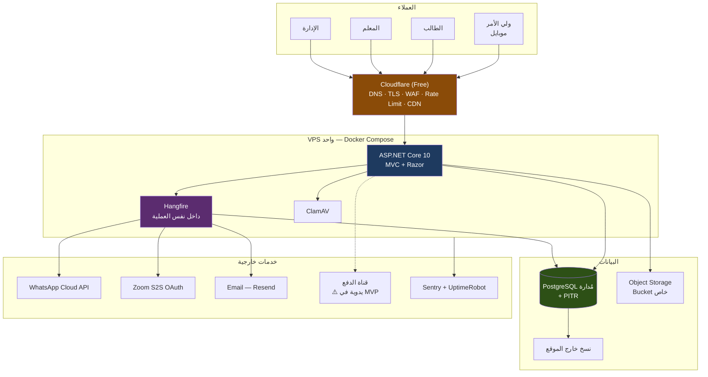

# MVTEACHES — دراسة تقنية وهندسية شاملة — الإصدار الثاني
### Technical, Architectural & Commercial Feasibility Study — V2

| | |
|---|---|
| **الإصدار** | **v3.2** |
| **تاريخ الإصدار** | 2026-08-17 · مُحدَّثة 2026-08-19 · ⭐ **مُحدَّثة 2026-08-24** · ⭐ **مُحدّثة 2026-08-25** |
| **يحل محل** | `MVTEACHES_Technical_Study_v1.md` (v1.0) |
| **الحالة** | Pre-Development — Implementation Blueprint |
| **الأساس الجديد** | «OFFICIAL BUSINESS DECISIONS» (2026-08-17) + 10 قرارات (2026-08-19) — D-38…D-47 + ⭐ **19 قرارًا من الجولة الثالثة (2026-08-24)** — D-48…D-66 + ⭐ **6 قرارات (2026-08-25)** — D-83…D-88 |
| ⭐ **تغيير جوهري في v3.0** | **نموذج البيع تحوّل من «باقة اشتراك» إلى «محفظة ساعات»** · **لا امتحان تحديد مستوى** · **كل ثابت عمل يضبطه الأدمن** |
| **الهدف** | مخطط تنفيذ موثوق قبل بدء التطوير |
| **ما لم يُنفَّذ في هذه الوثيقة** | ❌ لا كود · ❌ لا Migrations · ❌ لا Controllers/Models/Services · ❌ لا تعديل على أي مستودع قائم |
| **تحذير** | هذه الوثيقة **ليست استشارة قانونية**. البنود المتعلقة بحماية بيانات القاصرين والفوترة موسومة `LEGAL`. |

> **ملاحظة على الـ DDL في هذه الوثيقة:** ما يرد من `CREATE TABLE` وتوقيعات واجهات هو **توصيف منطقي توضيحي داخل الدراسة** (استجابةً للمطلب §34: «اشرح المفاتيح والقيود والفهارس»)، **وليس كودًا للتنفيذ**. لا تُنشأ ملفات مصدر ولا Migrations في هذه المرحلة.

---

## 0. المصادر المعتمدة في V2

| # | المصدر | الوصف | الوزن |
|---|---|---|---|
| **S0** | ⭐ **OFFICIAL BUSINESS DECISIONS (2026-08-17)** | 30 قرارًا مُوقَّعًا من صاحب العمل | **المصدر الأعلى — يحسم كل تعارض سابق** |
| **S1** | نص الطلب الأصلي | المتطلبات الأولية | مُتجاوَز جزئيًا بـ S0 |
| **S2** | `MVTEACHES_Profile.docx` | باقات وأسعار | ⚠️ **أرقامه أمثلة — S0 §5/§24 تجعل التسعير قابلًا للضبط** |
| **S3** | `MVTEACHES_buss-pro.pdf` | Company Profile 2026 | تسويقي |
| **S4** | صور SRS (6 من 14 صفحة) | مواصفات شاشات وتكاملات | تقني — **لا يزال ناقصًا** |
| **S5** | صورة إعلان إنستجرام | أسعار منشورة | ⚠️ أمثلة |
| **S6** | `mvteaches.com` | ⚠️ **S0 §23: موقع تسويقي مرجعي فقط — لا يُعاد استخدام معماريته ولا قاعدته** | مرجع أعمال |
| **S7** | مصادر خارجية رسمية | تم التحقق 2026-08-17 — موثقة بالرابط والتاريخ | تقني/تجاري |

> ✅ **مُغلق نهائيًا 2026-08-25 (بدل `ACTION REQUIRED` القديم):** وثيقة SRS الأصلية 14 صفحة (عربي كامل ص1–8 · إنجليزي مرآة ص9–14). **الست المصوَّرة (S4) هي ص4–9**: شاشات الموقع العام · بوابة الطالب · بوابة المعلم · لوحة الإدارة · التكاملات · الملاحظات الختامية — وكلها انعكست في أقسام هذه الدراسة. **الناقص كان فعليًا: صفحة 1 (غلاف) وصفحة 3** (نظرة عامة على المشروع · نطاق العمل · البنية العامة للفروع). النقطة الوحيدة التي احتاجت تأكيدًا — هل «فرع» (Branch) في صور الشاشات يطابق «بلد» (`Country`/`D-53`) الذي تنمذجه هذه الدراسة — **حسمها المالك صراحةً (2026-08-25): «الفرع» يعني البلد/السوق نفسه (الأردن، فلسطين، وغيرهما)، ولا فروع فعلية مستقلة داخل نفس الدولة في الـMVP.** ➜ **لا كيان `Branch` منفصل — `Country` كافٍ**، وتُسقط الصفحتان 1 و3 نهائيًا من متطلبات الدراسة.

---

# 1. Confirmed Business Decisions — القرارات المعتمدة

هذا الجدول هو **العقد المرجعي** للمشروع. كل قسم لاحق في هذه الوثيقة متسق معه، وكل مخالفة له تُعد خطأ تنفيذيًا.

| # | القرار | قاعدة العمل | الأثر على النظام |
|---|---|---|---|
| **D-01** | **حسابات أولياء الأمور** | ولي الأمر له حساب مستقل، ويرتبط بعدة أبناء | كيان `Guardians` + جدول ربط + طبقة تخويل «الوصاية» في كل استعلام |
| **D-02** | **كل طفل كيان مستقل** | لا يتشارك الأشقاء سجل طالب واحد | `Students` منفصل تمامًا: مستوى، اشتراك، حضور، واجبات، شهادات، تقدّم |
| **D-03** | **البالغون بلا ولي أمر** | العلاقة اختيارية (0..1) | `Student.GuardianId NULL` مسموح؛ القيد يُفرض بالعمر لا بالكود الثابت |
| **D-04** | **الفئات العمرية النهائية** | **5–12 · 13–17 · 18+** بلا حد أعلى | ❌ إلغاء 30+ · حدود غير متداخلة · الاشتقاق من تاريخ الميلاد |
| **D-05** | **إسناد المستوى** | **معلم مخوّل أو أدمن مخوّل** | ❌ حذف «الأدمن فقط» من v1 · سجل تدقيق إلزامي لكل تغيير مستوى |
| **D-06** | **بلدان التسعير** | الأردن · فلسطين | `Country` بُعد أساسي (بديل `Branch` في v1) |
| **D-07** | **تحديد البلد** | من **رمز دولة الهاتف** المتحقق عبر OTP | ⚠️ **يُخزَّن كحالة على الحساب في الخادم — لا يُقرأ من الطلب أبدًا** |
| **D-08** | **منع اختيار البلد** | الفلسطيني لا يرى/يختار أسعار الأردن والعكس | الفلترة على مستوى الاستعلام + إعادة تحقق عند الشراء |
| **D-09** | **العملات** | الأردن **JOD** · فلسطين **ILS** | `Money = (amount, currency)` في كل الجداول المالية · ❌ لا عملة ثابتة في الكود |
| **D-10** | **الأسعار قابلة للضبط** | الأدمن يضبط كل الأسعار | ❌ لا أرقام في الكود · ✅ Snapshot للسعر لحظة الشراء |
| **D-11** | ⚠️ **حساب شخصي للاستلام** | لا يوجد حساب بنكي تجاري ولا شركة مؤكدة | 🔴 **يغيّر معمارية الدفع كليًا — القسم 21** |
| **D-12** | **لا افتراض بتوفر Stripe** | يجب بحث الأهلية الفعلية | Stripe مستبعد عمليًا (القسم 21) |
| **D-13** | **اشتراك بلا دفع** | الأدمن يفعّل اشتراكًا و«المدفوع = 0» | فصل صريح: **تفعيل الاشتراك ≠ اكتمال الدفع** |
| **D-14** | **الرصيد المستحق يحجب الحضور** | الطالب المدين يُمنع من الحضور + يُشعَر | ⚠️ يتعارض ظاهريًا مع D-13 — انظر `CONF-01` |
| **D-15** | **لا استرداد** | NO REFUND | تُسجَّل السياسة ويُوثَّق الطلب — ❌ لا تدفق استرداد آلي |
| ~~**D-16**~~ | ~~مدة الاشتراك 45 يومًا~~ | ⛔ **مُلغى بـ`D-64`** | المهلة تتناسب مع حجم الشراء ويضبطها الأدمن — ❌ **لا رقم صلاحية ثابت في النظام** |
| **D-17** | **لا تمديد تلقائي** | الإكمال الطبيعي = لا تمديد | ❌ لا منطق تمديد آلي إطلاقًا |
| **D-18** | **تمديد استثنائي بقرار أدمن** | «ظروف مقبولة» → تمديد/إعادة جدولة | تدفق استثناء يدوي **مُدقَّق بسبب إلزامي** |
| ~~**D-19**~~ | ~~صلاحية التعويض 30 يومًا~~ | ⛔ **مُعدَّل بـ`D-63`** | `MakeUpCredit.ExpiresOn` يبقى — لكن **يكتبه الأدمن لكل حالة** لا يُحسب بثابت |
| **D-20** | ⭐ **لا ازدواج تعويض** | إلغاء/نقل من الأدمن = إلغاء + جدولة جديدة، **بلا رصيد تعويض إضافي** | الاستحقاق **يُنقل** لا يُعاد إصداره — انظر §20.4 |
| **D-21** | **لا مهلة إلغاء عامة** | ❌ لا قاعدة «قبل X ساعة» | ❌ حذف كل منطق Cutoff من v1 |
| **D-22** | **الإلغاء بيد الأدمن** | إلغاء/نقل/تحويل الطالب لجدول أو دورة أخرى | صلاحيات أدمن واسعة + تدقيق |
| **D-23** | **جدول أسبوعي ثابت** | مثال: اثنين+أربعاء · أحد+ثلاثاء · أحد+ثلاثاء+خميس | `RecurringSchedules` جوهر MVP — ❌ لا حجز حر |
| **D-24** | **الطالب لا يختار المعلم** | الإسناد من الأدمن/النظام | مؤجَّل للمستقبل بلا إعادة هيكلة |
| **D-25** | **حصة بطالب واحد** | الأدمن يقرر: تُعقد / تُلغى / يُنقل | ❌ لا حد أدنى آلي |
| **D-26** | ⭐ **أجر المعلم من الساعات المُسلَّمة المتحقَّق منها** | ❌ ليس من الحجز ولا الجدولة | حالات مستقلة: Scheduled / Booked / Cancelled / Delivered / NotDelivered + تحقق أدمن |
| **D-27** | **أجر متغيّر** | Conversation 12 JOD/س · IELTS 15 JOD/س (أمثلة) | `TeacherRates` بأبعاد: دورة/مستوى/فئة/عقد + **Snapshot عند التسليم** |
| **D-28** | **حسابات المعلمين يدويًا** | ❌ لا تسجيل ذاتي للمعلم في MVP | الأدمن ينشئ الحساب — ❌ حذف «بوابة تقديم المعلمين» من v1 |
| ~~**D-29**~~ | ~~امتحان تحديد المستوى قائم~~ | ⛔ **مُلغى بـ`D-48`** | ❌ **لا امتحان يقدّمه الطالب** — المعلمة تقابله عبر Zoom وتقرّر من أين تبدأ · يسقط بنك الأسئلة والتصحيح |
| **D-30** | ⭐ **الشهادات لكل 30 ساعة تدريس** | إكمال 30 ساعة للمستوى → شهادة | ⚠️ التقدّم يُحسب على **(طالب × مستوى)** لا على الاشتراك — انظر `CONF-03` |
| **D-31** | **الواجبات ثنائية الاتجاه** | المعلم يرفع · الطالب يرفع حلّه | تخزين خاص + Signed URLs + تخويل بالتسجيل |
| **D-32** | ⭐ **ترحيل الطلاب الحاليين** | طلاب دفعوا مسبقًا — **ممنوع تحصيل مبلغ مكرر** | عملية استيراد مُدارة + قيود دفتر ترحيل — انظر `CONF-02` |
| **D-33** | **بناء من الصفر** | `mvteaches.com` مرجع أعمال فقط | ❌ لا إعادة استخدام لمعماريته أو قاعدته |
| **D-34** | **تحكم إداري شامل** | 20+ مجالًا تحت سيطرة الأدمن | كل تجاوز إداري **مُدقَّق بسبب** |
| **D-35** | **ليس سوق دورات** | منصة تعليم مُدارة | النموذج يعكس: أولياء أمور، أطفال، جداول متكررة، استحقاقات ساعات، أجور |
| **D-36** | ⭐ **دفتر حركات لا عدّادات** | ❌ ممنوع `TotalClasses/UsedClasses/…` كحقول مستقلة | Append-Only Ledger — **يُبقى عليه من v1** |
| **D-37** | **الحصة ≠ الساعة بالضرورة** | الحصة عادةً ساعة، لكن النموذج يدعم مدة متغيرة | `DurationMinutes` + استحقاق بالدقائق |
| **D-38** | ⭐⭐ **لا تقسيط — الدفع كامل أو لا اشتراك** | الطالب يشتري الاشتراك كاملًا · ❌ لا دفعات جزئية | 🔴 **يحل `CONF-01` كليًا** — الأهلية = (المستحق = 0) |
| **D-39** | ⭐ **قناة الدفع: تحويل بنكي / CliQ يدويًا** | الأدمن يستلم ويعتمد · **MEPS مرشّح لاحقًا** | `ManualVerifiedProvider` هو التطبيق الوحيد في MVP |
| **D-40** | **لا حد أدنى مضمون لأجر المعلم** | الأجر = الساعات المُسلَّمة × السعر الذي يحدده المالك | ❌ لا منطق `MAX(ساعات×سعر, حد أدنى)` |
| **D-41** | ⭐ **دورة واحدة: تقوية إنجليزي حسب المستوى** | ❌ لا IELTS ولا TOEFL ولا Corporate في MVP | `Courses` يبقى كيانًا (رخيص ومستقبلي) ويُبذَّر بصف واحد |
| ~~**D-42**~~ | ~~غياب الطالب~~ | ⛔ **مُستبدَل بـ`D-83`** (2026-08-25) | القاعدة الجديدة: الغياب (عدم ضغط Join) **لا يُخصم مطلقًا**، بعذر كان أم بلا عذر — التمييز القديم سقط لأن الخصم صار مرتبطًا حصرًا بضغطة الحضور |
| **D-43** | **إلغاء المعلم** | يجب إخطار الأدمن **قبل يوم على الأقل** | قاعدة تشغيلية + أساس لتقييم التزام المعلم |
| **D-44** | **حصة تحديد المستوى** | ❌ **لا تدخل كشف الأجور** | `session_type='Placement'` مستثناة من `payroll_lines` |
| **D-45** | **صرف الأجر خارج النظام** | النظام **يحتسب ويعرض ويعتمد** · الأدمن **يحوّل يدويًا** | ❌ لا تكامل مع أي نظام صرف — تُسجَّل واقعة الصرف فقط |
| **D-46** | **مدة الحصة 60 دقيقة** | ساعة كاملة | `duration_minutes = 60` افتراضيًا |
| **D-47** | **الحصة الجماعية تُحسب لكل طالب** | كل طالب له قيده الخاص في الدفتر | ✅ يؤكد تصميم `entitlement_ledger` |

## ⭐ الجولة الثالثة — قرارات المالك (2026-08-24) · D-48…D-66

> **هذه الجولة غيّرت نموذج البيع نفسه.** المنتج لم يعد «اشتراكًا بمدة ثابتة»، بل **محفظة ساعات** يشتري منها الطالب ما يريد. الدفتر (`D-36`) استوعب التغيير بلا تعديل جدول واحد.

| # | القرار | قاعدة العمل | الأثر على النظام |
|---|---|---|---|
| **D-48** | ⭐⭐ **لا امتحان يقدّمه الطالب** | المعلمة تقابله عبر Zoom وتقرّر من أين تبدأ معه | ❌ يسقط `placement_tests` · `placement_sections` · `placement_questions` · `placement_answers` · `placement_results` · ✅ يبقى `placement_attempts` كسجل **مقابلة** · **يُغلق §10.4** |
| **D-49** | ⭐ **وحدة البيع: الساعة · والكمية حرّة** | 3 · 5 · 10 · 30 ساعة — بلا باقة مفروضة | ❌ لا عدّ بالحصص في أي مكان · حصتان × 1.5 ساعة = **3 ساعات تُخصم** |
| **D-50** | **«خاصة» = حصة فردية 1:1** | الطالب لا يريد أن يكون في مجموعة | تُشترى بالساعة · **يجوز شراؤها بلا أي اشتراك جماعي** |
| **D-51** | ⭐⭐ **الشهادة: 30 ساعة داخل مستوى واحد** | الساعات **الخاصة تُحتسب** · ويجوز بلا اشتراك أصلًا | 🔴 **يحلّ `CONF-03`** — العدّاد على (طالب × مستوى) مهما كان المصدر · **من لم يبلغ 30 لا شيء ينقصه** |
| **D-52** | ⭐ **المعلم يصحّح امتحان نهاية الكورس ويحدد الدرجة وسلّم النجاح بنفسه** | ✅ **لا سلّم درجات مفروض من النظام** — حقل درجة/تقييم حر يملؤه المعلم لكل طالب، **لا محرك امتحانات** | الدرجة تدخل الشهادة كنص/رقم حر — **حُسم، لا حاجة لرقم من المالك** |
| **D-53** | ⭐ **قائمة أسعار لكل بلد بعملته** | الأردن JOD · فلسطين ILS (**الأدمن يحوّل بنفسه**) · بقية العالم USD | ❌ **لا تحويل آلي للأسعار** · `price_lists` مفتوح لا محصور ببلدين · يسقط تدفّق «بانتظار تحديد الفرع» للتسعير |
| **D-54** | **التجميد: 3 مرات/شهر بعذر · ويوقف العدّاد** | باب مستقل عن التمديد الاستثنائي | `subscription_freezes` · **تاريخ الانتهاء يُشتق ولا يُكتب** |
| **D-55** | ⭐⭐ **التعويض حصة مجدولة تُخصم من الرصيد المشترى** | الأدمن يجدولها في مجموعة أخرى + إشعار واتساب بالموعد | 🔴 **الفائتة بعذر لا تُخصم · البديلة تُخصم** = خصم واحد · تخلّف عنها ← تضيع · يؤكد `D-20` |
| **D-56** | **إثبات الدفع: صورة الحوالة على ملف الطالب** | الأدمن يبحث بالاسم أو الهاتف ويعتمد | `payment_proofs` + `Signed URLs` + شاشة «بانتظار الاعتماد» + تدقيق — يعزّز `D-39` |
| **D-57** | **واتساب: الهدف صفر تكلفة** | ضمن ما هو مجاني قدر الإمكان | ✅ Utility داخل نافذة 24س مجانية · 🔴 **OTP مدفوع دائمًا** ← **OTP عبر البريد** |
| **D-58** | **الترحيل ميزة داخل النظام** | رفع ملف Excel يسجّل الطلاب | `migration_batches` + **معاينة قبل التنفيذ** + تراجع |
| **D-59** | ⭐⭐ **الخصم بالمدة المجدولة لا الفعلية** | حصة 60د انتهت في 57 ← **يُخصم 60** | ❌ لا مطابقة أزمنة Zoom في أي حساب مالي · حضور **ثنائي** لا نسبة · **يُغلق §18.4** |
| **D-60** | ~~صلاحية موحّدة 45 يومًا~~ | ⛔ **مُلغى بـ`D-64`** | — |
| **D-61** | **سن القبول 5–12 · مؤكَّد** | جواب الجولة الثانية (6–12) مُلغى | `D-04` يبقى كما هو · ⚖️ وسم `LEGAL` قائم |
| **D-62** | **أجر المعلم أيضًا على المدة المجدولة** | حصة 60د انتهت في 57 ← **يُحاسَب على 60** | `D-26` يبقى صحيحًا — «المُسلَّمة» = **المجدولة المتحقَّق منها** |
| **D-63** | **لرصيد التعويض مهلة يحددها الأدمن** | لكل حالة على حدة | `makeup_entitlement.expires_on` **يكتبه الأدمن** — يحل محل ثابت الـ30 يومًا |
| **D-64** | ⭐⭐ **مهلة الشراء تتناسب مع حجمه** | 10 ساعات/شهر · 20/شهرين · 30/ثلاثة أشهر · وغيرها يحددها الأدمن | 🔴 **يُلغي `D-16`** · المهلة **حقل على الباقة** · المعدّل ≈ 10 ساعات/شهر **قابل للتحقيق فعلًا** |
| **D-65** | ⭐⭐ **كل ثابت عمل يضبطه الأدمن** | «أريد كل شيء ديناميكيًا» — ❌ لا Hard-coding | جدول `settings` عام + شاشة + تدقيق · ⚠️ **الـ Snapshot للقيم المالية وحدها** (السعر · سعر الصرف) — الإعدادات غير المالية تُقرأ **لحظيًا** — انظر §19.5 |
| **D-66** | **طابور «بانتظار التعويض» عند الأدمن** | يظهر له الطالب الذي يجب تعويضه | شاشة عمل مرتّبة بالأقرب انتهاءً للمهلة — ضمانة ضد سقوط استحقاقات منسية |


## ⭐ جولة 2026-08-25 — ستة قرارات تُغلق ما تبقّى · D-83…D-88

> ## ⚠️ سجلّ حجز أرقام القرارات — اقرأه قبل إضافة أي قرار جديد
>
> ثلاث وثائق جانبية **حجزت أرقام `D-` مستقلة عن هذا الجدول**، فوقع **تعارض ثلاثي فعلي** اكتُشف يوم 2026-08-25. هذا السجلّ يمنع تكراره:
>
> | المدى | المالك | الحالة |
> |---|---|---|
> | `D-01`…`D-66` | ⭐ **هذه الوثيقة** (§1) | ✅ معتمدة |
> | `D-67`…`D-76` | [`MVTEACHES_Payments_And_Reporting_Study.md`](MVTEACHES_Payments_And_Reporting_Study.md) | ⏳ **مقترحة — بانتظار موافقة المالك** |
> | `D-77`…`D-82` | [`MVTEACHES_Domain_Hosting_Compliance_Study.md`](MVTEACHES_Domain_Hosting_Compliance_Study.md) | ✅ معتمدة (الدومين · الاستضافة · واتساب) |
> | ⭐ `D-83`…`D-88` | ⭐ **هذه الوثيقة — جولة 2026-08-25** | ✅ **معتمدة ومثبَّتة — لا يُعاد فتحها** |
> | `D-89`+ | — | ⚪ **أول رقم حرّ لأي قرار قادم** |

| # | القرار | قاعدة العمل | الأثر على النظام |
|---|---|---|---|
| **D-83** | ⭐⭐ **الحضور والخصم بضغطة Join — فوري ومنفصل عن مسار المعلم** | الطالب يضغط زر **Join** الخاص بحصته — و**ولي الأمر يضغطه نيابةً عن طفله** إن لم يكن للطفل حساب مستقل — فيُسجَّل **Present** و**تُخصم مدة الحصة كاملة في اللحظة نفسها**. الضغطة الثانية لا تخصم شيئًا. ❌ **لا مراقبة لمدة البقاء ولا اعتماد على Zoom لإثبات الحضور** — خرج بعد 5 دقائق أو بقي الساعة كاملة، الحصة محسوبة في الحالتين. عدم الضغط = **No-show: لا خصم ولا تعويض تلقائي** | 🔴 **يُعدِّل `D-42`** (سقط تمييز العذر) · 🔴 **يُعدِّل §20.5 قاعدة 5** (القيد يُكتب عند الضغطة لا عند تحقق التسليم) · ✅ **`D-26` بلا تغيير**: المعلم يثبت أن الحصة قُدّمت **لأجرته وحدها**، ولا علاقة لذلك بخصم ساعات الطالب · ❌ **لا Admin approval لكل حضور أو لكل خصم** |
| **D-84** | ✅ **مقابلة تحديد المستوى مجانية** | لا رسوم إطلاقًا | 🔴 **يُغلق `Q-11` نهائيًا** · `session_type='Placement'` مستثناة من الأجور (`D-44`) **ومن الفوترة معًا** · ❌ لا مسار دفع ولا قيد دفتر ولا شاشة — **خصم صافٍ من النطاق** |
| **D-85** | ✅ **الشهادة مجانية** | لا رسم إصدار | 🔴 **يُغلق `Q-12` نهائيًا** · `certificates` بلا أي ارتباط بالمدفوعات · ❌ لا حالة «صدرت ولم تُدفع» — **خصم صافٍ من النطاق** |
| **D-86** | ⭐ **الحصة الخاصة تُباع من داخل النظام** | منتج يشتريه الطالب بالساعة داخل المنصة — ❌ **ليست ترتيبًا خارجيًا** | 🔴 **يُغلق `Q-09` نهائيًا** · يؤكّد `D-50` و`D-49` · صنف سعر في `price_lists` يضبطه الأدمن (`D-10`/`D-65`) · **نفس محفظة الساعات ونفس الدفتر ونفس زر Join** — ❌ لا جدول جديد ولا مسار شراء منفصل |
| **D-87** | ✅✅ **الملف القانوني وخصوصية الأطفال — مغلق نهائيًا بقرار المالك** | ❌ لا مراجعة محامٍ معلّقة · ❌ لا إجراء · ❌ لا خطوة إضافية · ❌ **ولا يعود كسؤال مفتوح لاحقًا** | 🔴 **تُغلق `Q-17` · `Q-18` · `Q-19`** · تسقط كل بنود «بانتظار محامٍ» من خارطة الطريق والمخاطر والتكاليف · ❌ **ممنوع بناء أي Business Rule أو Feature أو خطوة عليه** · وسم `LEGAL` يبقى **وصفًا للسياق لا بند عمل** |
| **D-88** | ⏳ **MEPS: `Waiting for MEPS` حتى وصول الرد الرسمي** | أُرسلت أسئلة الـOnboarding والوثائق المطلوبة وتفاصيل الـAPI — **وردّهم وحده يحدّد المتطلبات** | 🔴 ❌ **ممنوع افتراض أي متطلب من عندنا** · المطلوب تحديده من ردّهم: **الأوراق · الإثباتات · تسجيل المؤسسة · الحساب البنكي · API credentials · البيانات التقنية** — انظر §21.7 · ✅ قناة MVP تبقى `ManualVerifiedProvider` (`D-39`) · `Q-01` محجوب لـ**Phase 7 وحدها** |

> ## 🔒 هذه القرارات مثبَّتة
>
> `D-83`…`D-88` **قرارات نهائية لا يُعاد فتحها.** أي وثيقة أو قسم يخالفها يُعدَّل ليطابقها، لا العكس. وبالتحديد:
>
> - **`D-87` يعني أن الملف القانوني مغلق كمصدر عمل** — لا سؤال مفتوح، ولا بند في خارطة الطريق، ولا سطر تكلفة، ولا Feature يُبنى عليه.
> - **`D-83` يُنفَّذ بأبسط صورة ممكنة**: صف واحد في `attendance` + قيد واحد في الدفتر، في معاملة واحدة. ❌ **لا Provisional Attendance · لا Approval Workflow · لا Closing Window · لا Time Tracking · لا حالات إضافية.**
> - **`D-84`/`D-85`/`D-86` تُقلّل العمل ولا تزيده**: المجانية تُلغي مسارَي دفع كاملين، والحصة الخاصة تعيد استخدام ما هو مبنيّ أصلًا.

---

# 2. Executive Summary — الملخّص التنفيذي

## 2.1 ما تغيّر جوهريًا عن V1

V1 كانت دراسة **تحت الغموض**: أربعة مصادر تصف أربعة أعمال، وستة أسئلة محجوبة تمنع تصميم قاعدة البيانات. **S0 حسم خمسة من الستة.** النتيجة: المشروع انتقل من «غير جاهز للتصميم» إلى ✅ **«جاهز لتصميم قاعدة البيانات فورًا»** — مع أربعة أسئلة تحسم **بالتوازي** وتمنع مراحل تنفيذ محددة لا المخطط (القسم 43 و§45.6).

لكن **S0 أدخل مخاطرة جديدة أكبر من كل ما سبق**:

> ## 🔴 الاكتشاف الأهم في V2
>
> **D-11: لا توجد شركة مسجّلة ولا حساب بنكي تجاري — الأموال تُستلم في حساب شخصي.**
>
> **كل بوابات البطاقات في الأردن وفلسطين تشترط كيانًا مسجّلًا وحساب تسوية تجاريًا.** إن ثبت ذلك، فإن **قبول البطاقات غير متاح في MVP إطلاقًا**، وتصبح القناة الأساسية للدفع في **البلدين معًا**:
>
> **CliQ / تحويل بنكي + إثبات دفع + اعتماد إداري مُدقَّق.**
>
> هذا **يقلب** تصميم v1 رأسًا على عقب: v1 اعتبرت التحويل البنكي «احتياطيًا لفلسطين»؛ في V2 قد يكون **القناة الأساسية للجميع**. النتائج (القسم 21):
> - ❌ **لا Webhook** ← لا تأكيد دفع آلي ← تأكيد الأدمن يصبح **عملية من الدرجة الأولى، بأعلى صلاحية، ومُدقَّقة بالكامل**
> - ✅ **يسقط بند عمولة البوابة (~2.5–3.5%)** من التكلفة الشهرية
> - ⚠️ **يظهر بند جديد: عمل إداري يدوي** يتناسب طرديًا مع عدد المدفوعات
> - ✅ طبقة `IPaymentProvider` تبقى صحيحة، لكن `ManualVerifiedProvider` يصبح **تطبيقًا أصيلًا لا حلًا مؤقتًا**

## 2.2 الحكم الهندسي المختصر — V2

| السؤال | الجواب |
|---|---|
| هل المشروع قابل للتنفيذ تقنيًا؟ | **نعم.** لا مسألة خوارزمية غير محلولة. |
| هل نموذج العمل متسق داخليًا الآن؟ | ✅ **متسق.** قرار **«لا تقسيط» (D-38)** حلّ `CONF-01`، و**سياسة الغياب بضغطة Join (D-83، تُبسِّط D-42)** حلّت `Q-02`. و⭐ **`CONF-05` (غياب الطالب بمبادرته) أُغلق كليًا بـ`D-83`**. بقي `CONF-04` (تعارض تواريخ) مغلقًا جزئيًا. |
| ما أخطر ما فيه الآن؟ | ⭐ **بيانات الطلاب الحاليين.** قناة الدفع حُسمت (تحويل/CliQ يدوي — D-39). الخطر المتبقي: **ترحيل أرقام غير دقيقة يتحول إلى نزاعات مع عملاء دافعين.** |
| هل يمكن البدء بتصميم قاعدة البيانات؟ | ✅ **نعم — بالكامل وفورًا.** بفصل «الاستحقاق» عن «الأهلية» (§22.2)، لم يبقَ سؤال يمنع شكل الجداول. الأسئلة الأربعة تمنع **مراحل تنفيذ** لا المخطط (§45.6). |
| هل زاد حجم المشروع عن V1؟ | **نعم — بوضوح.** أولياء الأمور + أجور المعلمين المتحقَّقة + الشهادات + الترحيل + الجداول المتكررة = **زيادة صافية ~35 يوم عمل** (القسم 38). |
| هل التكلفة التشغيلية معقولة؟ | **نعم، وأقل حتى مما ورد هنا.** ⚠️ **رقم قديم — انظر [`MVTEACHES_Domain_Hosting_Compliance_Study.md`](MVTEACHES_Domain_Hosting_Compliance_Study.md):** البنية التحتية ≈$8–12/شهر (أرقام رسمية) + **Zoom $0 على المعهد** (كل معلم يدفع اشتراكه) + واتساب غير محدَّد بعد. |

## 2.3 التوصية النهائية باختصار

> **Modular Monolith على ASP.NET Core 10 + Razor، مع PostgreSQL 16، و Hangfire داخل العملية، على VPS واحد، خلف Cloudflare — مع طبقة دفع مجرّدة يكون تطبيقها الأول `ManualVerifiedProvider` (CliQ/تحويل بنكي + اعتماد إداري)، ونموذج بيانات مبني على دفتر استحقاقات append-only بالدقائق لا بالحصص.**

**التغيير المعماري الوحيد الجوهري عن v1:** استبدال بُعد `Branch` بـبُعد `Country`، وترقية «التحويل البنكي» من احتياطي إلى قناة أساسية.

---

# 3. Business Model — نموذج العمل

## 3.1 ما هو هذا العمل فعليًا (D-35)

**ليس سوق دورات (Marketplace).** لا يوجد بائعون مستقلون، ولا يختار الطالب معلمه (D-24)، ولا يوجد تسعير تنافسي. هو:

> **منصة تعليم إنجليزي مُدارة مركزيًا**، تبيع **استحقاق ساعات تدريس** لطلاب مصنّفين بالمستوى والعمر والبلد، وتُسلّمها عبر **جداول أسبوعية ثابتة** يديرها الأدمن، وتحتسب **أجور المعلمين من الساعات المُسلَّمة المتحقَّق منها**.

**الأثر المعماري المباشر لهذا التمييز:**

| لو كان Marketplace | لأنه منصة مُدارة |
|---|---|
| بحث وتصفح وتقييمات معلمين | ❌ غير مطلوب — الأدمن يُسند |
| تسعير لكل معلم | ❌ سعر واحد لكل (دورة × بلد) |
| تقويم حجز حر للطالب | ❌ جدول أسبوعي ثابت (D-23) |
| محفظة معلم وتحصيل عمولة | ✅ **كشف أجور من ساعات مُسلَّمة** (D-26) |
| العرض والطلب يحكمان السعة | ✅ **الأدمن يقرر انعقاد الحصة** (D-25) |

## 3.2 دورة الحياة التجارية الكاملة

```
تسجيل ولي أمر/طالب
    ↓ تحقق OTP واتساب  →  ⚡ يُثبَّت البلد والعملة هنا (D-07)
مقابلة تحديد المستوى عبر Zoom — ❌ لا امتحان يقدّمه الطالب (D-48)
    ↓ تقييم المعلم
إسناد المستوى (معلم أو أدمن — مُدقَّق) (D-05)
    ↓
شراء اشتراك بسعر بلده (D-08/D-10)  ← أو  اشتراك ينشئه الأدمن بلا دفع (D-13)
    ↓ قيد استحقاق في الدفتر (D-36)
إسناد جدول أسبوعي ثابت (D-23) + إسناد معلم (D-24)
    ↓
حصة → حضور → ⚡ تأكيد التسليم من المعلم → تحقق الأدمن (D-26)
    ↓                                    ↓
خصم استحقاق الطالب              استحقاق أجر المعلم
    ↓
تراكم الساعات على (طالب × مستوى)
    ↓ عند 30 ساعة (D-30)
شهادة المستوى → الترقية للمستوى التالي
```

**نقطتان يجب ألا تُخلطا أبدًا:**
1. **خصم استحقاق الطالب** يحدث عند **استهلاك الحصة**.
2. **استحقاق أجر المعلم** يحدث عند **تأكيد التسليم**.

قد تحدثان معًا، وقد لا تحدثان. مثال: حصة أُلغيت بخطأ إداري بعد حضور المعلم وانتظاره — قد يُقرَّر دفع أجر المعلم دون خصم من الطالب. **حدثان ماليان مستقلان في دفترين مستقلين.**

## 3.3 مصادر الإيراد والتكلفة

| البند | النوع | ملاحظة |
|---|---|---|
| اشتراكات الحصص الجماعية | إيراد رئيسي | حتى 4 طلاب/حصة |
| الحصص الخاصة (Private) | إيراد | ✅ **داخل MVP، تُباع من النظام** (`D-86`) |
| مقابلة تحديد المستوى | ✅ **مجانية نهائيًا** (`D-84`) | `Q-11` مغلق |
| الشهادات | ✅ **مجانية نهائيًا** (`D-85`) | `Q-12` مغلق |
| **أجور المعلمين** | **أكبر بند تكلفة** | متغيّر بالساعة المُسلَّمة (D-27) |
| رسائل واتساب | تكلفة متغيرة | تنمو مع عدد الحصص لا الطلاب |
| رخص Zoom | تكلفة شبه ثابتة | **بعدد المعلمين المضيفين** (القسم 28) |
| البنية التحتية | تكلفة ثابتة | أصغر بند — لا تُهدر وقتًا في تحسينه |
| عمولة بوابة | ⚠️ **قد تكون صفرًا** | إن اعتُمد التحويل البنكي (D-11) |

> ⚠️ **تحذير هامش الربح — يتكرر من v1 ويزداد أهمية:** أجر المعلم 12–15 JOD/ساعة (D-27). إن كانت الباقة 30 حصة بسعر يقل عن **360–450 JOD**، فالهامش سالب قبل أي تكلفة تقنية. **الأسعار أمثلة (D-10)، لكن هذه المعادلة ليست مثالًا.** ➜ **نمذج هامش كل باقة قبل تثبيت السعر** — لا معمارية تصلح تسعيرًا خاسرًا.

---

# 4. Actors — الفاعلون

| # | الفاعل | جديد في V2؟ | الوصف |
|---|---|---|---|
| **A-1** | **ولي الأمر / Guardian** | ⭐ **نعم — D-01** | حساب مستقل، يرتبط بعدة أبناء، يرى بياناتهم ويتابع دفعاتهم |
| **A-2** | **الطالب القاصر (5–17)** | معدّل | حساب مستقل تمامًا (D-02)، مرتبط بولي أمر |
| **A-3** | **الطالب البالغ (18+)** | معدّل — لا حد أعلى (D-04) | حساب مستقل، بلا ولي أمر (D-03) |
| **A-4** | **المعلم** | معدّل | يُنشأ يدويًا (D-28) · يُقيّم المستوى (D-05) · **يؤكد تسليم الحصة** (D-26) · يرفع الواجبات |
| **A-5** | **الأدمن الرئيسي (الأردن)** | كما هو | صلاحية كاملة + كل التجاوزات |
| **A-6** | **الأدمن المُطّلِع (فلسطين، بريطانيا)** | كما هو | **قراءة فقط** |
| **A-7** | **النظام (Scheduler)** | كما هو | Hangfire: تذكيرات، انتهاء اشتراكات، انتهاء تعويضات، تنبيهات |
| **A-8** | **بوابة/قناة الدفع** | ⭐ **معدّل جوهريًا** | قد تكون **بشرية** (اعتماد أدمن) لا آلية — D-11 |

## 4.1 ⭐ الفاعل الجديد: ولي الأمر — والمشكلة التي يحلّها

v1 وسمت «حساب الطفل» كأخطر مشكلة في المشروع كله وتركته `UNKNOWN`. **D-01 حسمها.** الحل المعتمد:

```
Guardian (حساب مستقل: بريد + هاتف + كلمة مرور + OTP)
   │
   ├──> Student A   (حساب مستقل — B1 — اشتراك خاص به)
   ├──> Student B   (حساب مستقل — A2 — اشتراك خاص به)
   └──> Student C   (حساب مستقل — A1 — اشتراك خاص به)
```

**لماذا هذا التصميم صحيح ولماذا البديل كارثي:**

| البديل المرفوض | لماذا يفشل |
|---|---|
| طفل بلا حساب، البيانات داخل حساب ولي الأمر | ❌ الأشقاء يتقدمون بسرعات مختلفة (D-02). مستوى واحد وشهادة واحدة لثلاثة أطفال = مستحيل |
| حساب واحد يتشارك فيه الإخوة | ❌ حضور مَن؟ واجب مَن؟ شهادة مَن؟ — يفسد الأجور والشهادات معًا |
| ربط N:N بين ولي الأمر والطالب | ⚠️ يعقّد التخويل بلا مبرر حالي — **لكن انظر `Q-04`** (والدان مطلّقان؟) |

**القرار المعماري:** `Student` كيان مستقل دائمًا. `Guardian` كيان مستقل. العلاقة **1:N** من ولي الأمر إلى الطلاب، و**0..1** من الطالب إلى ولي الأمر.

> ⚠️ **ملاحظة تخويل حرجة:** وجود ولي أمر يعني أن **كل استعلام عن بيانات طالب له مساران للتخويل**: «أنا الطالب» أو «أنا وليّه». هذا **يضاعف سطح ثغرات IDOR**. المعالجة الإلزامية في القسم 31.

---

# 5. Roles — الأدوار

| الدور | الوصف | يُنشأ بواسطة |
|---|---|---|
| `SystemAdmin` | الأدمن الأردني — تحكم كامل (D-34) | تثبيت أولي |
| `ReadOnlyAdmin` | أدمن فلسطين وبريطانيا | `SystemAdmin` |
| `Teacher` | معلم | `SystemAdmin` يدويًا (D-28) |
| `Guardian` | ولي أمر | تسجيل ذاتي + OTP |
| `Student` | طالب (قاصر أو بالغ) | تسجيل ذاتي، أو **إنشاء ولي الأمر**، أو الأدمن — انظر `Q-05` |

> **قرار:** الأدوار **بيانات لا Enum ثابت**، لكن **الصلاحيات المرتبطة بها ثابتة في الكود**. السبب: دور جديد بلا كود يفهمه = ثغرة صامتة. إضافة دور تتطلب نشرًا — وهذا مقصود في نظام مالي.

## 5.1 نموذج الصلاحيات: RBAC + Scope + Ownership

الدور وحده لا يكفي. كل طلب يمر بثلاث بوابات متتالية:

```
1. Authentication      → مَن أنت؟
2. Role/Permission     → هل دورك يملك هذه الصلاحية أصلًا؟   (مثال: Billing.Write)
3. Scope + Ownership   → هل هذا السجل بالذات يخصك؟          (⚠️ البوابة التي تُنسى دائمًا)
```

**البوابة الثالثة هي المهمة في هذا النظام تحديدًا**، لأن وجود أولياء الأمور والأشقاء يجعل «طالب يقرأ بيانات طالب آخر» **سيناريو واقعيًا لا نظريًا**.

---

# 6. Permissions — مصفوفة الصلاحيات

| المجال | SystemAdmin | ReadOnlyAdmin | Teacher | Guardian | Student |
|---|---|---|---|---|---|
| بيانات الطالب الشخصية | ✏️ كامل | 👁️ | 👁️ **طلابه فقط** | 👁️ **أبنائه فقط** | 👁️ **نفسه** |
| إسناد/تعديل المستوى | ✏️ (D-05) | ❌ | ✏️ **طلابه فقط** (D-05) | ❌ | ❌ |
| نتيجة مقابلة تحديد المستوى | ✏️ | 👁️ | ✏️ تقييم | 👁️ أبنائه | 👁️ نفسه |
| إنشاء/تفعيل اشتراك | ✏️ (D-13) | ❌ | ❌ | ❌ | ➕ شراء لنفسه |
| شراء اشتراك لابنه | — | — | — | ➕ **نعم** | — |
| تسجيل دفعة / اعتمادها | ✏️ **حصريًا** ⚠️ | ❌ | ❌ | 📎 رفع إثبات | 📎 رفع إثبات |
| عرض الرصيد المستحق | 👁️✏️ | 👁️ | ❌ | 👁️ أبنائه | 👁️ نفسه |
| دفتر الاستحقاقات | 👁️ + تعديل بسبب | 👁️ | ❌ | 👁️ (للقراءة) | 👁️ (للقراءة) |
| إنشاء/تعديل جدول متكرر | ✏️ | ❌ | ❌ | ❌ | ❌ |
| إتاحة المعلم | ✏️ | 👁️ | ✏️ **نفسه** | ❌ | ❌ |
| إلغاء/نقل حصة | ✏️ **حصريًا** (D-22) | ❌ | ⚠️ طلب فقط | ❌ | ⚠️ طلب فقط |
| ⭐ **تسجيل الحضور (ضغطة Join)** | ❌ لا يسجّله أحد يدويًا — يعالج الاستثناءات فقط | ❌ | ❌ **لم يعد من مهامه** (`D-83`) | ✏️ **عن أبنائه** | ✏️ **نفسه** |
| **تأكيد تسليم الحصة** | ✏️ تحقق نهائي | 👁️ | ✏️ **إقرار أولي** | ❌ | ❌ |
| **أجور المعلمين** | ✏️ اعتماد | 👁️ | 👁️ **أجره فقط** ⚠️ | ❌ | ❌ |
| الأسعار وقوائم البلدان | ✏️ (D-10) | 👁️ | ❌ | ❌ | 👁️ **بلده فقط** (D-08) |
| رفع مواد/واجب | ✏️ | 👁️ | ✏️ **حصصه** | ❌ | ❌ |
| رفع حل واجب | — | 👁️ | 👁️ طلابه | 👁️ أبنائه | ✏️ **نفسه** (D-31) |
| الشهادات | ✏️ إصدار/اعتماد | 👁️ | 👁️ | 👁️ أبنائه | 👁️ نفسه |
| الترحيل والاستيراد | ✏️ **حصريًا** (D-32) | ❌ | ❌ | ❌ | ❌ |
| الإعلانات | ✏️ | 👁️ | 👁️ | 👁️ | 👁️ |
| التقارير والـ Dashboard | 👁️ كامل | 👁️ كامل | 👁️ محدود | ❌ | ❌ |
| سجل التدقيق | 👁️ | 👁️ | ❌ | ❌ | ❌ |
| المستخدمون والأدوار | ✏️ | ❌ | ❌ | ❌ | ❌ |

**رمز:** ✏️ تعديل · 👁️ قراءة · ➕ إنشاء لنفسه · 📎 رفع مرفق · ❌ ممنوع

## 6.1 خمس قواعد صلاحيات غير قابلة للتفاوض

1. **Deny by default.** كل Endpoint يتطلب صلاحية صريحة. غياب السمة = رفض، لا سماح.
2. **`ReadOnlyAdmin` يُفرض على مستوى البنية لا الواجهة.** إخفاء الزر ليس أمانًا. تُطبَّق على مستوى الـ Handler، **ويُختبر آليًا** أن كل أمر كتابة يرفض هذا الدور.
3. ⭐ **المعلم يرى أجره هو فقط.** «معلم يعدّل أجر معلم آخر» أو حتى يراه = خرق مباشر (§35 في S0).
4. ⭐ **المعلم يُقر بالتسليم، والأدمن يتحقق.** لا يجوز أن يكون الإقرار وحده كافيًا لصرف المال (D-26). فصل الواجبات (Segregation of Duties) — مبدأ محاسبي لا تفضيل.
5. **كل تجاوز إداري يتطلب حقل «سبب» غير فارغ ويُكتب في `AuditLogs`** (D-34). بلا استثناء.

> ⚠️ **`UNKNOWN` — صلاحية الأدمن المُطّلِع على البيانات المالية.** هل يحق لأدمن فلسطين رؤية **إيرادات الأردن وأجور معلميه**؟ v1 افترضت فصلًا بالفرع. **S0 لم يحسم هذا.** انظر `Q-05`.
---

# 7. Parent/Child Architecture — معمارية ولي الأمر والطفل

## 7.1 النموذج المعتمد

**القرار: فصل الهوية (Identity) عن الشخص (Person).** هذا أهم قرار بنيوي في V2 بعد الدفتر.

```
users  (الهوية — ASP.NET Core Identity)
  ├── id, email, phone, password_hash, phone_verified, mfa, ...
  └── country_id  ⚡ حالة خادم — لا تُقرأ من الطلب (D-07)
        │
        ├──> guardians.user_id     (1:1)   ← ولي الأمر يسجّل الدخول
        ├──> students.user_id      (0..1)  ← ⚠️ قد يكون NULL
        └──> teachers.user_id      (1:1)
```

> ### ⭐ لماذا `students.user_id` قد يكون `NULL` — القرار الذي يوفّر أخطر ترحيل لاحق
>
> طفل عمره 5 سنوات **لا يملك بريدًا ولا هاتفًا ولا كلمة مرور**، ولا يجب أن يملك. لكنه **يجب** أن يكون كيان طالب مستقل بمستوى واشتراك وشهادات (D-02).
>
> الحل: **الطالب موجود دائمًا كـ `Student`. أما `User` فاختياري.**
>
> | الحالة | `Student` | `User` | من يسجّل الدخول |
> |---|---|---|---|
> | طفل 5–12 | ✅ | ❌ `NULL` | ولي الأمر فقط |
> | مراهق 13–17 | ✅ | ⚠️ اختياري — `Q-07` | ولي الأمر و/أو الطالب |
> | بالغ 18+ | ✅ | ✅ | الطالب |
> | طالب مُرحَّل (D-32) | ✅ | ❌ حتى يفعّل حسابه | لا أحد بعد |
>
> **لو ربطنا الطالب بالمستخدم برابط إلزامي، لاضطررنا لاحقًا إلى ترحيل بيانات مصادقة عند بلوغ الطفل — وهو أخطر ترحيل ممكن.** هذا التصميم يجعل «منح الطفل حسابًا لاحقًا» مجرد `UPDATE` لعمود واحد.
>
> ### ⭐ أثر ذلك على زر Join (`D-83`)
>
> الطفل بلا `user_id` **لا يستطيع الضغط بنفسه** — لا حساب له يدخل منه. والقرار: **ولي الأمر يضغط Join نيابةً عنه من حسابه هو**، بنفس القاعدة حرفيًا — ❌ **لا حساب مستقل للطفل، ولا مسار حضور منفصل للأطفال**. `attendance.marked_by` يحمل `user_id` **ولي الأمر**، بينما `student_id` يحمل **الطفل** — يتيحه المخطط أصلًا بلا تعديل عمود واحد.

## 7.2 جدول الوصاية

```sql
CREATE TABLE guardianships (
    guardian_id   bigint NOT NULL REFERENCES guardians(id),
    student_id    bigint NOT NULL REFERENCES students(id),
    relationship  text   NOT NULL,        -- Parent | LegalGuardian | Other
    is_primary    boolean NOT NULL DEFAULT true,
    can_pay       boolean NOT NULL DEFAULT true,
    linked_at_utc timestamptz NOT NULL DEFAULT now(),
    linked_by     bigint NULL REFERENCES users(id),
    PRIMARY KEY (guardian_id, student_id)
);
CREATE UNIQUE INDEX ux_guardianship_primary
    ON guardianships (student_id) WHERE is_primary;
```

**لماذا جدول ربط وليس `students.guardian_id` مباشرة؟** S0 §1 يقول «0..1 حسب التصميم النهائي»، لكن الواقع الاجتماعي يفرض احتمال **والدين منفصلين، أو ولي أمر + جد**. جدول الربط يستوعب الحالتين بتكلفة **صفر** الآن، بينما إضافته لاحقًا تعني تعديل كل استعلام تخويل. القيد `ux_guardianship_primary` يضمن ولي أمر رئيسي واحد للفوترة والإشعارات. راجع `Q-06`.

## 7.3 لوحة ولي الأمر — ما يراه بالضبط (D-01)

| القسم | لكل ابن | المصدر |
|---|---|---|
| البيانات الشخصية | ✅ | `students` |
| المستوى الحالي | ✅ | `student_levels` (الحالي) |
| نتيجة تحديد المستوى | ✅ | `placement_attempts` |
| الاشتراك ونوعه | ✅ | `subscriptions` |
| الساعات المشتراة | ✅ | `SUM(delta) WHERE delta > 0` |
| الساعات المستهلكة | ✅ | `SUM(delta) WHERE delta < 0` |
| **الساعات المتبقية** | ✅ | ⭐ `SUM(delta)` — مشتقة لا مخزّنة |
| الحضور والغياب | ✅ | `attendance` (الغياب مُشتقّ — `D-83`) |
| ⭐ **زر Join للحصة الجارية** | ✅ **يضغطه نيابةً عن الابن** (`D-83`) | `class_sessions` + `attendance` |
| الجدول والحصص القادمة | ✅ | `class_sessions` |
| المعلم | ✅ | `class_sessions.teacher_id` |
| رابط Zoom | ⚠️ **مقيّد — انظر أدناه** | `zoom_meetings` |
| الواجبات وحلولها | ✅ | `homework` |
| المدفوعات والمستحق | ✅ | دفتر المدفوعات |
| الإشعارات | ✅ | `notification_log` |
| **الشهادات** | ✅ | `certificates` |

> ⚠️ **قرار أمني على رابط Zoom لولي الأمر:** الرابط يُكشف **قبل الحصة بمدة قصيرة فقط** ولا يُخزَّن في صفحة دائمة قابلة للنسخ. السبب: رابط انضمام قابل لإعادة التوزيع = **دخول غرباء إلى حصة فيها أطفال**. راجع القسم 28.

## 7.4 قاعدة استقلال الأشقاء (D-02) — اختبار القبول

مثال إلزامي يجب أن ينجح قبل إغلاق أي Sprint:

```
ولي أمر: أبو أحمد
  ├─ أحمد  (13 سنة) → B1 → اشتراك 10 حصص → 30/30 ساعة B1 → 🎓 شهادة B1
  └─ سارة  (8 سنوات) → A2 → اشتراك 20 حصة → 12/30 ساعة A2 → لا شهادة
```

**ما يجب أن يكون مستقلًا تمامًا:** المستوى · نتيجة المقابلة · الاشتراك · الحضور · تاريخ الحصص · الواجبات · التقدّم · الشهادات · دفتر الاستحقاق.
**ما يجوز أن يكون مشتركًا:** ولي الأمر · قناة الإشعار · **معاملة الدفع** (⚠️ `Q-08`) · البلد والعملة.

---

# 8. Student Lifecycle — دورة حياة الطالب

```
[1] تسجيل        → ولي أمر يسجّل ويضيف أبناءه، أو بالغ يسجّل نفسه
[2] تحقق         → OTP واتساب  ⚡ هنا يُثبَّت country_id نهائيًا (D-07)
[3] Pending      → لا مستوى بعد
[4] مقابلة      → عبر Zoom: المعلم يحاوره ويقرّر من أين يبدأ (D-48)
[5] تقييم        → المعلم يُدخل النتيجة والتقدير
[6] Leveled      → إسناد المستوى (معلم أو أدمن) + سجل تدقيق (D-05)
[7] اشتراك       → شراء بسعر بلده، أو إنشاء إداري بلا دفع (D-13)
[8] إسناد جدول   → جدول أسبوعي ثابت + معلم (D-23/D-24)
[9] نشط          → حصص → حضور → استهلاك استحقاق
[10] تقدّم       → تراكم ساعات على (طالب × مستوى)
[11] شهادة       → عند 30 ساعة مُسلَّمة (D-30)
[12] ترقية       → المستوى التالي → عودة إلى [7]
```

## 8.1 حالات الطالب

| الحالة | المعنى | ماذا يستطيع |
|---|---|---|
| `PendingVerification` | لم يؤكد الهاتف | لا شيء عمليًا |
| `PendingLevel` | تحقق، بلا مستوى | ✅ يحجز مقابلة تحديد المستوى · ⚠️ **يُمنع من الاشتراك بمستوى محدد** حتى الإسناد |
| `Active` | مستوى معتمد + اشتراك ساري | كل شيء |
| `PaymentBlocked` | ⭐ عليه رصيد مستحق (D-14) | 👁️ يرى بياناته · ❌ **يُمنع من الحضور** · 📎 يرفع إثبات دفع |
| `Expired` | انتهت مهلة الباقة (D-64) | يشتري ساعات جديدة · ✅ `CONF-04` محلول |
| `Suspended` | إيقاف إداري | لا شيء — بسبب مُدقَّق |
| `Migrated` | ⭐ مُرحَّل، لم يفعّل حسابه (D-32) | استحقاقه محفوظ، ينتظر التفعيل |

> **قاعدة v1 المُبقى عليها (وتؤكدها S0 §5):** الطالب غير المحدد المستوى **لا يُمنع من حجز المقابلة ولا من الوجود في النظام**، لكنه **يُمنع من الاشتراك في مستوى بعينه**، مع رسالة صريحة تدعوه لمراجعة الإدارة. هذا سلوك مقصود لا خطأ.

## 8.2 ✅ الحضور بضغطة Join والغياب — محسوم (`D-83`، يُبسِّط `D-42`)

لم يعد المعلم يسجّل حضور الطلاب يدويًا. لكل طالب زر **Join** خاص بحصته يضغطه من حسابه — أو **يضغطه ولي أمره نيابةً عنه** إن كان طفلًا (5–12) بلا حساب مستقل:

| الحالة | استحقاق الطالب |
|---|---|
| ضغط Join (أول مرة فقط — أي ضغط لاحق لا يُغيّر شيئًا) | ⭐ **Present + خصم كامل مدة الحصة فورًا**، بلا انتظار أي اعتماد لاحق من الأدمن أو المعلم |
| لم يضغط حتى انتهاء الحصة | **Absent — لا خصم إطلاقًا**، أيًا كان السبب |

مشكلة تطرأ **بعد** الضغط (كانقطاع الاتصال) لا يعالجها النظام آليًا؛ الطالب يتواصل مع الأدمن، الذي يقرر — إن رأى ذلك مناسبًا — حصة تعويضية عبر آلية «الإلغاء مع بديل» القائمة أصلًا (`D-20`/`D-55`)، بلا تعديل القيد القديم ولا نظام تعويض مستقل.

➜ التفصيل الكامل والقيمة المخزَّنة في `attendance.status` — §16.1/§16.2.

---

# 9. Teacher Lifecycle — دورة حياة المعلم

```
[1] إنشاء يدوي بواسطة الأدمن (D-28) — ❌ لا تسجيل ذاتي
[2] تعبئة الملف: المستويات · الدورات/المهارات · الفئات العمرية · المنطقة الزمنية
[3] تحديد الأجور: rate لكل (دورة/مستوى) — D-27
[4] تسجيل بيانات العقد
[5] إدخال الإتاحة الأسبوعية
[6] إسناد الجداول المتكررة (الأدمن)
[7] تسليم الحصص → إقرار التسليم  (❌ لا تسجيل حضور — D-83)
[8] تحقق الأدمن من الساعات
[9] احتساب واعتماد كشف الأجور
```

> ⚠️ **حُذف من v1:** «بوابة تقديم المعلمين + مسار القبول» كانت في نطاق MVP في v1. **D-28 يلغيها.** ➜ **توفير مباشر ~6 أيام عمل.**

## 9.1 ملف المعلم — البيانات المطلوبة

| المجموعة | الحقول |
|---|---|
| الهوية | الاسم، البريد، الهاتف، الصورة، اللغات |
| **المنطقة الزمنية** | ⭐ `IANA TimeZoneId` — إلزامي (المعلم البريطاني) |
| **المستويات** | A1…C2 (متعدد) |
| **الدورات/المهارات** | Conversation, Grammar, IELTS, … (متعدد) |
| **الفئات العمرية** | 5–12 · 13–17 · 18+ (متعدد) — من يُدرّس الأطفال يخضع لاعتبارات إضافية `LEGAL` |
| **الأجور** | ⭐ سجلات `TeacherRates` بأبعاد وتواريخ سريان |
| العقد | نوعه، تاريخ البدء، الحالة، ملاحظات |
| الإتاحة | قواعد أسبوعية + استثناءات (إجازات) — `Q-13` |

## 9.2 ⭐ نموذج الأجور المتغيرة (D-27)

```sql
CREATE TABLE teacher_rates (
    id             bigserial PRIMARY KEY,
    teacher_id     bigint NOT NULL REFERENCES teachers(id),
    course_id      bigint NULL REFERENCES courses(id),   -- NULL = افتراضي
    level_id       int    NULL REFERENCES levels(id),    -- NULL = كل المستويات
    age_group_id   int    NULL REFERENCES age_groups(id),
    rate_amount    numeric(12,3) NOT NULL CHECK (rate_amount >= 0),
    rate_currency  char(3) NOT NULL,
    rate_unit      text NOT NULL DEFAULT 'PerHour',      -- PerHour | PerSession
    effective_from date NOT NULL,
    effective_to   date NULL,                            -- NULL = ساري
    created_by     bigint NOT NULL REFERENCES users(id),
    CHECK (effective_to IS NULL OR effective_to > effective_from)
);
CREATE INDEX ix_rates_lookup
  ON teacher_rates (teacher_id, effective_from DESC);
```

**قاعدة الاختيار عند التسليم:** الأكثر تحديدًا يفوز — `(course + level + age_group)` ← `(course + level)` ← `(course)` ← الافتراضي. تُطبَّق على `effective_from <= delivery_date` والأحدث.

> ### ⭐⭐ القاعدة الذهبية: Snapshot الأجر لحظة التسليم
>
> **لا يُقرأ أجر المعلم من `teacher_rates` عند طباعة الكشف. يُنسخ إلى سجل التسليم لحظة التحقق.**
>
> **السبب:** لو رفع الأدمن أجر المعلم من 12 إلى 15 في 1/9، ثم أُعيد احتساب كشف شهر 8، **لتغيّر الماضي**. في نظام أجور هذا ليس خطأً تقنيًا — إنه **خطأ محاسبي**. القاعدة نفسها تنطبق على سعر الاشتراك (§23) وسعر صرف العملة (§24).

---

# 10. Placement Interview — مقابلة تحديد المستوى

> ⭐ **أُعيدت كتابة هذا القسم كليًا في v3.0** بموجب `D-48`. النسخة السابقة (امتحان بثلاثة أقسام وبنك أسئلة) **مُلغاة**.

## 10.1 الواقع المعتمد (D-48 — يحل محل D-29)

**جواب المالك (2026-08-24):**
> «لا يجب أن يكون هناك امتحان يقدمه الطالب ليحدد مستواه — المعلم من أين يبدأ معه.»

**المحسوم: لا امتحان إطلاقًا.** المعلمة تقابل الطالب عبر Zoom، وتقرّر من أين تبدأ معه، ويُسنَد المستوى بسجل مُدقَّق (`D-05`).

| ما كان مخططًا في v2.1 | ما هو مطلوب فعلًا في v3.0 |
|---|---|
| بنك أسئلة يضعه المعلمون | ❌ **لا شيء** |
| ثلاثة أقسام بأوزان (Conversation · Grammar · Writing) | ❌ **لا شيء** |
| محاولات وإجابات وتصحيح | ❌ **لا شيء** |
| عتبات درجات تترجم الرقم إلى مستوى | ❌ **لا شيء** — لم تعد هناك درجة أصلًا |
| — | ✅ **حجز موعد مقابلة + حصة Zoom + نموذج تقييم من شاشة واحدة** |

> **الاستنتاج المعماري:** النظام **ليس محرك امتحانات، ولا حتى أداة تسجيل امتحان**. هو **شاشة تقييم واحدة** يملؤها المعلم بعد المقابلة. هذا **أكبر خفض نطاق في المشروع كله** — تقدير v2.1 كان ~5 أيام بعد التخفيض الأول، والمطلوب الآن **جزء منها**.
>
> 🔸 `D-44` يبقى ساريًا: حصة تحديد المستوى **لا تدخل كشف الأجور**.

## 10.2 النموذج — بعد الحذف

**جداول تسقط بالكامل (`D-48`):**

`placement_tests` · `placement_sections` · `placement_questions` · `placement_answers` · `placement_results`

**ما يبقى:**

| الكيان | الغرض بعد التعديل |
|---|---|
| `placement_attempts` | ⭐ **يصير سجل مقابلة**: الموعد · رابط Zoom · المعلم المقيّم · الحالة · **المستوى المُسنَد** · ملاحظات المعلم النصية |
| `student_levels` | ⭐ **سجل تاريخي** للمستويات المسندة — لا حقل واحد (بلا تغيير) |

> 🔸 **تسمية مقترحة عند التنفيذ:** `placement_interviews` أدقّ من `placement_attempts` — «محاولة» تفترض امتحانًا لم يعد موجودًا.

## 10.3 ⭐ سجل المستوى — تنفيذ D-05

```sql
CREATE TABLE student_levels (
    id               bigserial PRIMARY KEY,
    student_id       bigint NOT NULL REFERENCES students(id),
    level_id         int NOT NULL REFERENCES levels(id),
    assigned_by      bigint NOT NULL REFERENCES users(id),
    assigned_by_role text NOT NULL,          -- Teacher | Admin
    source           text NOT NULL,          -- PlacementTest | Promotion
                                             -- | AdminOverride | Migration
    attempt_id       bigint NULL REFERENCES placement_attempts(id),
    reason           text NULL,              -- إلزامي عند AdminOverride
    effective_from   timestamptz NOT NULL DEFAULT now(),
    is_current       boolean NOT NULL DEFAULT true
);
CREATE UNIQUE INDEX ux_student_current_level
    ON student_levels (student_id) WHERE is_current;
```

**السيناريو المطلوب في S0 §3 يعمل حرفيًا:**

| # | الطالب | المستوى | من أسنده | الدور | المصدر |
|---|---|---|---|---|---|
| 1 | أحمد | B1 | محمد | Teacher | PlacementTest |
| 2 | أحمد | B2 | أحمد (أدمن) | Admin | AdminOverride + **سبب إلزامي** |

**السجل الأول لا يُحذف ولا يُعدَّل** — يُوسم `is_current = false` فقط. سجل التدقيق الكامل يبقى إلى الأبد.

## 10.4 ✅ حدود درجات المستويات — **مغلق (`D-48`/`D-52`)**

> ⛔ **سقط هذا السؤال بأكمله.** كان يسأل عن عتبات رقمية تحوّل درجة امتحان إلى A1…C2 — و**`D-48` ألغى الامتحان نفسه**، فلم تعد ثمة درجة تُحوّل.
>
> ✅ **المعتمد الآن:** المعلم يقابل الطالب عبر Zoom ويسند المستوى بحكمه المهني مباشرة (`D-48`)، ودرجة امتحان نهاية الكورس يكتبها المعلم حرّةً بلا سلّم مفروض من النظام (`D-52`). ❌ **لا مصفوفة عتبات مطلوبة من المالك، ولا وحدة Assessment تُبنى.**

## 10.5 ✅ إعادة التقييم — **مغلق (`D-84`)**

إعادة مقابلة تحديد المستوى **مجانية ومسموحة بموافقة أدمن** — لا فاصل زمني مفروض من النظام. النموذج يدعم محاولات متعددة (`placement_attempts`) أصلًا.

---

# 11. Levels — المستويات

| الرمز | الوصف | الساعات المطلوبة (D-30) |
|---|---|---|
| A1 | مبتدئ | 30 |
| A2 | مبتدئ متقدم | 30 |
| B1 | متوسط | 30 |
| B2 | فوق المتوسط | 30 |
| C1 | متقدم | 30 |
| C2 | محترف | 30 |

**قرار تصميمي:** المستويات **بيانات في جدول** لها `sort_order` و`required_hours`، **لا Enum في الكود**. السبب: `required_hours` قد تختلف مستقبلًا بين المستويات (C1 قد يحتاج 45 ساعة)، و`required_hours` يجب أن يكون **قابلًا للضبط من لوحة الإدارة** اتساقًا مع D-10.

```sql
CREATE TABLE levels (
    id             int PRIMARY KEY,
    code           text NOT NULL UNIQUE,      -- A1 … C2
    name_ar        text NOT NULL,
    name_en        text NOT NULL,
    sort_order     int  NOT NULL UNIQUE,
    required_minutes int NOT NULL DEFAULT 1800,  -- ⭐ 30 ساعة بالدقائق (D-37)
    is_active      boolean NOT NULL DEFAULT true
);
```

> ⭐ **لماذا `required_minutes` وليس `required_hours`؟** D-37 يقول إن الحصة ليست بالضرورة ساعة. لو خُزّنت الساعات كأعداد صحيحة، فحصة 45 دقيقة أو 90 دقيقة تكسر الحساب. **الدقيقة هي الوحدة الذرّية لكل شيء في هذا النظام: الاستحقاق، الأجر، وتقدّم المستوى.**

## 11.1 الترقية بين المستويات

| السؤال | الجواب |
|---|---|
| متى يُرقّى الطالب؟ | عند بلوغ `required_minutes` مُسلَّمة في مستواه الحالي (D-30) |
| هل الترقية آلية؟ | ⚠️ **`UNKNOWN` — انظر §27.4 و `Q-27`** |
| هل يمكن تجاوز مستوى؟ | ✅ نعم بـ `AdminOverride` مع سبب — النموذج يدعمه |
| هل تُحسب ساعات المستوى السابق؟ | ❌ لا. التراكم على **(طالب × مستوى)** — يُصفَّر مع كل مستوى جديد |

---

# 12. Age Groups — الفئات العمرية

## 12.1 القرار النهائي (D-04)

| الفئة | المدى | ملاحظة |
|---|---|---|
| `Kids` | **5 – 12** | قاصرون — `LEGAL` مشدَّد |
| `Teens` | **13 – 17** | قاصرون — `LEGAL` |
| `Adults` | **18 +** | ⭐ **بلا حد أعلى** |

> ✅ **حُلّت مشكلتان من v1:**
> 1. **التداخل عند 12** (كانت 5–12 و12–17) → الآن 5–12 و**13**–17: حدود صريحة بلا تداخل.
> 2. **الحد الأعلى 30** → أُلغي. طالب عمره 45 مقبول في `Adults`.

```sql
CREATE TABLE age_groups (
    id        int PRIMARY KEY,
    code      text NOT NULL UNIQUE,
    min_age   int NOT NULL,
    max_age   int NULL,               -- ⭐ NULL = بلا حد أعلى (D-04)
    is_minor  boolean NOT NULL,       -- ⚡ يقود قواعد الخصوصية والوصاية
    CHECK (max_age IS NULL OR max_age >= min_age)
);
INSERT ... VALUES (1,'Kids',5,12,true), (2,'Teens',13,17,true), (3,'Adults',18,NULL,false);
```

**`is_minor` ليس حقلًا تجميليًا** — هو المفتاح الذي يقود: إلزامية ولي الأمر، قواعد الخصوصية (§32)، محتوى الإشعارات ووجهتها، وقيود رفع الملفات.

## 12.2 ⚠️ عبور حدود العمر — المسألة التي طلب S0 توثيقها صراحة

**السيناريو:** طالب عمره 12 سنة في مجموعة `Kids`، مسجّل في حصة يوم الاثنين. **يبلغ 13 يوم الأربعاء.** ماذا يحدث؟

**ما يقوله النظام تقنيًا:** `age_group` **مشتق من تاريخ الميلاد**، فيتغيّر تلقائيًا في منتصف الليل.
**ما يقوله الواقع:** الطفل ما زال في نفس الحصة، مع نفس الأصدقاء، ومع معلم قد لا يكون معتمدًا للفئة الجديدة.

**قرار تقني ملزم بغض النظر عن السياسة:** الفئة العمرية للطالب **تُلتقط Snapshot عند التسجيل في الحصة** (`session_enrollments.age_group_at_enrollment`)، ولا تُعاد قراءتها ديناميكيًا من تاريخ الميلاد. **بدون هذا، تقرير تاريخي عن توزيع الفئات العمرية يتغيّر كلما مر يوم — وهو أمر لا يُصلَح لاحقًا.**

```
UNKNOWN: ما سياسة العمل عند عبور الطالب حدّ الفئة العمرية؟

WHY IT MATTERS: يمس استمرارية الحصة، أهلية المعلم، تجانس المجموعة،
وقواعد الخصوصية (مراهق 17→18 يخرج من نطاق حماية القاصرين).

OPTIONS:
  أ. يُكمل اشتراكه الحالي في مجموعته، ويُنقل عند تجديد الاشتراك (⭐ الأقل اضطرابًا)
  ب. يُنقل فورًا إلى المجموعة الجديدة
  ج. تنبيه للأدمن، والقرار يدوي لكل حالة
  د. لا نقل إطلاقًا — الفئة تُثبَّت عند أول تسجيل

RECOMMENDATION: (أ) + تنبيه للأدمن قبل انتهاء الاشتراك بـ 7 أيام.
يحترم ما دفعه الطالب، ويمنح الأدمن قرارًا واعيًا لا مفاجأة.
ملاحظة `LEGAL`: بلوغ 18 يستوجب مراجعة أساس معالجة البيانات (موافقة ولي الأمر ← موافقة ذاتية).

CLIENT DECISION REQUIRED: YES — 🟠 مهم، غير محجوب (النموذج يستوعب الأربعة).
```

---

# 13. Courses — الدورات

## 13.1 ⭐ لماذا `Course` كيان أول وليس مجرد صفة

v1 حذّرت: «`Level` كمحور بدل `Program` → IELTS و TOEFL مستحيلة». **S0 §17 يؤكد ذلك ضمنيًا وبشكل حاسم**: أجر المعلم يختلف بين **Conversation (12)** و**IELTS (15)**.

> **إن لم يكن هناك كيان `Course`، فلا مكان لتعليق هذا الفارق في الأجر أصلًا.**
>
> ➜ **`Courses` كيان إلزامي في MVP.** ليس ترفًا مستقبليًا — هو **شرط لعمل نظام الأجور**.

```sql
CREATE TABLE courses (
    id           bigserial PRIMARY KEY,
    code         text NOT NULL UNIQUE,       -- GENERAL | CONVERSATION | IELTS …
    name_ar      text NOT NULL,
    name_en      text NOT NULL,
    is_leveled   boolean NOT NULL DEFAULT true,   -- IELTS قد لا يكون بمستويات CEFR
    grants_certificate boolean NOT NULL DEFAULT true,
    is_active    boolean NOT NULL DEFAULT true
);
```

## 13.2 محور المنتج

**المنتج القابل للبيع = (Course × Level × AgeGroup × Country)** ← يحدد السعر (§23) والمعلم المؤهل والمجموعة.

| البُعد | مثال | يؤثر على |
|---|---|---|
| Course | Conversation | أجر المعلم · الشهادة |
| Level | B1 | أهلية الطالب · تجانس المجموعة |
| AgeGroup | Teens | فصل المجموعات · قواعد الخصوصية |
| Country | Jordan | ⭐ **السعر والعملة** (D-06/D-09) |

> ⚠️ **`UNKNOWN`:** ما هي قائمة الدورات المعتمدة في MVP بالضبط؟ S0 ذكر Conversation و IELTS كأمثلة أجور. S3 يذكر IELTS و TOEFL و Kids و Corporate. **لا تفترض.** انظر `Q-10`.
---

# 14. Scheduling — الجدولة

## 14.1 النموذج ثلاثي الطبقات

الخطأ الأكثر شيوعًا في أنظمة الجدولة هو خلط «القاعدة» بـ«الحدث». V2 يفصلهما صراحةً:

```
الطبقة 1 — القاعدة (Rule)
  teacher_availability_rules   ← «محمد متاح كل اثنين 16:00–20:00 بتوقيت عمّان»
  recurring_schedules          ← «مجموعة B1-Teens: اثنين+أربعاء 17:00، 8 أسابيع»
        │
        │  ⚙️ مولّد Hangfire — يُنتج مسبقًا بأفق محدود
        ▼
الطبقة 2 — الحدث الفعلي (Materialized)
  class_sessions               ← «حصة يوم 2026-08-24 من 14:00 إلى 15:00 UTC»
        │
        ▼
الطبقة 3 — الارتباط
  session_enrollments          ← «سارة مسجّلة في هذه الحصة»
  attendance                   ← «سارة حضرت»
  session_delivery             ← ⭐ «المعلم سلّم الحصة، والأدمن تحقق»
```

> ### ⭐ لماذا نُولّد الحصص (Materialize) ولا نحسبها ديناميكيًا
>
> يبدو أنيقًا أن نُخزّن القاعدة فقط ونحسب الحصص عند العرض. **هذا خطأ فادح في هذا النظام تحديدًا:**
>
> 1. **لا يمكن إلغاء حصة واحدة** (D-22) — القاعدة لا تملك استثناءات فردية بلا جدول استثناءات يعادل تعقيد الحصص نفسها.
> 2. **لا يمكن ربط الحضور** بحدث غير موجود في القاعدة.
> 3. **لا يمكن ربط أجر المعلم** بساعة مُسلَّمة غير مادية.
> 4. **لا يمكن ربط رابط Zoom** بحصة غير موجودة.
> 5. **قيد `EXCLUDE` لمنع التعارض يحتاج صفوفًا حقيقية** ليعمل.
>
> ➜ **قرار: نُولّد `class_sessions` مسبقًا بأفق 8–12 أسبوعًا**، عبر مهمة Hangfire ليلية، مع إمكانية توليد يدوي من الأدمن.

## 14.2 `class_sessions` — الجدول المحوري

```sql
CREATE TABLE class_sessions (
    id                bigserial PRIMARY KEY,
    country_id        int    NOT NULL REFERENCES countries(id),   -- ⭐ بُعد التقسيم
    recurring_id      bigint NULL REFERENCES recurring_schedules(id),
    course_id         bigint NOT NULL REFERENCES courses(id),
    level_id          int    NOT NULL REFERENCES levels(id),
    age_group_id      int    NOT NULL REFERENCES age_groups(id),
    teacher_id        bigint NOT NULL REFERENCES teachers(id),

    -- ⭐ الوقت: مصدر الحقيقة UTC، والمحلي مخزّن للعرض والتدقيق
    starts_at_utc     timestamptz NOT NULL,
    ends_at_utc       timestamptz NOT NULL,
    duration_minutes  int NOT NULL CHECK (duration_minutes > 0),  -- D-37
    schedule_tz       text NOT NULL,        -- IANA — منطقة تعريف الجدول
    local_start_text  text NOT NULL,        -- «17:00» كما قصدها الأدمن

    session_type      text NOT NULL,        -- Group | Private | Placement
    capacity          int  NOT NULL DEFAULT 4 CHECK (capacity BETWEEN 1 AND 10),
    seats_taken       int  NOT NULL DEFAULT 0 CHECK (seats_taken >= 0),

    status            text NOT NULL DEFAULT 'Scheduled',
       -- Scheduled | Completed | Cancelled | NotDelivered
    cancel_reason     text NULL,
    cancelled_by      bigint NULL REFERENCES users(id),
    replaced_by_id    bigint NULL REFERENCES class_sessions(id),  -- ⭐ D-20

    created_at_utc    timestamptz NOT NULL DEFAULT now(),

    CHECK (ends_at_utc > starts_at_utc),
    CHECK (seats_taken <= capacity)
);

-- ⭐⭐ القيد الذي يجعل تعارض جدول المعلم مستحيلًا فيزيائيًا
ALTER TABLE class_sessions ADD CONSTRAINT no_teacher_overlap
  EXCLUDE USING gist (
      teacher_id WITH =,
      tstzrange(starts_at_utc, ends_at_utc, '[)') WITH &&
  ) WHERE (status <> 'Cancelled');
```

**`replaced_by_id` هو العمود الذي ينفّذ D-20 حرفيًا** — انظر §17.4.

> **لماذا `capacity` عمود وليس ثابت 4؟** الحصة الخاصة سعتها 1، ومقابلة تحديد المستوى سعتها 1، والحد 4 قد يتغيّر بقرار إداري. **الثوابت في الكود تُصبح ديونًا خلال شهور.** القيد `BETWEEN 1 AND 10` يحرس من الخطأ دون تجميد السياسة.

## 14.3 إتاحة المعلم

```sql
CREATE TABLE teacher_availability_rules (
    id           bigserial PRIMARY KEY,
    teacher_id   bigint NOT NULL REFERENCES teachers(id),
    day_of_week  smallint NOT NULL CHECK (day_of_week BETWEEN 0 AND 6),
    start_local  time NOT NULL,
    end_local    time NOT NULL,
    timezone_id  text NOT NULL,          -- ⭐ IANA — بتوقيت المعلم
    valid_from   date NOT NULL,
    valid_to     date NULL,
    CHECK (end_local > start_local)
);

CREATE TABLE teacher_time_off (          -- إجازات واستثناءات — Q-13
    id           bigserial PRIMARY KEY,
    teacher_id   bigint NOT NULL REFERENCES teachers(id),
    starts_at_utc timestamptz NOT NULL,
    ends_at_utc   timestamptz NOT NULL,
    reason        text NULL,
    created_by    bigint NOT NULL REFERENCES users(id)
);
```

> ⭐ **الإتاحة غير المتتالية مدعومة بالتصميم.** «محمد متاح 16:00–18:00 و20:00–22:00» = **صفّان**، لا صف واحد بفجوة. هذا يلبي متطلب S1 الأصلي («ليس بالضرورة أن تكون الساعات متتالية») بلا أي تعقيد إضافي.

## 14.4 المناطق الزمنية و DST — القواعد الحاكمة

المعلم البريطاني + الطالب الأردني + التوقيت الصيفي البريطاني = **أخطر مصدر أخطاء صامتة في هذا النظام**.

| # | القاعدة | لماذا |
|---|---|---|
| 1 | **الخادم وقاعدة البيانات على UTC دائمًا** | لا استثناء |
| 2 | **كل عمود وقت `timestamptz`** | ❌ `timestamp` بلا منطقة = خطأ صامت |
| 3 | ⭐ **يُخزَّن الوقت المحلي المقصود + المنطقة الزمنية بجانب UTC** | لأن «17:00 بتوقيت عمّان» هي **نية الأدمن**؛ الـ UTC نتيجة تُعاد حسابها إن تغيّرت قواعد DST |
| 4 | **NodaTime إلزاميًا — ❌ لا `TimeZoneInfo`** | `TimeZoneInfo` لا يعالج الحالات الحدّية بأمان |
| 5 | **معرّفات IANA (`Asia/Amman`, `Europe/London`)** | ❌ لا أسماء ويندوز |
| 6 | **العرض بمنطقة المستخدم، والحساب دائمًا بـ UTC** | |
| 7 | ⭐ **معالجة صريحة لساعة غير موجودة وساعة مكررة** | ليلة تغيير التوقيت: 02:30 قد لا توجد، أو توجد مرتين |
| 8 | **إعادة توليد الحصص بعد تحديث قاعدة بيانات المناطق الزمنية** | مهمة مراجعة سنوية |

**السيناريو الواجب اختباره (T-DST):** جدول متكرر «كل اثنين 17:00 بتوقيت `Europe/London`» يمتد عبر آخر أحد من أكتوبر (انتهاء BST). **الحصص قبل التحول وبعده يجب أن تبقى 17:00 محليًا في لندن، بينما يتغير الـ UTC بساعة، ويتغير عرضها للطالب الأردني بساعة.** إن ثبت الـ UTC وتحرك المحلي، فالتنفيذ خاطئ.

**عرض ثنائي التوقيت (متطلب معلن):** جدول المعلم البريطاني يظهر بتوقيت لندن **وبتوقيت عمّان معًا**، كخاصية عرض مشتقة من نفس قيمة UTC — لا يُخزَّن مرتين.

---

# 15. Recurring Classes — الجداول المتكررة

## 15.1 القرار (D-23) وأثره على النطاق

> **الطالب لا يحجز مواعيد فردية. يُسنَد إلى جدول أسبوعي ثابت.**

**هذا أكبر تبسيط في V2، وأكبر توفير في الجهد.** ما سقط من نطاق v1:

| ما سقط | التوفير التقريبي |
|---|---|
| تقويم حجز تفاعلي للطالب مع اختيار Slots | ~8 أيام |
| محرك التحقق من الأهلية عند كل حجز | ~4 أيام |
| ⚠️ **معالجة Race Condition على المقعد الأخير** | ~3 أيام |
| قائمة انتظار للحصص الممتلئة | ~3 أيام |
| **الإجمالي** | **~18 يوم عمل** |

> ### ⚠️ لكن انتبه — Race Condition لم تختفِ، بل انتقلت
>
> v1 اعتبرت التسابق على المقعد الأخير الخطر رقم 2 في المشروع. مع الجدول الثابت، **الطالب لم يعد يتسابق** — لكن:
> - **الأدمن ما يزال يُسند طلابًا لمجموعات** (وقد يعمل أدمنان معًا مستقبلًا)
> - ⭐ **متطلب «فتح المقعد لطالب بديل عند تخلّف طالب»** (من S1، لم يُلغَ في S0) يعيد المنافسة على المقعد
>
> ➜ **القرار: نُبقي الحمايتين الرخيصتين، ونسقط الغالية.**
> - ✅ `UPDATE` شرطي ذرّي على `seats_taken` — **سطران، تكلفة صفر**
> - ✅ فهرس فريد على `(session_id, student_id)` يمنع التسجيل المكرر
> - ❌ نُسقط: قائمة الانتظار، حجز مؤقت للمقعد، واجهة التسابق
>
> **هذه هي الحماية الذرّية المُبقى عليها:**
> ```sql
> UPDATE class_sessions
>    SET seats_taken = seats_taken + 1
>  WHERE id = @sessionId
>    AND status = 'Scheduled'
>    AND seats_taken < capacity;
> -- إن كان عدد الصفوف المتأثرة = 0 ← المقعد ضاع. ارفض بأمان.
> ```
> السبب: القراءة ثم الكتابة (`SELECT` … `IF` … `UPDATE`) **تفشل حتمًا** تحت التزامن. التحديث الشرطي يجعل الفحص والكتابة **عملية ذرّية واحدة داخل المحرّك**.

## 15.2 نموذج الجدول المتكرر

```sql
CREATE TABLE recurring_schedules (
    id             bigserial PRIMARY KEY,
    country_id     int NOT NULL REFERENCES countries(id),
    course_id      bigint NOT NULL REFERENCES courses(id),
    level_id       int NOT NULL REFERENCES levels(id),
    age_group_id   int NOT NULL REFERENCES age_groups(id),
    teacher_id     bigint NOT NULL REFERENCES teachers(id),

    days_of_week   smallint[] NOT NULL,     -- ⭐ {1,3} = اثنين+أربعاء
    start_local    time NOT NULL,
    duration_minutes int NOT NULL DEFAULT 60,
    timezone_id    text NOT NULL,

    starts_on      date NOT NULL,
    ends_on        date NULL,
    capacity       int NOT NULL DEFAULT 4,
    status         text NOT NULL DEFAULT 'Active',   -- Active | Paused | Ended
    created_by     bigint NOT NULL REFERENCES users(id),

    CHECK (array_length(days_of_week, 1) BETWEEN 1 AND 7)
);
```

**الأنماط المطلوبة في S0 §14 كلها مدعومة بحقل واحد:**

| النمط | `days_of_week` |
|---|---|
| اثنين + أربعاء | `{1,3}` |
| أحد + ثلاثاء | `{0,2}` |
| أحد + ثلاثاء + خميس | `{0,2,4}` |

## 15.3 المولّد

| البند | القرار |
|---|---|
| الأفق | 8–12 أسبوعًا مقدمًا |
| التكرار | مهمة Hangfire ليلية + تشغيل يدوي من الأدمن |
| التصادم | إن رفض قيد `EXCLUDE` توليد حصة، **تُسجَّل كـ Exception للأدمن ولا تُتجاهل صامتة** |
| العطل الرسمية | ⚠️ **`UNKNOWN` — `Q-13`** |
| إجازة المعلم | تُحجب الحصص المتصادمة وتُعرض على الأدمن |
| تعديل الجدول | يؤثر على **الحصص المستقبلية فقط** — الماضي لا يُمس أبدًا |

> ⚠️ **قاعدة حاسمة:** تعديل `recurring_schedule` **لا يُعيد كتابة الحصص الماضية ولا الحصص التي سُلّمت**. أي منطق يفعل ذلك سيفسد الحضور والأجور معًا. الحصص المولّدة **تنفصل عن قاعدتها لحظة توليدها**.

## 15.4 الجاهزية للمستقبل (D-24 / §44)

| ميزة مستقبلية | هل يعوقها التصميم؟ | لماذا |
|---|---|---|
| الطالب يختار المعلم | ❌ لا | `teacher_id` موجود على الحصة أصلًا |
| الطالب يحجز بنفسه | ❌ لا | `session_enrollments` مستقل عن آلية الإسناد |
| حصص فردية Private | ❌ لا | `session_type = 'Private'` + `capacity = 1` |
| قائمة انتظار | ❌ لا | تُضاف كجدول جانبي بلا تعديل جوهري |

---

# 16. Attendance — الحضور

## 16.1 ⭐ الفصل الحاسم: حضور ≠ تسليم

هذا أهم تمييز في القسمين 16 و17، وهو **الجواب المباشر على D-26**:

| المفهوم | من يسجّله | يُجيب على | يؤثر على |
|---|---|---|---|
| **الحضور (Attendance)** | ⭐ **النظام تلقائيًا**، عند ضغط الطالب (أو ولي أمره) زر **Join** — `D-83` | «هل ضغط الطالب Join؟» | ⚠️ استحقاق **الطالب**، فورًا وبلا شرط |
| **التسليم (Delivery)** | المعلم **للحصة ككل**، ثم يتحقق الأدمن | «هل أُعطيت الحصة فعلًا؟» | ⭐ أجر **المعلم** فقط — لا علاقة له بخصم الطالب |

**الحالات الأربع الممكنة — ولماذا لا يكفي حقل واحد:**

| # | الحصة سُلّمت؟ | الطالب ضغط Join؟ | أجر المعلم | استحقاق الطالب |
|---|---|---|---|---|
| 1 | ✅ | ✅ | ✅ يُدفع | ✅ **يُستهلك فورًا عند الضغطة** (`D-83`) |
| 2 | ✅ | ❌ (لم يضغط) | ✅ **يُدفع** | ❌ **لا يُستهلك** — غياب بلا خصم، أيًا كان السبب (`D-83`) |
| 3 | ❌ (المعلم غاب) | — | ❌ **لا يُدفع** | ⚠️ إن كان الطالب قد ضغط Join فعلًا فاستحقاقه **مُستهلك أصلًا** — استثناء يعالجه الأدمن يدويًا (`D-83`)، وإن لم يضغط فـ**لا يُستهلك** |
| 4 | ❌ (أُلغيت إداريًا) | — (الحصة أُلغيت قبل أن يتاح لأحد الضغط) | ⚠️ `Q-07` | ❌ لا يُستهلك — يُنقل (D-20) |

> **الصف 2 هو الحالة التي تكشف صحة التصميم.** المعلم حضر وانتظر وأعطى الحصة، وثلاثة من أربعة طلاب لم يضغطوا Join. **يستحق أجره كاملًا** — لأن أجره على الساعة المُسلَّمة لا على عدد الحضور (D-26). ⭐ **واستحقاق الطالب محسوم بـ`D-83`**: الحاسم الوحيد الآن هو ضغطة Join نفسها — لا فرق بين غياب بعذر أو بلا عذر، ولا اعتماد إداري مطلوب على مستوى كل طالب أو كل خصم.
>
> **الصف 3 هو الاستثناء الوحيد الذي يحتاج تدخل الأدمن**: طالب ضغط Join فاستُهلك استحقاقه، ثم لم يحصل على الحصة فعلًا لسبب خارج عن إرادته. يتواصل مع الأدمن، الذي يقرر حصة تعويضية عبر `D-20`/`D-55` — بلا تعديل القيد القديم ولا نظام تعويض مستقل.
>
> **لو كان لدينا حقل واحد `IsCompleted`، لاستحال التمييز بين الصفين 1 و3 — وهو الفرق بين دفع أجر واستقطاعه.**

## 16.2 نموذج الحضور (`D-83`)

```sql
CREATE TABLE attendance (
    id             bigserial PRIMARY KEY,
    session_id     bigint NOT NULL REFERENCES class_sessions(id),
    student_id     bigint NOT NULL REFERENCES students(id),
    status         text NOT NULL DEFAULT 'Present',
       -- Present فقط — لا حالة أخرى تُكتب فعليًا، انظر ملاحظة Absent أدناه
    marked_by      bigint NOT NULL REFERENCES users(id),
       -- ⭐ حساب الطالب نفسه، أو حساب ولي الأمر إن ضغط نيابةً عن طفل بلا حساب مستقل (D-02/D-03) — ❌ ليس المعلم
    marked_at_utc  timestamptz NOT NULL DEFAULT now(),
       -- لحظة الضغطة — تُستخدم فقط لعرض «متى حضر»، لا لأي حساب مالي
    note           text NULL,
    UNIQUE (session_id, student_id)
       -- ⭐ يضمن أن الضغطة الأولى فقط تُنشئ الصف — أي ضغطة لاحقة تُرفض بصمت (Idempotent)، بلا خصم إضافي
);
```

> ✅ **لا حالة `Absent` مخزَّنة.** الغياب هو **غياب الصف نفسه**: بعد انتهاء وقت الحصة، أي طالب مسجَّل في الحصة بلا صف مطابق في `attendance` يُعرَض كـ**Absent** — قيمة **مُشتقّة عند القراءة**، لا حقلًا يُكتب، تمامًا مثل فلسفة الرصيد المُشتق في `entitlement_ledger` (D-36). لا حاجة لمهمة خلفية ولا تنبيه إداري — الغياب حالة متوقعة وسليمة، لا خطأ بيانات، وهو **بلا أي خصم** (`D-83`).
>
> ❌ **أُسقطت `Excused` / `Late` / `NotMarked`** — لم تعد الأسباب أو التوقيت الدقيق للضغطة يغيّران استحقاق الطالب، فلا حاجة لتصنيفات إضافية على مستوى القيد نفسه.

---

# 17. Teacher Delivery Verification — التحقق من تسليم الحصة

## 17.1 لماذا يستحق هذا قسمًا مستقلًا

**S0 §17 يقول حرفيًا: «النظام يجب ألا يحتسب أجر المعلم من الحصص المجدولة/المحجوزة».** تنفيذ هذا يتطلب **آلة حالة صريحة** ومسارًا ذا خطوتين، لا حقلًا منطقيًا.

## 17.2 آلة حالة الحصة

```
                    ┌─────────────┐
                    │  Scheduled  │  ← ولّدها المولّد
                    └──────┬──────┘
                           │
          ┌────────────────┼─────────────────┐
          ▼                ▼                 ▼
   ┌────────────┐   ┌──────────────┐  ┌──────────────┐
   │  Cancelled │   │ NotDelivered │  │  Delivered   │
   │ (أدمن D-22)│   │ (المعلم غاب) │  │(إقرار المعلم)│
   └────────────┘   └──────────────┘  └──────┬───────┘
          │                │                 │
          │                │                 ▼
          │                │          ┌──────────────┐
          │                │          │   Verified   │ ⭐ تحقق الأدمن
          │                │          └──────┬───────┘
          ▼                ▼                 ▼
   لا أجر                لا أجر            ✅ أجر · ✅ يدخل كشف الأجور
   يُنقل الاستحقاق (D-20)
```

> ⭐ **هذه الآلة تخصّ أجر المعلم وحده** (`D-83`). **الاستهلاك وتقدّم المستوى لا يظهران فيها إطلاقًا** — فهما يُكتبان لحظة ضغطة الطالب على Join (§16.2 · §20.5 قاعدة 5)، بصرف النظر عمّا تؤول إليه حالة التسليم لاحقًا. المسار الوحيد الذي يربط بينهما هو تدخّل الأدمن اليدوي في الاستثناءات (`Q-07`/§16.1 الصف 3).

## 17.3 سجل التسليم

```sql
CREATE TABLE session_delivery (
    session_id        bigint PRIMARY KEY REFERENCES class_sessions(id),
    teacher_id        bigint NOT NULL REFERENCES teachers(id),

    -- الخطوة 1: إقرار المعلم
    declared_by       bigint NULL REFERENCES users(id),
    declared_at_utc   timestamptz NULL,
    declared_minutes  int NULL CHECK (declared_minutes >= 0),
    teacher_note      text NULL,

    -- الخطوة 2: تحقق الأدمن ⭐
    verified_by       bigint NULL REFERENCES users(id),
    verified_at_utc   timestamptz NULL,
    verified_minutes  int NULL CHECK (verified_minutes >= 0),
    admin_note        text NULL,

    -- ⭐⭐ Snapshot الأجر لحظة التحقق — لا يُقرأ لاحقًا من جدول الأجور
    rate_amount       numeric(12,3) NULL,
    rate_currency     char(3) NULL,
    rate_source_id    bigint NULL REFERENCES teacher_rates(id),

    payable_amount    numeric(12,3) NULL,   -- verified_minutes/60 × rate
    payroll_period_id bigint NULL REFERENCES payroll_periods(id),
    state             text NOT NULL DEFAULT 'Pending'
       -- Pending | Declared | Verified | Rejected | Paid
);
```

## 17.4 ⭐⭐ تنفيذ D-20 — قاعدة «لا ازدواج تعويض»

هذا القرار من أدقّ ما في S0، وأسهل ما يُنفَّذ خطأً. **السيناريو من S0 §13:**

```
الأصل:  B1 — الاثنين 17:00     ← أُلغيت
الجديد: B1 — الأربعاء 18:00    ← جُدولت
```

| ❌ التنفيذ الخاطئ (الحدسي) | ✅ التنفيذ الصحيح |
|---|---|
| إلغاء الحصة → **إرجاع** استحقاق للطالب (`+1`) | إلغاء الحصة → **لا حركة في الدفتر إطلاقًا** |
| ثم تسجيله في الحصة الجديدة → **خصم** (`-1`) | نقل التسجيل إلى الحصة الجديدة |
| **الأثر الصافي = صفر** لكن... | الأثر الصافي = صفر، **وبلا ضجيج** |
| ⚠️ ظهرت حركتان في دفتره | ✅ حركة واحدة أصلية باقية |
| ⚠️ **وإن نُفِّذت واحدة وفشلت الأخرى ← رصيد خاطئ دائم** | ✅ لا شيء ليفشل |

**التنفيذ:**
```
1. class_sessions(الأصل).status        = 'Cancelled'
2. class_sessions(الأصل).replaced_by_id = الجديد.id      ⭐ الرابط
3. session_enrollments: تُنقل إلى session_id الجديد
4. class_credit_ledger: ❌ لا شيء
5. notifications: «أُلغيت حصتك الأصلية ونُقلت إلى [التاريخ الجديد]»
```

> **القاعدة بجملة واحدة:** *الاستحقاق يُنقل مع التسجيل، ولا يُعاد إصداره.*
>
> عمود `replaced_by_id` هو **الإثبات الدائم** بأن الحصة نُقلت ولم تُلغَ فحسب — وهو ما يجعل شكوى «أين حصتي؟» قابلة للحسم في استعلام واحد.

**متى يُنشأ رصيد تعويض فعلًا (D-19)؟** فقط حين **لا يوجد بديل مجدول**: مثلًا أُلغيت الحصة نهائيًا ولم يُحدَّد بديل بعد. عندها `MakeUpGranted` بصلاحية **30 يومًا**. أما مع بديل مباشر ← ❌ لا تعويض.

---

# 18. Teacher Payroll — أجور المعلمين

## 18.1 المبدأ الحاكم (D-26)

> **الأجر = Σ (الدقائق المُسلَّمة المتحقَّق منها ÷ 60) × السعر المُلتقط لحظة التحقق**

**ثلاث كلمات تحمل كل الوزن:**
- **المُسلَّمة** — لا المجدولة، لا المحجوزة
- **المتحقَّق منها** — إقرار المعلم وحده لا يكفي (فصل الواجبات)
- **المُلتقط** — السعر مُجمَّد لحظة التحقق، لا يُقرأ لاحقًا (§9.2)

## 18.2 دورة الأجور

```
[1] المعلم يُقر بالتسليم بعد الحصة     → state = Declared
[2] الأدمن يراجع (فرديًا أو دفعة)      → state = Verified + Snapshot السعر
[3] فتح فترة أجور (شهرية مثلًا)        → payroll_periods
[4] تجميع كل Verified في الفترة        → payroll_lines
[5] مراجعة الأدمن للكشف الكامل         ⭐ D-26: «الأدمن يراجع قبل الاعتماد»
[6] اعتماد وإغلاق الفترة               → مُقفلة، لا تُعدَّل
[7] تسجيل الصرف                        → state = Paid
```

```sql
CREATE TABLE payroll_periods (
    id            bigserial PRIMARY KEY,
    country_id    int NOT NULL REFERENCES countries(id),
    period_start  date NOT NULL,
    period_end    date NOT NULL,
    status        text NOT NULL DEFAULT 'Open',  -- Open|Review|Approved|Paid|Closed
    approved_by   bigint NULL REFERENCES users(id),
    approved_at_utc timestamptz NULL,
    UNIQUE (country_id, period_start, period_end)
);

CREATE TABLE payroll_lines (
    id             bigserial PRIMARY KEY,
    period_id      bigint NOT NULL REFERENCES payroll_periods(id),
    teacher_id     bigint NOT NULL REFERENCES teachers(id),
    session_id     bigint NOT NULL REFERENCES class_sessions(id),
    minutes        int NOT NULL,
    rate_amount    numeric(12,3) NOT NULL,   -- Snapshot
    rate_currency  char(3) NOT NULL,
    amount         numeric(12,3) NOT NULL,
    UNIQUE (period_id, session_id)           -- ⭐ منع الاحتساب المزدوج
);
```

**`UNIQUE (period_id, session_id)` ليس تفصيلًا** — هو ما يمنع دفع أجر حصة واحدة مرتين لو أُعيد تشغيل التجميع. في نظام يصرف أموالًا، هذا القيد يساوي مراجعًا ماليًا.

## 18.3 قواعد إلزامية

| # | القاعدة |
|---|---|
| 1 | **الفترة المعتمدة مُقفلة.** التصحيح بقيد تسوية في الفترة التالية — ❌ لا تعديل بأثر رجعي |
| 2 | **المعلم يرى أجره هو فقط** (§6.1) |
| 3 | **من يُقر ≠ من يتحقق.** فصل واجبات إلزامي |
| 4 | **كل تعديل يدوي على سطر أجر يتطلب سببًا ويُدقَّق** |
| 5 | **الأجر بعملة المعلم** — انظر `Q-14` |
| 6 | **حصة `NotDelivered` لا تدخل الكشف إطلاقًا** |

## 18.4 ✅ **حُسم (D-59 / D-62)** — المدة المجدولة كاملة

**جواب المالك (2026-08-24):**
> «بمجرد أنه حضر الحصة التي مدتها ساعة ونصف أو ساعة، نقول إنه حضر وتُخصم منه ساعة.» · وعن المعلم: «**نعم**، يُحاسَب على 60 دقيقة كاملة.»

**المحسوم — الخيار (أ)، وعلى طرفي المعادلة معًا:**

| الحدث | القاعدة |
|---|---|
| **خصم الطالب** (`D-59`) | `session.duration_minutes` **المجدولة** كاملة |
| **أجر المعلم** (`D-62`) | `session.duration_minutes` **المجدولة** كاملة |
| حصة 60د انتهت في 57د | الطالب **−60** · المعلم **+60** |
| حصة 90د | الطالب **−90** · المعلم **+90** |
| الحضور | ⭐ **قرار ثنائي** (حضر/لم يحضر) — ❌ لا حضور جزئي بنسبة |

**قواعد مشتقّة إلزامية:**

1. ❌ **لا مطابقة زمنية مع Zoom في أي حساب مالي.** بيانات دخول/خروج Zoom تبقى **للتدقيق والإثبات فقط**، ولا تُغذّي خصمًا ولا أجرًا.
2. ✅ **طرفا المعادلة على وحدة واحدة** — لا فرق يتسرّب بين ما يُخصم من الطالب وما يُدفع للمعلم عن الحصة نفسها.
3. ✅ `D-26` يبقى صحيحًا حرفيًا: «الأجر من الساعات المُسلَّمة المتحقَّق منها» — و«المُسلَّمة» تعني **المجدولة التي تحقّق الأدمن من انعقادها**، لا المقيسة بالساعة.
4. ✅ `D-36`/`D-37` يبقيان: الدفتر **يُخزَّن** بالدقائق (لأن الحصص 60 · 90 · 120)، لكن **الكمية تأتي من الجدول لا من الساعة**.

## 18.5 `UNKNOWN` — أجر الحصة المُلغاة متأخرًا

```
UNKNOWN: إن ألغى الأدمن حصة قبل ساعة من موعدها، والمعلم كان قد فرّغ وقته —
هل يستحق أجرًا (كليًا أو جزئيًا)؟

WHY IT MATTERS: يمس عقود المعلمين مباشرة. غيابه يعني نزاعًا حتميًا مع
أول إلغاء متأخر. تقنيًا: يحدد هل يجوز إصدار سطر أجر لحصة Cancelled.

OPTIONS:
  أ. لا أجر عن أي حصة مُلغاة — أبسط، لكنه ينقل المخاطرة كلها للمعلم
  ب. أجر كامل إن كان الإلغاء خلال X ساعة من الموعد
  ج. تعويض بنسبة (50%)
  د. قرار أدمن لكل حالة مع سبب مُدقَّق

RECOMMENDATION: (د) في MVP + تسجيل السياسة نصًا في عقد المعلم.
النموذج يدعم سطر أجر يدويًا بسبب إلزامي. تُحوَّل لقاعدة آلية عند استقرار السياسة.

CLIENT DECISION REQUIRED: YES — 🟠 قبل Phase 6.
```
---

# 19. Subscriptions — الاشتراكات

## 19.1 التمييز الجوهري (D-13)

> ## **تفعيل الاشتراك ≠ اكتمال الدفع**
>
> هذان **حدثان مستقلان في جدولين مستقلين**. خلطهما هو الخطأ الذي يجعل D-13 مستحيل التنفيذ.

| | الاشتراك | الدفع |
|---|---|---|
| يجيب على | «ماذا يستحق الطالب؟» | «كم دخل من مال؟» |
| الجدول | `subscriptions` + دفتر الاستحقاقات | `payments` + دفتر المدفوعات |
| من ينشئه | الطالب/ولي الأمر أو **الأدمن (D-13)** | معاملة أو **اعتماد أدمن (D-11)** |
| قد يوجد بلا الآخر؟ | ✅ **نعم — D-13 صراحةً** | ⚠️ نادرًا (دفعة مقدمة) |

## 19.2 النموذج

```sql
CREATE TABLE subscriptions (
    id                bigserial PRIMARY KEY,
    student_id        bigint NOT NULL REFERENCES students(id),
    country_id        int NOT NULL REFERENCES countries(id),
    course_id         bigint NOT NULL REFERENCES courses(id),
    level_id          int NOT NULL REFERENCES levels(id),

    -- ⭐ Snapshot السعر لحظة الشراء (D-10)
    price_amount      numeric(12,3) NOT NULL CHECK (price_amount >= 0),
    price_currency    char(3) NOT NULL,
    price_plan_id     bigint NULL REFERENCES pricing_plans(id),
    sessions_count    int NOT NULL CHECK (sessions_count > 0),
    minutes_total     int NOT NULL CHECK (minutes_total > 0),   -- D-37

    starts_on         date NOT NULL,
    expires_on        date NOT NULL,           -- ⭐ = starts_on + package.validity_days + أيام التجميد (D-64/D-54)
    validity_days     int  NOT NULL DEFAULT 45,-- قابل للضبط، مُلتقط هنا

    status            text NOT NULL DEFAULT 'Active',
       -- Draft | Active | Expired | Extended | Cancelled | Completed
    origin            text NOT NULL,
       -- ⭐ SelfPurchase | GuardianPurchase | AdminCreated | Migration
    created_by        bigint NOT NULL REFERENCES users(id),
    created_reason    text NULL,        -- إلزامي عند AdminCreated (D-13)

    extended_by       bigint NULL REFERENCES users(id),
    extended_reason   text NULL,        -- إلزامي عند التمديد (D-18)
    extended_to       date NULL,

    CHECK (expires_on > starts_on)
);
```

**`origin` عمود حاسم**: يميّز الاشتراك المُنشأ إداريًا بلا دفع (D-13) عن المُرحَّل (D-32) عن المشترى ذاتيًا. **بدونه لا يمكن للتقارير المالية التفريق بين إيراد فعلي وإيراد مستحق وإيراد مُرحَّل** — وهي ثلاثة أشياء مختلفة تمامًا محاسبيًا.

## 19.3 مدة الصلاحية والتمديد (⭐ D-64 · D-54 / D-17 / D-18)

> ⭐ **أُعيدت كتابته في v3.0.** `D-16` (45 يومًا ثابتة) **مُلغى** — لم يعد في النظام رقم صلاحية ثابت.

### القاعدة الجديدة — المهلة تتناسب مع حجم الشراء (D-64)

| الشراء | المهلة الافتراضية | المعدّل المطلوب |
|---|---|---|
| **10 ساعات** | شهر | ≈ 2.5 ساعة/أسبوع |
| **20 ساعة** | شهران | ≈ 2.5 ساعة/أسبوع |
| **30 ساعة** | ثلاثة أشهر | ≈ 2.5 ساعة/أسبوع |
| **أي كمية أخرى** (3 · 5 …) | ⭐ **يحددها الأدمن** | — |

> ⭐ **الثلاث تنتج معدّلًا واحدًا ≈ 10 ساعات/شهر** — وهو معدّل **قابل للتحقيق فعلًا** بجدول حصتين إلى ثلاث أسبوعيًا (`D-23`). قاعدة الـ45 يومًا الملغاة كانت تعني ≈13–29 ساعة فقط، أي أن **مشتري الـ30 ساعة كان يخسر ساعات دفع ثمنها حتى لو لم يتغيّب يومًا** — ومع `D-15` (لا استرداد) كان ذلك مصدر شكاوى مباشرة.

**التنفيذ:** `validity_days` **حقل على صف قائمة الأسعار** (`price_lists`) يكتبه الأدمن لكل باقة — ❌ لا ثابت في الكود (`D-65`).

### حساب تاريخ الانتهاء

```
Subscription.ExpiresOn = starts_on
                       + package.validity_days      ← D-64 (من الباقة)
                       + SUM(subscription_freezes)  ← D-54 (أيام التجميد)
```

⭐ **يُشتق ولا يُكتب.** أي كتابة مباشرة لـ `ExpiresOn` تكسر تتبّع التجميد.

### الحالات

| الحالة | السلوك | التنفيذ |
|---|---|---|
| **إكمال طبيعي** لكل الساعات | ❌ **لا تمديد** (D-17) | `status = Completed` — ولا شيء آخر |
| **انتهاء المهلة مع ساعات متبقية** | ⚠️ **لا شيء آلي** | `status = Expired` + **تنبيه للأدمن** |
| **تجميد** (3 مرات/شهر بعذر) | ✅ **يوقف العدّاد** (D-54) | صف في `subscription_freezes` + سبب + من اعتمده |
| **ظروف مقبولة** | ✅ الأدمن يمدد أو يعيد الجدولة (D-18) | `extended_to` + `extended_reason` **إلزامي** + تدقيق |

> ⚠️ **تحذير تنفيذي:** لا تكتب أي منطق يمدد اشتراكًا تلقائيًا لأي سبب. D-17 صريح. المسموح الوحيد: **مهمة ليلية تُعلّم `Expired` وتُنبّه الأدمن.** القرار بشري دائمًا.
>
> 🔸 **التجميد ليس تمديدًا:** `D-54` باب مستقل بحدّ 3 مرات شهريًا، **لا يُحتسب** من حدّ المرة الواحدة في `D-18`.

## 19.4 `UNKNOWN` — تعريف «الظروف المقبولة» (D-18)

```
UNKNOWN: ما هي «الظروف المقبولة» التي تبرر التمديد؟

WHY IT MATTERS: بلا تعريف، القرار مزاجي، وينفتح باب المحاباة والنزاع
(«مُدّد لفلان ولم يُمدَّد لي»). كما أنه يحدد هل نبني قائمة أسباب
مُعرَّفة مسبقًا أم حقلًا نصيًا حرًا.

OPTIONS:
  أ. قائمة أسباب معرّفة (مرض بتقرير · سفر · ظرف عائلي · خطأ من المعهد)
  ب. نص حر يكتبه الأدمن
  ج. قائمة + خيار «أخرى» بنص إلزامي

RECOMMENDATION: (ج). يمنح اتساقًا قابلًا للتقرير («كم تمديدًا بسبب خطأ منّا؟»
مؤشر جودة تشغيلية حقيقي) دون تقييد الحالات النادرة.
الحد الأقصى لعدد التمديدات ومدتها: مطلوب من العميل.

CLIENT DECISION REQUIRED: YES — 🟡 غير محجوب، النموذج يستوعب الثلاثة.
```

---

## 19.5 ⭐⭐ إعدادات النظام — تنفيذ D-65

**جواب المالك (2026-08-24):**
> «أريد كل شيء ديناميكيًا يحدده الأدمن.» · ثم توضيحًا: «الرقم متوقَّع أن يبقى ثابتًا غالبًا، لكن **لا أريده Hard-coded** في الكود؛ أريده قابلًا للتعديل من الأدمن عند الحاجة.»

**المبدأ الحاكم:** ❌ **لا رقم عمل مكتوب في الكود.** كل مهلة وحدّ وعتبة = **صف في جدول `settings`** يقرؤه النظام وقت التنفيذ، ويعدّله الأدمن من لوحة التحكم **بلا نشر إصدار جديد**.

### مفاتيح الإعدادات — معرَّفة لا نصًّا حرًّا

| المفتاح | القيمة الافتراضية | القرار |
|---|---|---|
| `CertificateRequiredHours` | **30** | `D-30` · `D-51` |
| `FreezesPerMonth` | 3 | `D-54` |
| `ExtensionsPerStudent` | 1 | `D-18` |
| `MaxChildrenPerGuardian` | 4 | بند 22 |
| `DefaultSessionMinutes` | 60 | `D-46` |
| `DefaultMakeupExpiryDays` | (يقترحه الأدمن) | `D-63` — قيمة أولية تُملأ تلقائيًا ويستطيع الأدمن تجاوزها لكل حالة |

> ⚠️ **مفاتيح معرَّفة مسبقًا، لا جدول مفاتيح/قيم حرّ.** المفتاح الحرّ يعني أخطاء إملائية صامتة تُعيد النظام إلى قيمة افتراضية بلا إنذار.
> ✅ **كل تعديل على إعداد مُدقَّق:** من عدّله · متى · من أي قيمة إلى أي قيمة (§31.4).

### ⭐ ما يُختم (Snapshot) وما يُقرأ لحظيًا — التمييز الحاسم

> **الـ Snapshot للقيم المالية وحدها.** توسيعه إلى كل إعداد تعقيد بلا مقابل.

| القيمة | السلوك | لماذا |
|---|---|---|
| **السعر** | ⭐ **يُختم على الشراء** | `D-10` — تغيير السعر يجب ألا يغيّر ما دفعه الطالب |
| **سعر الصرف** | ⭐ **يُختم على الدفعة** | بند 24 — وإلا تغيّرت أرقام تقارير الأشهر الماضية كلما حُدِّث السعر |
| **`validity_days` للباقة** | ⭐ **يُختم على الاشتراك** | `D-64` — التزام تعاقدي بمهلة محددة بِيعت للطالب |
| **`CertificateRequiredHours`** | ✅ **يُقرأ لحظيًا** | ❌ **لا يُخزَّن لكل طالب** — الأهلية تُقيَّم من الإعداد العام وقت الفحص |
| باقي الإعدادات غير المالية | ✅ **تُقرأ لحظيًا** | لا التزام مالي مرتبط بها |

**قاعدة تنفيذية صريحة (`D-65`):**

```
❌ ممنوع:  Student.RequiredCertificateHours   ← لا حقل لكل طالب
✅ الصحيح: أهلية الشهادة = SUM(ساعات الطالب في المستوى)
                          >= settings.CertificateRequiredHours   ← يُقرأ الآن
```

### 📌 ماذا يحدث للطلاب الحاليين إذا غُيِّر `CertificateRequiredHours`؟

بما أن القيمة **تُقيَّم لحظيًا**، فتغييرها يسري على **كل الطلاب فورًا** — بمن فيهم من بدأ قبل التغيير. هذا **سلوك مقصود ومقبول**، لكنه يجب أن يكون معروفًا للأدمن قبل الضغط على «حفظ»:

| السيناريو | ما يحدث للطلاب الحاليين |
|---|---|
| **خفض** 30 ← 25 | ⚡ كل طالب رصيده **≥25 ساعة** يصبح **مؤهَّلًا فورًا** — بمن فيهم من أنهى 27 ساعة قبل شهر |
| **رفع** 30 ← 35 | ⚡ طالب رصيده 32 ساعة كان مؤهَّلًا **يعود غير مؤهَّل** حتى يبلغ 35 |
| **أي تغيير** | ✅ **الشهادات الصادرة فعلًا لا تتأثر إطلاقًا** — الشهادة سجل صادر ومختوم، لا حساب يُعاد |

**ثلاث ضمانات تجعل هذا آمنًا:**

1. ⭐ **الشهادة تُصدَر باعتماد الأدمن لا آليًا** (`D-30` + بند 10) — فلا شهادة تُطبع تلقائيًا لحظة تغيير الرقم. الأهلية تعني «يظهر في قائمة الاعتماد»، لا أكثر
2. ⭐ **رسالة تأكيد قبل الحفظ** تعرض العدد المتأثر بالضبط: «هذا التغيير سيجعل **7 طلاب** مؤهَّلين للشهادة / سيسحب الأهلية من **3 طلاب**»
3. ✅ **تدقيق التعديل** — من غيّر الرقم ومتى ومن أي قيمة، ليُفسَّر أي تغيير مفاجئ في قائمة المؤهَّلين

> 🔸 **لماذا لا Snapshot هنا:** لأن ساعات الشهادة **ليست التزامًا ماليًا**. الطالب لم يدفع مقابل «30 ساعة للشهادة»، بل دفع مقابل **ساعات تدريس**. الشهادة اعتراف بالإنجاز تحكمه سياسة المعهد الحالية، ولا يوجد ما يُحمى بختمه.

---

# 20. Entitlements & Ledger — دفتر الاستحقاقات

## 20.1 القرار (D-36) — مُبقى عليه من v1 ومعزَّز

S0 §26 يطلب صراحةً **عدم** استخدام عدّادات، ويطلب إعادة تقييم دفتر v1. **التقييم: الدفتر لا يزال صحيحًا، وأصبح ألزم مما كان** — لأن V2 أضاف أربعة مصادر جديدة لتغيّر الاستحقاق: الترحيل (D-32)، الاشتراك الإداري (D-13)، النقل الإداري (D-20)، والتمديد (D-18).

> **إن لم يكن الدفتر يجيب على «لماذا تغيّر الرصيد ومَن غيّره ومتى»، فلن يكون هناك جواب على شكوى طالب — أبدًا.**

## 20.2 ⭐⭐ الجدول الأهم في المشروع

```sql
CREATE TABLE entitlement_ledger (
    id              bigserial PRIMARY KEY,
    student_id      bigint NOT NULL REFERENCES students(id),
    subscription_id bigint NULL REFERENCES subscriptions(id),
    course_id       bigint NOT NULL REFERENCES courses(id),
    level_id        int    NOT NULL REFERENCES levels(id),

    -- ⭐⭐ الوحدة الذرّية: الدقيقة، لا الحصة (D-37)
    delta_minutes   int NOT NULL CHECK (delta_minutes <> 0),

    reason          text NOT NULL,
      -- Purchase            +  شراء اشتراك
      -- AdminGrant          +  اشتراك أنشأه الأدمن بلا دفع (D-13)
      -- MigrationOpening    +  رصيد افتتاحي لطالب مُرحَّل (D-32)
      -- Consumption         -  ⭐ ضغطة Join من الطالب/ولي أمره (D-83)
      -- MakeUpGranted       +  تعويض (فقط بلا بديل مجدول — D-19/D-20)
      -- MakeUpExpired       -  انتهاء صلاحية التعويض (30 يومًا)
      -- Expiry              -  انتهاء مهلة الباقة (D-64)      ✅ CONF-04 محلول
      -- AdminAdjustment     ±  تسوية إدارية — سبب إلزامي
      -- Correction          ±  عكس قيد خاطئ

    session_id      bigint NULL REFERENCES class_sessions(id),
    payment_id      bigint NULL REFERENCES payments(id),
    migration_id    bigint NULL REFERENCES migration_records(id),
    reverses_id     bigint NULL REFERENCES entitlement_ledger(id),  -- للتصحيح

    performed_by    bigint NULL REFERENCES users(id),  -- NULL = النظام
    note            text NULL,                          -- إلزامي عند AdminAdjustment
    expires_on      date NULL,                          -- ⭐ للتعويض: مهلة يكتبها الأدمن (D-63)
    created_at_utc  timestamptz NOT NULL DEFAULT now()
);

CREATE INDEX ix_ent_student   ON entitlement_ledger (student_id, created_at_utc);
CREATE INDEX ix_ent_sub       ON entitlement_ledger (subscription_id);
CREATE UNIQUE INDEX ux_ent_consumption
    ON entitlement_ledger (session_id, student_id)
    WHERE reason = 'Consumption';        -- ⭐ منع الخصم المزدوج
```

**الرصيد المتبقي — مشتق دائمًا، لا مخزّن أبدًا:**
```sql
SELECT COALESCE(SUM(delta_minutes), 0)
  FROM entitlement_ledger
 WHERE student_id = @id AND subscription_id = @sub;
```

**`ux_ent_consumption` قيد حاسم:** يجعل خصم نفس الحصة من نفس الطالب مرتين **مستحيلًا في المحرّك** — حتى لو أُعيد تشغيل مهمة أو ضُغط زر مرتين.

## 20.3 لماذا بالدقائق لا بالحصص

| السيناريو | بالحصص | ⭐ بالدقائق |
|---|---|---|
| حصة 60 دقيقة | `-1` | `-60` |
| حصة 90 دقيقة (D-37) | ❌ `-1.5`؟ كسر | ✅ `-90` |
| حصة انتهت بعد 40 دقيقة | ❌ لا تمثيل | ✅ `-40` أو `-60` بالسياسة |
| **تقدّم المستوى (D-30)** | ❌ **30 حصة ≠ 30 ساعة** | ✅ `SUM = 1800` دقيقة بالضبط |
| تسوية إدارية جزئية | ❌ مستحيلة | ✅ ممكنة |

> ⭐ **الدقيقة هي ما يجعل D-30 و D-37 قابلين للتنفيذ معًا.** لو كانت الوحدة «حصة»، لانهار حساب الشهادة (30 ساعة) لحظة وجود حصة واحدة بمدة مختلفة.

## 20.4 الأسئلة التي يجيب عليها الدفتر (المطلوبة في S0 §26)

| السؤال | الاستعلام |
|---|---|
| ماذا اشترى؟ | `WHERE reason IN ('Purchase','AdminGrant','MigrationOpening')` |
| كم دفع؟ | من دفتر المدفوعات (§22) — **دفتر منفصل** |
| كم يستحق؟ | `SUM(delta_minutes) WHERE delta > 0` |
| ماذا استُهلك؟ | `WHERE reason='Consumption'` — ⭐ مصدره ضغطة Join (`D-83`) |
| ماذا سُلّم؟ | `JOIN session_delivery WHERE state='Verified'` |
| ماذا أُلغي؟ | `class_sessions WHERE status='Cancelled'` |
| ماذا نُقل؟ | ⭐ `WHERE replaced_by_id IS NOT NULL` |
| كم تبقّى؟ | `SUM(delta_minutes)` |
| **لماذا تغيّر؟** | ⭐ `reason` + `note` |
| **من غيّره؟** | ⭐ `performed_by` |
| **متى؟** | ⭐ `created_at_utc` |
| **بسبب ترحيل أم تسوية أم إلغاء؟** | ⭐ `reason` + `migration_id` |

**اثنتا عشرة إجابة من جدول واحد append-only.** هذا هو المقابل الكامل لمتطلب S0 §26.

## 20.5 قواعد الدفتر غير القابلة للتفاوض

1. **Append-Only.** ❌ لا `UPDATE` ولا `DELETE` — يُفرض بصلاحيات قاعدة البيانات و/أو Trigger.
2. **التصحيح بقيد عكسي** يشير بـ `reverses_id` إلى القيد الخاطئ. **الخطأ يبقى مرئيًا للأبد.**
3. **`note` إلزامي** عند `AdminAdjustment`.
4. **الرصيد مشتق دائمًا.** يجوز `cached_balance_minutes` **للأداء فقط**، يُحدَّث بـ Trigger، **ويُوفَّق ليليًا** — وليس مصدر حقيقة أبدًا.
5. ⭐ **قيد الاستهلاك يُكتب في نفس معاملة ضغطة Join** (`D-83`) — لا مهمة خلفية، لا تأخير، **ولا انتظار لتحقق التسليم**. المعاملة الواحدة تكتب صف `attendance` وقيد الاستهلاك معًا، ويحرسها `UNIQUE (session_id, student_id)` في الجدولين، فالضغطة الثانية لا تُنتج خصمًا ثانيًا. ⚠️ **الاستحقاق يُتحقَّق منه قبل الكتابة**: من لا يملك رصيدًا كافيًا لا تُقبل ضغطته أصلًا.
6. ⭐ **الإلغاء مع بديل (D-20) لا يُنتج أي قيد.**

---

# 21. Payments — معمارية المدفوعات

## 21.1 🔴 القيد الحاكم الجديد (D-11)

> **لا شركة مسجّلة. لا حساب بنكي تجاري. الأموال تُستلم في حساب شخصي.**

هذا يعيد كتابة القسم كله. **الحقائق المتحقَّق منها بتاريخ 2026-08-17:**

| الحقيقة | المصدر | التاريخ |
|---|---|---|
| PayTabs يقبل **الفريلانسرز** بشهادة/تصريح عمل حر — **لكن الصفحة تغطي السعودية والإمارات ومصر فقط، ولا تذكر الأردن** | [PayTabs — Freelancer Certificate](https://ai.paytabs.com//en/freelancer-certificate-permit-accepted-get-started-with-paytabs/) | 2026-08-17 |
| متطلبات PayTabs للموقع تنص على إظهار **«الاسم القانوني والسجل التجاري/الرخصة»** | [PayTabs — Onboarding Documentation](https://ai.paytabs.com/en/onboarding-documentation/) | 2026-08-17 |
| **PayTabs دخل السوق الفلسطيني بشراكة مع MEPS**، ويدعم USD و JOD والعملة المحلية | [PayTabs × MEPS](https://ai.paytabs.com/pr/paytabs-partners-with-meps-to-enter-palestines-emerging-web-commerce-market/) | 2026-08-17 |
| **CliQ: المشاركة المباشرة في النظام مقصورة على البنوك.** الشركات تتكامل عبر **مستحوذين (Acquirers)** | [JoPACC — CliQ Services](https://www.jopacc.com/what-we-do/systems-platforms/instant-payment-system-cliq/cliq-services) | 2026-08-17 |
| بنك فلسطين يوفر بوابة تجارة إلكترونية **بتوقيع اتفاقية في الفرع** | [Bank of Palestine — Payment Gateway](https://www.bop.ps/en/business/electronic-services/payment-gateway) | 2026-08-17 |
| Network International الأردن أطلق **Click to Pay** عبر Mastercard Merchant Cloud (مايو 2026) | [Mastercard Newsroom](https://www.mastercard.com/news/eemea/en/newsroom/press-releases/en/2026/may/network-international-jordan-launches-click-to-pay-through-mastercard-merchant-cloud-expanding-access-to-secure-digital-payments/) | 2026-08-17 |

## 21.2 🔴 `Q-01` — السؤال المحجوب رقم واحد في المشروع كله

```
UNKNOWN: هل يقبل أي مستحوذ في الأردن تاجرًا فردًا بلا سجل تجاري،
مع تسوية إلى حساب بنكي شخصي؟

WHY IT MATTERS: هذا ليس تفصيلًا في التكلفة — إنه يحدد وجود قناة البطاقات
من عدمه. جوابه يغيّر: شاشات الدفع، تدفق تأكيد الدفع، عبء العمل الإداري،
بند التكلفة، وأحد أخطر أجزاء الأمن في النظام.

  • إن كان «نعم» ← بوابة مستضافة + Webhook + تأكيد آلي.
  • إن كان «لا»  ← ⭐ التحويل/CliQ + إثبات + اعتماد أدمن يصبح القناة الأساسية،
                    ويسقط ~2.5–3.5% من التكلفة، ويظهر عبء تشغيلي يدوي.

OPTIONS:
  أ. تسجيل شركة/مؤسسة فردية في الأردن ← يفتح كل الخيارات (⭐ موصى به بشدة)
  ب. البقاء بحساب شخصي ← الاعتماد على CliQ/التحويل + PayPal إن قُبل
  ج. مسار الفريلانسر لدى PayTabs ← ⚠️ غير مؤكد للأردن (المصدر يغطي 3 دول أخرى)

RECOMMENDATION: (أ). كلفة تسجيل مؤسسة فردية في الأردن ضئيلة أمام ما يفتحه:
قبول البطاقات، وتقليل الاحتكاك في التحصيل، وشرعية التعامل مع أموال العملاء
وأجور المعلمين. **ولا يزال ملف الأعمال يحمل بريد gmail كعنوان رسمي** — وهو
مؤشر إضافي على أن النضج التشغيلي متأخر عن التسويقي.
⚖️ `LEGAL` — تحصيل أموال من عملاء واحتساب أجور معلمين عبر حساب شخصي له
تبعات ضريبية ومحاسبية تحتاج مراجعة محاسب قانوني، بغض النظر عن الجانب التقني.

CLIENT DECISION REQUIRED: YES — 🔴 **محجوب لبناء وحدة الدفع (Phase 7)،
غير محجوب لتصميم قاعدة البيانات** (طبقة التجريد تستوعب الحالتين).

ACTION الأسبوع 1: اتصال مباشر بـ PayTabs الأردن و MEPS فلسطين وبنك الأردن،
بسؤال واحد محدد: «هل تقبلون تاجرًا فردًا بلا سجل تجاري، بتسوية لحساب شخصي؟»
هذا سؤال لمزوّد الخدمة — لا يُجاب ببحث على الإنترنت.
```

## 21.3 مقارنة المزوّدين — محدّثة 2026-08-17

| المزوّد | الأردن | فلسطين | يقبل فردًا بلا سجل؟ | JOD | ILS | Webhooks | استرداد | 3DS | .NET |
|---|---|---|---|---|---|---|---|---|---|
| **Stripe** | ❌ غير مدعوم | ❌ | — | ❌ | ❌ | ✅ | ✅ | ✅ | ✅ |
| **PayTabs** | ✅ حضور معلن | ✅ عبر MEPS | ⚠️ **UNKNOWN للأردن** | ✅ | ✅ محلي | ✅ | ✅ | ✅ | ⚠️ REST |
| **MEPS** | — | ✅ مستحوذ محلي | ⚠️ UNKNOWN | ✅ | ✅ | ⚠️ | ✅ | ✅ | ⚠️ REST |
| **بنك فلسطين** | ❌ | ✅ باتفاقية فرع | ❌ **يشترط اتفاقية تجارية** | ⚠️ | ✅ | ⚠️ | ⚠️ | ✅ | ⚠️ |
| **MyFatoorah** | ⚠️ تركيز خليجي | ⚠️ | ⚠️ UNKNOWN | ⚠️ | ❌ | ✅ | ✅ | ✅ | ⚠️ REST |
| **HyperPay** | ⚠️ | ❌ | ⚠️ | ⚠️ | ❌ | ✅ | ✅ | ✅ | ⚠️ REST |
| **PayPal** | ⚠️ قيود سحب | ⚠️ غير مؤكد | ✅ حساب شخصي ممكن | ❌ | ❌ | ✅ | ✅ | ✅ | ✅ |
| ⭐ **CliQ (الأردن)** | ✅ واسع الانتشار | ❌ | ✅ **حساب شخصي يستقبل** | ✅ | ❌ | ❌ **يدوي** | يدوي | — | — |
| ⭐ **تحويل بنكي / محفظة** | ✅ | ✅ | ✅ | ✅ | ✅ | ❌ **يدوي** | يدوي | — | — |

> ⚠️ **`UNKNOWN` — الرسوم.** رسوم PayTabs و MyFatoorah و HyperPay في الأردن **غير منشورة علنًا وتُحدَّد بعرض سعر لكل تاجر**. تأكد هذا في v1 ولم يتغير. **أي رقم أكتبه هنا سيكون اختراعًا.** اطلب عروضًا مكتوبة بسؤال موحّد: النسبة + الرسم الثابت + رسم التأسيس + الرسم الشهري + مدة التسوية + رسم الاسترداد + رسم Chargeback + دعم JOD/ILS.

## 21.4 ⭐ التوصية: تصميم يعمل في الحالتين

**ابنِ طبقة التجريد أولًا، وليكن `ManualVerifiedProvider` هو التطبيق الأول والوحيد في MVP.**

```csharp
public interface IPaymentProvider
{
    string Key { get; }                       // manual | paytabs | paypal
    PaymentMode Mode { get; }                 // Redirect | ManualVerified
    Task<CheckoutResult> InitiateAsync(PaymentRequest r, CancellationToken ct);
    Task<WebhookResult>  HandleCallbackAsync(HttpRequest req, CancellationToken ct);
    bool VerifySignature(string payload, string signature, string secret);
}
```
*(توقيع توضيحي داخل الدراسة — ليس كودًا للتنفيذ.)*

| المزوّد | `Mode` | تدفق التأكيد |
|---|---|---|
| `ManualVerifiedProvider` ⭐ | `ManualVerified` | الطالب يحوّل → يرفع إثباتًا → **الأدمن يعتمد** → تأكيد |
| `PayTabsProvider` (لاحقًا) | `Redirect` | صفحة مستضافة → **Webhook موقّع** → تأكيد آلي |
| `PayPalProvider` (لاحقًا) | `Redirect` | نفسه |

**الاختيار وقت التشغيل:** `countries.payment_provider_key` → `IPaymentProviderFactory.Resolve(key)`.
إضافة بوابة لاحقًا = **صنف جديد + تحديث صف في جدول البلدان**. صفر تعديل في منطق الأعمال.

## 21.5 ⭐ مسار الدفع اليدوي — عملية من الدرجة الأولى

**هذا ليس حلًا مؤقتًا. صمّمه بجودة المسار الآلي.**

```
[1] الطالب/ولي الأمر يبدأ الشراء
[2] النظام يُنشئ payment_intent (Pending) + ⭐ مرجع فريد قصير: MVT-8FQ2K
[3] تُعرض تعليمات التحويل: CliQ alias / IBAN + المبلغ + المرجع
[4] الطالب يحوّل ويرفع إيصالًا (صورة/PDF)
[5] إشعار للأدمن: «دفعة بانتظار الاعتماد»
[6] ⭐ الأدمن يطابق المبلغ مع كشف حسابه ويعتمد أو يرفض — بسبب إلزامي
[7] عند الاعتماد — داخل معاملة واحدة:
       payments: Confirmed
       entitlement_ledger: +minutes
       student.status: PaymentBlocked → Active (إن سُدّد المستحق)
       notification: تأكيد للطالب/ولي الأمر
```

**ستة ضوابط أمنية إلزامية على هذا المسار** (لأنه بشري = قابل للخطأ والتلاعب):

| # | الضابط | لماذا |
|---|---|---|
| 1 | **الاعتماد حصريًا لـ `SystemAdmin`** | ❌ ممنوع على `ReadOnlyAdmin` والمعلمين |
| 2 | **كل اعتماد يُدقَّق: مَن، متى، المبلغ، المرجع، من IP أي** | نقطة الاحتيال الداخلي الأولى |
| 3 | ⭐ **مرجع فريد لكل عملية + قيد فريد عليه** | يمنع اعتماد نفس الإيصال مرتين |
| 4 | **الإيصال في تخزين خاص + Signed URL** | يحوي بيانات بنكية |
| 5 | **الرفض يتطلب سببًا ويُشعَر به الطالب** | شفافية تمنع النزاع |
| 6 | ⭐ **تقرير تسوية شهري: مجموع المعتمَد مقابل كشف البنك** | الحارس الوحيد ضد اعتماد وهمي |

> ### ⚠️ الوجه الآخر — كن صريحًا مع صاحب المشروع
>
> المسار اليدوي **يوفّر عمولة البوابة، لكنه ليس مجانيًا.** بـ 200 عملية شهريًا × 3 دقائق مطابقة = **10 ساعات عمل إداري شهريًا**. عند 500 عملية تصبح 25 ساعة — أي **نصف وظيفة**.
>
> ➜ **نقطة التعادل تقريبًا: عندما تتجاوز قيمة وقت الأدمن عمولة البوابة على نفس الحجم.** ينبغي إعادة تقييم القرار عند تجاوز ~150 عملية/شهر.

## 21.6 لماذا الـ Webhook حصريًا (عند تفعيل بوابة لاحقًا)

**❌ لا تعتمد صفحة Success أبدًا كدليل دفع.** المتصفح يمكن التلاعب به: تعديل الرابط، إعادة التشغيل، الرجوع للخلف — كلها تُنتج «نجاحًا» بلا مال.

| الطبقة | القاعدة |
|---|---|
| صفحة النجاح | **تعرض «قيد المعالجة» فقط** — لا تمنح أي استحقاق |
| Webhook | ⭐ **المصدر الوحيد لتأكيد الدفع** |
| التحقق | توقيع HMAC مقارَن بزمن ثابت + فحص الطابع الزمني (مضاد لإعادة الإرسال) |
| Idempotency | `UNIQUE (provider, provider_txn_id)` + `ON CONFLICT DO NOTHING` |
| الاستعلام | مهمة تسوية تسأل المزوّد عن أي `Pending` تجاوز 30 دقيقة |

---

# 22. Outstanding Balances — الأرصدة المستحقة

## 22.1 النموذج المالي — دفتر لا حقل

**S0 §8 صريح: ❌ لا تعتمد على حقل `Paid` قابل للتعديل.**

```sql
CREATE TABLE payments (
    id                bigserial PRIMARY KEY,
    student_id        bigint NOT NULL REFERENCES students(id),
    subscription_id   bigint NULL REFERENCES subscriptions(id),
    payer_user_id     bigint NULL REFERENCES users(id),   -- ⭐ قد يكون ولي الأمر
    amount            numeric(12,3) NOT NULL CHECK (amount > 0),
    currency          char(3) NOT NULL,
    method            text NOT NULL,   -- Card|CliQ|BankTransfer|PayPal|Cash|Migration
    provider_key      text NOT NULL,
    provider_txn_id   text NULL,
    reference_code    text NOT NULL,   -- ⭐ MVT-8FQ2K
    status            text NOT NULL DEFAULT 'Pending',
       -- Pending | Confirmed | Rejected | Failed
    proof_file_id     bigint NULL REFERENCES files(id),
    confirmed_by      bigint NULL REFERENCES users(id),   -- ⭐ الأدمن
    confirmed_at_utc  timestamptz NULL,
    rejection_reason  text NULL,
    created_at_utc    timestamptz NOT NULL DEFAULT now(),

    UNIQUE (provider_key, provider_txn_id),
    UNIQUE (reference_code)
);
```

**المعادلة — مشتقة دائمًا:**
```
المستحق = اشتراك.price_amount − Σ(payments.amount WHERE status='Confirmed')
```

**لا يوجد عمود `outstanding` ولا عمود `paid`.** كلاهما محسوب. السبب نفسه سبب الدفتر: الحقل المخزّن يمكن أن يتناقض مع مصدره، والمشتق لا يمكن.

## 22.2 ✅ `CONF-01` — حُسم بقرار «لا تقسيط» (D-38)

> ## ⭐ القرار النهائي من صاحب العمل (2026-08-19)
>
> > **«لأنه يشتري الاشتراك كاملًا أو لا… أنا أقول نلغي قصة التقسيط.»**
>
> **هذا يحلّ التناقض كليًا — ولا يحتاج أي هندسة إضافية.**

| | القاعدة النهائية |
|---|---|
| **الشراء** | ⭐ **الدفع الكامل شرط لتفعيل الاستحقاق.** ❌ لا دفعات جزئية |
| **قيد الدفتر** | يُكتب **بكامل الدقائق** عند تأكيد الدفع الكامل |
| **الأهلية للحضور** | `المستحق = 0` ← مؤهَّل · `المستحق > 0` ← محجوب |
| **الاشتراك الإداري (D-13)** | ✅ **يبقى مفيدًا ومتسقًا**: الأدمن يسجّل نية الطالب/يحجز له مقعده، ويبقى محجوبًا حتى يسدّد كاملًا |
| **علم السماح الإداري** | ✅ يبقى — للمنح والحالات الخاصة وخطأ المعهد · **بسبب إلزامي ومُدقَّق** |

> ### ⭐ لماذا صار D-13 و D-14 متسقين الآن
>
> التناقض كان ينشأ من **وجود حالة وسطى** (دفع جزئي). بإلغاء التقسيط اختفت الحالة الوسطى، فبقيت حالتان فقط:
>
> ```
> مدفوع بالكامل  → استحقاق كامل + مؤهَّل للحضور
> غير مدفوع      → استحقاق كامل مُقيَّد + محجوب + تذكيرات دفع
> ```
>
> **الاشتراك الإداري لم يعد «ميتًا عند الولادة» — صار حجزًا مشروعًا بانتظار السداد.** وهذا بالضبط ما وصفه المالك.

> ### ⚠️ خيار مؤجَّل صراحةً — لا يُبنى الآن
>
> طرح المالك احتمال تقسيط للمبالغ الكبيرة («فوق 50 وأكثر من 3 حصص») **ثم عدل عنه صراحةً**.
> ➜ ❌ **لا يُبنى منطق تقسيط في MVP.**
> ✅ لكن النموذج يستوعبه لاحقًا بلا إعادة كتابة: `payments` جدول متعدد الصفوف أصلًا، والأهلية دالة مشتقة — يكفي تغيير معادلتها إلى تناسبية. **~يومان عمل متى طُلب.**

## 22.2.1 (أرشيف) التحليل الذي أدى إلى القرار

> **S0 §7:** الأدمن يفعّل اشتراكًا بـ «المدفوع = 0، المستحق = 100».
> **S0 §8:** «إن كان على الطالب رصيد مستحق، يُمنع من حضور الحصص».
>
> **قراءة حرفية للاثنين معًا: كل اشتراك ينشئه الأدمن يولد محجوبًا. الميزة ميتة عند الولادة.**

**والمثال الذي طرحه صاحب العمل نفسه في S1 يناقض القراءة الحرفية:**
> «دفع 25 من 50، حضر حصة، **الحصة الثانية ممنوعة حتى يدفع**».
> أي أن دفع 25 **سمح بحصة واحدة**. هذا **تناسب (Pro-rata)** — لا حجب مطلق.

**الخيارات:**

| # | القاعدة | الأثر |
|---|---|---|
| **أ** | ⭐ **تناسبي:** الحصص المتاحة = `⌊المدفوع ÷ سعر الحصة⌋` | يطابق مثال S1 حرفيًا، وينسجم مع D-13 |
| ب | **حجب مطلق:** أي مستحق > 0 ← منع كامل | يطابق نص S0 §8، **ويُبطل D-13** |
| ج | **علم سماح إداري:** الأدمن يمنح استثناءً لطالب بعينه | مرن، لكنه يحوّل القاعدة إلى قرار يدوي متكرر |
| د | **مهلة زمنية:** يُسمح X أيام ثم يُحجب | لم يذكره أحد — لا تفترضه |

```
RECOMMENDATION: (أ) + (ج) معًا — على أن يُفصل المفهومان أولًا.

⭐⭐ الفصل الذي يحل التناقض بلا تضحية بأي من القرارين:

  الاستحقاق (Entitlement) = ماذا يملك الطالب       ← يُقيَّد بالكامل عند التفعيل
  الأهلية   (Eligibility)  = ماذا يجوز له استهلاكه اليوم ← تُشتق ولا تُخزَّن

التنفيذ:
  1. عند تفعيل الاشتراك — أيًا كان مصدره (شراء · إنشاء إداري · ترحيل) —
     يُقيَّد في الدفتر **كامل الدقائق المشتراة**. دائمًا. بلا استثناء.
  2. الأهلية تُحسب لحظة الحضور:
        الدقائق المؤهَّلة = ⌊(المدفوع المؤكَّد ÷ سعر الوحدة)⌋ × مدة الوحدة
        مسموح بالحضور ⟺ الدقائق المستهلكة < الدقائق المؤهَّلة
                        أو علم السماح الإداري مفعّل
  3. علم سماح إداري مُدقَّق (`allow_unpaid_attendance` + سبب إلزامي)
     للمنح والحالات الخاصة وخطأ المعهد.

لماذا هذه الصيغة تحديدًا:
  ✅ مثال S0 §7 حرفيًا يصبح قابلًا للتمثيل: اشتراك 10 حصص · مدفوع 0 ·
     مستحق 100 · **مُفعَّل وله استحقاق كامل في الدفتر** · وغير مؤهل للحضور.
     الصيغة البديلة (تقييد القيد بالمدفوع) كانت تجعل D-13 بلا معنى في
     نفس المثال الذي ضربه صاحب العمل.
  ✅ مثال S1 (25 من 50) يعمل: مؤهَّل لحصة واحدة، ممنوع من الثانية.
  ✅ ⭐ يتسق مع الترحيل (§25.2): الطالب المُرحَّل يأخذ استحقاقًا كاملًا +
     قيد تسوية مالي ← مدفوعه يساوي سعره ← مؤهل بالكامل. **قاعدة قيد واحدة
     في المسارات الثلاثة، لا قاعدتان متعارضتان.**
  ✅ الدفتر يبقى سجل ملكية نظيفًا، والأهلية سياسة قابلة للتغيير بلا
     إعادة كتابة تاريخ.

⭐ نتيجة مهمة: **شكل الجداول لم يعد رهينة هذا القرار.** القيد يُكتب بالكامل
دائمًا، والأهلية مشتقة. لذا يمكن البدء بتصميم قاعدة البيانات فورًا، ويبقى
المطلوب من العميل هو **قاعدة الأهلية** فقط (تناسبي · مطلق · بعلم سماح).

CLIENT DECISION REQUIRED: YES — 🟠 **مطلوب قبل سلوك Phase 5،
لكنه لم يعد محجوبًا لتصميم قاعدة البيانات.**
```

## 22.3 الحجب والإشعار (D-14)

| الحدث | الإجراء |
|---|---|
| ظهور رصيد مستحق | `student.status = PaymentBlocked` + إشعار واتساب/بريد بالمبلغ وطريقة الدفع |
| اقتراب حصة مع وجود مستحق | ⭐ تذكير **قبل 24 ساعة** — أنفع من منعه لحظة الحصة |
| محاولة الحضور مع الحجب | ❌ لا رابط Zoom + رسالة واضحة بالمبلغ والمرجع |
| تأكيد الدفع | ✅ رفع الحجب فورًا داخل نفس المعاملة + إشعار |
| **لوحة الأدمن** | ⭐ **قائمة كل المدينين مرتبة بالمبلغ وبعمر الدين** — أهم شاشة تحصيل |

## 22.4 سياسة عدم الاسترداد (D-15)

**لا تُبنَ آلية استرداد آلية.** المطلوب فقط:

1. **نص السياسة معروض ومقبول عند الشراء** مع **ختم زمني وإصدار** — دليلك الوحيد عند النزاع.
2. **تسجيل طلب الاسترداد كحدث** (`refund_requests`) بحالة `Rejected — Policy` وسبب — لأن عدّ الطلبات مؤشر رضا حقيقي.
3. `payments.status = 'Refunded'` **موجود في النموذج لكنه لا يُستخدم** — يُترك لحالة قسرية (خطأ من المعهد، إلزام قانوني). أي استخدام له يتطلب سببًا و`SystemAdmin` وتدقيقًا.
4. ⚖️ `LEGAL` — «لا استرداد إطلاقًا» قد يصطدم بقوانين حماية المستهلك، خصوصًا مع القاصرين وفي البيع عن بُعد. **تحقق مع محامٍ قبل نشر السياسة.**

---

# 23. Pricing — التسعير

## 23.1 المبدأ (D-10)

> **كل الأسعار في كل المصادر أمثلة. لا رقم واحد منها يُكتب في الكود.**

## 23.2 النموذج

```sql
CREATE TABLE pricing_plans (
    id              bigserial PRIMARY KEY,
    country_id      int NOT NULL REFERENCES countries(id),   -- ⭐ D-06
    course_id       bigint NOT NULL REFERENCES courses(id),
    level_id        int NULL REFERENCES levels(id),          -- NULL = كل المستويات
    age_group_id    int NULL REFERENCES age_groups(id),
    session_type    text NOT NULL DEFAULT 'Group',           -- Group | Private
    sessions_count  int NOT NULL CHECK (sessions_count > 0),
    minutes_total   int NOT NULL,
    amount          numeric(12,3) NOT NULL CHECK (amount >= 0),
    currency        char(3) NOT NULL,                        -- ⭐ D-09
    validity_days   int NOT NULL,                            -- ⭐ D-64 — يكتبه الأدمن لكل باقة · ❌ لا افتراضي
    is_active       boolean NOT NULL DEFAULT true,
    effective_from  date NOT NULL,
    effective_to    date NULL,
    created_by      bigint NOT NULL REFERENCES users(id)
);
CREATE INDEX ix_plans_lookup
  ON pricing_plans (country_id, course_id, level_id, is_active);
```

## 23.3 ⭐ Snapshot السعر — القاعدة الذهبية الثانية

| الحدث | السلوك |
|---|---|
| الطالب يشتري | يُنسخ `amount` و`currency` و`plan_id` إلى `subscriptions` |
| الأدمن يرفع السعر غدًا | ❌ **الاشتراكات القائمة لا تتأثر إطلاقًا** |
| تقرير عن الشهر الماضي | ✅ يستخدم السعر المُلتقط، فلا يتغير الماضي |
| تعديل خطة سعرية | ✅ `effective_to` + خطة جديدة — ❌ **لا `UPDATE` على السعر أبدًا** |

**نفس القاعدة تحكم: أجر المعلم عند التسليم (§9.2)، وسعر الصرف عند المعاملة (§24.4).** ثلاثة تطبيقات لمبدأ واحد: **كل حقيقة مالية تُجمَّد لحظة حدوثها.**

## 23.4 الحصص الخاصة (Private)

من S1: سعر مختلف، طالب واحد، تسعيرة لكل ساعة، ساعات غير متتالية، بلا تعارض مع جدول المعلم. **النموذج يدعمها بالكامل** عبر `session_type='Private'` + `capacity=1` + خطة سعرية منفصلة.

> ✅ **مغلق نهائيًا (`D-86`):** الحصص الخاصة **داخل MVP وتُباع من داخل النظام** — ليست ترتيبًا خارج المنصة.

---

# 24. Country & Currency — البلد والعملة

## 24.1 القرار (D-06 → D-09 · ⭐ مُوسَّع بـ`D-53`)

**جواب المالك (2026-08-24):** «فلسطين أريدها بالشيكل — **الأدمن يحوّل السعر من دولار إلى شيكل ويضع الأسعار كيف يشاء**.» · «الأدمن يسعّر حسب العملة اللي بدّو ياها.»

| الشريحة | العملة | كيف يوضع السعر |
|---|---|---|
| **الأردن** | **JOD** | الأدمن يكتبه مباشرة |
| **فلسطين** | **ILS** | ⭐ **الأدمن يحوّل من الدولار بنفسه ويكتب الرقم** |
| ⭐ **بقية العالم** | **USD** | الأدمن يكتبه مباشرة |

> ⭐ **تغيير v3.0:** بُعد البلد **لم يعد محصورًا ببلدين**. أي طالب برقم هاتف غير أردني وغير فلسطيني يرى **سعر الدولار مباشرة** — ويسقط تدفّق «بانتظار تحديد الفرع» لأغراض التسعير (كان في `D-07`).

**قاعدتان إلزاميتان (`D-53`):**
1. ❌ **لا تحويل آلي للأسعار** ولا جلب سعر صرف من أي خدمة خارجية. الرقم الذي يكتبه الأدمن هو الرقم المعروض حرفيًا.
2. ✅ **Snapshot السعر** لحظة الشراء يبقى ساريًا (`D-10`) — وكذلك سعر الصرف على الدفعة (§24.4).

> ⭐ **تغيير معماري عن v1:** v1 استخدمت `BranchId` كبُعد تقسيم. **V2 يستخدم `CountryId`.** المبرر: S0 يتحدث عن بلدان لا فروع، ولا يوجد أي كيان «فرع» له معنى تشغيلي في القرارات الجديدة. **الأثر عملي صفر** — نفس العمود بنفس الدور، باسم يطابق الواقع.

```sql
CREATE TABLE countries (
    id                  int PRIMARY KEY,
    code                char(2) NOT NULL UNIQUE,      -- JO | PS | ⭐ أي رمز آخر
    name_ar             text NOT NULL,
    name_en             text NOT NULL,
    currency_code       char(3) NOT NULL,             -- JOD | ILS | ⭐ USD
    phone_country_code  text NOT NULL,                -- +962 | +970 | …
    default_timezone    text NOT NULL,                -- Asia/Amman | Asia/Hebron | …
    payment_provider_key text NOT NULL DEFAULT 'manual',
    is_default_intl     boolean NOT NULL DEFAULT false,  -- ⭐ D-53: صف «بقية العالم» (USD)
    is_active           boolean NOT NULL DEFAULT true
);
```

> 🔸 **صف واحد افتراضي للعالم** (`is_default_intl = true`, `currency_code = 'USD'`) يلتقط كل رمز هاتف غير مُعرَّف — بدل إنشاء صف لكل دولة. الأدمن يستطيع لاحقًا ترقية أي دولة إلى صف مستقل بسعرها وعملتها.

## 24.2 ⭐⭐ تحديد البلد — الجواب على D-07/D-08

**S0 صريح: «يجب ألا يعتمد النظام على مُحدِّد بلد من جهة العميل. القرار يُفرض من الخادم».**

> ### القاعدة المعمارية
> **البلد حالة على الحساب في الخادم — وليس حقلًا في الطلب. أبدًا.**

**الأعمدة الخمسة الموصى بها ولماذا كل واحد منها:**

| العمود | الغرض | لماذا ضروري |
|---|---|---|
| `phone_country_code` | الرمز المستخرج من الهاتف المتحقَّق بـ OTP | **الدليل الأولي**، وأقواها لأنه متحقَّق بامتلاك فعلي للرقم |
| ⭐ `account_country_id` | **البلد الحاكم للتسعير** | ما يُقرأ عند كل استعلام سعر. **يُثبَّت مرة، والمستخدم لا يعدّله** |
| `billing_country_id` | بلد وسيلة الدفع الفعلية | قد يختلف (مغترب يدفع ببطاقة أجنبية) — للتوفيق المالي |
| ⭐ `country_verification_state` | `Unverified` \| `PhoneVerified` \| `AdminVerified` \| `Disputed` | يميّز الثقة العالية من المنخفضة، ويسمح بمراجعة الحالات المشبوهة |
| ⭐ `country_override_by/reason` | تجاوز إداري مُدقَّق | حالات حقيقية: فلسطيني برقم أردني، عائلة على الحدود |

## 24.3 هل رمز الهاتف كافٍ؟ — التحليل المطلوب في D-07

**الجواب الصريح: لا، ليس كافيًا وحده. لكنه أفضل ما هو متاح عمليًا.**

| نقطة الضعف | السيناريو | التخفيف |
|---|---|---|
| **شراء أرقام** | أردني يشتري شريحة فلسطينية للسعر الأرخص | ❌ لا يمكن منعه تقنيًا · ✅ يُكشف بتقرير شذوذ |
| **تعدد الأرقام** | طالب له رقمان | ✅ **البلد يُثبَّت عند أول تحقق ولا يتغير بتغيير الرقم** |
| **المغتربون** | فلسطيني مقيم في الأردن | ✅ تجاوز إداري مُدقَّق |
| **أرقام دولية** | رقم بريطاني | ⚠️ **`Q-15`: ما البلد الافتراضي لمن ليس أردنيًا ولا فلسطينيًا؟** |
| **أرقام WhatsApp افتراضية** | رقم لا يطابق الإقامة | ✅ التحقق الإداري عند الشك |

**ثلاث آليات إضافية — وتقييمها الصريح:**

| الآلية | التقييم |
|---|---|
| **اختيار المستخدم للبلد** | ❌ **مرفوض صراحةً** — S0 يمنع الاعتماد على مُحدِّد العميل |
| **الموقع الجغرافي بالـ IP** | ⚠️ **مساعد لا حاكم.** يُهزم بـ VPN، ويعطي نتائج خاطئة في الأردن/فلسطين بسبب توجيه مزودي الخدمة. ✅ **استخدمه كإشارة شذوذ فقط**: «حساب أردني يدخل دائمًا من IP فلسطيني ← راجعه» |
| **إثبات وثائقي** | ✅ **الأقوى** لكنه احتكاك عالٍ. مقترح: يُطلب فقط عند `Disputed` |

> ### ⭐ التوصية النهائية — دفاع بثلاث طبقات
>
> 1. **التثبيت:** `account_country_id` يُحدَّد من رمز هاتف متحقَّق بـ OTP عند التسجيل، ثم **يُجمَّد**.
> 2. **الفرض:** كل استعلام سعر يقرأ من صف الحساب في الخادم. **إعادة تحقق ثانية لحظة الشراء** — لا يُقبل أي `countryId` من الطلب مهما كان مصدره.
> 3. **الكشف:** تقرير أسبوعي بالشذوذ (IP ≠ البلد، بلد الفوترة ≠ بلد الحساب، تجاوزات إدارية متكررة).
>
> **اعتراف صريح: لن يمنع هذا محتالًا مصممًا.** لكن الفارق بين سعرين لدورة لغة **لا يبرر احتكاكًا يوقف عملاء صادقين**. مقايضة واعية، لا ثغرة مُغفلة.

## 24.4 العملات وسعر الصرف

**`Money = (amount, currency)` في كل حقل مالي، بلا استثناء.** ❌ لا عملة ضمنية في أي مكان.

```
UNKNOWN: كيف تُوحَّد التقارير المالية بين JOD و ILS؟

WHY IT MATTERS: لوحة الأدمن تعرض «إيراد الشهر». إيراد بعملتين لا يُجمع بلا
سعر صرف. وسعر الصرف يتغيّر يوميًا — أي رقم موحّد بلا سياسة صرف موثّقة
سيتغير كلما فُتح التقرير، وهو أسوأ من عدم عرضه.

OPTIONS:
  أ. لا توحيد — تقارير منفصلة لكل عملة (⭐ الأبسط والأصدق)
  ب. عملة عرض موحدة بسعر صرف مُلتقط لحظة كل معاملة
  ج. سعر صرف يدوي يضبطه الأدمن شهريًا

RECOMMENDATION: (أ) في MVP + (ب) لاحقًا عند الحاجة.
إن اختير (ب): يُخزَّن `fx_rate` و`fx_captured_at` على كل معاملة — الحقيقة
المالية تُجمَّد لحظة حدوثها، كالسعر والأجر تمامًا.

CLIENT DECISION REQUIRED: YES — 🟡 غير محجوب.
```

---

# 25. Migration — ترحيل الطلاب الحاليين

## 25.1 لماذا هذا قسم بحجمه (D-32)

**S0 §22 صريح: «الطالب يجب ألا يُطالَب بالدفع مرة أخرى عن حصص دفع ثمنها».** هذا **ليس استيراد بيانات — إنه نقل التزامات مالية قائمة**. الخطأ فيه يعني إما خسارة مال أو خسارة ثقة عميل دافع.

## 25.2 🔴 التناقض `CONF-02` — الفخ الذي يجعل كل مُرحَّل محجوبًا

> **المعادلة:** `المستحق = سعر الاشتراك − Σ(المدفوعات المؤكدة)`
> **طالب مُرحَّل:** له اشتراك بـ 100 JOD و**صفر صفوف في `payments`** (دفع نقدًا خارج النظام قبل شهور).
> **النتيجة:** `المستحق = 100` ← `PaymentBlocked` (D-14) ← **طالب دافع يُمنع من حصصه.**

> ### ✅ الحل: كل ترحيل يكتب **قيدين** لا واحدًا
>
> | # | الجدول | القيد |
> |---|---|---|
> | 1 | `entitlement_ledger` | `+minutes` بـ `reason = 'MigrationOpening'` |
> | 2 | ⭐ `payments` | صف تسوية بـ `method='Migration'`، `status='Confirmed'`، المبلغ = ما دُفع فعلًا |
>
> **القيد الثاني هو ما يجعل `المستحق = 0`.** إغفاله يحجب كل طالب مُرحَّل — وهو خطأ لن يُكتشف إلا يوم الإطلاق، أمام العملاء الحاليين.
>
> ⚠️ **يجب أن يكون هذا اختبار قبول إلزاميًا: «طالب مُرحَّل لا يظهر عليه أي مستحق ولا يُحجب».**

## 25.3 سجل الترحيل

```sql
CREATE TABLE migration_records (
    id                  bigserial PRIMARY KEY,
    batch_id            uuid NOT NULL,
    source              text NOT NULL,       -- WhatsApp | Excel | Manual
    source_reference    text NULL,
    student_id          bigint NULL REFERENCES students(id),
    guardian_id         bigint NULL REFERENCES guardians(id),
    raw_payload         jsonb NOT NULL,      -- ⭐ البيانات الخام كما وردت
    level_code          text NULL,
    remaining_sessions  int NULL,
    remaining_minutes   int NULL,
    amount_paid         numeric(12,3) NULL,
    currency            char(3) NULL,
    paid_on             date NULL,
    subscription_start  date NULL,
    subscription_end    date NULL,
    notes               text NULL,
    status              text NOT NULL DEFAULT 'Draft',
       -- Draft | Validated | Imported | Failed | RolledBack
    error_message       text NULL,
    imported_by         bigint NULL REFERENCES users(id),
    imported_at_utc     timestamptz NULL
);
```

**`raw_payload` غير قابل للتفاوض.** حين يشكو طالب مُرحَّل بعد ستة أشهر أن رصيده خاطئ، **البيانات الخام كما وردت هي الفيصل الوحيد.** بدونها الكلمة ضد الكلمة.

## 25.4 عملية الترحيل — أربع مراحل

```
[1] جمع    → قالب Excel/CSV يملؤه الأدمن من سجلاته وجروب واتساب
[2] تحقق   → رفع → فحص آلي → ⭐ تقرير أخطاء — بلا كتابة أي شيء
[3] معاينة → «سيُنشأ 47 طالبًا، 12 ولي أمر، 47 قيد استحقاق، 47 قيد تسوية»
[4] تنفيذ  → معاملة واحدة لكل دفعة، قابلة للتراجع بـ batch_id
```

**قواعد التحقق الإلزامية:** رقم هاتف صالح بصيغة E.164 · **لا تكرار** (الهاتف/البريد) · رمز مستوى صالح · `remaining ≥ 0` · العملة تطابق البلد · تاريخ الانتهاء بعد البداية · المبلغ ≥ 0.

> ⭐ **تأكيد المالك (`D-58`, 2026-08-24):** «يوجد ملف إكسل نريد أن نرفعه لكي يتم تسجيل الطلاب في قاعدة البيانات.»
> ➜ الترحيل **ميزة داخل النظام** لا عملية خارجية: شاشة رفع + تحقق + **معاينة قبل التنفيذ** + `migration_batches` للتراجع. المراحل الأربع أعلاه هي المواصفة المعتمدة.

> 🔴 **تعديل واجب على القالب قبل التعبئة (`D-49` · `D-53`):** أعمدة `عدد_الحصص_*` تصير `عدد_الساعات_*` (البيع بالساعات)، و`العملة` تقبل `USD`، و`الدولة` تقبل أي رمز دولة. ويُضاف عمود **`مهلة_الاستهلاك_بالأيام`** (`D-64`).

## 25.5 قواعد الترحيل

| # | القاعدة |
|---|---|
| 1 | ⭐ **ممنوع تحصيل مبلغ مكرر** (D-32) — الاختبار في §25.2 إلزامي |
| 2 | **الترحيل حصريًا لـ `SystemAdmin`** ومُدقَّق بالكامل |
| 3 | **قابل للتراجع بـ `batch_id`** — الترحيل يُخطئ دائمًا في أول محاولة |
| 4 | **الطالب المُرحَّل حالته `Migrated`** حتى يفعّل حسابه بـ OTP |
| 5 | ⭐ **صلاحية اشتراكه المُرحَّل تُقرأ من عمود الملف**، لا تُحسب بقاعدة `D-64` |
| 6 | **جفاف أولًا (Dry-Run) دائمًا** — لا استيراد بلا معاينة |
| 7 | **يُرحَّل ولي الأمر إن توفر** — وإلا يُربط لاحقًا |

## 25.6 `Q-04` / `UNKNOWN` — جودة البيانات المصدر

```
UNKNOWN: ما هي الحالة الفعلية لبيانات الطلاب الحاليين؟

WHY IT MATTERS: يحدد كليًا جهد الترحيل — من يومين إلى عشرة.
"جروب واتساب + دفتر" ≠ "ملف Excel منظم".

الأسئلة المحددة المطلوبة:
  • كم عدد الطلاب الحاليين بالضبط؟
  • أين البيانات الآن؟ (Excel · ورق · رسائل واتساب · ذاكرة الأدمن)
  • هل يوجد سجل موثوق لما دفعه كل طالب وما تبقى له؟
  • هل تُعرف مستوياتهم الحالية موثّقة؟
  • هل يوجد أولياء أمور معروفون للأطفال؟
  • هل الأرقام محفوظة بصيغة دولية؟

RECOMMENDATION: اطلب عيّنة من 10 طلاب حقيقيين بكل حقولهم في الأسبوع الأول.
عشر صفوف حقيقية تكشف عن جهد الترحيل أكثر من أي وصف شفهي.
⚠️ إن لم يوجد سجل موثوق للمدفوع والمتبقي، فالترحيل يتحول من مسألة تقنية
إلى **تسوية حسابات مع كل طالب على حدة** — وهذا عمل تجاري لا برمجي،
ويجب تسعيره وجدولته على هذا الأساس.

CLIENT DECISION REQUIRED: YES — 🟠 مطلوب قبل تقدير جهد الترحيل بدقة.
```
---

# 26. Homework — الواجبات

## 26.1 المتطلب (D-31)

ثنائي الاتجاه: **المعلم يرفع** المادة/الواجب، **والطالب يرفع حلّه**. الوصول مقيّد بالتسجيل في الحصة.

```sql
CREATE TABLE homework (
    id            bigserial PRIMARY KEY,
    session_id    bigint NOT NULL REFERENCES class_sessions(id),
    teacher_id    bigint NOT NULL REFERENCES teachers(id),
    title         text NOT NULL,
    instructions  text NULL,
    kind          text NOT NULL,        -- Material | Assignment
    due_at_utc    timestamptz NULL,
    created_at_utc timestamptz NOT NULL DEFAULT now()
);

CREATE TABLE homework_submissions (
    id            bigserial PRIMARY KEY,
    homework_id   bigint NOT NULL REFERENCES homework(id),
    student_id    bigint NOT NULL REFERENCES students(id),
    file_id       bigint NOT NULL REFERENCES files(id),
    submitted_at_utc timestamptz NOT NULL DEFAULT now(),
    submitted_by  bigint NOT NULL REFERENCES users(id),  -- ⭐ قد يكون ولي الأمر
    grade         numeric(5,2) NULL,
    feedback      text NULL,
    graded_by     bigint NULL REFERENCES teachers(id),
    graded_at_utc timestamptz NULL,
    UNIQUE (homework_id, student_id)      -- ⚠️ انظر Q-16
);
```

## 26.2 ⭐ التخويل على الملفات — سلسلة إلزامية

**الملف لا يُقدَّم إلا بعد اجتياز السلسلة كاملة:**

```
الملف → الواجب → الحصة → التسجيل → الطالب → [هو نفسه] أو [ولي أمره] أو [معلم الحصة] أو [أدمن]
```

| القاعدة | التنفيذ |
|---|---|
| **Bucket خاص بالكامل** | ❌ لا ملف عام إطلاقًا، ولا حتى «رابط سري» |
| **Signed URL قصير الأجل** | صلاحية **5 دقائق**، تُولَّد لكل طلب بعد التحقق |
| **التحقق قبل التوليد لا بعده** | الرابط يُولَّد **فقط** بعد اجتياز السلسلة |
| ⭐ **`ObjectKey` عشوائي (UUID)** | ❌ لا `student_5_homework_3.pdf` — التسمية المتوقعة تدعو للتخمين |
| **لا كشف عن الوجود** | ملف غير مخوَّل ← **404** لا 403 |
| **فحص فيروسات قبل الإتاحة** | ClamAV — ملف مرفوع من قاصر يصل لمعلم |
| **قائمة سماح للأنواع** | PDF, DOCX, JPG, PNG + **تحقق من التوقيع السحري لا الامتداد** |
| **حد الحجم** | 10 MB افتراضيًا، قابل للضبط |

> ⚠️ **هذا هو المكان الأول لثغرات IDOR في هذا النظام.** «طالب يفتح واجب طالب آخر بتغيير رقم في الرابط» هو السيناريو الذي **يجب** أن يكون له اختبار آلي دائم في الـ CI. مع وجود أولياء الأمور والأشقاء، مسارات التخويل تتضاعف — وكل مسار إضافي هو ثغرة محتملة.

## 26.3 `UNKNOWN` — تسليم متعدد وتأخر

هل يجوز للطالب رفع حل أكثر من مرة (استبدال)؟ ماذا لو سلّم بعد الموعد؟ هل يُقبل؟ يُعلَّم متأخرًا؟ يُرفض؟ — **القيد `UNIQUE (homework_id, student_id)` يفترض تسليمًا واحدًا. إن كان التعدد مطلوبًا، يُضاف `attempt_no`.** انظر `Q-16`.

---

# 27. Certificates — الشهادات

## 27.1 القاعدة (D-30 · D-51)

> **30 ساعة تدريس داخل مستوى واحد → شهادة ذلك المستوى.**

**تحديثات v3.0 الجوهرية (`D-51`):**

| القاعدة | التفصيل |
|---|---|
| ⭐ **الساعات الخاصة تُحتسب** | حصص 1:1 (`D-50`) تدخل عدّاد الشهادة كحصص المجموعة تمامًا |
| ⭐ **لا اشتراك مطلوب أصلًا** | طالب اشترى **ساعات خاصة فقط** حتى بلغ 30 ← **يستحق الشهادة** |
| ⭐ **الشهادة اختيارية بطبيعتها** | من أخذ 5 أو 10 ساعات فقط **لا شيء ينقصه** — لا حجب ولا وسم ولا إنذار |
| **العتبة إعداد لا ثابت** | `settings.CertificateRequiredHours` (`D-65`) — تُقرأ **لحظيًا**، ❌ لا تُخزَّن لكل طالب · §19.5 |
| **التصحيح** | المعلم يصحّح امتحان نهاية الكورس ويضع الدرجة (`D-52`) — ✅ **حقل درجة/تقييم حر بيد المعلم، لا محرك امتحانات ولا سلّم درجات مفروض من النظام (حُسم 2026-08-25)** |

## 27.2 ✅ `CONF-03` — **حُلَّ بـ`D-51`**

**التعارض كما كان:**

> `D-30`: المستوى يتطلب 30 ساعة. · ~~`D-16`~~: الاشتراك ينتهي بعد 45 يومًا.
> **النتيجة:** بحصتين أسبوعيًا، 45 يومًا ≈ 12–13 حصة فقط ← **لن يحصل أي طالب على شهادة أبدًا** لو رُبط التقدّم بالاشتراك.

**كيف حُلَّ — من طرفين معًا:**

1. ⭐ **`D-51`** فكّ الارتباط من جذره: التقدّم **غير مرتبط بالاشتراك إطلاقًا**، بل مجموع ساعات مُسلَّمة على (طالب × مستوى) **مهما كان مصدرها ومهما طال الزمن**.
2. ⭐ **`D-64`** أزال المفارقة الحسابية أصلًا: مهلة الـ30 ساعة صارت **ثلاثة أشهر** لا 45 يومًا — أي ≈10 ساعات/شهر، **معدّل قابل للتحقيق**.

> ### ⛔ الخطأ القاتل الذي يجب تجنبه — يبقى تحذيرًا قائمًا
>
> **لا تربط تقدّم الشهادة بالاشتراك في أي استعلام.** القرار حُسم، لكن الخطأ سهل الوقوع أثناء التنفيذ.
>
> ### ✅ القاعدة الصحيحة
>
> **تقدّم المستوى يتراكم على `(student_id, level_id, course_id)` — لا على الاشتراك.**
>
> ```sql
> SELECT SUM(sd.verified_minutes)
>   FROM session_delivery sd
>   JOIN class_sessions cs ON cs.id = sd.session_id
>   JOIN attendance a ON a.session_id = cs.id AND a.student_id = @student
>  WHERE cs.level_id = @level
>    AND cs.course_id = @course
>    AND sd.state = 'Verified'      -- ⭐ المُسلَّم فعلًا فقط
>    AND a.status IN ('Present','Late');
> ```
>
> **ثلاث ملاحظات على هذا الاستعلام:**
> 1. **لا ذكر لـ `subscription_id` إطلاقًا** — وهذا مقصود.
> 2. يعتمد على **`Verified`** لا `Scheduled` — اتساقًا مع D-26.
> 3. يعتمد على **حضور الطالب** — حصة سُلّمت وغاب عنها الطالب لا تُحسب في تقدّمه (وإن استحق المعلم أجرها).

```sql
CREATE TABLE level_progress (           -- ⭐ عرض مادي يُحدَّث عند كل تحقق تسليم
    student_id      bigint NOT NULL REFERENCES students(id),
    level_id        int NOT NULL REFERENCES levels(id),
    course_id       bigint NOT NULL REFERENCES courses(id),
    minutes_completed int NOT NULL DEFAULT 0,
    -- ⛔ حُذف `minutes_required` في v3.0 (D-65 · §19.5):
    --    ❌ لا تُخزَّن العتبة لكل طالب — تُقرأ لحظيًا من settings.CertificateRequiredHours
    completed_at_utc timestamptz NULL,
    PRIMARY KEY (student_id, level_id, course_id)
);
-- الأهلية = minutes_completed >= (settings.CertificateRequiredHours * 60)   ← تُقيَّم وقت الفحص

CREATE TABLE certificates (
    id             bigserial PRIMARY KEY,
    student_id     bigint NOT NULL REFERENCES students(id),
    level_id       int NOT NULL REFERENCES levels(id),
    course_id      bigint NOT NULL REFERENCES courses(id),
    certificate_no text NOT NULL UNIQUE,      -- ⭐ رقم تسلسلي فريد
    minutes_completed int NOT NULL,           -- Snapshot
    issued_at_utc  timestamptz NOT NULL DEFAULT now(),
    issued_by      bigint NULL REFERENCES users(id),  -- NULL = آلي
    status         text NOT NULL DEFAULT 'Issued',    -- Pending|Issued|Revoked
    file_id        bigint NULL REFERENCES files(id),
    UNIQUE (student_id, level_id, course_id)  -- ⚠️ شهادة واحدة لكل مستوى
);
```

## 27.3 استقلال الأشقاء — اختبار قبول إلزامي (D-02 + D-30)

```
ولي أمر واحد:
  الطفل أ:  A1 → 1800/1800 دقيقة → 🎓 شهادة A1 → رُقّي إلى A2 → 300/1800
  الطفل ب:  A1 → 900/1800 دقيقة  → ❌ لا شهادة → ما زال A1
```
**يجب أن يعمل هذا حرفيًا.** أي تصميم يربط التقدّم بولي الأمر أو بالاشتراك سيفشل في هذا الاختبار.

## 27.4 `UNKNOWN` — الإصدار الآلي أم باعتماد؟

```
UNKNOWN: هل تُصدر الشهادة آليًا عند بلوغ 30 ساعة، أم تتطلب اعتماد الأدمن؟
وهل الترقية للمستوى التالي آلية أم بقرار معلم؟

WHY IT MATTERS: الشهادة وثيقة تحمل اسم المعهد. إصدار آلي لطالب لم يستوعب
المستوى يضر بالسمعة. واعتماد يدوي لكل شهادة عبء متزايد مع النمو.
كما أن الترقية الآلية قد تنقل طالبًا لمستوى لا يناسبه فعليًا.

OPTIONS:
  أ. آلي بالكامل عند بلوغ العتبة
  ب. النظام يولّدها بحالة Pending، والأدمن يعتمد
  ج. تنبيه للمعلم ← تقييم ← توصية ← اعتماد الأدمن

RECOMMENDATION: (ب) للشهادة — بلوغ 30 ساعة شرط ضروري لا كافٍ، والاعتماد
بضغطة واحدة عبء ضئيل يحمي السمعة.
و(ج) للترقية — D-05 يعطي المعلم صلاحية إسناد المستوى، فمن المنطقي أن
يكون رأيه في الترقية جزءًا من القرار.

CLIENT DECISION REQUIRED: YES — 🟡 غير محجوب (النموذج يدعم الثلاثة عبر status).
```

## 27.5 توليد ملف الشهادة

**QuestPDF** (رخصة مجانية للإيرادات المنخفضة) + قالب يدعم AR/EN. الشهادة تُولَّد **مرة واحدة وتُخزَّن كملف** — لا تُولَّد عند كل عرض. السبب: شهادة أُصدرت باسم/تاريخ معين يجب ألا تتغير لو تغير القالب لاحقًا. ✅ **رمز QR للتحقق العلني** توصية قوية: صفحة عامة تعرض «شهادة رقم X صالحة» بلا كشف بيانات شخصية.

---

# 28. Zoom — معمارية Zoom

## 28.1 الاستخدامات الثلاثة

| الاستخدام | المصدر | الحساسية |
|---|---|---|
| **مقابلة تحديد المستوى** | D-48 | 1:1 — معلم وطالب |
| **الحصص** | S1 | حتى 4 طلاب — ⚠️ **أطفال** |
| **حصص خاصة** | S1 | 1:1 — ⚠️ **طفل ومعلم منفردان** — `LEGAL` |

## 28.2 ⛔ لماذا لا يصلح رابط دائم واحد — كما طلب S0 §33 تقييمه

**S0 صريح: «لا تفترض أن رابط اجتماع دائم واحد آمن أو ملائم». التقييم: صحيح تمامًا، والرابط الدائم مرفوض قطعًا.**

| المشكلة | الأثر الواقعي |
|---|---|
| ⚠️ **رابط واحد يُوزَّع للأبد** | طالب انتهى اشتراكه قبل سنة ما زال يستطيع الدخول |
| ⚠️ **تسرّبه = دخول غرباء على أطفال** | **خطر أمني وقانوني جسيم — الأهم في هذا القسم** |
| **لا فصل بين الحصص** | طلاب حصة 5 يدخلون على حصة 4 |
| **لا سجل حضور** | لا يمكن ربط من دخل بأي حصة |
| **تعارض المضيف** | حصتان بنفس الوقت على نفس الرابط = فوضى |

> ### ✅ القرار: اجتماع مُولَّد لكل حصة عبر Server-to-Server OAuth
>
> | البند | القرار |
> |---|---|
> | **المصادقة** | **S2S OAuth** — من الخادم فقط · ❌ لا JWT (مُهمَل) · ❌ لا OAuth تفاعلي |
> | **الإنشاء** | ⭐ **آلي من الخادم** عند توليد الحصة أو قبلها بمدة قصيرة |
> | **`join_url`** | يُرسل للطلاب **قبل 5 دقائق** (S1) — ❌ لا يُخزَّن في صفحة دائمة |
> | **`start_url`** | ⚠️⚠️ **سر مطلق — لا يُعرض ولا يُرسل ولا يُسجَّل أبدًا** |
> | **غرفة الانتظار** | ✅ **مفعّلة إلزاميًا** — أطفال |
> | **كلمة مرور الاجتماع** | ✅ مفعّلة |
> | **التسجيل** | ❌ **معطّل في MVP** — تسجيل قاصرين تعقيد قانوني كبير · `LEGAL` |
> | **Webhooks** | `meeting.started` · `meeting.ended` · `participant_joined` |
> | **الانتهاء** | الاجتماع ينتهي بانتهاء الحصة |

> ### ⚠️⚠️ `start_url` — أخطر سلسلة نصية في النظام كله
>
> **من يملك `start_url` يصبح مضيف الاجتماع** — بكامل صلاحياته. **قواعد إلزامية:**
> - ❌ لا يُرسل عبر واتساب أو بريد **إطلاقًا**
> - ❌ لا يُكتب في السجلات ولا في `AuditLogs`
> - ✅ يُكشف **فقط** للمعلم المُسنَد، **داخل الجلسة**، عبر إعادة توجيه من الخادم
> - ✅ يُخزَّن مشفَّرًا أو لا يُخزَّن ويُطلب من Zoom عند الحاجة

## 28.3 ⭐ التكلفة — الرخص بالمضيف لا بالتزامن

**تصحيح مهم لفهم شائع (وردت الإشارة إليه في v1 بصيغة أقل دقة):**

| الحقيقة | المصدر | التاريخ |
|---|---|---|
| **رخصة Zoom = مستخدم مُسمّى (Named User)، لا رخصة متزامنة.** كل من يستضيف يحتاج مقعدًا مدفوعًا خاصًا به | [Zylo — Zoom License Cost](https://zylo.com/blog/zoom-license-cost) | 2026-08-17 |
| **Zoom Pro:** $14.16/مستخدم/شهر سنويًا · $16.99 شهريًا · **1–99 رخصة** · حد الاجتماع 30 ساعة | [Zoom Pricing 2026 — Pumble](https://pumble.com/zoom-pricing) · [tech.co](https://tech.co/web-conferencing/zoom-pricing-guide) | 2026-08-17 |
| **Zoom Business:** $18.33/مستخدم/شهر سنويًا · **حد أدنى 10 رخص** | [Zylo](https://zylo.com/blog/zoom-license-cost) | 2026-08-17 |
| **Zoom Basic (مجاني):** حد **40 دقيقة** للاجتماعات الجماعية | مصادر متعددة أعلاه | 2026-08-17 |

> ### ⚠️ Basic المجاني غير صالح — والسبب حاسم
>
> حد **40 دقيقة** أقل من الحصة (60 دقيقة). **الحصة ستُقطع على الأطفال في منتصفها.** ➜ **رخصة مدفوعة لكل معلم مضيف إلزامية.**

**نموذج التكلفة (Pro، سنوي):**

| عدد المعلمين المضيفين | التكلفة الشهرية |
|---|---|
| 3 | ~$42 |
| 5 | ~$71 |
| 10 | ~$142 |
| 20 | ~$283 |

> ⭐ **تحسين تشغيلي حقيقي — قد يوفّر نصف الفاتورة:**
>
> الرخصة **بالمضيف**، والمضيف الفعلي في Zoom **لا يجب أن يكون المعلم**. يمكن للنظام إنشاء الاجتماعات تحت **عدد محدود من حسابات مضيفة مشتركة يديرها الخادم**، ويُسند لكل حصة حساب حر منها. عندئذ:
>
> **عدد الرخص = أقصى عدد حصص متزامنة، لا عدد المعلمين.**
>
> بـ 10 معلمين لا يستضيفون أكثر من 4 حصص في نفس اللحظة: **4 رخص بدل 10 = توفير ~$85/شهر.**
>
> ⚠️ **الثمن:** يحتاج جدول `zoom_host_accounts` وحجزًا للمضيف لكل فترة، وقيد `EXCLUDE` مماثل لمنع تعارض المضيف. **~3 أيام عمل.** يستحق التنفيذ من MVP إن تجاوز عدد المعلمين 5؛ ودونه أجّله.

## 28.4 البدائل — تقييم صريح

| البديل | التقييم |
|---|---|
| **Jitsi (مستضاف ذاتيًا)** | 💰 مجاني · ⚠️ يحتاج خادم قوي وصيانة · ❌ **ينهار في اجتماعات ضعيفة الشبكة** — و4 طلاب على شبكات موبايل في المنطقة سيناريو حقيقي |
| **LiveKit / Daily.co** | تسعير بالدقيقة · مرن · ⚠️ يتطلب بناء واجهة الاجتماع كاملة (~15 يومًا) |
| **Google Meet** | ⚠️ الأتمتة أضعف · التكامل أقل نضجًا لهذه الحالة |
| ⭐ **Zoom** | ✅ **موصى به**: مألوف للطلاب والمعلمين في المنطقة، أداء موثوق على شبكات ضعيفة، API ناضج، صفر عمل واجهة |

**الحكم: ابقَ على Zoom.** التوفير من البدائل يُبتلَع بجهد التطوير ومخاطر الجودة. **أعد التقييم فقط إن تجاوزت الفاتورة $300/شهر.**

---

# 29. WhatsApp — معمارية واتساب

## 29.1 نموذج التسعير — تحقق 2026-08-17

| الحقيقة | المصدر | التاريخ |
|---|---|---|
| ⭐ **الفوترة بالرسالة لا بالمحادثة، اعتبارًا من 1 يوليو 2025.** الرسوم على كل قالب مُسلَّم (Marketing/Utility/Authentication) حسب فئته وسوق المستلم | [Meta — WhatsApp Pricing](https://developers.facebook.com/docs/whatsapp/pricing/) | 2026-08-17 |
| ⭐ **محادثات الخدمة مجانية للجميع** منذ نوفمبر 2024 | نفسه | 2026-08-17 |
| ⭐⭐ **قوالب Utility مجانية داخل نافذة خدمة مفتوحة** | نفسه | 2026-08-17 |
| **الرسائل غير القالبية مجانية داخل نافذة الخدمة (24 ساعة)** | نفسه | 2026-08-17 |
| **الأردن وفلسطين ضمن «Rest of Middle East»** — لا بطاقة أسعار مفردة لهما | نفسه | 2026-08-17 |
| **Authentication و Utility لهما شرائح حجم شهرية** تنخفض بتجاوز العتبات | نفسه | 2026-08-17 |

> ⚠️ **`UNKNOWN` — السعر الرقمي الدقيق.** بطاقة أسعار «Rest of Middle East» تفاعلية على منصة Meta وتتغير دوريًا. **لن أخترع رقمًا.**
> ➜ **ACTION:** افتح بطاقة الأسعار في حساب Meta Business بعد التسجيل، وسجّل ثلاثة أرقام فقط: `Authentication` · `Utility` · `Marketing` لسوق الأردن وفلسطين. **الميزانية تُبنى عليها ولا تُقدَّر قبلها.**

## 29.1.1 ⭐ هدف المالك: صفر تكلفة (D-57)

**جواب المالك (2026-08-24):** «أريده أن يكون ضمن الخطة المجانية.»

**الواقع مقابل الهدف — مبنيًا على الحقائق المتحقَّق منها في §29.1:**

| البند | مجاني؟ |
|---|---|
| توثيق الأعمال لدى Meta | ✅ **نعم** |
| استخدام WhatsApp Cloud API | ✅ **نعم** — لا رسوم اشتراك ولا استضافة |
| محادثات الخدمة (الطالب يبدأ المراسلة) | ✅ **نعم** |
| ⭐ قوالب **Utility** داخل نافذة 24 ساعة | ✅ **نعم** ← *كل التذكيرات وروابط Zoom* |
| ❌ قوالب **Authentication** (OTP) | 🔴 **لا — مدفوعة دائمًا، ولا خطة مجانية تغطيها** |

> ⭐ **الهدف قابل للتحقيق تقريبًا بالكامل — بشرط واحد:**
> **انقل OTP إلى البريد الإلكتروني** (مجاني)، وأبقِ واتساب للتذكيرات داخل نافذة الخدمة. عندها تقترب الفاتورة من الصفر.
> ✅ وهذا **يتوافق أصلًا** مع القاعدة الإلزامية في §29.4: البريد قناة احتياطية إلزامية لكل رسالة حرجة — فيصير القناة **الأولى** للـ OTP لا الاحتياطية.

> 🔴 **تنبيه لا يغيّره المجّان:** التوثيق **يأخذ أسابيع ولم يبدأ بعد**، ويتطلب رقمًا غير مسجَّل على واتساب العادي، ويُفضَّل بريد `@mvteaches.com`.

## 29.2 ⭐⭐ التحسين الذي يخفض الفاتورة كثيرًا

> **قوالب Utility مجانية داخل نافذة الخدمة المفتوحة 24 ساعة.**

**الأثر على هذا المشروع تحديدًا:** كل التذكيرات (حصة بعد ساعة، ربع ساعة، رابط Zoom) هي **Utility**. فإن كانت نافذة الخدمة مفتوحة، فهي **مجانية**.

| الاستراتيجية | الأثر |
|---|---|
| ⭐ **شجّع الطالب على مراسلة الرقم** (زر «تواصل معنا»، رسالة ترحيب) | يفتح نافذة 24 ساعة |
| ⭐ **ادمج تذكير الحصة ورابط Zoom** حيث أمكن | رسالة واحدة بدل اثنتين |
| **راجع كل قالب: هل هو Utility فعلًا؟** | تصنيفه Marketing خطأً = **ضعف السعر بلا سبب** |
| **قوالب Authentication للـ OTP فقط** | أرخص فئة + شرائح حجم |
| **البريد كقناة أولى لغير العاجل** | مجاني عمليًا |
| ⭐ **إلغاء التذكيرات للحصص الملغاة** | خطأ شائع يُهدر المال ويُربك الطلاب |

## 29.3 المعمارية

```
حدث عمل (حصة بعد ساعة)
      ↓
notification_outbox  ← ⭐ يُكتب في نفس معاملة الحدث
      ↓
Hangfire يلتقط الصفوف المستحقة
      ↓
تحقق: هل الحصة ما زالت قائمة؟ هل الطالب ما زال مسجلًا؟  ⭐ إلزامي
      ↓
WhatsApp Cloud API  ──> Webhook: delivered/read/failed
      ↓
notification_log (السجل النهائي)
```

**قواعد إلزامية:**

| # | القاعدة | لماذا |
|---|---|---|
| 1 | ⭐ **Outbox في نفس معاملة الحدث** | لا رسالة عن حدث لم يقع، ولا حدث بلا رسالة |
| 2 | ⭐ **مفتاح Idempotency لكل رسالة** | إعادة تشغيل المهمة ← **لا رسالة مكررة ولا فاتورة مكررة** |
| 3 | **إعادة المحاولة بتباعد أسّي** (3 محاولات) | فشل الشبكة عابر |
| 4 | ⭐ **إعادة تحقق قبل الإرسال مباشرة** | الحصة قد تكون أُلغيت بعد الجدولة |
| 5 | **`notification_log` لكل رسالة**: القالب، الوجهة، الحالة، **التكلفة** | التتبع والفوترة |
| 6 | **حد أقصى يومي لكل مستلم** | حارس ضد خلل يرسل مئات الرسائل |
| 7 | ⭐ **إشعارات القاصرين تذهب لولي الأمر** (D-01) | قرار خصوصية `LEGAL` — انظر `Q-17` |

## 29.4 المتطلبات التشغيلية والمخاطر

| البند | الواقع |
|---|---|
| **Meta Business Verification** | ⏳ **أسابيع** — يبدأ في الأسبوع الأول لا قبل الإطلاق |
| **اعتماد القوالب** | كل قالب يُراجع من Meta · **قد يُرفض** |
| **رقم مخصص** | ❌ **لا يمكن استخدام رقم مسجّل على تطبيق واتساب عادي** |
| **جودة المرسِل** | تدهورها (بلاغات المستخدمين) يخفض حد الإرسال |
| ⚠️ **مخاطرة منصية** | تعليق الحساب = **توقف OTP والتذكيرات فورًا** |

> ⛔ **قاعدة معمارية إلزامية: لا تجعل واتساب نقطة فشل وحيدة.**
> **البريد قناة احتياطية إلزامية لكل رسالة حرجة** — خصوصًا OTP. تعليق حساب واتساب بلا احتياطي يعني **عجز كل مستخدم عن تسجيل الدخول أو التسجيل**.

---

# 30. Notifications — نظام الإشعارات

## 30.1 مصفوفة الأحداث

| الحدث | المستلم | التوقيت | القناة | الفئة |
|---|---|---|---|---|
| OTP التسجيل | المسجِّل | فوري | واتساب + **بريد احتياطي** | Authentication |
| تأكيد الحساب | المستخدم | فوري | بريد | — |
| ⭐ إسناد المستوى (D-05) | الطالب + ولي الأمر | فوري | واتساب | Utility |
| تأكيد الاشتراك | الطالب + ولي الأمر | فوري | واتساب + بريد | Utility |
| ⭐ **اشتراك أنشأه الأدمن** (D-13) | الطالب + ولي الأمر | فوري | واتساب | Utility |
| ⭐ **رصيد مستحق** (D-14) | الطالب + ولي الأمر | فوري + **تذكير دوري** | واتساب | Utility |
| **تذكير الحصة — الطالب** | الطالب (+ولي الأمر إن قاصر) | **قبل ساعة** | واتساب | Utility |
| **تذكير الحصة — المعلم** | المعلم | **قبل ساعة** | واتساب | Utility |
| **تجهيز المعلم** | المعلم | **قبل 15 دقيقة** | واتساب | Utility |
| ⭐ **رابط Zoom** | الطلاب | **قبل 5 دقائق** | واتساب | Utility |
| ⭐ **إلغاء/نقل حصة** (D-20) | الطالب + ولي الأمر | فوري | واتساب | Utility |
| رفع واجب | الطلاب + أولياء الأمور | فوري | بريد | — |
| تصحيح واجب | الطالب + ولي الأمر | فوري | بريد | — |
| ⭐ **إصدار شهادة** (D-30) | الطالب + ولي الأمر | فوري | واتساب + بريد | Utility |
| اقتراب انتهاء الاشتراك | الطالب + ولي الأمر | قبل 7 و2 يوم | واتساب | Utility |
| ⭐ **انتهاء اشتراك برصيد متبق** | ⚠️ **الأدمن** (D-17/D-18) | فوري | داخلي + بريد | — |
| اقتراب انتهاء تعويض | الطالب | قبل 5 أيام | واتساب | Utility |
| ⭐ **طالب بلا مستوى** | الأدمن | يومي مجمّع | داخلي | — |
| ⭐ **حضور غير مسجَّل بعد 24 ساعة** | الأدمن + المعلم | يومي | داخلي + بريد | — |
| ⭐ **دفعة بانتظار الاعتماد** (§21.5) | الأدمن | فوري | داخلي + بريد | — |
| إعلان جديد | الجميع | فوري | داخل المنصة | — |

## 30.2 قواعد التصميم

1. **الترجمة بلغة المستلم** (AR/EN) — القالب مزدوج ويُختار بتفضيل المستخدم.
2. ⭐ **إشعار القاصر يذهب لولي الأمر** — والطالب المراهق قد ينسخ. `Q-17`.
3. **حد أقصى يومي لكل مستلم.**
4. **إعادة تحقق قبل الإرسال** (§29.3 قاعدة 4).
5. **كل توقيت قابل للضبط من لوحة الإدارة** — «قبل ساعة» قيمة لا ثابت.
6. ⭐ **لوحة إشعارات فاشلة للأدمن** — رسالة OTP فاشلة تعني مستخدمًا عالقًا.

## 30.3 الطوابير — القرار (S0 §39)

| الخيار | التكلفة | التقييم |
|---|---|---|
| ⭐ **Hangfire على PostgreSQL** | **$0** | ✅ **موصى به**: Retry · Cron · Dashboard · صفر بنية إضافية · نفس العملية |
| Redis + Hangfire | ~$15/شهر | لاحقًا فقط إن لزم Cache أيضًا |
| RabbitMQ | خادم إضافي | ❌ تشغيل ثقيل بلا مقابل |
| Azure Service Bus / AWS SQS | رسوم + ارتباط بمزوّد | ❌ يخالف قيد أقل تكلفة |

**الحساب الفاصل:** 500 طالب × 12 حصة/شهر × 3 إشعارات ≈ **18,000 رسالة/شهر** ≈ **600/يوم** ≈ **0.007 رسالة/ثانية**. هذا حِمل لا يبرر أي بنية طوابير مخصصة. **Hangfire على Postgres يستوعبه بهامش يفوق الألف ضعف.**

**Dead-letter:** بعد 3 محاولات فاشلة → `Failed` + لوحة الأدمن + **تنبيه للأدمن على فشل OTP تحديدًا**.

---

# 31. Security — معمارية الأمن

## 31.1 السيناريوهات السبعة التي حددها S0 §35 — والمعالجة

| # | التهديد | المعالجة الأساسية | الحارس الثاني |
|---|---|---|---|
| 1 | **طالب يصل لبيانات طالب آخر** | فلترة عامة على `student_id` من الجلسة | اختبار IDOR آلي في CI |
| 2 | ⭐ **طفل يصل لواجب أخيه** | سلسلة التخويل الكاملة (§26.2) | `ObjectKey` عشوائي + 404 لا 403 |
| 3 | ⭐ **ولي أمر يصل لأبناء ولي أمر آخر** | التحقق من `guardianships` في **كل** استعلام | اختبار آلي دائم |
| 4 | ⭐ **طالب يتلاعب بالسعر أو البلد** | ⭐ **السعر والبلد يُحسبان في الخادم — لا يُقبلان من الطلب إطلاقًا** | إعادة تحقق لحظة الشراء |
| 5 | **مستخدم يعدّل حالة الدفع** | ❌ لا Endpoint يقبل حالة دفع من العميل | Webhook موقّع / اعتماد أدمن حصريًا |
| 6 | ⭐ **مستخدم يعلّم حصة كمُسلَّمة** | إقرار المعلم + **تحقق الأدمن** (فصل واجبات) | تدقيق كامل |
| 7 | ⭐ **معلم يعدّل أجر معلم آخر** | نطاق `teacher_id = self` مفروض في الـ Handler | فترة أجور مُقفلة بعد الاعتماد |

## 31.2 مصفوفة الضوابط

| المجال | الضابط |
|---|---|
| **المصادقة** | ASP.NET Core Identity · Argon2id أو PBKDF2 بمعاملات قوية · حد أدنى 10 محارف مع فحص كلمات مسربة |
| **MFA** | ⭐ **إلزامي لـ `SystemAdmin` و`ReadOnlyAdmin`** · TOTP · موصى به للمعلمين |
| **OTP** | 6 أرقام · **صلاحية 5 دقائق** · **5 محاولات كحد أقصى** · **يُخزَّن مُجزّأً (hashed)** · حد معدل لكل رقم ولكل IP · ❌ **لا يُسجَّل في أي سجل** |
| **الجلسات** | كوكي `HttpOnly` + `Secure` + `SameSite=Lax` · تدوير المعرّف عند الدخول · مهلة خمول · إبطال عند تغيير كلمة المرور |
| **التخويل** | Deny-by-default · فحص Ownership في كل استعلام · **`ReadOnlyAdmin` مفروض على مستوى البنية** |
| **CSRF** | Antiforgery Token على كل POST — مدمج في Razor |
| **XSS** | Razor يُهرّب افتراضيًا · ❌ `@Html.Raw` ممنوع إلا بمراجعة · **CSP صارم** |
| **SQL Injection** | EF Core/Dapper بمعاملات · ❌ لا سلاسل SQL مبنية بالدمج |
| **حد المعدل** | Cloudflare + `AspNetCoreRateLimit` على: الدخول · OTP · رفع الملفات · الدفع |
| **رفع الملفات** | قائمة سماح + **توقيع سحري** · حد حجم · ClamAV · **اسم عشوائي** · Bucket خاص · ❌ لا تنفيذ من مسار التخزين |
| **التخزين** | Bucket خاص · Signed URL **5 دقائق** · تحقق قبل التوليد |
| **Webhooks** | HMAC بمقارنة زمن ثابت · فحص طابع زمني (مضاد لإعادة الإرسال) · Idempotency |
| **الأسرار** | متغيرات بيئة / Docker secrets · ❌ **لا سر في Git إطلاقًا** · `gitleaks` في CI |
| **التشفير** | TLS 1.2+ إلزامي · HSTS · تشفير عند السكون على القرص والنسخ الاحتياطية |
| **التدقيق** | كل عملية حساسة في `AuditLogs` **مع سبب** |
| **التبعيات** | `dotnet list package --vulnerable` في CI + Dependabot |
| **الرؤوس** | CSP · X-Content-Type-Options · Referrer-Policy · Permissions-Policy |

## 31.3 ⭐ حماية الأموال — الضوابط الست

| # | الضابط |
|---|---|
| 1 | **لا مبلغ يُقبل من العميل.** كل المبالغ تُحسب في الخادم من `pricing_plans` |
| 2 | **لا حالة دفع تُقبل من العميل.** Webhook موقّع أو اعتماد `SystemAdmin` فقط |
| 3 | ⭐ **دفتر Append-Only للاستحقاقات والمدفوعات.** ❌ لا `UPDATE` على مبلغ |
| 4 | ⭐ **فصل الواجبات:** من يُقر بالتسليم ≠ من يتحقق ≠ من يعتمد الأجور |
| 5 | ⭐ **تسوية شهرية:** المعتمَد في النظام مقابل كشف البنك · **الحارس الوحيد ضد الاعتماد الوهمي** |
| 6 | **قيود فريدة تمنع الازدواج:** `(provider, txn_id)` · `reference_code` · `(period, session)` · `(session, student)` للاستهلاك |

## 31.4 منع عبث الإدارة بلا أثر

**الأدمن يملك صلاحيات واسعة (D-34). القاعدة: لا نمنعه — نجعل كل فعل مرئيًا للأبد.**

| الضابط | التنفيذ |
|---|---|
| **سبب إلزامي** | كل تجاوز يرفض الحفظ بلا `reason` غير فارغ |
| **سجل غير قابل للحذف** | ❌ لا يملك التطبيق صلاحية `DELETE` على `audit_logs` |
| ⭐ **مستخدم قاعدة بيانات منفصل للتطبيق** | بلا `DROP`/`TRUNCATE` — يحد أثر أي اختراق |
| **MFA إلزامي للأدمن** | |
| **تقرير التجاوزات** | ⭐ **مراجعة أسبوعية لكل `AdminAdjustment` و`AdminOverride`** |
| **نسخ احتياطية خارج الموقع** | لا يستطيع الأدمن حذفها |
| ⚠️ **Bus Factor = 1** | ⭐ **المالك يملك وصولًا مستقلًا للأسرار والنسخ من اليوم الأول** |

---

# 32. Privacy — الخصوصية وحماية القاصرين

## 32.1 لماذا هذا القسم مضاعف الأهمية في V2

**V1 كان لديه طلاب من عمر 5 سنوات. V2 أضاف حسابات أولياء الأمور (D-01) — أي بيانات شخصية لطرف ثالث بالغ مرتبطة ببيانات قاصر.** هذا يوسّع سطح المسؤولية لا يضيّقه.

> ⚖️ **`LEGAL` — هذه الوثيقة ليست استشارة قانونية.** كل ما يلي **مدخلات لمحامٍ**، لا بديل عنه.

## 32.2 الأطر المنطبقة

| الإطار | ينطبق؟ | ملاحظة |
|---|---|---|
| **قانون حماية البيانات الأردني** | ✅ | التشريع الأساسي — ✅ **الملف مغلق بقرار المالك (`D-87`) — لا مراجعة معلّقة** |
| **القانون الفلسطيني** | ⚠️ | إطار حماية البيانات أقل نضجًا — ⚖️ `UNKNOWN` |
| **UK GDPR / ICO Children's Code** | ⚠️ **مشروط** | ينطبق إن استُهدف مستخدمون في بريطانيا. ⭐ **قرار: لا يوجد تسعير لبريطانيا في S0 ← لا استهداف ← لا انطباق.** ⚠️ لكن **أحد الإداريين في بريطانيا** — وهذا يثير مسألة **نقل بيانات دولي** |
| **EU GDPR** | ❌ غالبًا | لا استهداف معلن |

> ✅ **مُغلق (`D-87` · 2026-08-25):** أدمن مقيم في بريطانيا يصل إلى بيانات أطفال أردنيين وفلسطينيين — أثيرت كملاحظة سياق، وأغلقها المالك نهائيًا بلا إجراء إضافي. `Q-18` مغلق.

## 32.3 المبادئ التقنية الواجبة

| المبدأ | التنفيذ |
|---|---|
| ⭐ **تقليل البيانات** | ❌ **لا تجمع ما لا تستخدمه.** لا عنوان سكن، لا رقم هوية، لا صورة للطفل إلا بحاجة مثبتة |
| ⭐ **موافقة ولي الأمر** | تُسجَّل بختم زمني + نسخة السياسة + IP · **شرط لتفعيل حساب قاصر** |
| **الغرض المحدد** | كل حقل له سبب موثّق |
| **حق الوصول** | تصدير كل بيانات الطالب (JSON/PDF) بضغطة |
| **حق الحذف** | ⚠️ **متعارض مع الالتزام المحاسبي** — انظر أدناه |
| **مدة الاحتفاظ** | ✅ **مغلق (`D-87`)** — لا مراجعة معلّقة |
| **التشفير** | نقلًا وسكونًا |
| **تسجيل الوصول** | ⭐ **من فتح ملف قاصر ومتى** — سجل وصول لا سجل تعديل فقط |
| **إشعار الاختراق** | إجراء موثّق مسبقًا |

## 32.4 ⚠️ التعارض بين حق الحذف والالتزام المالي

طلب حذف من ولي أمر يصطدم بـ: السجل المحاسبي (المدفوعات والفواتير) · سجل التدقيق · أجور المعلمين المرتبطة بحصص حضرها الطالب.

**النهج المعتمد (`D-87` — بلا حاجة لإقرار إضافي):**

| البيانات | الإجراء |
|---|---|
| الهوية والتواصل | ✅ **تُحذف أو تُخفى (Pseudonymize)** |
| الواجبات والملفات | ✅ تُحذف |
| **السجلات المالية** | ❌ **تُحفظ للمدة القانونية** مع **إخفاء الهوية** — يبقى المبلغ والتاريخ، ويُستبدل الاسم بمعرّف |
| سجل التدقيق | ❌ يُحفظ — مطلب أمني وقانوني |

## 32.5 مخاطر خصوصية خاصة بهذا المشروع

| # | المخاطرة | التخفيف |
|---|---|---|
| 1 | ⚠️⚠️ **حصة خاصة 1:1 بين معلم وطفل** | ⭐ **موافقة صريحة من ولي الأمر · سياسة سلوك للمعلمين · فحص خلفية** |
| 2 | **تسرّب رابط Zoom ← دخول غريب على أطفال** | غرفة انتظار + كلمة مرور + رابط لكل حصة (§28.2) |
| 3 | ⭐ **بيانات القاصرين في رسائل واتساب** | ❌ **لا تضع اسم الطفل الكامل أو تفاصيل حساسة في نص الرسالة** |
| 4 | **صور الأطفال** | ❌ **لا ترفعها إطلاقًا في MVP** ما لم يكن هناك سبب مثبت وموافقة |
| 5 | **الأدمن المُطّلِع في بريطانيا** | نقل دولي — ✅ مغلق بقرار المالك (`D-87`) |
| 6 | ⭐ **`AuditLogs` الشامل** | **أكبر مسرّب محتمل في النظام.** ❌ لا كلمات مرور ولا OTP ولا أرقام بطاقات ولا أسرار — **قائمة سماح صريحة لا قائمة منع** |
| 7 | **مراهق 17→18** | يتغير أساس المعالجة — راجع §12.2 |

## 32.6 `UNKNOWN` — سلطة ولي الأمر على بيانات المراهق

```
UNKNOWN: هل يرى ولي الأمر كل شيء عن ابنه البالغ 17 عامًا؟ وهل يجوز
للمراهق حساب مستقل بخصوصية جزئية؟

WHY IT MATTERS: يمس حقوق الطفل وقوانين خصوصية القاصرين. كما أنه يحدد
هل نبني مستويي وصول أم واحدًا. ICO Children's Code (إن انطبق) يوصي
باستقلالية متدرجة مع تقدم العمر.

OPTIONS:
  أ. ولي الأمر يرى كل شيء حتى سن 18
  ب. رؤية كاملة حتى 13، ثم مالية وحضور فقط من 13 إلى 17
  ج. الطالب من 13+ يختار ما يُشارَك

RECOMMENDATION: (أ) في MVP للبساطة والوضوح القانوني، مع ⚖️ مراجعة محامٍ.
النموذج يدعم (ب) لاحقًا بعمود مستوى وصول في `guardianships` — لكن **لا تبنه
الآن بلا قرار قانوني**.

CLIENT DECISION REQUIRED: YES — 🟠 + ⚖️ LEGAL.
```
---

# 33. Database Logical Model — النموذج المنطقي لقاعدة البيانات

> ⛔ **تذكير: هذا توصيف منطقي داخل الدراسة. ❌ لا Migrations، ❌ لا تنفيذ، ❌ لا ملفات مصدر.**

## 33.1 المبادئ الحاكمة

| # | المبدأ | التطبيق |
|---|---|---|
| 1 | ⭐ **`country_id` في كل جدول أساسي** | بُعد تقسيم منذ اليوم الأول (D-06) |
| 2 | ⭐ **الهوية ≠ الشخص** | `users` منفصل عن `students`/`teachers`/`guardians` |
| 3 | ⭐ **Append-Only لكل ما يمس المال والاستحقاق** | `entitlement_ledger` · `payments` · `audit_logs` |
| 4 | ⭐ **Snapshot لكل حقيقة مالية** | السعر عند الشراء · الأجر عند التسليم · الصرف عند المعاملة |
| 5 | ⭐ **الدقيقة وحدة ذرّية** | استحقاق · أجر · تقدّم مستوى (D-37) |
| 6 | **`timestamptz` حصريًا** | ❌ لا `timestamp` بلا منطقة |
| 7 | **القاعدة تفرض القواعد** | `EXCLUDE` · `CHECK` · `UNIQUE` — أرخص وأوثق من كود يُنسى |
| 8 | **`Money = (amount, currency)`** | ❌ لا عملة ضمنية |
| 9 | **الحذف المنطقي لا الفيزيائي** | للكيانات الأساسية |
| 10 | **`numeric` للمال** | ❌ **لا `float` ولا `double` في أي حقل مالي** |

## 33.2 خريطة الكيانات الكاملة

### أ. الهوية والصلاحيات
| الجدول | ملاحظة |
|---|---|
| `users` | Identity — البريد، الهاتف، كلمة المرور، MFA، ⭐ `country_id` |
| `roles` · `user_roles` · `permissions` · `role_permissions` | RBAC |
| `audit_logs` | ⭐ append-only |

### ب. المرجعية
| الجدول | ملاحظة |
|---|---|
| `countries` | ⭐ JO/PS + العملة + رمز الهاتف + مزوّد الدفع (D-06/D-09) |
| `currencies` | JOD · ILS |
| `levels` | A1…C2 + ⭐ `required_minutes` (D-30) |
| `age_groups` | ⭐ 5–12 · 13–17 · 18+ مع `max_age NULL` (D-04) |
| `courses` | ⭐ Conversation · IELTS … (شرط عمل نظام الأجور) |

### ج. الأشخاص
| الجدول | ملاحظة |
|---|---|
| `guardians` | ⭐ **جديد في V2** (D-01) |
| `students` | ⭐ `user_id NULL` · `guardian`-independent (D-02/D-03) |
| `guardianships` | ⭐ **جديد** — جدول ربط + `is_primary` |
| `teachers` | + `timezone_id` إلزامي |
| `teacher_courses` · `teacher_levels` · `teacher_age_groups` | مؤهلات |
| `teacher_rates` | ⭐ **جديد** — أجر متغير بتواريخ سريان (D-27) |
| `teacher_availability_rules` · `teacher_time_off` | الإتاحة |

### د. تحديد المستوى — ⭐ قُلِّص جذريًا في v3.0 (D-48)
| الجدول | ملاحظة |
|---|---|
| ~~`placement_tests` · `placement_sections` · `placement_questions`~~ | ⛔ **تسقط** — لا امتحان (D-48) |
| ~~`placement_answers` · `placement_results`~~ | ⛔ **تسقط** — لا تصحيح ولا درجات |
| `placement_interviews` | ⭐ **الباقي وحده** (كان `placement_attempts`): موعد · Zoom · المعلم المقيّم · **المستوى المُسنَد** · ملاحظات |
| `student_levels` | ⭐ **سجل تاريخي** لا حقل واحد (D-05) |

### هـ. الجدولة
| الجدول | ملاحظة |
|---|---|
| `recurring_schedules` | ⭐ **جديد** — `days_of_week[]` (D-23) |
| `class_sessions` | ⭐ + `EXCLUDE` + `replaced_by_id` (D-20) + `duration_minutes` (D-37) |
| `session_enrollments` | + `age_group_at_enrollment` (Snapshot) |
| `attendance` | ⭐ صف واحد لكل ضغطة Join — `Present` فقط، والغياب **مُشتقّ لا مخزَّن** (`D-83`) |
| `session_delivery` | ⭐ **جديد** — إقرار + تحقق + Snapshot الأجر (D-26) |
| `zoom_meetings` | ⭐ + `zoom_host_accounts` (تحسين §28.3) |

### و. المالية
| الجدول | ملاحظة |
|---|---|
| `pricing_plans` | ⭐ لكل (بلد × دورة × مستوى) (D-10) · ⭐ + `hours` + `validity_days` + `currency` (**D-53/D-64**) |
| `subscriptions` | ⭐ + `origin` + Snapshot السعر + Snapshot `validity_days` (D-13/**D-64**) |
| `entitlement_ledger` | ⭐⭐ **الجدول الأهم** — بالدقائق، append-only (D-36) |
| `payments` | ⭐ + `reference_code` + `proof_file_id` + `confirmed_by` (D-11) |
| `refund_requests` | للتوثيق فقط — ❌ لا استرداد آلي (D-15) |
| `payroll_periods` · `payroll_lines` | ⭐ **جديد** (D-26) · الكمية = **المدة المجدولة** (D-62) |
| ⭐ `subscription_freezes` | **جديد v3.0** (D-54) — بداية · نهاية · سبب · من اعتمده ← يُشتق منه `expires_on` |
| ⭐ `makeup_sessions` | **جديد v3.0** (D-55/D-63/D-66) — الفائتة · البديلة · **المهلة** · الحالة · الإشعار |
| ⭐ `payment_proofs` | **جديد v3.0** (D-56) — مسار صورة الحوالة · بصمتها · من اعتمدها · متى |
| ⭐ `migration_batches` | **جديد v3.0** (D-58) — دفعة استيراد قابلة للمعاينة والتراجع |
| ⭐ `settings` | **جديد v3.0** (D-65) — مفاتيح معرَّفة + تدقيق لكل تعديل · §19.5 |

### ز. المحتوى والتشغيل
| الجدول | ملاحظة |
|---|---|
| `files` | بيانات وصفية · ⭐ `object_key` عشوائي |
| `homework` · `homework_submissions` | ⭐ ثنائي الاتجاه (D-31) |
| `level_progress` · `certificates` | ⭐ **جديد** — على (طالب × مستوى) (D-30) |
| `announcements` | إعلانات + صور |
| `notification_outbox` · `notification_log` · `notification_templates` | |
| `migration_records` | ⭐ **جديد** (D-32) |

**الإجمالي: ~45 جدولًا.** حجم معقول تمامًا لمنظومة بهذا النطاق.

## 33.3 المفاتيح والقيود الجوهرية

| الجدول | القيد | الغرض |
|---|---|---|
| `class_sessions` | ⭐ `EXCLUDE USING gist (teacher_id, tstzrange) WHERE status<>'Cancelled'` | **تعارض المعلم مستحيل فيزيائيًا** |
| `class_sessions` | `CHECK (seats_taken <= capacity)` | حارس السعة |
| `session_enrollments` | `UNIQUE (session_id, student_id) WHERE state<>'Cancelled'` | لا تسجيل مكرر |
| `attendance` | ⭐ `UNIQUE (session_id, student_id)` | **الضغطة الثانية على Join لا تُنتج شيئًا** (`D-83`) |
| `entitlement_ledger` | ⭐ `UNIQUE (session_id, student_id) WHERE reason='Consumption'` | **لا خصم مزدوج** — ⭐ حارس Join المكرر على الطرف المالي (`D-83`) |
| `entitlement_ledger` | `CHECK (delta_minutes <> 0)` | لا قيود عقيمة |
| `payments` | ⭐ `UNIQUE (provider_key, provider_txn_id)` | **لا ازدواج Webhook** |
| `payments` | ⭐ `UNIQUE (reference_code)` | **لا اعتماد إيصال مرتين** |
| `payroll_lines` | ⭐ `UNIQUE (period_id, session_id)` | **لا أجر مزدوج** |
| `student_levels` | ⭐ `UNIQUE (student_id) WHERE is_current` | مستوى حالي واحد |
| `guardianships` | ⭐ `UNIQUE (student_id) WHERE is_primary` | ولي أمر رئيسي واحد |
| `certificates` | `UNIQUE (student_id, level_id, course_id)` | شهادة واحدة لكل مستوى |
| `level_progress` | `PK (student_id, level_id, course_id)` | ⭐ **الحبيبية الصحيحة** (CONF-03) |
| `users` | `UNIQUE LOWER(email)` · `UNIQUE phone_e164` | |
| `teacher_rates` | `CHECK (effective_to IS NULL OR > effective_from)` | |

## 33.4 الفهارس الأساسية

| الجدول | الفهرس | الاستعلام المستهدف |
|---|---|---|
| `class_sessions` | `(country_id, starts_at_utc, status)` | التقويم — الأكثر تكرارًا |
| `class_sessions` | `(teacher_id, starts_at_utc)` | جدول المعلم |
| `class_sessions` | `(recurring_id, starts_at_utc)` | حصص جدول متكرر |
| `session_enrollments` | `(student_id, session_id)` | تقويم الطالب |
| `entitlement_ledger` | `(student_id, created_at_utc)` | ⭐ حساب الرصيد |
| `entitlement_ledger` | `(subscription_id)` | رصيد اشتراك |
| `session_delivery` | `(teacher_id, verified_at_utc) WHERE state='Verified'` | ⭐ كشف الأجور |
| `payments` | `(student_id, status, created_at_utc)` | الأرصدة المستحقة |
| `payments` | `(status) WHERE status='Pending'` | ⭐ طابور اعتماد الأدمن |
| `guardianships` | `(guardian_id)` · `(student_id)` | ⭐ التخويل — يُنفَّذ في كل طلب |
| `attendance` | `(session_id)` · `(student_id, marked_at_utc)` | |
| `notification_outbox` | `(status, scheduled_for_utc) WHERE status='Pending'` | التقاط المهام |
| `audit_logs` | `(entity_type, entity_id, occurred_at DESC)` | التتبع |
| `level_progress` | `(student_id)` | لوحة ولي الأمر |

## 33.5 قواعد التزامن ومعالجة التسابق

| الحالة | الآلية |
|---|---|
| تسجيل طالب في حصة | ⭐ `UPDATE` شرطي ذرّي على `seats_taken` + فهرس فريد |
| تعارض جدول المعلم | ⭐ `EXCLUDE` على مستوى المحرّك |
| تعارض حساب مضيف Zoom | `EXCLUDE` مماثل على `zoom_host_accounts` |
| اعتماد دفعة | معاملة واحدة: `payments` + `entitlement_ledger` + حالة الطالب |
| Webhook دفع | `UNIQUE (provider, txn_id)` + `ON CONFLICT DO NOTHING` |
| ⭐ **ضغطة Join** (`D-83`) | معاملة واحدة: `attendance` + قيد الاستهلاك + `level_progress` · الضغطة المكررة تُحيَّد بـ `UNIQUE (session_id, student_id)` + `ON CONFLICT DO NOTHING` |
| تحقق التسليم | معاملة واحدة: `session_delivery` + Snapshot الأجر — ⭐ **بلا أي مساس باستحقاق الطالب** (`D-83`) |
| إغلاق فترة أجور | `SELECT … FOR UPDATE` على صف الفترة |
| تعديل ملف شخصي | تفاؤلي عبر `xmin` |
| ⭐ **دفعة الترحيل** | معاملة واحدة لكل `batch_id`، قابلة للتراجع |

## 33.6 السجلات التاريخية (Auditability)

| الكيان | كيف يُحفظ التاريخ |
|---|---|
| مستوى الطالب | ⭐ `student_levels` — صف لكل تغيير، `is_current` |
| السعر | ⭐ Snapshot في `subscriptions` + `effective_from/to` في الخطة |
| أجر المعلم | ⭐ Snapshot في `session_delivery` + سجلات `teacher_rates` |
| الاستحقاق | ⭐ `entitlement_ledger` append-only |
| المدفوعات | ⭐ append-only (التصحيح بقيد جديد) |
| الحصة المنقولة | ⭐ `replaced_by_id` — الأصل يبقى مرئيًا |
| كل تعديل حساس | `audit_logs` مع `before/after` و`reason` |

---

# 34. ERD — مخطط الكيانات والعلاقات

```mermaid
erDiagram
    COUNTRIES     ||--o{ USERS            : "يحدد التسعير"
    COUNTRIES     ||--o{ PRICING_PLANS    : "لكل بلد قائمة"
    COUNTRIES     ||--o{ CLASS_SESSIONS   : "بُعد تقسيم"

    USERS         ||--o| GUARDIANS        : "هوية"
    USERS         ||--o| STUDENTS         : "هوية (اختيارية)"
    USERS         ||--o| TEACHERS         : "هوية"

    GUARDIANS     ||--o{ GUARDIANSHIPS    : "ولي أمر"
    STUDENTS      ||--o{ GUARDIANSHIPS    : "تحت وصاية"

    STUDENTS      ||--o{ STUDENT_LEVELS   : "سجل مستويات"
    LEVELS        ||--o{ STUDENT_LEVELS   : ""
    STUDENTS      ||--o{ PLACEMENT_ATTEMPTS : "محاولات"
    PLACEMENT_ATTEMPTS ||--o| PLACEMENT_RESULTS : "نتيجة"

    TEACHERS      ||--o{ TEACHER_RATES    : "أجور متغيرة"
    TEACHERS      ||--o{ TEACHER_AVAILABILITY : "إتاحة"
    TEACHERS      ||--o{ RECURRING_SCHEDULES  : "مُسنَد"
    COURSES       ||--o{ RECURRING_SCHEDULES  : ""
    LEVELS        ||--o{ RECURRING_SCHEDULES  : ""
    AGE_GROUPS    ||--o{ RECURRING_SCHEDULES  : ""

    RECURRING_SCHEDULES ||--o{ CLASS_SESSIONS : "يولّد"
    TEACHERS      ||--o{ CLASS_SESSIONS   : "يُدرّس"
    CLASS_SESSIONS ||--o| CLASS_SESSIONS  : "replaced_by (D-20)"
    CLASS_SESSIONS ||--o{ SESSION_ENROLLMENTS : ""
    STUDENTS      ||--o{ SESSION_ENROLLMENTS  : ""
    CLASS_SESSIONS ||--o{ ATTENDANCE     : ""
    STUDENTS      ||--o{ ATTENDANCE      : ""
    CLASS_SESSIONS ||--o| SESSION_DELIVERY : "تحقق التسليم"
    CLASS_SESSIONS ||--o| ZOOM_MEETINGS  : ""

    SESSION_DELIVERY ||--o| PAYROLL_LINES : "أجر"
    PAYROLL_PERIODS  ||--o{ PAYROLL_LINES : ""
    TEACHERS         ||--o{ PAYROLL_LINES : ""

    PRICING_PLANS ||--o{ SUBSCRIPTIONS   : "Snapshot"
    STUDENTS      ||--o{ SUBSCRIPTIONS   : ""
    SUBSCRIPTIONS ||--o{ ENTITLEMENT_LEDGER : "قيود"
    STUDENTS      ||--o{ ENTITLEMENT_LEDGER : ""
    CLASS_SESSIONS ||--o{ ENTITLEMENT_LEDGER : "استهلاك"
    PAYMENTS      ||--o{ ENTITLEMENT_LEDGER : "شراء"

    STUDENTS      ||--o{ PAYMENTS        : ""
    SUBSCRIPTIONS ||--o{ PAYMENTS        : ""
    FILES         ||--o| PAYMENTS        : "إثبات دفع"

    STUDENTS      ||--o{ LEVEL_PROGRESS  : "تقدّم"
    LEVELS        ||--o{ LEVEL_PROGRESS  : ""
    LEVEL_PROGRESS ||--o| CERTIFICATES   : "عند 30 ساعة"

    CLASS_SESSIONS ||--o{ HOMEWORK       : ""
    HOMEWORK      ||--o{ HOMEWORK_SUBMISSIONS : ""
    STUDENTS      ||--o{ HOMEWORK_SUBMISSIONS : ""
    FILES         ||--o{ HOMEWORK_SUBMISSIONS : ""

    MIGRATION_RECORDS ||--o| STUDENTS    : "يُنشئ"
    MIGRATION_RECORDS ||--o{ ENTITLEMENT_LEDGER : "رصيد افتتاحي"
    MIGRATION_RECORDS ||--o{ PAYMENTS    : "قيد تسوية ⭐ CONF-02"
```



## 34.1 الكاردينالية الحرجة

| العلاقة | القاعدة | لماذا |
|---|---|---|
| `Guardian → Student` | **1:N** | ⭐ D-01 |
| `Student → Guardian` | **0..1 رئيسي** | ⭐ D-03 — البالغ بلا ولي أمر |
| `Student → User` | **0..1** | ⭐ الطفل الصغير بلا حساب دخول |
| `Student → StudentLevel` | **1:N، واحد `is_current`** | ⭐ D-05 |
| `Student → Subscription` | **1:N متتالية** | ⭐ مستوى واحد = 2–3 اشتراكات (CONF-03) |
| `Subscription → LedgerEntry` | **1:N** | ⭐ D-36 |
| `ClassSession → SessionDelivery` | **1:0..1** | ⭐ D-26 — قد لا تُسلَّم |
| `ClassSession → ClassSession` | **0..1 (`replaced_by`)** | ⭐ D-20 |
| `Student × Level → LevelProgress` | **1:1** | ⭐ D-30 — **لا يمر عبر الاشتراك** |
| `SessionDelivery → PayrollLine` | **1:0..1** | فقط عند `Verified` |
| `MigrationRecord → Payment` | **1:1** | ⭐ **CONF-02 — إلزامي** |

---

# 35. Infrastructure — البنية التحتية

## 35.1 معمارية MVP — بسيطة عن قصد



## 35.2 المكوّنات

| المكوّن | القرار | لماذا |
|---|---|---|
| **CDN/WAF** | ⭐ **Cloudflare Free** | يغطي MVP كاملًا مجانًا: TLS, WAF, DDoS, حد معدل، Turnstile |
| **التطبيق** | VPS واحد + Docker Compose | ❌ **لا Kubernetes في أي مرحلة** |
| **قاعدة البيانات** | ⭐ **PostgreSQL مُدارة** | **PITR = التأمين الوحيد ضد الحذف الخاطئ** |
| **الطوابير** | Hangfire داخل العملية | ❌ لا Redis، لا RabbitMQ (§30.3) |
| **التخزين** | Bucket خاص متوافق S3 | ❌ **لا ملفات في قاعدة البيانات** |
| **فحص الفيروسات** | ClamAV كحاوية | ملفات من قاصرين |
| **البريد** | Resend (طبقة مجانية) | احتياطي إلزامي لواتساب |
| **المراقبة** | Sentry + UptimeRobot + `/health` | طبقات مجانية كافية |
| **CI/CD** | GitHub Actions | مجاني للمستودع الخاص |

## 35.3 ⭐ الرد على «الصورة باينري لتوفير المساحة» — تقييم صريح

**الطلب الأصلي (S1):** «بشرط الصورة تكون باينري حتى لا تأخذ مساحة في السيرفر».

> ### الحكم الهندسي: هذا الفهم معكوس. تخزين الصور في قاعدة البيانات **يزيد** الاستهلاك ولا يقلله.

| البعد | صورة في قاعدة البيانات (`bytea`) | ⭐ صورة في Object Storage |
|---|---|---|
| **الحجم الفعلي** | **نفسه + ~33% إن رُمّزت Base64** | الحجم الأصلي |
| **النسخ الاحتياطي** | ⚠️⚠️ **كل صورة في كل نسخة** — النسخة تتضخم بلا حدود | ✅ مستقل، ونسخه أرخص |
| **الاستعادة** | ⚠️ **ساعات بدل دقائق** | ✅ سريعة |
| **الذاكرة** | ⚠️ **تلوّث ذاكرة التخزين المؤقت** فتبطؤ الاستعلامات كلها | ✅ لا أثر |
| **التقديم** | ⚠️ عبر التطبيق — يستهلك اتصالات القاعدة | ✅ عبر CDN — **صفر حمل على الخادم** |
| **التكلفة/GB** | 💰 **الأغلى** (تخزين قاعدة مُدارة) | 💰 **الأرخص بفارق كبير** |
| **Egress** | من عرض نطاق الخادم | ✅ **مجاني** لدى بعض المزوّدين |

**التوصية الفعلية لتوفير المساحة** — وهي ما يحقق مقصد الطلب الأصلي:
1. ⭐ **Object Storage خارجي** — لا القاعدة ولا قرص الخادم.
2. ⭐ **إعادة تحجيم عند الرفع** (مثلًا 1600px كحد أقصى) — يقلل الحجم **80–90%**.
3. ⭐ **تحويل إلى WebP/AVIF** — يقلل **25–50%** إضافية.
4. **حد أقصى للحجم قبل الرفع.**
5. **تقديم عبر CDN** — الخادم لا يرى الطلب أصلًا.

> **الأثر المجمّع: صورة 4MB من الهاتف تصبح ~120KB.** هذا **يحقق مقصد الطلب (توفير المساحة) بأضعاف ما يحققه تخزينها Binary — وبكلفة أقل وأداء أفضل.**
>
> ⚠️ **يبقى القرار لصاحب المشروع.** إن أصرّ على `bytea` بعد قراءة هذا، فالنموذج يستوعبه (`files.inline_data`) — لكن **وثّق أن الاستشارة الهندسية كانت بخلافه**.

## 35.4 مراحل النمو

| المرحلة | المشغّل | التغيير |
|---|---|---|
| **MVP** (≤500 طالب) | البداية | VPS واحد + قاعدة مُدارة |
| **نمو** (≤2,000) | CPU > 70% مستدام | ترقية VPS · فصل Hangfire في حاوية · نسخة قراءة للتقارير |
| **توسع** (≤20,000) | القاعدة عنق الزجاجة | Load Balancer + خادمان · Redis للـ Cache · تقسيم الجداول التاريخية |

> **صادق: لن يبلغ هذا المشروع المرحلة الثالثة قريبًا.** بـ 4 طلاب/حصة و12 حصة/شهر، فإن 20,000 طالب يعني **60,000 حصة شهريًا** — أي مئات المعلمين. ذُكرت المرحلة للاكتمال لا للتخطيط.

---

# 36. Hosting — خيارات الاستضافة

## 36.1 المقارنة

| المزوّد | الملاءمة | ملاحظة |
|---|---|---|
| ⭐ **Hetzner Cloud** | ✅ **الأفضل سعرًا/أداءً بفارق واضح** | ألمانيا/فنلندا · زمن استجابة ~60–80ms للمنطقة — **مقبول تمامًا** لتطبيق Server-rendered |
| **DigitalOcean** | ✅ جيد | ⭐ **قاعدة مُدارة ممتازة مع PITR** · أغلى للحوسبة |
| **Oracle Cloud Free** | ⚠️ مغرٍ | 💰 طبقة مجانية سخية · ⚠️ **موثوقية غير مضمونة للإنتاج** — استخدمه لـ Staging لا للإنتاج |
| **Azure / AWS** | ❌ للـ MVP | أغلى بأضعاف · تعقيد فوترة · **بلا فائدة تقنية هنا** |
| **Render / Railway / Fly.io** | ⚠️ | نشر أسهل · أغلى مع النمو · تحكم أقل |
| **استضافة محلية أردنية** | ⚠️ | ✅ زمن استجابة أفضل · ⚠️ نضج تشغيلي وأدوات أضعف · ✅ **قد تكون مطلوبة إن فرض القانون توطين بيانات القاصرين** — ⚖️ `LEGAL` |

## 36.2 ⭐ التوصية

| الطبقة | الاختيار | مبرر |
|---|---|---|
| **التطبيق** | **Hetzner Cloud CX/CPX** (2 vCPU / 4GB للبداية) | أفضل قيمة مقابل سعر |
| **قاعدة البيانات** | ⭐ **PostgreSQL مُدارة (DigitalOcean أو ما يعادلها)** | **PITR** — أرخص تأمين في المشروع كله |
| **التخزين** | **Cloudflare R2** أو ما يعادله | ⭐ **صفر Egress** · متوافق S3 |
| **CDN/WAF** | **Cloudflare Free** | يكفي MVP بالكامل |
| **Staging** | VPS صغير أو Oracle Free | بيئة مطابقة إلزامية |

> ### ⭐ لماذا ندفع مقابل قاعدة مُدارة ونحن نريد أقل تكلفة؟
>
> **مبلغ صغير شهريًا يشتري Point-in-Time Recovery.** بدونه، `DELETE` خاطئ من الأدمن على جدول الاستحقاقات = **بيانات مفقودة إلى الأبد**، مع مطالبات مالية لا سبيل لإثباتها.
>
> **هذا هو البند الوحيد الذي أرفض تخفيضه في هذا المشروع.** كل ما عداه قابل للتقليص.

## 36.3 الدومين

| البند | التوصية |
|---|---|
| **النطاق** | ⭐ `app.mvteaches.com` — نطاق فرعي على النطاق المملوك |
| **لماذا فرعي لا مسار؟** | فصل الكوكيز · CSP مستقل · نشر مستقل · **الموقع التسويقي لا يتأثر** (D-33) |
| **الأمن** | ⭐ **قفل النطاق (Registrar Lock) + MFA على حساب المسجّل** |
| **DNS** | Cloudflare |
| **الشهادة** | Cloudflare + Let's Encrypt — تجديد آلي |
| **البريد** | ⭐ **انتقل من `gmail.com` إلى بريد النطاق مع MFA** — بريد Gmail كعنوان رسمي لشركة يضعف الثقة ويعقّد اعتماد Meta Business |
| **SPF/DKIM/DMARC** | ⭐ إلزامية — بدونها رسائل النظام تذهب للـ Spam |

---

# 37. API Architecture — معمارية التطبيق والتكاملات

## 37.1 المعمارية: Modular Monolith (مُبقى عليها من v1)

**S0 §37 يطلب إعادة التقييم. التقييم: القرار صحيح ويزداد صحة.**

| العامل | الواقع |
|---|---|
| الفريق | مطوّر واحد — Microservices تتطلب فريقًا لكل خدمة |
| حجم البيانات | 2,000 طالب × 12 حصة/شهر ≈ 24k صف/شهر — **جزء من الألف** من طاقة Postgres |
| **المعاملات** | ⭐ **اعتماد الدفع يلمس 4 جداول في معاملة واحدة.** توزيعها يفرض Saga + تعويضات = تعقيد هائل بلا مقابل |
| التكلفة | كل خدمة = خادم + مراقبة + نشر |
| **الحكم** | ❌ **Microservices و Kubernetes مرفوضان في كل المراحل الثلاث** |

**الوحدات:**
```
MVTeaches.Web              ← المدخل الوحيد (MVC + Razor)
Modules/
  ├── Identity/            ← مصادقة، أدوار، MFA
  ├── People/              ← ⭐ Guardians · Students · Teachers · Guardianships
  ├── Catalog/             ← Countries · Courses · Levels · AgeGroups · Pricing
  ├── Assessment/          ← مقابلة تحديد المستوى + إسناد المستوى
  ├── Scheduling/          ← ⭐ RecurringSchedules · Sessions · Availability
  ├── Delivery/            ← ⭐ جديد: الحضور + تحقق التسليم
  ├── Billing/             ← ⭐ الاشتراكات · الدفتر · المدفوعات · الأجور  ⚠️ الأخطر
  ├── Progress/            ← ⭐ جديد: تقدّم المستوى + الشهادات
  ├── Notifications/       ← Outbox · قوالب · قنوات
  ├── Content/             ← ملفات · واجبات · إعلانات
  ├── Migration/           ← ⭐ جديد: الاستيراد
  └── Reporting/           ← قراءة فقط
Shared/
  ├── Kernel/              ← Money · Result · Clock · Errors
  ├── Audit/
  └── Integrations/        ← IPaymentProvider · IWhatsAppSender · IZoomClient · IFileStore
```

**ثلاث قواعد فصل غير قابلة للتفاوض:**
1. **لا وحدة تستدعي `DbContext` وحدة أخرى** — التواصل عبر واجهات عامة. **يُختبر بـ ArchUnitNET في CI** (الفصل غير المُختبَر يذوب خلال شهرين).
2. **`Billing` لا تعرف Zoom ولا WhatsApp** — تُصدر أحداثًا وتلتقطها `Notifications`.
3. **كل تكامل خارجي خلف واجهة** — `IPaymentProvider` لا `PayTabsClient` في المتحكّم.

## 37.2 حزمة التقنيات — التقييم النهائي (S0 §37)

| الطبقة | ⭐ التوصية | البديل المرفوض | لماذا |
|---|---|---|---|
| **Backend** | **ASP.NET Core 10 (LTS)** | — | تفضيل المطوّر المعلن · ناضج · مجاني |
| **Frontend** | ⭐ **Razor + htmx + Alpine.js + FullCalendar** | React/Vue SPA | **مشروع واحد لا اثنان** · ❌ لا توكنات في المتصفح · أسرع تطوير · أعلى أمان افتراضي |
| | | Blazor Server | ⚠️ WebSocket دائم — **هش على شبكات موبايل متقطعة في المنطقة** |
| | | Blazor WASM | ❌ تحميل أولي كبير |
| **Database** | ⭐ **PostgreSQL 16+** | SQL Server | ⭐ **`EXCLUDE USING gist` غير موجود في SQL Server** — وهو حجر الزاوية في محرك الجدولة · رخصة مجانية · `timestamptz` أقوى · فهارس جزئية |
| | | MySQL | ❌ لا `EXCLUDE` · معالجة مناطق زمنية أضعف |
| **ORM** | **EF Core (كتابة) + Dapper (تقارير)** | EF فقط | EF للسلامة، Dapper لتقارير Dashboard الثقيلة |
| **الطوابير** | **Hangfire.PostgreSql** | Redis/RabbitMQ/SQS | صفر بنية إضافية (§30.3) |
| **الوقت** | ⭐ **NodaTime** | `TimeZoneInfo` | الوحيد الذي يعالج حالات DST الحدّية بأمان |
| **المصادقة** | **ASP.NET Core Identity + TOTP** | Auth0/IdentityServer | مدمج · مجاني · كافٍ |
| **PDF** | **QuestPDF** | iTextSharp | رخصة مجانية للإيرادات المنخفضة |
| **CSS** | **Bootstrap 5 RTL** | Tailwind | ⭐ دعم RTL جاهز — أسرع للعربية |
| **الاختبار** | xUnit + Testcontainers + ArchUnitNET | | Postgres حقيقي في الاختبار، لا محاكاة |

> ⭐ **السبب الحاسم لاختيار PostgreSQL — وهو ليس السعر:**
> ```sql
> ALTER TABLE class_sessions ADD CONSTRAINT no_teacher_overlap
>   EXCLUDE USING gist (teacher_id WITH =,
>                       tstzrange(starts_at_utc, ends_at_utc, '[)') WITH &&)
>   WHERE (status <> 'Cancelled');
> ```
> هذا القيد يجعل تعارض جدول المعلم **مستحيلًا فيزيائيًا** — رغم أخطاء الكود، والطلبات المتزامنة، والإدخال اليدوي، وحتى `INSERT` مباشر من psql. في SQL Server يتطلب الضمان نفسه أقفالًا يدوية ومنطقًا **يمكن نسيانه**. في نظام جوهره الجدولة، هذا **جدار الحماية الأخير**.

## 37.3 التكاملات الخارجية المطلوبة

| # | الخدمة | الغرض | التكلفة | ⏳ مدة الحصول |
|---|---|---|---|---|
| 1 | ⭐ **WhatsApp Cloud API** | OTP · تذكيرات · روابط Zoom | متغيرة بالرسالة | ⏳ **أسابيع** (Meta Business Verification) |
| 2 | ⭐ **Zoom S2S OAuth** | إنشاء الاجتماعات | رخصة/مضيف | ⏳ فوري |
| 3 | **Resend / SES** | البريد + احتياطي واتساب | مجاني حتى حد | ⏳ ساعات |
| 4 | ⚠️ **بوابة دفع** | البطاقات | ⚠️ **UNKNOWN** | ⏳ **2–6 أسابيع** — ⚠️ **مشروط بـ D-11** |
| 5 | **Cloudflare** | DNS · WAF · CDN | مجاني | ⏳ فوري |
| 6 | **Object Storage** | ملفات وواجبات وصور | ~$5/شهر | ⏳ فوري |
| 7 | **Sentry** | تتبع الأخطاء | مجاني حتى حد | ⏳ فوري |
| 8 | **UptimeRobot** | مراقبة التوفر | مجاني | ⏳ فوري |
| 9 | **PostgreSQL مُدارة** | القاعدة + PITR | ~$15/شهر | ⏳ فوري |

> ⚠️ **البندان 1 و4 هما المسار الحرج الزمني.** ابدأ إجراءاتهما في **الأسبوع الأول**، لا قبل الإطلاق. تأخيرهما يؤخر الإطلاق مهما تقدّم الكود.
## 37.4 Admin Reporting & Dashboard — لوحة التقارير

**المبدأ الحاكم (S0 §40): ❌ لا تُبنَ لوحة تجمع وتطرح عدّادات. كل رقم يُشتق من دفتر.**

| المؤشر | المصدر — لا عدّاد |
|---|---|
| إيراد يومي/أسبوعي/شهري | `SUM(payments.amount) WHERE status='Confirmed'` مجمّعًا بالتاريخ |
| **المدفوع مقابل المستحق** | `subscriptions.price − Σ(payments Confirmed)` |
| اشتراكات نشطة / منتهية | `subscriptions.status` + `expires_on` |
| حصص مجدولة / مُسلَّمة / ملغاة | `class_sessions.status` + `session_delivery.state` |
| نسبة الحضور | `attendance` مجمّعة |
| ⭐ **ساعات المعلم المُسلَّمة** | `SUM(session_delivery.verified_minutes) WHERE state='Verified'` |
| ⭐ **مستحقات المعلمين** | `SUM(payroll_lines.amount)` |
| **صافي الهامش** | الإيراد − أجور المعلمين − التكاليف الثابتة |
| طلاب بلا مستوى | `students WHERE status='PendingLevel'` |
| ⭐ **قائمة المدينين** | مرتبة بالمبلغ **وبعمر الدين** — أهم شاشة تحصيل |
| ⭐ **دفعات بانتظار الاعتماد** | `payments WHERE status='Pending'` — طابور العمل اليومي |
| شهادات صادرة / قيد الاعتماد | `certificates.status` |

**الفلاتر المطلوبة (S0 §41):** التاريخ · البلد · المعلم · المستوى · الفئة العمرية · الدورة · حالة الدفع.

**التنفيذ:** Dapper على Views محسّنة — ❌ **لا تُبنَ التقارير عبر EF Core** (تجميعات ثقيلة على عدة جداول). يُفصل ذلك من اليوم الأول لتفادي إعادة كتابة لاحقة.

**النفقات (Expenses):** ⚠️ يعرض النظام **أجور المعلمين** كمصروف محتسب آليًا. أما المصاريف الأخرى (إعلانات، رخص، اشتراكات) فتحتاج جدول `expenses` بإدخال يدوي — **بسيط لكنه لم يُطلب صراحة.** انظر `Q-20`.

---

# 38. Cost Analysis — تحليل التكاليف

## 38.1 تكلفة التطوير (لمرة واحدة) — ⭐⭐ أُعيد حسابها من الصفر (2026-08-25، بعد `D-83`…`D-88`)

**التقدير بأيام العمل — ❌ لن أخترع سعر يوم**، فهو يختلف جذريًا بين مطوّر منفرد وشركة، وبين الأردن وبريطانيا.

> ⚠️ **لماذا "من الصفر" لا تعديلًا على جدول v2.1 القديم:** الجدول الذي كان هنا سابقًا (≈199 يومًا) كُتب **قبل** الجولة الثالثة (`D-48`…`D-66`) بكاملها، وظل بلا تحديث عبر v3.0 وv3.1 رغم أن هذه الوثيقة نفسها اعترفت بذلك صراحةً («الرقم الإجمالي لم يُحدَّث بعد» — كان يظهر في هذا الموضع). الجدول أدناه يقيس **النطاق الفعلي الحالي فقط**: كل ما أُلغي (امتحان تحديد المستوى، مطابقة أزمنة Zoom، تسجيل حضور يدوي) خرج نهائيًا من الحساب، وكل ما اعتُمد (محفظة الساعات، دفتر الاستحقاقات، تحقق التسليم، الترحيل، **زر Join**، **لوحة تحكم CRM مرئية بالكامل**) دخل فيه بكامل تكلفته — بما في ذلك بند لم يُقدَّر رقميًا من قبل قط.

| # | Phase | الوحدات المشمولة | أيام |
|---|---|---|---|
| 1 | **الأساس** | مشروع · Docker · CI · PostgreSQL · Identity · MFA · RBAC · NodaTime · هيكل AR/EN | **14** |
| 2 | **الأشخاص** | Guardians · Students · Teachers · `guardianships` · تخويل الوصاية (D-01/D-02/D-03) | **12** |
| 3 | **الكتالوج والمقابلة** | بلدان/عملات · دورات · مستويات · فئات عمرية · `price_lists` لكل بلد (D-53) · حجز مقابلة تحديد المستوى عبر Zoom **بلا محرك امتحان ولا فوترة** (D-48/D-84) · إسناد المستوى | **12** |
| 4 | **الجدولة والحضور** | جداول متكررة · مولّد الحصص · `EXCLUDE` (تعارض معلم/مضيف Zoom) · تسجيل في الحصص · ⭐ **زر Join** (D-83): صف `attendance` واحد + قيد استهلاك بمعاملة واحدة، بلا حالات Excused/Late/NotMarked وبلا مهمة تنبيه | **19** |
| 5 | **الدفتر ومحفظة الساعات** | `entitlement_ledger` append-only بالدقائق (D-36) · شراء بالساعة (D-49) · مهلة تتناسب مع الحجم (D-64) · التجميد (D-54) · التعويض كحصة مجدولة (D-55/D-20) · جدول `settings` العام + شاشته (D-65) | **16** |
| 6 | **التسليم والأجور** | `session_delivery` (إقرار المعلم ← تحقق الأدمن، D-26) · Snapshot الأجر · أجور متغيرة بالدورة/المستوى (D-27) · فترات وكشوف واعتماد — **مستقل تمامًا عن حضور الطالب** (D-83) | **20** |
| 7 | **المدفوعات (يدوي فقط)** | `ManualVerifiedProvider` (D-39) · رفع صورة حوالة + Signed URLs (D-56) · شاشة اعتماد أدمن · أرصدة مستحقة وحجب حضور (D-14) · ❌ **صفر أيام لتكامل MEPS** — `Waiting for MEPS` (D-88)، لا يُبنى شيء قبل وصول الرد | **12** |
| 8 | **التكاملات** | Zoom S2S OAuth + دورة حياة الاجتماع (بلا قراءة أي بيانات حضور منه، D-59/D-83) · واتساب Cloud API + Outbox + قوالب + بريد احتياطي للـOTP (D-57) | **18** |
| 9 | **المحتوى والشهادات** | واجبات ثنائية الاتجاه + Signed URLs · تقدّم المستوى (طالب×مستوى، D-51) · شهادات **مجانية بلا أي منطق فوترة** (D-85) | **13** |
| 10 | **الترحيل** | رفع Excel · معاينة قبل التنفيذ · دفتر ترحيل · تراجع (D-58) | **9** |
| 11 | **الإدارة والتقارير + لوحة CRM المرئية** | لوحة أساسية + فلاتر + تدقيق (12) ⭐ **+ لوحة CRM المرئية الجديدة كليًا** (سجل طلاب ملوّن بستّ حالات وأولوية عرض · ملف طالب · متتبع دفعات · عدّاد دورة · لوحة رئيسية ببطاقات إحصاء) — **تقدير تقريبي +10–15 يومًا، غير مؤكَّد قبل استقرار الـMockups الفعلية** (كما نُصَّ عليه في `MVTEACHES_Dashboard_UI_Design.md` §13) | **24** ⚠️ **(12 مؤكَّد + 12 تقريبي)** |
| 12 | **التشديد والإطلاق** | AR/EN + RTL (6) · أمن وتشديد وIDOR (10) · 16 حالة اختبار إلزامية + تكامل (10) · نشر ومراقبة ونسخ ووثائق (8) | **34** |
| | **الإجمالي — MVP الفعلي الحالي** | | **≈ 203 يومًا** |
| | احتياطي مخاطر 15% | | **+30** |
| | **الإجمالي مع الاحتياطي** | | **≈ 233 يوم عمل ≈ 11.5 شهرًا (مطوّر واحد)** |

> ⚠️ **الرقم الوحيد غير المؤكَّد في الجدول هو Phase 11.** كل بند آخر مبني على قرار مالك محسوم ومكتوب. لوحة الـCRM المرئية وحدها بانتظار Mockups فعلية قبل ثبات رقمها — النطاق أدناه **±5 أيام** حول 233 يعكس هذا التذبذب الوحيد.

### لماذا هذا الرقم قريب من الرقم القديم رغم تبسيط الحضور جذريًا

التبسيط في `D-83` (خصم −5 إلى −6 أيام تقريبًا عن نموذج الحضور اليدوي القديم) و`D-84`/`D-85` (لا منطق فوترة لمقابلة أو شهادة) **قابله بالضبط** ظهور بند لم يكن مُقدَّرًا رقميًا من قبل إطلاقًا: **لوحة الـCRM المرئية** (+10 إلى +15 يومًا). الصافي: **مشروع أبسط منطقًا، بنفس الحجم البرمجي تقريبًا** — لأن التبسيط في مكان واحد موّل ميزة واجهة حقيقية في مكان آخر، لا لأن المشروع لم يتغيّر.

### مقارنة مع الجدول القديم (كان في هذا الموضع، مبنيًا على v2.1 قبل الجولة الثالثة)

| | الجدول القديم (لم يُحدَّث منذ v2.1) | الجدول الحالي (v3.2، من الصفر) |
|---|---|---|
| يفترض | امتحان تحديد مستوى قائم (6 أيام) | ✅ مقابلة مجانية بلا محرك امتحان (`D-48`/`D-84`) |
| يفترض | حضور يُسجَّله المعلم يدويًا (7 أيام + مهمة تنبيه) | ✅ زر Join ذاتي الخدمة، بلا تسجيل يدوي (`D-83`) |
| لا يشمل إطلاقًا | لوحة CRM مرئية | ✅ مشمولة كتقدير تقريبي (Phase 11) |
| لا يشمل | جدول `settings` العام وشاشته | ✅ مشمول ضمن Phase 5 (`D-65`) |
| لا يشمل | التجميد (`D-54`) وصورة الحوالة (`D-56`) | ✅ مشمولان ضمن Phase 5/7 |
| الإجمالي | ≈199 يومًا (≈229 بالاحتياطي) | **≈203 يومًا (≈233 بالاحتياطي)** |

**بنود خارج الرقم أعلاه (بلا تغيير):**

| البند | التقدير |
|---|---|
| تصميم UI/UX احترافي للوحة الـCRM (Mockups فعلية) | يُحدَّد رقم Phase 11 النهائي بعده |
| اختبار اختراق خارجي قبل الإطلاق | موصى به بشدة — أموال + بيانات أطفال |
| صيانة سنوية | 15–20% من تكلفة التطوير سنويًا |
| تسوية حسابات الطلاب الحاليين | عمل تجاري لا برمجي — يُقدَّر بعد §25.6 |

## 38.2 التكلفة التشغيلية الشهرية

### ثابت مقابل متغير

| البند | النوع | MVP (≤500 طالب) | نمو (≤2,000) |
|---|---|---|---|
| **خادم التطبيق** (Hetzner) | 🔒 ثابت | ~$12 | ~$30 |
| **PostgreSQL مُدارة + PITR** | 🔒 ثابت | ~$15 | ~$45 |
| **تخزين الكائنات** | 📈 متغير بطيء | ~$5 | ~$12 |
| **النسخ الاحتياطي خارج الموقع** | 🔒 ثابت | ~$3 | ~$8 |
| **Cloudflare** | 🔒 ثابت | **$0** | $0–20 |
| **البريد (Resend)** | 📈 متغير | **$0** | ~$20 |
| **المراقبة (Sentry + UptimeRobot)** | 🔒 ثابت | **$0** | ~$26 |
| **الدومين** | 🔒 ثابت | ~$1.5 | ~$1.5 |
| **مجموع البنية التحتية** | | **≈ $37** | **≈ $142** |
| ⭐ **Zoom** | — | 🔴 **$0 على المعهد** — كل معلم يدفع اشتراكه بنفسه (دراسة الفيديو §1.9) | $0 |
| ⭐ **WhatsApp** | 📈 **بعدد الرسائل** | ⚠️ **UNKNOWN — لا نفترضه، يُراجَع من حساب المالك على Meta** | ⚠️ UNKNOWN |
| **بوابة الدفع** | 📈 بالإيراد | ⭐ **$0** إن بقي المسار يدويًا (D-11) — MEPS اختياري لاحقًا | 0 أو 2.5–3.5% |
| **الإجمالي المعروف** | ⚠️ **صف قديم — الرقم الفعلي ≈$8–12 + واتساب** | ~~$79–108~~ | ~~$284–425~~ |

### ⚠️ بند واتساب — الحجم معلوم والسعر غير معلوم

**لن أخترع سعرًا. لكنني أستطيع حساب الحجم بدقة، وهو نصف المعادلة:**

**عند 500 طالب نشط (12 حصة/شهر لكل طالب، 4 طلاب/حصة ← ~1,500 حصة/شهر):**

| نوع الرسالة | الحجم الشهري | الفئة |
|---|---|---|
| تذكير الطالب (قبل ساعة) | 6,000 | Utility |
| رابط Zoom للطلاب | 6,000 | Utility |
| تذكيرا المعلم (ساعة + 15 د) | 3,000 | Utility |
| OTP (تسجيلات جديدة) | ~300 | Authentication |
| مالية ومستوى وشهادات | ~1,000 | Utility |
| **الإجمالي** | **≈ 16,300 رسالة/شهر** | **~98% Utility** |

> ### ⭐ الرافعة الحقيقية لتخفيض هذه الفاتورة
>
> **قوالب Utility مجانية داخل نافذة خدمة مفتوحة 24 ساعة** ([Meta، تم التحقق 2026-08-17](https://developers.facebook.com/docs/whatsapp/pricing/)).
>
> **إن نجحت استراتيجية إبقاء النافذة مفتوحة (§29.2)، قد تصبح نسبة كبيرة من هذه الـ 16,300 رسالة مجانية.** هذا **أكبر تحسين تكلفة منفرد في المشروع كله** — أضعاف ما توفره أي مقارنة استضافة.
>
> **ACTION:** بعد فتح حساب Meta Business، سجّل ثلاثة أرقام لسوق الأردن وفلسطين: `Authentication` · `Utility` · `Marketing`. عندها:
> ```
> فاتورة واتساب ≈ (16,300 × نسبة الرسائل المدفوعة) × سعر Utility + (300 × سعر Authentication)
> ```

## 38.3 ثلاث ملاحظات على التكلفة

1. ⭐ **البنية التحتية أرخص بند وأقلها أهمية** ($37/شهر). ❌ **لا تُهدر وقتًا في تحسينه.**
2. ⭐ **البندان اللذان يستحقان هندسة فعلية هما واتساب و Zoom** — وهما وحدهما يمثلان **أكثر من 60%** من الفاتورة عند النمو.
3. ⭐ **أكبر تكلفة في المشروع كله ليست في هذا الجدول إطلاقًا — إنها أجور المعلمين** (12–15 JOD/ساعة). عند 1,500 حصة شهريًا فهي **18,000–22,500 JOD/شهر**. ➜ **مقارنة استضافة توفّر $20 بينما دقيقة إضافية في احتساب الأجور تكلف أضعافها. وجّه الانتباه حيث المال فعلًا.**

---

# 39. MVP Scope — نطاق الحد الأدنى

**المعيار:** يدخل الـ MVP كل ما بدونه **لا تعمل دورة كاملة من التسجيل إلى الشهادة**.

## 39.1 داخل الـ MVP ✅ (وفق S0 §43)

| المجال | المشمول |
|---|---|
| **المصادقة** | تسجيل · **OTP واتساب** · تحقق بريد · استعادة كلمة مرور · **MFA للإدارة** · RBAC + Scope |
| ⭐ **أولياء الأمور** | حساب ولي أمر · ربط أبناء · لوحة موحدة · **تخويل الوصاية** (D-01) |
| ⭐ **الطلاب** | حسابات مستقلة · `user_id` اختياري · حالات كاملة (D-02) |
| ⭐ **المعلمون** | إنشاء إداري · مؤهلات · **أجور متغيرة** · إتاحة · منطقة زمنية (D-28) |
| **الكتالوج** | بلدان · عملات · **دورات** · مستويات · فئات عمرية · خطط أسعار |
| ⭐ **تحديد المستوى** | جدولة عبر Zoom · تسجيل تقييم · **إسناد من معلم أو أدمن + تدقيق** (D-05/D-48) |
| ⭐ **الجدولة** | **جداول أسبوعية ثابتة** · مولّد · مناطق زمنية + DST · **منع التعارض بالمحرّك** (D-23) |
| **التسجيل والحضور** | إسناد إداري · حضور لكل طالب · تنبيه الحضور غير المسجَّل |
| ⭐ **تحقق التسليم** | إقرار المعلم + تحقق الأدمن (D-26) |
| ⭐ **أجور المعلمين** | احتساب من الساعات المتحقَّقة · فترات · **مراجعة واعتماد** (D-26) |
| **محفظة الساعات** | مهلة حسب حجم الشراء (D-64) · **إنشاء إداري بلا دفع** · **تجميد** (D-54) · تمديد مُدقَّق (D-13/D-18) |
| ⭐ **دفتر الاستحقاقات** | Append-only بالدقائق (D-36/D-37) |
| ⭐ **المدفوعات** | **مسار يدوي كامل** · إثبات · اعتماد أدمن · تسوية · أرصدة مستحقة (D-11/D-14) |
| **التسعير** | لكل بلد وعملة · **Snapshot** · حجب أسعار البلد الآخر (D-08/D-10) |
| ⭐ **الترحيل** | استيراد إداري · تحقق · معاينة · تراجع · **بلا تحصيل مكرر** (D-32) |
| ⭐ **الشهادات** | تقدّم على (طالب × مستوى) · إصدار عند 30 ساعة (D-30) |
| **Zoom** | إنشاء آلي · `join_url` مؤقت · **`start_url` محمي** · غرفة انتظار |
| **الإشعارات** | Outbox + Hangfire + قوالب + **توقيتات قابلة للضبط** + واتساب + **بريد احتياطي** |
| ⭐ **الواجبات** | رفع المعلم + **رفع حل الطالب** + Signed URLs + فحص فيروسات (D-31) |
| **الإدارة** | لوحة كاملة · إدارة كل الكيانات · **Audit Log** · إعلانات |
| **التوطين** | **AR/EN كامل + RTL** · واجهة متجاوبة |
| **الأمن** | القسم 31 بالكامل |
| **التشغيل** | نسخ · مراقبة · Staging · **اختبار استعادة موثّق** |

## 39.2 مؤجَّل صراحةً ⏸️

| المؤجَّل | لماذا يمكن تأجيله بأمان |
|---|---|
| ⭐ **اختيار الطالب لمعلمه** | **D-24 يستبعده صراحة** |
| ⭐ **الحجز الحر للطالب** | **D-23 يستبعده** — الجدول الثابت يغطي |
| قائمة انتظار | تُدار يدويًا |
| Corporate / شراكات المدارس | 🔴 خط عمل كامل بنطاق منفصل |
| تحليلات متقدمة ورسوم بيانية | تقرير جدولي بسيط يكفي للقرار |
| تطبيق موبايل أصلي | 🔴 **مضاعفة التكلفة** — موقع متجاوب ثم PWA يكفيان |
| ⭐ **تسجيل حصص Zoom** | 🔴 **تعقيد قانوني كبير مع القاصرين — لا تفتح هذا الباب** |
| مراسلة داخلية | واتساب يغطيها |
| كوبونات وإحالات | نمو لا تشغيل |
| تصحيح آلي للامتحان | ❌ **لا امتحان أصلاً** — التقييم بشري بالكامل (D-48) |
| بوابة بطاقات آلية | ⚠️ **مشروطة بـ D-11 — قد لا تكون خيارًا أصلًا** |

## 39.3 ⭐ خمسة أشياء تبدو مؤجَّلة وليست كذلك

> **تأجيل هذه الخمسة يفرض إعادة كتابة لا تعديلًا. تكلفتها اليوم أقل من أسبوعين، وبعد سنة شهور.**
>
> | # | البند | تكلفة الآن | تكلفة لاحقًا |
> |---|---|---|---|
> | 1 | ⭐ **دفتر الاستحقاقات بدل العدّادات** | جدول واحد | **التاريخ المفقود لا يُستعاد أبدًا** |
> | 2 | ⭐ **`country_id` في كل جدول أساسي** | عمود + فلتر عام | تعديل كل استعلام وفهرس وتقرير |
> | 3 | ⭐ **`User` ≠ `Student` ≠ `Guardian`** | ثلاثة جداول | **ترحيل بيانات مصادقة — أخطر ترحيل ممكن** |
> | 4 | ⭐ **الدقيقة وحدة ذرّية لا الحصة** | نوع عمود | كسر حساب الشهادات والأجور معًا |
> | 5 | ⭐ **`Course` ككيان أول** | جدول + مفتاح | **أجور المعلمين المتغيرة مستحيلة بدونه** |

---

# 40. Future Scope — النطاق المستقبلي

| الميزة | المشغّل | هل يعوقها التصميم الحالي؟ |
|---|---|---|
| اختيار الطالب لمعلمه | طلب المستخدمين | ❌ لا — `teacher_id` على الحصة أصلًا |
| الحجز الذاتي للطالب | مرونة أعلى | ❌ لا — `session_enrollments` مستقل |
| بوابة بطاقات آلية | ⭐ **حسم D-11** | ❌ لا — `IPaymentProvider` جاهزة |
| قائمة انتظار | امتلاء متكرر | ❌ لا |
| **Corporate Training** | قرار تجاري | ⚠️ يحتاج Scope منفصل |
| تطبيق موبايل / PWA | تبنٍّ واسع | ❌ لا — PWA فوق نفس التطبيق |
| تحليلات متقدمة | حجم بيانات كافٍ | ❌ لا — الدفاتر تحتوي كل شيء |
| تصحيح آلي للـ Grammar | توفير وقت المعلمين | ❌ لا — ⭐ **`D-48` أسقط بنك الأسئلة ومحرك الامتحانات معًا**؛ أي تصحيح آلي لاحق يُبنى من الصفر ولا يعتمد على شيء قائم |
| مراسلة داخلية | مخاطرة واتساب | ❌ لا |
| ⚠️ **تسجيل الحصص** | طلب تعليمي | ⚠️ **`LEGAL` أولًا — قاصرون** |
| توسع لدول جديدة | نمو | ❌ لا — `countries` بيانات |
| ⭐ **مشاركة مضيفي Zoom** | >5 معلمين | ❌ لا — تحسين مستقل (§28.3) |

**❌ مرفوض في كل المراحل:** Microservices · Kubernetes · تطبيق أصلي مزدوج المنصة · إدخال بيانات بطاقة داخل التطبيق (ينقل المشروع إلى PCI SAQ-D).

---

# 41. Risks — المخاطر

## 41.1 أخطر عشرة أشياء في V2

| # | الخطر | الأثر | التخفيف |
|---|---|---|---|
| **1** | 🔴 ⭐ **قناة الدفع غير محسومة (D-11)** — لا شركة ولا حساب تجاري | قد لا توجد بوابة بطاقات إطلاقًا؛ تغيّر في الشاشات والتكلفة والتشغيل | ⭐ اتصال مباشر بالمزوّدين الأسبوع 1 (`Q-01`) + `ManualVerifiedProvider` أولًا |
| **2** | 🔴 ⭐ **تناقض D-13 مع D-14** | ميزة الاشتراك الإداري ميتة عند الولادة · **أو قاعدتا قيد متعارضتان بين الشراء والترحيل** | ⭐ **فصل الاستحقاق عن الأهلية** (§22.2) — القيد بالكامل دائمًا، والأهلية مشتقة · ثم حسم `Q-03` قبل سلوك Phase 5 |
| **3** | 🔴 ⭐ **الطالب المُرحَّل يُحجب خطأً** | طلاب دافعون يُمنعون يوم الإطلاق أمام العملاء | ⭐ قيد تسوية إلزامي (`CONF-02`) + اختبار قبول |
| **4** | 🔴 ⭐ **ربط الشهادة بالاشتراك** | **لا شهادة لأي طالب أبدًا** | ⭐ التقدّم على (طالب × مستوى) (`CONF-03`) |
| **5** | 🔴 **عدّادات بدل دفتر** | ضياع حقوق طلاب بلا إثبات ونزاعات لا تُحسم | Append-Only Ledger (§20) |
| **6** | 🔴 ⭐ **أجر معلم من الحجز لا التسليم** | دفع أجور عن حصص لم تُعطَ | آلة حالة التسليم + تحقق أدمن (§17) |
| **7** | 🔴 ⭐ **ثغرة IDOR في مسار ولي الأمر** | ولي أمر يرى أطفال آخرين — **خرق بيانات قاصرين** ⚖️ | تحقق `guardianships` في كل استعلام + اختبار آلي دائم |
| **8** | 🔴 **أخطاء DST** | حصص خاطئة بساعة مرتين سنويًا بلا ملاحظة فورية | NodaTime + وقت محلي مخزّن + اختبار T-DST (§14.4) |
| **9** | 🔴 ⭐ **تسرّب رابط Zoom / `start_url`** | دخول غرباء على أطفال ⚖️ | رابط لكل حصة + غرفة انتظار + `start_url` سر مطلق (§28.2) |
| **10** | 🔴 **Bus Factor = 1** | توقف المشروع كليًا | توثيق + Git خارجي + **وصول المالك للأسرار والنسخ من اليوم الأول** |

## 41.2 مخاطر تجارية وتشغيلية (خارج الكود)

| # | الخطر | التخفيف |
|---|---|---|
| 11 | ⚠️ **هامش ربح سالب** — أجر 12–15 JOD/ساعة قد يتجاوز حصة الطالب من السعر | ⭐ **نمذجة هامش كل باقة قبل تثبيت السعر** — لا معمارية تصلح تسعيرًا خاسرًا |
| 12 | ⚠️ **الحجم الفعلي ≈203 يوم عمل، لا 140 يومًا كما كان مفترضًا في V1** (§38.1) | ⭐ إعادة تسعير العرض **قبل التوقيع لا بعده** |
| 13 | ⚠️ **العبء اليدوي لاعتماد المدفوعات** | مراجعة عند تجاوز 150 عملية/شهر (§21.5) |
| 14 | ⚠️ **تعليق حساب واتساب** | ⭐ بريد احتياطي إلزامي لكل رسالة حرجة |
| 15 | ⚠️ **جودة بيانات الترحيل مجهولة** | ⭐ اطلب عيّنة 10 طلاب في الأسبوع الأول (§25.6) |
| 16 | ⚠️ **رفض قوالب واتساب من Meta** | جهّز القوالب مبكرًا وقدّمها للمراجعة في Phase 1 |
| 17 | ✅ ~~بيانات قاصرين بلا مراجعة قانونية~~ | ⛔ **مغلق (`D-87`)** — لا مراجعة معلّقة |
| 18 | ⚠️ **حصة خاصة 1:1 مع طفل** | ⭐ سياسة سلوك + موافقة ولي أمر |

## 41.3 استراتيجية الاختبار — 16 حالة لا يُطلق النظام بدونها

| # | الحالة | ما تحميه |
|---|---|---|
| T-01 | 10 تسجيلات متزامنة على مقعد أخير واحد → **واحد ينجح فقط** | التسابق |
| T-02 | محاولة إنشاء حصتين متداخلتين لنفس المعلم → **يرفضها المحرّك** | `EXCLUDE` |
| T-03 | جدول متكرر عبر تحول DST → **الوقت المحلي ثابت** | §14.4 |
| T-04 | خصم استحقاق مرتين لنفس الحصة → **يرفضه القيد** | `ux_ent_consumption` |
| T-05 | رصيد الطالب = `SUM(ledger)` دائمًا بعد 100 عملية عشوائية | الدفتر |
| T-06 | ⭐ **إلغاء إداري مع بديل → صفر حركات دفتر** | D-20 |
| T-07 | ⭐ **طالب مُرحَّل → المستحق = 0 وغير محجوب** | `CONF-02` |
| T-08 | ⭐ **حصة Booked وغير Delivered → أجر المعلم = 0** | D-26 |
| T-09 | ⭐ **30 ساعة عبر 3 اشتراكات → شهادة تصدر** | `CONF-03` |
| T-10 | ⭐ **ولي أمر أ يطلب بيانات ابن ولي أمر ب → 404** | IDOR |
| T-11 | ⭐ **طالب يطلب واجب طالب آخر → 404** | IDOR |
| T-12 | ⭐ **طالب فلسطيني يرسل `countryId=JO` → السعر يبقى ILS** | D-08 |
| T-13 | ⭐ **`ReadOnlyAdmin` على كل Endpoint كتابة → رفض** | D-34 |
| T-14 | Webhook دفع مكرر → استحقاق واحد فقط | Idempotency |
| T-15 | ⭐ **معلم يطلب أجر معلم آخر → رفض** | S0 §35 |
| T-16 | ⭐ **استعادة نسخة احتياطية كاملة على بيئة نظيفة** | التعافي |

> **اختبر الخطر لا التغطية.** هذه الست عشرة أنفع من 90% تغطية عمياء.
---

# 42. Requirements Conflicts — V2

> **قاعدة الأولوية:** قرارات S0 تعلو على كل ما سبق — **إلا إذا اصطدمت بقيد تقني أو قانوني**، وعندها تُرفع صراحةً بدل تغييرها صامتًا.

## `CONF-01` — 🔴 الاشتراك الإداري مقابل حجب المستحق

| | |
|---|---|
| **SOURCE A** | S0 §7 (D-13): الأدمن يفعّل اشتراكًا بـ «المدفوع = 0، المستحق = 100» |
| **SOURCE B** | S0 §8 (D-14): «إن كان على الطالب رصيد مستحق، يُمنع من حضور الحصص» |
| **CONFLICT** | القراءة الحرفية للاثنين معًا تجعل **كل اشتراك إداري يولد محجوبًا** — الميزة معطّلة كليًا |
| **IMPACT** | 🟠 **يؤثر على السلوك لا على شكل الجداول** — بعد فصل الاستحقاق عن الأهلية (أدناه). قبل هذا الفصل كان يبدو محجوبًا لتصميم الدفتر |
| **CURRENT DECISION** | ⚠️ **غير محسوم** — والقرار المطلوب هو **قاعدة الأهلية** لا قاعدة القيد |
| **RECOMMENDED RESOLUTION** | ⭐⭐ **افصل «الاستحقاق» عن «الأهلية».** (1) **الاستحقاق** = ما يملكه الطالب ← يُقيَّد في الدفتر **بالكامل عند التفعيل، أيًا كان المصدر** (شراء · إنشاء إداري · ترحيل). (2) **الأهلية** = ما يجوز استهلاكه اليوم ← **تُشتق ولا تُخزَّن**: `الدقائق المؤهَّلة = ⌊المدفوع ÷ سعر الوحدة⌋ × مدة الوحدة`. (3) **علم سماح إداري مُدقَّق** للاستثناءات.<br><br>**لماذا هذه الصيغة دون غيرها:** الصيغة البديلة (تقييد القيد بما دُفع) تجعل مثال S0 §7 نفسه — «10 حصص، مدفوع 0، مُفعَّل» — **غير قابل للتمثيل**، أي تُبطل D-13 في المثال الذي ضربه صاحب العمل لتوضيحها. كما أنها **تتعارض مع قاعدة الترحيل في §25.2** التي تمنح استحقاقًا كاملًا. الفصل يوحّد القاعدة في المسارات الثلاثة.<br><br>⭐ **نتيجة:** شكل الجداول **لم يعد رهينة هذا القرار** — يمكن بدء تصميم قاعدة البيانات فورًا، والمطلوب من العميل هو **قاعدة الأهلية** فقط |

## `CONF-02` — 🔴 الطالب المُرحَّل يُحجب خطأً

| | |
|---|---|
| **SOURCE A** | S0 §22 (D-32): «الطالب يجب ألا يُطالَب بالدفع مرة أخرى عن حصص دفع ثمنها» |
| **SOURCE B** | S0 §8 (D-14) + النموذج المالي: `المستحق = السعر − Σ(المدفوعات المؤكدة)` |
| **CONFLICT** | الطالب المُرحَّل له اشتراك بلا صفوف في `payments` (دفع نقدًا قبل شهور) ← يظهر عليه **كامل المبلغ كمستحق** ← يُحجب |
| **IMPACT** | 🔴 **كل طالب حالي يُمنع من حصصه يوم الإطلاق — أمام العملاء الدافعين مباشرة** |
| **CURRENT DECISION** | ⚠️ لم يُلاحَظ في S0 |
| **RECOMMENDED RESOLUTION** | ⭐ **كل ترحيل يكتب قيدين لا واحدًا:** (1) قيد استحقاق `MigrationOpening`، (2) **صف تسوية في `payments`** بـ `method='Migration'` و`status='Confirmed'` بالمبلغ المدفوع فعلًا. الثاني هو ما يجعل المستحق = 0. **إغفاله خطأ صامت لا يُكتشف إلا عند الإطلاق** ← اختبار قبول إلزامي T-07 |

## `CONF-03` — 🔴 الشهادة مقابل مدة الاشتراك

| | |
|---|---|
| **SOURCE A** | S0 §20 (D-30): كل مستوى = **30 ساعة تدريس** → شهادة |
| **SOURCE B** | ~~S0 §10 (D-16): الاشتراك صالح 45 يومًا~~ — ⬛ **مُلغى بـ`D-64`** |
| **CONFLICT** | ~~بحصتين أسبوعيًا، 45 يومًا ≈ 12–13 حصة~~ — ✅ **حُلّ من طرفين: `D-51`** فكّ ارتباط التقدّم بالاشتراك، و**`D-64`** جعل مهلة الـ30 ساعة **ثلاثة أشهر** |
| **IMPACT** | 🔴 لو رُبط تقدّم الشهادة بالاشتراك، **فلن يحصل أي طالب على شهادة أبدًا** |
| **CURRENT DECISION** | ⚠️ لم يُلاحَظ في S0 |
| **RECOMMENDED RESOLUTION** | ⭐ **التقدّم يتراكم على `(student_id, level_id, course_id)` على الساعات المُسلَّمة المتحقَّق منها — لا على الاشتراك ولا على ولي الأمر.** جدول `level_progress` بحبيبية (طالب × مستوى × دورة). **لا يظهر `subscription_id` في حساب الشهادة إطلاقًا** ← اختبار T-09 |

## `CONF-04` — 🟠 صلاحية التعويض مقابل صلاحية الاشتراك

| | |
|---|---|
| **SOURCE A** | ~~S0 §12 (D-19): صلاحية التعويض 30 يومًا~~ — ⬛ **مُعدَّل بـ`D-63`**: مهلة يكتبها الأدمن |
| **SOURCE B** | ~~S0 §10 (D-16): الاشتراك 45 يومًا~~ — ⬛ **مُلغى بـ`D-64`** |
| **CONFLICT** | تعويض مُنح في اليوم 40 من الاشتراك: صلاحيته 30 يومًا تتجاوز نهاية الاشتراك بـ 25 يومًا. **أيهما يحكم؟** |
| **IMPACT** | 🟠 يحدد قاعدة قيد `Expiry` في الدفتر. الخطأ فيه يُسقط حقًا للطالب أو يمنحه حقًا زائدًا |
| **CURRENT DECISION** | ⚠️ **غير محسوم** |
| **RECOMMENDED RESOLUTION** | **صلاحية التعويض مستقلة عن الاشتراك (30 يومًا من منحه، ولو تجاوزت انتهاءه).** المبرر: التعويض حق نشأ عن خطأ أو ظرف، وربطه بمدة الاشتراك يعاقب الطالب مرتين. النموذج يدعم ذلك عبر `expires_on` على القيد نفسه. ⚠️ **قرار تجاري لا تقني — يحتاج إقرار المالك** |

## ✅ `CONF-05` — غياب الطالب بمبادرته — **حُلَّ بـ`D-83`**

| | |
|---|---|
| **SOURCE A** | S0 §12/§13: يغطيان **الإلغاء الذي يبدأه الأدمن فقط** |
| **SOURCE B** | S1 (الطلب الأصلي): «الطالب يتصل ويقول لن أحضر → يُعوَّض» |
| **CONFLICT** | S0 ألغى مهلة الإلغاء (D-21) لكنه **لم يضع سياسة للغياب بمبادرة الطالب**: هل يستهلك استحقاقًا؟ هل يُعوَّض؟ متى؟ |
| **IMPACT** | 🔴 كان يحدد سلوك دفتر الاستحقاقات |
| **CURRENT DECISION** | ✅ **حُسم نهائيًا (`D-83` · 2026-08-25)** — الخصم لا يقع إلا بضغطة Join من الطالب نفسه. **من لم يضغط لا يُخصم منه شيء**، بعذر كان أم بلا عذر، فسقط السؤال كله. ولا انهيار في النموذج المالي: أجر المعلم قائم على **تسليمه هو** (`D-26`) لا على حضور الطلاب. |
| **RECOMMENDED RESOLUTION** | ⛔ **أرشيف — تجاوزه `D-83`:** التمييز بين ثلاث حالات: **(أ) عذر مقبول من الأدمن مسبقًا** ← لا استهلاك + تعويض · **(ب) غياب بلا إخطار (No-Show)** ← يستهلك الاستحقاق · **(ج) إلغاء إداري** ← نقل بلا حركة (D-20) |

## `CONF-06` — 🟠 التخزين Binary للصور

| | |
|---|---|
| **SOURCE A** | S1: «الصورة تكون باينري حتى لا تأخذ مساحة في السيرفر» |
| **SOURCE B** | ⚙️ **قيد تقني موضوعي** |
| **CONFLICT** | الافتراض معكوس: التخزين في القاعدة **يزيد** الاستهلاك (نسخ احتياطي متضخم، تلوث الذاكرة، تكلفة/GB أعلى، حمل على الخادم) |
| **IMPACT** | 🟠 يؤثر على تكلفة النسخ الاحتياطي وزمن الاستعادة وأداء كل الاستعلامات |
| **CURRENT DECISION** | لم يعالجه S0 |
| **RECOMMENDED RESOLUTION** | ⭐ **Object Storage + إعادة تحجيم + WebP + CDN** — يحقق **مقصد** الطلب (توفير المساحة) بأضعاف ما يحققه `bytea`: صورة 4MB تصبح ~120KB (§35.3). ⚠️ **القرار للمالك — والنموذج يستوعب `bytea` إن أصرّ، لكن وُثِّق أن الاستشارة الهندسية بخلافه** |

## `CONF-07` — 🟡 مصادر الأسعار المتضاربة

| | |
|---|---|
| **SOURCE A** | S2 (ملف الباقات) · S5 (إنستجرام) · S1 (25 JOD/حصة) — ثلاث قوائم متضاربة |
| **SOURCE B** | ⭐ **S0 §5 + §24 (D-10): الأسعار قابلة للضبط من لوحة الإدارة** |
| **CONFLICT** | ✅ **محلول فعليًا** |
| **IMPACT** | 🟢 صفر — النظام لا يهتم بالقيمة |
| **CURRENT DECISION** | ✅ **محسوم بـ D-10** |
| **RECOMMENDED RESOLUTION** | كل الأرقام أمثلة. ⚠️ **لكن يبقى تحذير الهامش قائمًا**: أجر المعلم 12–15 JOD/ساعة قيد اقتصادي لا مثال. **نمذج الهامش قبل تثبيت السعر** |

## `CONF-08` — 🟡 نطاق الأعمال بين المصادر

| | |
|---|---|
| **SOURCE A** | S3 (البروفايل): لندن · عمّان · الناصرة · بوغوتا · IELTS · TOEFL · Corporate · 40 دولة |
| **SOURCE B** | ⭐ **S0 §4: الأردن وفلسطين فقط** |
| **CONFLICT** | ✅ **محلول** — S0 يحسم النطاق |
| **IMPACT** | 🟢 منخفض — `countries` بيانات، وإضافة بلد لا تتطلب كودًا |
| **CURRENT DECISION** | ✅ **الأردن + فلسطين** |
| **RECOMMENDED RESOLUTION** | ⚠️ **يبقى فارق بين الطموح التسويقي والواقع التشغيلي.** الحل: **بيانات مرنة (بلدان، دورات، أسعار) ببنية تحتية صغيرة** — وهو بالضبط ما يفعله هذا التصميم |

## ✅ `CONF-09` — الحصص الخاصة — **حُلَّ (`D-86`)**

| | |
|---|---|
| **SOURCE A** | S1: حصص Private بسعر مختلف، تسعيرة بالساعة، ساعات غير متتالية |
| **SOURCE B** | S0: لا ذكر لها إطلاقًا — وغائبة عن قائمة MVP في §43 |
| **CONFLICT** | كان غموض نطاق: هل أُسقطت عمدًا أم سهوًا؟ |
| **IMPACT** | كان يقرر ~5 أيام عمل + خطط أسعار |
| **CURRENT DECISION** | ✅ **حُسم نهائيًا (`D-86` · 2026-08-25)**: داخل MVP، تُباع من داخل النظام كمنتج قائم بذاته |
| **RECOMMENDED RESOLUTION** | ⛔ أرشيف — النموذج يدعمها بلا تكلفة إضافية (`session_type` + `capacity=1`) كما افتُرض أصلًا |

## `CONF-10` — 🟢 الموقع القائم

| | |
|---|---|
| **SOURCE A** | v1: `mvteaches.com` موقع Next.js حي — «لا يُعاد بناؤه» |
| **SOURCE B** | ⭐ **S0 §23 (D-33): بناء من الصفر، والموقع مرجع أعمال فقط** |
| **CONFLICT** | ✅ **متوافقان** — كلاهما يقول: لا تلمسه ولا تعتمد عليه |
| **IMPACT** | 🟢 صفر |
| **CURRENT DECISION** | ✅ `app.mvteaches.com` نطاق فرعي مستقل |
| **RECOMMENDED RESOLUTION** | اتركه كما هو. **صفر جهد، صفر مخاطرة** |

---

# 43. Remaining Open Questions — الأسئلة المتبقية

> **حُسم في S0 ما كان محجوبًا في v1: نموذج ولي الأمر، الفئات العمرية، إسناد المستوى، البلدان والعملات، وقائمة الأسعار.** ما يلي هو **ما بقي فعلًا** — لا تكرار لما أُجيب.

## 🔴 المجموعة أ — محجوبة

> ### ⭐ تصحيح مهم على تصنيف الحجب
>
> بعد فصل **الاستحقاق** عن **الأهلية** في `CONF-01`، وبعد التدقيق في أثر كل سؤال على شكل الجداول فعليًا:
>
> **لا يوجد سؤال واحد يمنع البدء بتصميم قاعدة البيانات والـ ERD.**
>
> | السؤال | يمنع ماذا؟ | لا يمنع |
> |---|---|---|
> | `Q-01` | **Phase 7 (المدفوعات)** + قرارًا تجاريًا/قانونيًا | ❌ لا يمنع الجداول — `IPaymentProvider` تستوعب الحالتين |
> | `Q-02` | **سلوك Phase 5** (هل يستهلك No-Show؟) | ❌ لا يمنع الجداول — `reason` عمود `text` بقائمة موثّقة، وإضافة قيمة ليست تعديل مخطط |
> | `Q-03` | **سلوك Phase 5** (قاعدة الأهلية) | ❌ لا يمنع الجداول — الأهلية مشتقة والقيد يُكتب بالكامل دائمًا |
> | `Q-04` | **تقدير جهد الترحيل** وجدولته | ❌ لا يمنع الجداول |
>
> ✅ **الخلاصة: ابدأ تصميم قاعدة البيانات والـ ERD الآن.** هذه الأربعة تُحسم بالتوازي، ويجب أن تُحسم قبل **Phase 5** و**Phase 7** — لا قبل الجدول الأول.

### 🟠 `Q-01` — قناة الدفع — **حُسم تشغيليًا (D-39)** · يبقى الجانب القانوني

> **قرار المالك (2026-08-19):** «الأدمن يقوم بعمل حوالة بنكية أو عن طريق CliQ — يعني يدوي. ممكن نستخدم MEPS.»
>
> ✅ **القناة الأساسية في MVP: تحويل بنكي / CliQ + إثبات + اعتماد أدمن.** هذا يطابق `ManualVerifiedProvider` (§21.5) حرفيًا — **صفر عمولة بوابة، وصفر انتظار لموافقة مستحوذ.**
> ⏳ **MEPS مرشّح لاحقًا** — تحقق: [PayTabs × MEPS](https://ai.paytabs.com/pr/paytabs-partners-with-meps-to-enter-palestines-emerging-web-commerce-market/) يدعم USD و JOD والعملة المحلية (2026-08-17). ⚠️ **أهليته لتاجر فرد بلا سجل تجاري ما تزال `UNKNOWN`** — سؤال لمبيعات MEPS لا لمحرك بحث.
> ⚖️ **يبقى مفتوحًا:** التبعات الضريبية والمحاسبية لتحصيل أموال عملاء وصرف أجور معلمين عبر حساب شخصي. **سؤال لمحاسب قانوني، وهو الآن السبب الوحيد لبقاء هذا البند مفتوحًا.**
>
> ## ⏳ MEPS — `Waiting for MEPS` (`D-88`)
>
> أُرسلت لـ MEPS أسئلة الـOnboarding والوثائق المطلوبة وتفاصيل الـAPI (انظر [`MVTEACHES_MEPS_Questions.md`](MVTEACHES_MEPS_Questions.md))، و**ردّهم الرسمي وحده يحدّد المتطلبات** — لا افتراض من هذه الوثيقة. الجدول أدناه يُملأ **بعد وصول ردّهم فقط**، لا قبل:
>
> | البند | الحالة |
> |---|---|
> | الأوراق/الإثباتات المطلوبة | ⏳ بانتظار رد MEPS |
> | تسجيل المؤسسة — مطلوب أم لا؟ | ⏳ بانتظار رد MEPS |
> | الحساب البنكي المطلوب | ⏳ بانتظار رد MEPS |
> | API credentials وشكل التكامل | ⏳ بانتظار رد MEPS |
> | البيانات التقنية الأخرى (Webhook، التوقيع، صيغة الرد) | ⏳ بانتظار رد MEPS |
>
> ✅ إلى أن يصل الرد، **قناة MVP الفعلية تبقى `ManualVerifiedProvider` وحدها (`D-39`)** — لا شيء ينتظر لبدء التطوير.

<details><summary>التحليل الأصلي وبحث المزوّدين (أرشيف)</summary>


**QUESTION:** هل يقبل أي مستحوذ في الأردن (وفلسطين) **تاجرًا فردًا بلا سجل تجاري**، بتسوية إلى **حساب بنكي شخصي**؟ وهل سيُسجَّل كيان تجاري؟
**WHY IT MATTERS:** يحدد **وجود قناة البطاقات من عدمه**. يغيّر شاشات الدفع، تدفق التأكيد (Webhook آلي مقابل اعتماد بشري)، العبء التشغيلي، بند التكلفة، وأحد أخطر أجزاء الأمن.
**OPTIONS:** (أ) تسجيل مؤسسة فردية ← يفتح كل الخيارات · (ب) البقاء بحساب شخصي ← CliQ/تحويل + PayPal إن قُبل · (ج) مسار الفريلانسر لدى PayTabs ← ⚠️ **غير مؤكد للأردن** (المصدر الرسمي يغطي السعودية والإمارات ومصر فقط، تم التحقق 2026-08-17)
**YOUR RECOMMENDATION:** ⭐ **(أ).** كلفة تسجيل مؤسسة فردية ضئيلة أمام ما تفتحه من قنوات وشرعية. ⚖️ `LEGAL` — تحصيل أموال عملاء وصرف أجور معلمين عبر حساب شخصي له تبعات ضريبية تحتاج محاسبًا قانونيًا. **الإجراء فورًا: اتصال مباشر بـ PayTabs الأردن و MEPS فلسطين بسؤال واحد محدد — لا يُجاب ببحث على الإنترنت.**
**CLIENT DECISION REQUIRED: YES** — 🔴 محجوب لـ Phase 7 · **غير محجوب لقاعدة البيانات** (طبقة التجريد تستوعب الحالتين)

### ✅ `Q-02` — سياسة الغياب بمبادرة الطالب — **حُسم (D-42) ثم بُسِّط نهائيًا (D-83)**

> ⭐ **الحسم النهائي (2026-08-25 · `D-83`):** الخصم مرتبط حصرًا بضغطة **Join** من الطالب (أو ولي أمره).
>
> | الحالة | الاستحقاق | التعويض |
> |---|---|---|
> | **ضغط Join** (أول مرة فقط) | ⭐ **يُستهلك فورًا وبالكامل** | — |
> | **لم يضغط Join** — بعذر كان أم بلا عذر | ❌ **لا يُستهلك إطلاقًا** | لا حاجة إليه — لم يُخصم شيء |
> | **مشكلة بعد الضغط** (انقطاع اتصال، غياب المعلم) | مُستهلك أصلًا | ⚠️ **استثناء يقرره الأدمن** — حصة تعويضية عبر `D-20`/`D-55` |
> | **إلغاء إداري** | ❌ لا يُستهلك | نقل بلا رصيد جديد (D-20) |
>
> ✅ **قيم `reason` في الدفتر صارت محسومة.** لم يعد هذا السؤال محجوبًا لأي مرحلة.

<details><summary>الحسم الوسيط (D-42 · 2026-08-19) — أرشيف، مُستبدَل بـ`D-83`</summary>

> **قرار المالك (2026-08-19):** «إذا كان بعذر ممكن يعوّضه الأدمن بحصة غيرها، لكن إذا بدون عذر ممكن تروح عليه.»
>
> | الحالة | الاستحقاق | التعويض |
> |---|---|---|
> | **عذر مقبول** (بإخطار مسبق) | ❌ لا يُستهلك | ✅ **حصة بديلة يجدولها الأدمن** — مهلة يكتبها (D-55/D-63) |
> | **غياب بلا إخطار (No-Show)** | ⭐ **يُستهلك ويضيع** | ❌ لا تعويض |
>
> ⛔ **سقط هذا التمييز بـ`D-83`**: لمّا صار الخصم لا يقع إلا بضغطة الطالب نفسه، لم يبقَ ما يُستهلك في حالة الغياب أصلًا — فاستوى العذر وعدمه.

</details>

<details><summary>التحليل الأصلي (أرشيف)</summary>


**QUESTION:** طالب لم يحضر: (أ) أخطر مسبقًا وقُبل عذره · (ب) لم يخطر إطلاقًا (No-Show). هل يُستهلك استحقاقه في كل حالة؟ هل يُعوَّض؟ وكم مهلة الإخطار؟
**WHY IT MATTERS:** ⭐ يحدد **سلوك** دفتر الاستحقاقات: هل يُنشأ قيد `Consumption` لطالب لم يحضر؟ الغموض فيه يعني نزاعًا مع أول طالب متغيب، **وخسارة مالية صامتة متراكمة**. ⚠️ **تصحيح:** لا يمنع تصميم الجداول — `reason` عمود `text` بقائمة موثّقة، وإضافة قيمة لاحقًا ليست تعديل مخطط.
**OPTIONS:** (أ) عذر مقبول ← لا استهلاك + تعويض 30 يومًا · (ب) No-Show ← يستهلك · (ج) لا استهلاك في كل الأحوال · (د) الأدمن يقرر لكل حالة
**YOUR RECOMMENDATION:** ⭐ **(أ) + (ب) معًا.** المبرر مالي حاسم: **المعلم يُدفع له عن حصة سُلّمت (D-26)**. إن لم يُستهلك استحقاق المتغيب بلا إخطار، **يدفع المعهد أجر المعلم بلا مقابل** — والخسارة تتراكم بصمت.
**CLIENT DECISION REQUIRED: YES** — 🔴 **محجوب لسلوك Phase 5 · غير محجوب للجداول**

</details>

### ✅ `Q-03` — قاعدة الأهلية — **حُسم (D-38)**

> **قرار المالك:** ❌ **لا تقسيط.** الدفع كامل أو لا اشتراك.
> ➜ **الأهلية = (المستحق = 0) أو علم السماح الإداري.** لا معادلة تناسبية، ولا حالة وسطى.
> ✅ انظر §22.2 — التناقض انحلّ بلا هندسة إضافية.

<details><summary>التحليل الأصلي (أرشيف)</summary>

#### `Q-03` (سابقًا) — حسم `CONF-01` (قاعدة الأهلية)

**QUESTION:** مع الاشتراك الإداري بلا دفع (D-13) وقاعدة الحجب (D-14): **ما قاعدة الأهلية للحضور — تناسبية أم حجب مطلق؟**
**WHY IT MATTERS:** ⚠️ **تصحيح مهم:** كان يبدو قرارًا بنيويًا، **وهو ليس كذلك بعد فصل الاستحقاق عن الأهلية** (§22.2). القيد يُكتب في الدفتر **بالكامل دائمًا** في المسارات الثلاثة (شراء · إنشاء إداري · ترحيل)، والأهلية **تُشتق ولا تُخزَّن**. المطلوب من العميل هو **معادلة الأهلية** فقط.
**OPTIONS:** (أ) تناسبي: `⌊المدفوع ÷ سعر الوحدة⌋` · (ب) حجب مطلق عند أي مستحق · (ج) + علم سماح إداري · (د) مهلة زمنية
**YOUR RECOMMENDATION:** ⭐ **(أ) + (ج).** يطابق مثال صاحب العمل نفسه (25/50)، ويُبقي D-13 حيًا وقابلًا للتمثيل في البيانات.
**CLIENT DECISION REQUIRED: YES** — 🟠 **قبل سلوك Phase 5 · غير محجوب للجداول**

</details>

### 🔴 `Q-04` — واقع بيانات الطلاب الحاليين — **قيد التنفيذ**

> **قرار المالك (2026-08-19):** «سوف أزوّدك ببياناتهم لاحقًا على شكل Excel، لكن لا أعرف كيف سيكون الفورم.»
> ➜ ✅ **أُنتج القالب:** [`templates/MVTEACHES_Migration_Template.csv`](templates/MVTEACHES_Migration_Template.csv) + [`templates/MIGRATION_GUIDE.md`](templates/MIGRATION_GUIDE.md)
> ➜ ⏳ **بانتظار: 10 صفوف حقيقية متنوعة** — بها يُقفل هذا السؤال نهائيًا.

<details><summary>التحليل الأصلي (أرشيف)</summary>

#### `Q-04` (سابقًا) — واقع بيانات الطلاب الحاليين

**QUESTION:** كم عدد الطلاب الحاليين؟ أين بياناتهم الآن (Excel · ورق · واتساب · ذاكرة)؟ هل يوجد **سجل موثوق** لما دفعه كل طالب وما تبقّى له؟ ومستوياتهم موثّقة؟ وأولياء أمورهم معروفون؟
**WHY IT MATTERS:** يحدد جهد الترحيل — **من يومين إلى عشرة**. وقد يحوّله من مسألة تقنية إلى **تسوية حسابات فردية مع كل طالب** — وهو عمل تجاري يُسعَّر ويُجدول على حدة.
**OPTIONS:** (أ) سجل منظم ← استيراد مباشر · (ب) سجل جزئي ← تنظيف قبل الاستيراد · (ج) لا سجل ← تسوية فردية
**YOUR RECOMMENDATION:** ⭐ **اطلب عيّنة من 10 طلاب حقيقيين بكل حقولهم في الأسبوع الأول.** عشرة صفوف حقيقية تكشف عن الجهد أكثر من أي وصف شفهي.
**CLIENT DECISION REQUIRED: YES** — 🔴 محجوب لتقدير جهد الترحيل

</details>

</details>

## 🟠 المجموعة ب — مؤثرة على التصميم، غير محجوبة

| # | السؤال | التوصية |
|---|---|---|
| `Q-05` | هل يرى أدمن فلسطين **إيرادات الأردن وأجور معلميه**؟ | **الفصل بالبلد افتراضيًا** — أقل صلاحية تكفي · قابل للتوسيع بقرار |
| `Q-06` | هل يجوز **وليا أمر** لطالب واحد (والدان منفصلان)؟ | جدول `guardianships` يدعمه بلا تكلفة · فعّله عند الحاجة |
| `Q-07` | هل للمراهق (13–17) **حساب دخول خاص** به؟ | **نعم اختياريًا** — يشجع الاستقلالية · `user_id` جاهز |
| `Q-08` | هل يدفع ولي الأمر **لعدة أبناء في معاملة واحدة**؟ | ⭐ **نعم** — يوفّر احتكاكًا حقيقيًا · يحتاج `payment_allocations` (توزيع الدفعة على عدة اشتراكات) · **~2 يوم** |
| ✅ `Q-09` | **الحصص الخاصة** — **مؤكدة (D-27) ومغلقة نهائيًا (`D-86`)** | أجر المعلم = **سعر ساعته × عدد الساعات** · ⭐ **تُباع كمنتج من داخل النظام** — ❌ ليست ترتيبًا خارج المنصة · «طفل ومعلم منفردان» له موافقة ولي أمر وسياسة سلوك تشغيلية (§32.5) — بلا مراجعة قانونية معلّقة (`D-87`) |
| ✅ `Q-10` | **قائمة الدورات** — **حُسمت (D-41)** | «دورات تقوية إنجليزي حسب المستوى» ← **دورة واحدة (General English) بستة مستويات.** ❌ لا IELTS/TOEFL/Corporate في MVP · ⚠️ **سؤال متولّد:** هل يختلف أجر المعلم بين A1 و C1؟ |
| ✅ ~~`Q-11`~~ | ~~مقابلة تحديد المستوى: مجانية أم مدفوعة؟~~ | ⛔ **مغلق نهائيًا (`D-84`)** — **مجانية**، لا رسم، إعادة بموافقة أدمن |
| ✅ ~~`Q-12`~~ | ~~الشهادة مجانية أم برسم؟~~ | ⛔ **مغلق نهائيًا (`D-85`)** — **مجانية**، لا رسم إصدار |
| ✅ ~~`Q-13`~~ | **العطل · إجازات المعلمين · تجميد الاشتراك** | **حُسم (D-54):** التجميد **داخل MVP** — 3 مرات/شهر بعذر · **يوقف العدّاد** · `subscription_freezes` + `holidays` + `teacher_time_off` |
| `Q-14` | **بأي عملة يُدفع للمعلم**؟ خصوصًا معلم في بلد ثالث | عملة العقد · مُلتقطة في `teacher_rates` |
| `Q-15` | ما البلد الافتراضي لمستخدم **برقم ليس أردنيًا ولا فلسطينيًا**؟ | ⭐ **يُمنع التسجيل + رسالة «تواصل مع الإدارة»** — أوضح من تخمين خاطئ |
| `Q-16` | **تسليم متعدد للواجب** ومعالجة التأخر؟ | تسليم واحد في MVP · `attempt_no` لاحقًا |
| ✅ ~~`Q-17`~~ | ~~هل يرى ولي الأمر كل شيء عن ابنه 17 سنة؟~~ | ⛔ **مغلق نهائيًا (`D-87`)** — رؤية كاملة حتى 18 للبساطة، بلا مراجعة إضافية |
| ✅ ~~`Q-18`~~ | ~~أدمن في بريطانيا يصل لبيانات أطفال~~ | ⛔ **مغلق نهائيًا (`D-87`)** — لا إجراء |
| ✅ ~~`Q-19`~~ | ~~مدة الاحتفاظ بالبيانات وسياسة الحذف~~ | ⛔ **مغلق نهائيًا (`D-87`)** — إخفاء الهوية مع حفظ السجل المالي (§32.4) يبقى نهجًا معتمدًا بلا مراجعة إضافية |
| `Q-20` | هل يُدخل الأدمن **مصاريف أخرى** (إعلانات، رخص) لحساب الهامش؟ | جدول `expenses` بسيط · **~2 يوم** · يجعل «صافي الربح» حقيقيًا |
| `Q-21` | **حد أقصى لعدد الأبناء** لولي أمر واحد؟ | لا حد تقني · حد ناعم (10) كحارس ضد إساءة الاستخدام |
| ✅ `Q-22` | أجر المعلم **بالساعة الكاملة** (D-46) | الحصة 60 دقيقة = ساعة · ❌ **لا حد أدنى مضمون** (D-40) |
| ✅ `Q-23` | **إلغاء المعلم** — **حُسم (D-43)** | يجب إخطار الأدمن **قبل يوم** · ⚠️ **بقي:** ما جزاء عدم الإخطار؟ (خصم؟ إنذار؟) |
| ✅ ~~`Q-24`~~ | ~~**عتبات درجات** A1–C2~~ | ⛔ **سقط بـ`D-48`/`D-52`** — لا امتحان يقدّمه الطالب ولا سلّم درجات مفروض من النظام (§10.4 مغلق) |
| `Q-25` | سياسة **عبور حدّ الفئة العمرية** (§12.2) | يُكمل اشتراكه ثم يُنقل عند التجديد |
| `Q-26` | تعريف **«الظروف المقبولة»** للتمديد (§19.4) | قائمة أسباب + «أخرى» بنص إلزامي |
| `Q-27` | الشهادة **آلية أم باعتماد**؟ والترقية؟ (§27.4) | الشهادة باعتماد · الترقية بتوصية معلم |
| `Q-28` | سياسة **سعر الصرف** لتوحيد التقارير (§24.4) | تقارير منفصلة لكل عملة في MVP |
| ✅ `Q-29` | حسم `CONF-04` | **حُسِم (D-55/D-63)** — التعويض حصة مجدولة تُخصم من الرصيد المشترى · لا عملة ثانية |
| `Q-30` | هل **ولي الأمر يضيف أبناءه بنفسه** أم الأدمن فقط يربطهم؟ | ⭐ **ولي الأمر يضيف، والأدمن يعتمد** — يقلل العبء ويحفظ الرقابة |

---

# 44. Development Roadmap — خارطة التطوير

## 44.1 الأسبوع صفر — قرارات وإجراءات بطيئة (بلا كود)

| # | الإجراء | المسؤول | ⏳ |
|---|---|---|---|
| 1 | 🔴 **جلسة على أسئلة المجموعة أ (`Q-01`…`Q-04`)** | المطوّر + المالك | يوم |
| 2 | ✅ **MEPS: البريد أُرسل (2026-08-25) — بانتظار الرد** | المالك | ⏳ بانتظار MEPS |
| 3 | ✅ **توثيق واتساب: البريد أُرسل — بانتظار الرد** | المالك | ⏳ بانتظار Meta |
| 4 | ⏸️ **ملف الترحيل — مؤجَّل بقرار المالك، لا عجلة** | المالك | لاحقًا |
| 5 | ✅ ~~قرار: هل ما زالت صفحتا SRS 1 و3 مطلوبتين؟~~ — **حُسم 2026-08-25**: Branch = Country، الصفحتان أُسقطتا نهائيًا (§0) | — | — |
| 6 | **قرار تسجيل مؤسسة فردية** ⚖️ | المالك + محامٍ | ⏳ أسابيع |
| 7 | ⭐ **نمذجة هامش الربح لكل باقة** (سعر − أجر معلم − تكاليف) | المالك + المطوّر | يوم |
| 8 | إنشاء مستودع Git خاص + `.gitignore` + `gitleaks` | المطوّر | ساعة |
| 9 | ⭐ **الانتقال من `gmail.com` إلى بريد النطاق + MFA + قفل النطاق** | المالك | ساعات |
| ~~10~~ | ✅ ~~حجز موعد مع محامٍ لخصوصية القاصرين~~ — **مغلق نهائيًا (`D-87`)، لا إجراء** | — | — |

> ⭐ **البندان 2 و3 لهما مدد انتظار خارجية.** ابدأهما **اليوم** — تأخيرهما يؤخر الإطلاق مهما تقدّم الكود. **البند 6 (تسجيل المؤسسة) بيد المالك ومحاسبه، مستقل عن خصوصية الأطفال.**

## 44.2 المراحل

| Phase | المدة | المحتوى | البوابة |
|---|---|---|---|
| **1. الأساس** | 3 أسابيع | مشروع، Docker، CI، Postgres، Identity، MFA، RBAC، NodaTime، AR/EN | ✅ **اختبار DST يمر** · ✅ قوالب واتساب مُقدَّمة للمراجعة |
| **2. الأشخاص** ⭐ | 3 أسابيع | Guardians · Students · Teachers · Guardianships · **تخويل الوصاية** | ✅ **T-10 و T-11 (IDOR) يمران** |
| **3. الكتالوج والمستوى** | 2.5 أسبوع | بلدان · دورات · مستويات · فئات · أسعار · مقابلة تحديد مستوى (مجانية) · إسناد مستوى | ✅ **T-12 (تلاعب البلد) يمر** |
| **4. الجدولة** ⚠️ | 4 أسابيع | جداول متكررة · مولّد · إتاحة · `EXCLUDE` · تسجيل · حضور | ✅ **T-01 · T-02 · T-03 تمر** |
| **5. الدفتر ومحفظة الساعات** ⚠️⚠️ | 4 أسابيع | دفتر الاستحقاقات · مهلة الباقة (D-64) · التجميد (D-54) · **الاشتراك الإداري** | ✅ **T-04 · T-05 · T-06 تمر** · ✅ `Q-02`/`Q-03` محسومان |
| **6. التسليم والأجور** ⭐ | 3 أسابيع | تحقق التسليم · أجور متغيرة · فترات · اعتماد | ✅ **T-08 · T-15 تمر** |
| **7. المدفوعات** ⚠️ | 2.5 أسبوع | مسار يدوي · إثبات · اعتماد · أرصدة · تسوية | ⚠️ **يتطلب حسم `Q-01`** |
| **8. التكاملات** | 3 أسابيع | Zoom S2S · واتساب · Outbox · قوالب · بريد احتياطي | ✅ **T-14 يمر** · ✅ `start_url` غير مكشوف |
| **9. المحتوى والشهادات** ⭐ | 2.5 أسبوع | ملفات · واجبات ثنائية · تقدّم مستوى · شهادات | ✅ **T-09 يمر** |
| **10. الترحيل** ⭐ | 2 أسبوع | استيراد · تحقق · معاينة · تراجع | ✅ **T-07 يمر** |
| **11. الإدارة والتقارير + لوحة CRM المرئية** ⭐⚠️ | 4.5–5 أسابيع | لوحة أساسية · فلاتر · تدقيق · إعلانات **+ لوحة CRM مرئية كاملة** (سجل طلاب ملوّن · ملف طالب · متتبع دفعات · عدّاد دورة) — **الجزء الإضافي تقريبي بانتظار Mockups** | ✅ **T-13 يمر** |
| **12. التشديد والإطلاق** | 2.5 أسبوع | أمن · أداء · نسخ · مراقبة · **اختبار استعادة** | ✅ **T-16 يمر** · ⭐ اختبار اختراق |

**الإجمالي ≈ 41 أسبوعًا ≈ 9.5 أشهر عمل صافٍ · مع الاحتياطي ≈ 11.5 شهرًا** (⭐ مُعاد حسابه من الصفر 2026-08-25 عبر §38.1 — ≈203 يوم عمل صافٍ، ≈233 بالاحتياطي؛ الفرق عن الرقم القديم مصدره بندان متعاكسان: تبسيط الحضور بضغطة Join (`D-83`) خفَّض التقدير، ولوحة الـCRM المرئية (لم تكن مُقدَّرة رقميًا من قبل) رفعته بمقدار مقارب).

## 44.3 المسار الحرج

```
الأساس → الأشخاص → الكتالوج → ⚠️ الجدولة → ⚠️⚠️ الدفتر → التسليم/الأجور → الشهادات
                                                    ↓
                              المدفوعات (⚠️ مشروطة بـ Q-01، قابلة للتوازي)
```

**الجدولة والدفتر هما العنق.** كل شيء آخر يتفرع عنهما أو يتوازى معهما.

## 44.4 ⭐ لماذا نبني الأخطر مبكرًا لا متأخرًا

**الأسبوع 4–5 يجب أن يشهد إثبات مفهوم على أخطر ثلاثة أشياء، قبل بناء أي شيء فوقها:**

1. **محرك الجدولة الأدنى:** `class_sessions` + `EXCLUDE` + `UPDATE` الشرطي → **T-01 و T-02 يمران**
2. **دفتر الاستحقاقات:** إثبات أن الرصيد **يُشتق ولا يُخزَّن** → **T-05 يمر**
3. **تخويل الوصاية:** ولي أمر لا يرى أطفال غيره → **T-10 يمر**

> إن كان في نموذج الجدولة أو الدفتر أو التخويل خلل جوهري، فاكتشافه في **الأسبوع الخامس يكلّف ثلاثة أيام**. اكتشافه في **الشهر الثامن** — بعد بناء الدفع والأجور والشهادات والتقارير فوقه — يكلّف **شهرين**.
>
> **هذا هو الفرق العملي بين مشروع يُسلَّم ومشروع يُعاد.**

---

# 45. CTO Final Recommendation — V2

## 45.1 هل المشروع قابل للتنفيذ تقنيًا؟

**نعم.** لا يحتوي على أي مسألة خوارزمية أو معمارية غير محلولة. الأصعب فيه — منع تعارض الجدولة ودفتر الاستحقاقات — محلولان بأنماط معروفة ومختبَرة، ومدعومان بقيود على مستوى محرّك قاعدة البيانات.

**مطوّر ASP.NET Core متمكّن ينفّذه في ≈ 9.5 أشهر عمل صافٍ، و≈ 11.5 شهرًا بالاحتياطي الواقعي** (§38.1، مُعاد حسابه 2026-08-25).

## 45.2 هل نموذج العمل متسق داخليًا الآن؟

**شبه متسق — وهذا تقدّم كبير عن V1.** S0 حسم خمسة من ستة أسئلة محجوبة.

**لكن أربعة تناقضات حقيقية بقيت داخل القرارات الجديدة نفسها** (`CONF-01` … `CONF-04`). ثلاثة منها **لم يلاحظها أحد** لأنها تظهر فقط عند تقاطع قرارين منفصلين:

| التناقض | لماذا لم يُلاحَظ |
|---|---|
| `CONF-01` | D-13 و D-14 صحيحان منفردين، ومتناقضان مجتمعين |
| `CONF-02` | يظهر فقط عند تقاطع الترحيل مع معادلة المستحق |
| ~~`CONF-03`~~ | ✅ **محلول** (D-51 + D-64) |
| ~~`CONF-04`~~ | ✅ **محلول** (D-55 + D-63) |

**الحكم:** ✅ **نفّذه — بشرط جلسة واحدة تحسم `Q-01`…`Q-04`.**

## 45.3 أخطر عشر مخاطر متبقية

انظر §41.1 — وأخطرها بلا منازع: **قناة الدفع (D-11)**، و**تناقض الاشتراك الإداري مع الحجب**، و**حجب الطلاب المُرحَّلين يوم الإطلاق**.

## 45.4 ⭐ عشرة قرارات لا تُغيَّر باستهانة أثناء التطوير

| # | القرار | كلفة تغييره لاحقًا |
|---|---|---|
| 1 | **دفتر Append-Only بالدقائق** | **التاريخ المفقود لا يُستعاد أبدًا** |
| 2 | **`country_id` في كل جدول أساسي** | تعديل كل استعلام وفهرس وتقرير |
| 3 | **`User` ≠ `Student` ≠ `Guardian`** | **ترحيل بيانات مصادقة — أخطر ترحيل ممكن** |
| 4 | **الدقيقة وحدة ذرّية** | كسر الشهادات والأجور معًا |
| 5 | **`Course` ككيان أول** | أجور المعلمين المتغيرة مستحيلة |
| 6 | **تقدّم المستوى على (طالب × مستوى)** | **لا شهادة لأي طالب** (`CONF-03`) |
| 7 | **فصل التسليم عن الحضور** | أجور خاطئة بلا سبيل لكشفها |
| 8 | **Snapshot كل حقيقة مالية** | **تغيّر الماضي — خطأ محاسبي لا تقني** |
| 9 | **البلد حالة خادم لا حقل طلب** | تلاعب بالتسعير على نطاق واسع |
| 10 | **PostgreSQL بقيد `EXCLUDE`** | فقدان الحارس الأخير ضد تعارض الجدولة |

## 45.5 التوصيات النهائية

| المجال | ⭐ التوصية |
|---|---|
| **المعمارية** | **Modular Monolith** — ASP.NET Core 10 + Razor + htmx · ❌ لا Microservices ولا K8s |
| **قاعدة البيانات** | **PostgreSQL 16+** · ⭐ **دفتر append-only بالدقائق** · Snapshot لكل حقيقة مالية · `country_id` بُعد أساسي |
| **المدفوعات** | ⭐ **`IPaymentProvider` مع `ManualVerifiedProvider` أولًا** · بوابة لاحقًا **إن سمح `Q-01`** · ❌ لا إدخال بطاقة داخل التطبيق |
| **واتساب** | **Meta Cloud API مباشرة** · ⭐ **استغلال نافذة الخدمة المجانية للـ Utility** — أكبر تحسين تكلفة منفرد · **بريد احتياطي إلزامي** |
| **Zoom** | **S2S OAuth + اجتماع لكل حصة** · غرفة انتظار · ❌ لا تسجيل · ⭐ **مشاركة المضيفين عند >5 معلمين** |
| **الاستضافة** | **Hetzner للتطبيق + PostgreSQL مُدارة (PITR)** + Cloudflare Free + R2 |
| **الـ MVP** | §39.1 — دورة كاملة: تسجيل ← مقابلة تحديد مستوى ← مستوى ← اشتراك ← دفع ← جدول ← حصة (Join) ← تسليم ← أجر ← شهادة |
| **تكلفة التطوير** | **≈ 203 يوم عمل** (≈ 233 بالاحتياطي) ≈ **11.5 شهرًا لمطوّر واحد** — ⭐ مُعاد حسابه من الصفر بعد `D-83`…`D-88` (§38.1) |
| **التكلفة الشهرية** | ⚠️ رقم قديم — **≈$8–12/شهر بنية تحتية + Zoom $0 + واتساب غير محدَّد** (`MVTEACHES_Domain_Hosting_Compliance_Study.md`) |

## 45.6 ⭐ هل قاعدة البيانات جاهزة للتصميم؟

> ## ✅ **نعم. ابدأ تصميم النموذج المنطقي والـ ERD الآن.**

بعد فصل **الاستحقاق** عن **الأهلية** في `CONF-01`، **لم يبقَ سؤال واحد يمنع تصميم الجداول.** الأسئلة الأربعة تمنع **مراحل تنفيذ محددة** لا المخطط:

| السؤال | يمنع | متى يجب حسمه |
|---|---|---|
| `Q-01` قناة الدفع | **Phase 7** | ⏳ فورًا — له مدة انتظار خارجية |
| `Q-02` سياسة الغياب | **سلوك Phase 5** | قبل بدء الدفتر — **اجتماع ساعة** |
| `Q-03` قاعدة الأهلية | **سلوك Phase 5** | قبل بدء الدفتر — **اجتماع ساعة** |
| `Q-04` بيانات الترحيل | **تقدير Phase 10** | قبل تثبيت العرض والجدول الزمني |

**ثلاثة من الأربعة (`Q-02` · `Q-03` · `Q-04`) لا تحتاج مالًا ولا انتظارًا خارجيًا — فقط قرارًا في اجتماع واحد.**
**الرابع (`Q-01`) وحده له مدة انتظار خارجية — ولذلك يبدأ اليوم.**

⚠️ **الشرط الوحيد على البدء:** أن تُطبَّق قواعد §39.3 الخمس (الدفتر · `country_id` · فصل الهوية عن الشخص · الدقيقة وحدة ذرّية · `Course` كيان أول). **تغييرها لاحقًا إعادة كتابة لا تعديل.**

## 45.7 رأيي الصريح كـ CTO

**ما تحسّن جوهريًا عن V1:**
- ⭐ **حُسم نموذج ولي الأمر** — كان أخطر غموض في المشروع كله، والآن قرار واضح وسليم هندسيًا
- ⭐ **قرار الأجور من الساعات المُسلَّمة المتحقَّق منها** رؤية ناضجة نادرًا ما يفكر بها صاحب مشروع — إنه **فصل واجبات محاسبي صحيح**
- ⭐ **رفض العدّادات صراحةً** يدل على استيعاب حقيقي لأخطر جزء في النظام
- ⭐ **الجداول الثابتة** بسّطت المشروع وأسقطت ~18 يوم عمل من التعقيد

**ما يقلقني بصدق:**

1. 🔴 ⭐ **الفجوة بين طموح النظام وبنيته التجارية التحتية.** النظام يحتسب أجورًا ويصدر شهادات ويدير أموال عملاء ويعالج بيانات أطفال — **بينما الأموال تُستلم في حساب شخصي، والبريد الرسمي `gmail.com`، ولا شركة مسجّلة.** هذه ليست ملاحظة تقنية: **البنية التجارية هي ما يحدّ المعمارية هنا، لا العكس.** ➜ **تسجيل مؤسسة فردية هو أعلى عائد على الاستثمار في المشروع كله بعد جلسة الأسئلة الأربعة.**

2. ⚠️ ⭐ **+59 يوم عمل عن V1 (+42%).** قرارات S0 صحيحة وضرورية، **لكن أي عرض سعر مبني على V1 سيقلّ عن الواقع بأكثر من الثلث.** ➜ **صحّح التسعير قبل التوقيع لا بعده.** هذا سبب توتر مؤجَّل بين الطرفين إن أُهمل.

3. ⚠️ ⭐ **هامش الربح ما يزال غير مُنمذَج.** أجر المعلم 12–15 JOD/ساعة **ليس مثالًا — إنه قيد اقتصادي.** إن كانت الباقة 30 حصة بأقل من 360–450 JOD، فالهامش سالب قبل أي تكلفة تقنية. ➜ **نمذج هامش كل باقة قبل تثبيت السعر. لا معمارية تصلح تسعيرًا خاسرًا.**

4. ✅ ~~بيانات أطفال من عمر 5 سنوات، وحصص خاصة 1:1، وأدمن في بلد ثالث — بلا مراجعة قانونية~~ — **مغلق نهائيًا بقرار المالك (`D-87`، 2026-08-25): لا مراجعة معلّقة، ولا يعود هذا البند.**

5. ⚠️ **Bus Factor = 1.** مطوّر واحد يبني نظامًا ماليًا. ➜ **وصول المالك للأسرار والنسخ الاحتياطية والمستودع — من اليوم الأول، لا عند التسليم.**

## 45.8 الخلاصة

> **المشروع يستحق البناء. المعمارية المقترحة صحيحة له. التكلفة التشغيلية زهيدة. وقرارات S0 نقلته من «غير جاهز للتصميم» إلى «جاهز بعد أربعة أسئلة».**
>
> **لكن أكبر خطر عليه ما زال ليس تقنيًا.**
>
> في V1 كان الخطر: **البدء بالبرمجة قبل حسم نموذج العمل.**
> في V2 صار الخطر: **بناء نظام مالي متقن فوق بنية تجارية غير موجودة.**
>
> ⭐ **الخطوتان التاليتان الوحيدتان اللتان أوصي بهما:**
> 1. **جلسة ساعة واحدة تحسم `Q-02` و`Q-03`** — لا تكلفان شيئًا، وتفتحان تصميم قاعدة البيانات فورًا.
> 2. **اتصال واحد بمزوّدي الدفع + قرار تسجيل المؤسسة** — يفتح كل ما تبقّى.
>
> **لا تبدأ Phase 5 (الدفتر) قبل الأولى. ولا تبدأ Phase 7 (المدفوعات) قبل الثانية.**
> كل ما عداهما يمكن أن يبدأ **غدًا**.

---

# 46. Final Consistency Check — فحص الاتساق

**نُفِّذ الفحص المطلوب في S0 §49 على كامل الوثيقة:**

| # | البند | الحالة | الموضع |
|---|---|---|---|
| 1 | نموذج ولي الأمر/الطفل متسق في كل الوثيقة | ✅ | §4.1 · §7 · §8 · §27.3 · §33.2 · §34 |
| 2 | الفئات العمرية 5–12 · 13–17 · 18+ بلا حد أعلى | ✅ | §12 · §13.2 · §33.2 |
| 3 | تسعير البلد متسق ومفروض من الخادم | ✅ | §23 · §24 · §31.1 · T-12 |
| 4 | العملة متسقة (JOD/ILS) و`Money` مركّب | ✅ | §19.2 · §23.2 · §24.4 · §33.1 |
| 5 | مهلة الباقة متسقة (D-64) | ✅ | §19.2 · §19.3 · §19.5 · `CONF-03` · `CONF-04` |
| 6 | التعويض 30 يومًا حيث ينطبق | ✅ | §17.4 · §20.2 · `CONF-04` |
| 7 | ❌ **لا مهلة إلغاء عامة في أي موضع** | ✅ | §D-21 · حُذف منطق Cutoff من v1 |
| 8 | إعادة الجدولة بيد الأدمن متسقة | ✅ | §14.2 · §17.4 · §41 |
| 9 | ⭐ **لا ازدواج تعويض عند النقل الإداري** | ✅ | §17.4 · §20.5 قاعدة 6 · T-06 |
| 10 | ⭐ **الأجر من الساعات المُسلَّمة المتحقَّق منها** | ✅ | §16.1 · §17 · §18 · T-08 |
| 11 | ⭐ **حصة محجوزة غير مُسلَّمة لا تُنتج أجرًا** | ✅ | §16.1 جدول الحالات · §17.2 · T-08 |
| 12 | سياسة عدم الاسترداد متسقة | ✅ | §22.4 · ❌ لا تدفق آلي |
| 13 | ⭐ **الاشتراك الإداري بلا دفع مدعوم** | ✅ **مدعوم بالكامل** — القيد يُكتب بكامل الدقائق، والأهلية مشتقة | §19.1 · §22.2 |
| 14 | الرصيد المستحق يحجب الحضور | ✅ **متسق مع 13** بعد فصل الاستحقاق عن الأهلية · ⚠️ **معادلة الأهلية** تنتظر `Q-03` | §22.2 · §22.3 |
| 15 | ⭐ **الطلاب المُرحَّلون بلا تحصيل مكرر** | ✅ **متسق** — قيد استحقاق كامل + قيد تسوية مالي · **نفس قاعدة القيد في المسارات الثلاثة** | §25.2 · T-07 |
| 15أ | ⭐ **قاعدة قيد واحدة: شراء = إنشاء إداري = ترحيل** | ✅ **موحَّدة** — كان هذا تعارضًا داخليًا وصُحِّح | §22.2 · §25.2 |
| 16 | ⭐ **كل طفل بمستوى وتقدّم واشتراك مستقل** | ✅ | §7.4 · §27.3 · T-09 |
| 17 | ولي الأمر يرى كل أبنائه | ✅ | §7.3 · §6 |
| 18 | ⭐ **معلم أو أدمن يُسند المستوى** | ✅ | §6 · §10.3 |
| 19 | سجل تدقيق للتغييرات الحساسة | ✅ | §10.3 · §31.4 · §33.6 |
| 20 | ⭐ **الشهادة لكل 30 ساعة مكتملة** | ⚠️ **صحيح فقط بحبيبية (طالب × مستوى) — `CONF-03`** | §27.2 · T-09 |
| 21 | ❌ **اختيار الطالب لمعلمه خارج MVP** | ✅ | §15.4 · §39.2 · §40 |

**النتيجة:** ✅ **21 بندًا متسقًا** · ⚠️ **بند واحد (14) ينتظر قرار سياسة (`Q-03`) لا قرار بنية** — والنموذج يستوعب أيًا من خيارات الأهلية بلا تعديل مخطط.

> ### ⭐ تعارض داخلي اكتُشف في المراجعة النهائية وصُحِّح
>
> في المسودة الأولى كان §22.2 يوصي بـ**تقييد قيد الدفتر بما دُفع**، بينما §25.2 (الترحيل) يمنح **قيدًا كاملًا** + قيد تسوية. **قاعدتان متعارضتان لنفس الجدول** — وهي بالضبط فئة الخلل التي وُجدت هذه الوثيقة لمنعها.
>
> **التصحيح المعتمد:** قاعدة واحدة في المسارات الثلاثة — **القيد بالكامل دائمًا، والأهلية مشتقة.** وقد أُعيد فحص كل بند في الجدول أعلاه على هذا الأساس.

---

---

# 47. Changelog — سجل التحديثات

## ⭐ v3.2 — 2026-08-25 · تبسيط الحضور + إغلاق نهائي لخمسة بنود (D-83…D-88)

> **ستة قرارات — واحد يغيّر آلية مالية، وأربعة تُغلق أسئلة كانت مفتوحة منذ v2.0.**

### الحضور: من تسجيل يدوي إلى ضغطة Join (`D-83`)

المعلم لم يعد يسجّل حضور أحد. الطالب — أو ولي أمره عن طفل بلا حساب مستقل — يضغط **Join** الخاص بحصته فيُسجَّل حاضرًا وتُخصم مدة الحصة كاملة **في نفس اللحظة**، بلا انتظار اعتماد من أدمن أو معلم. من لم يضغط لا يُخصم منه شيء، مهما كان السبب. مسار المعلم (إقرار التسليم ← تحقق الأدمن) بقي بلا تغيير حرفيًا، لكنه صار يخص **أجره وحده**.

| قبل | بعد (`D-83`) |
|---|---|
| قيد الاستهلاك يُكتب عند **تحقق الأدمن من التسليم** (§20.5 قاعدة 5) | يُكتب عند **ضغطة Join** — فورًا |
| غياب بعذر ≠ غياب بلا عذر (`D-42`) | **كل غياب بلا خصم** — التمييز سقط بالكامل |
| `attendance.status` يشمل `Excused`/`Late`/`NotMarked` | **`Present` فقط** — الغياب قيمة مُشتقّة عند القراءة، لا حالة تُكتب |
| مهمة Hangfire تُنبّه على حضور غير مسجَّل | ❌ سقطت — لا معنى لها في نموذج ذاتي الخدمة |

### أربعة إغلاقات نهائية

| القرار | يُغلق | الأثر |
|---|---|---|
| **D-84** | `Q-11` | مقابلة تحديد المستوى **مجانية نهائيًا** |
| **D-85** | `Q-12` | الشهادة **مجانية نهائيًا** |
| **D-86** | `Q-09` | الحصة الخاصة **تُباع من داخل النظام**، لا ترتيبًا خارجيًا |
| **D-87** | `Q-17`·`Q-18`·`Q-19` | ⭐⭐ **الملف القانوني وخصوصية الأطفال يُغلق نهائيًا بقرار المالك** — يسقط كل بند «بانتظار محامٍ» من خارطة الطريق والمخاطر والتكاليف، ولا يعود هذا الموضوع كسؤال مفتوح |

### وواحد يبقى مفتوحًا بانتظار طرف خارجي فقط

**D-88 — MEPS في وضع `Waiting for MEPS`.** لا افتراض لأي متطلب من عندنا؛ ما يلزم من أوراق وإثباتات وتسجيل مؤسسة وحساب بنكي وAPI credentials يُحدَّد **حصرًا من ردّهم الرسمي** (§21.2). قناة MVP الفعلية تبقى `ManualVerifiedProvider` (`D-39`) بلا تغيير.

### أثرها على النطاق

| الاتجاه | البنود |
|---|---|
| 🟢 **خصم** | `D-87` يُسقط كل عمل قانوني معلّق من الخارطة والمخاطر والتكاليف · `D-84`/`D-85` تُلغيان مسارَي دفع كاملين (لا رسم مقابلة، لا رسم شهادة) · `D-83` يُسقط حالات `attendance` الثلاث الزائدة ومهمة تنبيهها |
| 🔴 **إضافة** | زر Join في بوابة الطالب/ولي الأمر + حراسة `UNIQUE (session_id, student_id)` |
| ⚪ **بلا تغيير** | `entitlement_ledger` · `session_delivery` · `payroll_lines` · `D-20`/`D-55` · `D-26`/`D-62` · مصفوفة الإشعارات |

> ⚠️ **قرارات `D-83`…`D-88` مثبَّتة ولا تُعاد مناقشتها** — انظر السجلّ في §1.

## ⭐ v3.0 — 2026-08-24 · الجولة الثالثة من قرارات المالك (D-48 … D-66)

> **19 قرارًا — وأكبرها غيّر نموذج البيع نفسه.**

### التغيير المفهومي الأكبر: من «باقة اشتراك» إلى «محفظة ساعات»

المنتج لم يعد اشتراكًا بمدة ثابتة يُتوقَّع إتمام 30 ساعة فيه. **الطالب حرّ**: يشتري 3 أو 5 أو 10 أو 30 ساعة. من أراد التقوية أخذ حصتين ومضى، ومن أراد كورسًا كاملًا أتمّ 30 ساعة وأخذ شهادة المستوى وانتقل للذي يليه. **الشهادة نتيجة اختيارية لا هدف مفروض.**

> ⭐ **الشهادة الهندسية الأهم:** رغم انقلاب نموذج البيع، **لم يتغيّر جدول واحد في قلب النظام المالي**. `entitlement_ledger` و`class_sessions` و`attendance` و`payroll_lines` بقيت كما هي حرفيًا. الدفتر `append-only` بالدقائق (`D-36`) استوعب التغيير بلا تعديل — وهذا ما صُمِّم لأجله.

### قرارات تُلغي قرارات سابقة

| المُلغى | البديل | الأثر |
|---|---|---|
| `D-16` — 45 يومًا ثابتة | ⭐ **`D-64`** — مهلة تتناسب مع حجم الشراء | §19.3 أُعيد كتابته · ❌ لا رقم صلاحية ثابت في النظام |
| `D-19` — تعويض 30 يومًا | **`D-63`** — مهلة يكتبها الأدمن لكل حالة | `MakeUpCredit.ExpiresOn` يبقى كحقل إداري |
| `D-29` — امتحان بثلاثة أقسام | ⭐⭐ **`D-48`** — لا امتحان إطلاقًا | §10 أُعيد كتابته · **5 جداول تسقط** |

### تعارضات حُلَّت

| التعارض | كيف |
|---|---|
| ✅ `CONF-03` — الشهادة مقابل مدة الاشتراك | **من طرفين:** `D-51` فكّ ارتباط التقدّم بالاشتراك · `D-64` جعل مهلة الـ30 ساعة ثلاثة أشهر |
| ✅ `CONF-04` — صلاحية التعويض مقابل الاشتراك | `D-55` — التعويض **حصة مجدولة تُخصم من الرصيد المشترى**، لا عملة ثانية |
| ✅ `Q-13` — التجميد | `D-54` — **داخل MVP**: 3 مرات/شهر بعذر · يوقف العدّاد |
| ✅ §10.4 — عتبات درجات المستويات | `D-48` — سقط السؤال بسقوط الامتحان |
| ✅ §18.4 — الدقيقة أم الساعة الكاملة | `D-59`/`D-62` — **المدة المجدولة كاملة** لطرفي المعادلة |

### أقسام أُعيد كتابتها أو عُدِّلت

`§1` جدول القرارات · `§10` مقابلة تحديد المستوى · `§18.4` وحدة الاحتساب · `§19.3` مدة الصلاحية · ⭐ `§19.5` **جديد — إعدادات النظام** · `§24.1` العملات · `§27` الشهادات · `§33.2` خريطة الكيانات · `§42` التعارضات · `§43` الأسئلة

### جداول جديدة

`subscription_freezes` · `makeup_sessions` · `payment_proofs` · `migration_batches` · `settings`

### أثرها على النطاق

| الاتجاه | البنود |
|---|---|
| 🟢 **خصم** | `D-48` محرّك امتحان كامل يسقط · `D-59`/`D-62` تسقط مطابقة أزمنة Zoom · `D-55` يسقط `MakeUpCredit` برصيده المستقل |
| 🔴 **إضافة** | `D-54` تجميد · `D-56` صورة الحوالة · `D-58` استيراد مُدار · `D-65` جدول إعدادات · `D-66` طابور التعويض |

> ✅ **الرقم الإجمالي أُعيد حسابه من الصفر بتاريخ 2026-08-25 — انظر §38.1.** النتيجة: **≈203 يومًا (≈233 بالاحتياطي)** — بعد إضافة `D-83`…`D-88` وحساب لوحة الـCRM المرئية لأول مرة رقميًا.

### ما يزال مفتوحًا بعد v3.2

| # | البند |
|---|---|
| ~~1~~ | ✅ ~~سلّم درجات الشهادة ودرجة النجاح~~ — **حُسم**: المعلم/الأدمن يحدّدها حرًّا بلا رقم مفروض من النظام (`D-52`) |
| ~~2~~ | ✅ ~~قائمة الأسعار النهائية~~ — **حُسم**: الأدمن يكتب السعر و`validity_days` لكل باقة من اللوحة، لا أرقام ثابتة في الكود |
| 3 | ⏳ **توثيق واتساب لدى Meta** — تم إرسال البريد، **بانتظار رد Meta** |
| ~~4~~ | ✅ ~~صفحتا SRS رقم 1 و3~~ — **حُسم**: Branch = Country بتأكيد المالك، الصفحتان أُسقطتا نهائيًا (§0) |
| 5 | **تعبئة ملف الترحيل** — مؤجَّلة بقرار المالك، لا عجلة |
| ~~6~~ | ✅ ~~مقابلة تحديد المستوى: مجانية أم مدفوعة؟~~ (`Q-11`) — **حُسم نهائيًا 2026-08-25**: مجانية (`D-84`) |
| ~~7~~ | ✅ ~~الشهادة مجانية أم برسم؟~~ (`Q-12`) — **حُسم نهائيًا 2026-08-25**: مجانية (`D-85`) |
| ~~8~~ | ✅ ~~الحصة الخاصة: منتج داخل المنصة أم ترتيب خارجها؟~~ (`Q-09`) — **حُسم نهائيًا 2026-08-25**: داخل النظام (`D-86`) |
| ~~9~~ | ✅ ~~الملف القانوني وخصوصية الأطفال~~ (`Q-17`/`Q-18`/`Q-19`) — **مغلق نهائيًا 2026-08-25 بقرار المالك (`D-87`) — لا يعود هذا البند** |
| 10 | ⏳ **MEPS — `Waiting for MEPS`** (`D-88`) — أُرسلت أسئلة الـOnboarding والوثائق والـAPI، **بانتظار الرد الرسمي وحده** — لا افتراض من عندنا |

---

## v2.1 — 2026-08-19

**عشرة قرارات جديدة من المالك (D-38 … D-47)** — طُبِّقت عبر الوثيقة، لا في ملحق.

| القرار | الأثر |
|---|---|
| ⭐⭐ **D-38 — لا تقسيط** | ✅ **حلّ `CONF-01` كليًا** · ❌ لا منطق دفعات جزئية · الأهلية = (المستحق = 0) |
| ⭐ **D-39 — تحويل بنكي / CliQ يدويًا** | ✅ أكّد `ManualVerifiedProvider` كقناة أساسية · **صفر عمولة بوابة** · MEPS مرشّح لاحقًا |
| ⭐ **D-42 — سياسة الغياب** | ✅ **حلّ `Q-02` المحجوب** · قيم `reason` في الدفتر محسومة |
| **D-40 — لا حد أدنى للأجر** | ❌ لا منطق `MAX(ساعات×سعر, حد أدنى)` |
| **D-41 — دورة واحدة بستة مستويات** | ❌ لا IELTS/TOEFL/Corporate في MVP · `Courses` يبقى كيانًا للمستقبل |
| **D-43 — إخطار المعلم قبل يوم** | قاعدة تشغيلية + أساس لقياس الالتزام |
| **D-44 — حصة تحديد المستوى بلا أجر** | تُستثنى من `payroll_lines` |
| **D-45 — الصرف خارج النظام** | النظام يحتسب ويعتمد · ❌ لا تكامل صرف |
| **D-46 / D-47** | 60 دقيقة · الاحتساب لكل طالب |

**أثرها على التقديرات:**

| البند | v2.0 | v2.1 | السبب |
|---|---|---|---|
| تكلفة التطوير | ≈199 يومًا | ⭐ **≈192 يومًا** | −4 (لا تقسيط) · −3 (دورة واحدة) |
| عمولة بوابة الدفع | ⚠️ 2.5–3.5% محتملة | ⭐ **صفر** | D-39 |
| أسئلة 🔴 محجوبة | 4 | ⭐ **صفر** | حُسمت كلها |

**مخرج جديد:** [`templates/MVTEACHES_Migration_Template.csv`](templates/MVTEACHES_Migration_Template.csv) + [`templates/MIGRATION_GUIDE.md`](templates/MIGRATION_GUIDE.md) — 25 عمودًا بالعربية، جاهزة للتعبئة في Excel.

**ما تزال مفتوحة:** ⚖️ المراجعة القانونية والمحاسبية · بيانات الترحيل (بانتظار 10 صفوف) · تفاصيل ثانوية في §43 المجموعة ب.

---

## ملحق: فهرس الترميز

| الرمز | المعنى | العدد |
|---|---|---|
| ⭐ | قرار تصميمي يستحق انتباهًا خاصًا | — |
| 🔴 | حرج — يوقف مرحلة تنفيذ (لا المخطط) | **4 أسئلة · 3 تعارضات · 10 مخاطر** |
| 🟠 | مهم — يؤثر على السلوك أو التصميم | **26 سؤالًا · 4 تعارضات** |
| 🟡 | متوسط — قابل للتأجيل بقرار | **3 تعارضات** |
| `UNKNOWN` | معلومة غير متوفرة — **لم تُخمَّن** | **11 موضعًا** |
| ⚖️ `LEGAL` | يحتاج مراجعة قانونية | **12 موضعًا** |
| 🔍 | تم التحقق من مصدر رسمي بتاريخه | **11 مصدرًا خارجيًا** |

**آخر تحديث:** 2026-08-17 · **الإصدار:** v2.0
**الوثيقة جاهزة كمخطط تنفيذ.** ✅ **تصميم قاعدة البيانات والـ ERD يمكن أن يبدأ فورًا** · ⚠️ `Q-02` و`Q-03` قبل **Phase 5** · ⚠️ `Q-01` قبل **Phase 7**.
**❌ لم يُكتب أي كود · ❌ لم تُنشأ أي Migrations · ❌ لم يُعدَّل أي مستودع قائم.**
